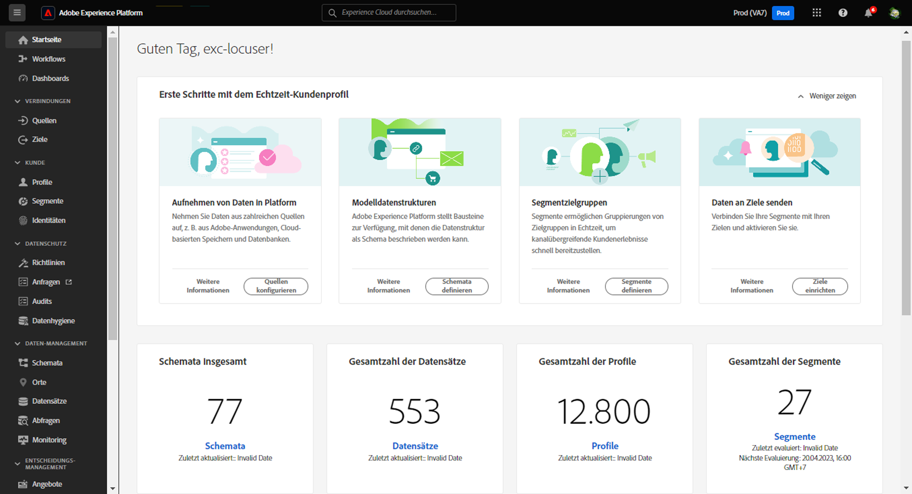
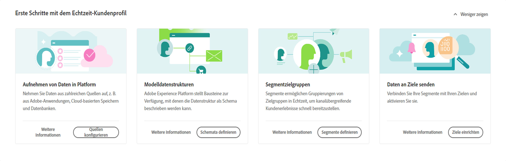
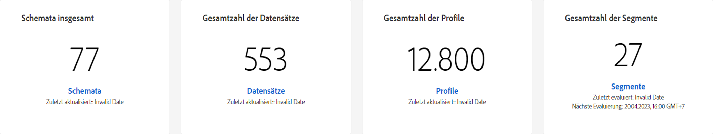
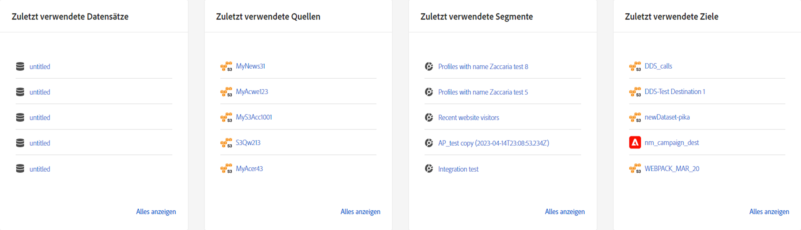
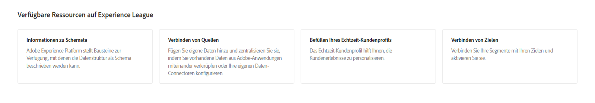

# [!DNL Real-Time Customer Data Platform] Startseite

Die Startseite von Adobe Real-time Customer Data Platform (Real-Time CDP) ist die erste Seite, die nach der Anmeldung bei Real-Time CDP angezeigt wird.

Die Real-Time CDP-Startseite enthält ein Widget &quot;Erste Schritte&quot;, mit dem Sie schnell auf verschiedene Funktionen zugreifen können, sowie einen Metrikabschnitt, der aktuelle Informationen zu Daten in Ihrem Unternehmen anzeigt.

Dieses Dokument bietet einen Überblick über die Real-Time CDP-Startseite und das Dashboard für Metriken.

## Widget &quot;Erste Schritte&quot;

Die [!UICONTROL Erste Schritte mit dem Echtzeit-Kundenprofil] Widget ist in vier Abschnitte unterteilt:

* **Daten in Platform erfassen**: Dieses Widget leitet Sie zum Quellkatalog. Wählen Sie im Quellkatalog eine Quelle aus und erfassen Sie Ihre Daten auf Experience Platform. Weitere Informationen finden Sie im Abschnitt [Quellen - Übersicht](../sources/home.md)
* **Modelldatenstrukturen**: Dieses Widget leitet Sie zur Übersicht über Schemata weiter. Verwenden Sie die Übersicht über Schemata , um nach vorhandenen Schemata zu suchen oder Bausteine zu erstellen, die die Struktur Ihrer Daten beschreiben. Weitere Informationen finden Sie im Abschnitt [Übersicht über Schemas](../xdm/home.md).
* **Segmentzielgruppen**: Dieses Widget leitet Sie zum [!DNL Segment Builder] in der Benutzeroberfläche. Verwenden Sie die [!DNL Segment Builder] , um mit Profildatenelementen zu interagieren und Regeln für Ihre Segmente zu definieren. Weitere Informationen finden Sie im Abschnitt [Übersicht über den Segmentierungsdienst](../segmentation/home.md).
* **Senden von Daten an Ziele**: Dieses Widget leitet Sie zum Zielkatalog. Verwenden Sie den Zielkatalog, um ein Ziel auszuwählen, mit dem Sie dann eine Verbindung herstellen und Segmente senden können. Weitere Informationen finden Sie im Abschnitt [Ziele - Übersicht](../destinations/home.md)

## Dashboard &quot;Metriken&quot;

Das Metriken-Dashboard zeigt aktuelle Informationen zu Ihren Experience Platform-Daten an. Das Dashboard ist in zwei Bereiche unterteilt:

### Die Leaderboard

Das Leaderboard zeigt die aktuelle Gesamtzahl der Schemas, Datensätze, Profile und Segmente in Ihrem Unternehmen sowie das aktuelle Aktualisierungsdatum an.

* **Schemata insgesamt**: Die **Schemata insgesamt** Zähler zeigt die Anzahl der Schemas im System an. Dieser Zähler wird bei der Erstellung eines Schemas aktualisiert. Weitere Informationen finden Sie im Abschnitt [Übersicht über Schemas](../xdm/home.md).
* **Datensätze insgesamt**: Die **Datensätze insgesamt** Zähler zeigt die Anzahl der Datensätze im System und die Datenmenge in [!DNL Platform]. Dieser Zähler wird aktualisiert, sobald ein neuer Datensatz erstellt wird. Weitere Informationen zu Datensätzen finden Sie im Abschnitt [Datensätze - Übersicht](../catalog/datasets/overview.md).
* **Profile insgesamt**: Die **Profile** count zeigt die Gesamtzahl der Personen mit Profilen in der [!DNL Real-Time Customer Profile]. Profilfragmente werden nicht einbezogen. Dabei handelt es sich um Ihre gesamte adressierbare Zielgruppe. Der Zähler nutzt die standardmäßige [Zusammenführungsrichtlinie](profile/merge-policies.md), die in der Konfiguration der Zusammenführungsrichtlinien im einheitlichen Profil festgelegt ist. Die Zahl der Profile wird alle 24 Stunden aktualisiert. Weiterführende Informationen zu Profilen finden Sie im Abschnitt [Übersicht über das Echtzeit-Kundenprofil](../profile/home.md).
* **Segmente insgesamt**: **Segmente** zeigt die Gesamtzahl der für die Organisation erstellten Segmente an. Diese Zahl wird aktualisiert, sobald neue Segmente erstellt werden. Weitere Informationen zu Segmenten finden Sie im Abschnitt [Übersicht über den Segmentierungsdienst](../segmentation/home.md).

### Letzte Elemente

Unter Letzte Elemente werden die neuesten Änderungen in Ihrer Organisation aufgeführt. Im folgenden Beispiel beziehen sich die letzten Änderungen auf Datensätze, Quellen, Segmente und Ziele.

* **Letzte Datensätze**: Die **[!UICONTROL Letzte Datensätze]** -Karte zeigt die fünf letzten Datensätze an, die innerhalb der Organisation erstellt wurden. Diese Liste wird aktualisiert, sobald ein neuer Datensatz erstellt wird. Wählen Sie einen Datensatz aus, um die Details zu diesem Element anzuzeigen, oder wählen Sie **[!UICONTROL Alle anzeigen]** für eine Liste von Datensätzen. Dort können Sie eine bestimmte Quelle für Details auswählen. Weiterführende Informationen über Datensätze finden Sie in der [Datensatzübersicht](../catalog/datasets/overview.md).
* **Letzte Quellen**: Die **[!UICONTROL Letzte Quellen]** Metrikkarte zeigt die fünf Quellen an, die im Unternehmen zuletzt erstellt wurden. Diese Liste wird aktualisiert, sobald eine neue Quelle erstellt wird. Wählen Sie eine Quelle aus, um die Details für dieses Element anzuzeigen, oder wählen Sie **[!UICONTROL Alle anzeigen]** für eine Liste von Quellen. Dort können Sie eine bestimmte Quelle für Details auswählen. Weiterführende Informationen zu Quellen finden Sie in der [Quellenübersicht](../sources/home.md).
* **Letzte Segmente**: Die **[!UICONTROL Letzte Segmente]** Metrikkarte zeigt die fünf Segmente an, die im Unternehmen zuletzt erstellt wurden. Diese Liste wird aktualisiert, sobald ein neues Segment erstellt wird. Wählen Sie ein Segment aus, um die Details zu diesem Element anzuzeigen, oder wählen Sie **[!UICONTROL Alle anzeigen]** für eine Liste von Segmenten. Weitere Informationen zu Segmenten finden Sie unter [Segmentation Service – Übersicht](../segmentation/home.md).
* **Letzte Ziele**: Die **[!UICONTROL Letzte Ziele]** Metrikkarte zeigt die fünf Ziele an, die im Unternehmen zuletzt erstellt wurden. Diese Liste wird aktualisiert, sobald ein neues Ziel erstellt wird. Wählen Sie ein Ziel aus, um die Details zu diesem Element anzuzeigen, oder wählen Sie **[!UICONTROL Alle anzeigen]** für eine Liste von Zielen. Weitere Informationen finden Sie im Abschnitt [Ziele - Übersicht](../destinations/home.md).

## Ressourcen

Schließlich bietet Ihnen das Ressourcen-Widget zusätzliche Dokumentationsressourcen, auf die Sie verweisen können. Dazu gehören:

* [Verstehen von Schemas](../xdm/schema/composition.md)
* [Quellen verbinden](../sources/home.md)
* [So füllen Sie Ihr Echtzeit-Kundenprofil aus](../profile/home.md)
* [Ziele verbinden](../destinations/home.md)
* [Verwalten des Zugriffs](../access-control/abac/overview.md)

<!-- ### Successful profile records

In the leaderboard **[!UICONTROL Successful profile records]** shows the total number of records that have been successfully processed into the profile.

There is also a metric card that shows the percentage of successful records. Select **[!UICONTROL View datasets]** to see more details about the profile records. Hover over the colored area of the graph to see additional details:

The number of successful profile records is updated hourly. 

For more information about profiles, see [A unified view of your customer in Real-Time CDP](profile/profile-overview.md).

### Total profile records

The **[!UICONTROL Total profile records]** metric card shows the total number of data records enabled to feed into the profiles, and the percentage that are successful, updated once per day. This does not include all data in the data lake, because some data might not be enabled to feed into the profiles.

 Hover over the colored area of the graph to see additional details about the successful profiles:

Select **[!UICONTROL View profiles]** to see more details about the profile records.

For more information about profiles, see [A unified view of your customer in Real-Time CDP](profile/profile-overview.md).

For more information about viewing a specific profile, see [Profile viewer](profile/profile-viewer.md).

### Failed profile records

In the leaderboard, **[!UICONTROL Failed profile records]** counts the number of records that failed to process into the profile.

The **[!UICONTROL Failed profile records]** metric card shows this count, and includes a graphical representation that helps you see how failures have trended during the time shown below the graphic. This chart is updated hourly. Select **[!UICONTROL View datasets]** to see more details about the profile records.

The number of failed profile records is updated hourly. -->
