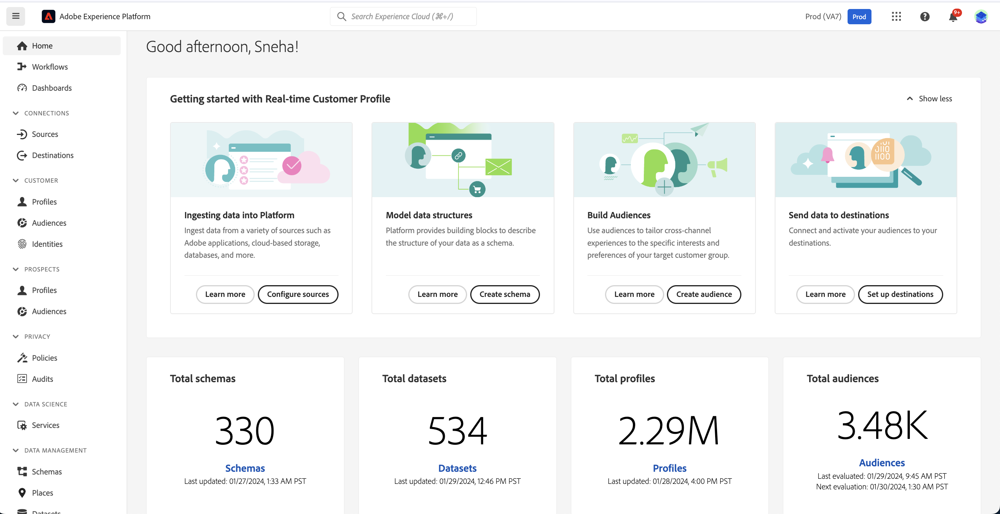

# [!DNL Real-Time Customer Data Platform] Startseite

Die Startseite von Adobe Real-Time Customer Data Platform (Real-Time CDP) ist die erste Seite, die nach der Anmeldung bei Real-Time CDP angezeigt wird.

Die Real-Time CDP-Startseite enthält ein Widget Erste Schritte , mit dem Sie schnell auf mehrere verschiedene Funktionen zugreifen können, sowie einen Abschnitt mit Metriken, in dem aktuelle Informationen zu den Daten in Ihrem Unternehmen angezeigt werden.

Dieses Dokument bietet einen Überblick über die Real-Time CDP-Startseite und das Metriken-Dashboard.

## Widget „Erste Schritte“

Das [!UICONTROL Erste Schritte mit dem Echtzeit-Kundenprofil] ist in vier Abschnitte unterteilt:

* **Daten in Experience Platform aufnehmen**: Dieses Widget leitet Sie zum Quellkatalog weiter. Verwenden Sie den Quellkatalog, um eine Quelle auszuwählen und Ihre Daten in Experience Platform aufzunehmen. Wählen **[Quellen konfigurieren]** aus, um zum Quellkatalog zu navigieren. Weitere Informationen finden Sie unter [Quelle – Übersicht](../sources/home.md).
* **Datenstrukturen modellieren**: Dieses Widget führt Sie zur Übersicht über Schemata. Verwenden Sie die Schemaübersicht , um nach vorhandenen Schemata zu suchen oder einen Blueprint zu erstellen, der die Struktur Ihrer Daten beschreibt. Wählen **[!UICONTROL Schema erstellen]** aus, um zur Benutzeroberfläche für die Schemaerstellung zu navigieren. Weitere Informationen finden Sie unter [Schemas - Übersicht](../xdm/home.md).
* **Zielgruppen erstellen** Dieses Widget leitet Sie zum Segment Builder in der Benutzeroberfläche. Verwenden Sie den Segment Builder, um mit Profildatenelementen zu interagieren und die Kriterien für Ihre Segmentdefinition zu definieren. Wählen Sie **[!UICONTROL Zielgruppe erstellen]** aus, um zum Segment Builder zu navigieren. Weitere Informationen finden Sie unter [Segmentierungs-Service - Übersicht](../segmentation/home.md).
* **Daten an Ziele senden**: Dieses Widget leitet Sie zum Zielkatalog weiter. Verwenden Sie den Zielkatalog, um ein Ziel auszuwählen, mit dem Sie dann eine Verbindung herstellen und an das Sie Zielgruppen senden können. Wählen **[!UICONTROL Ziele einrichten]** aus, um zum Zielkatalog zu navigieren. Lesen Sie für Weitere Informationen den [Überblick über die Ziele](../destinations/home.md).

## Metriken-Dashboard {#metrics-dashboard}

>[!CONTEXTUALHELP]
>id="platform_home_metrics_totalProfiles"
>title="Gesamtanzahl der Profile"
>abstract="Die Gesamtanzahl der Profile, die Ihr Unternehmen innerhalb von Experience Platform hat. Diese Anzahl basiert auf der Zusammenführungsrichtlinie Ihres Unternehmens und umfasst keine Profilfragmente. Die Zahl der Profile wird alle 24 Stunden aktualisiert."
>additional-url="https://experienceleague.adobe.com/docs/experience-platform/profile/ui/user-guide.html?lang=de#profile-count" text="Weitere Informationen finden Sie in der Dokumentation"

Das Metriken-Dashboard zeigt aktuelle Informationen zu Ihren Experience Platform-Daten an. Das Dashboard ist in zwei Abschnitte unterteilt:

### Das Leaderboard

Die Leaderboard zeigt die aktuelle Gesamtzahl der Schemata, Datensätze, Profile und Audiences in Ihrer Organisation sowie das Datum der letzten Aktualisierung an.

* **Gesamtzahl der Schemata**: Der Zähler **Gesamtzahl der**&quot; zeigt die Anzahl der Schemata im System an. Dieser Zähler wird aktualisiert, wenn ein Schema erstellt wird. Weitere Informationen finden Sie unter [Schemas - Übersicht](../xdm/home.md).
* **Gesamtzahl der Datensätze**: Der Zähler **Gesamtzahl der Datensätze** zeigt die Anzahl der Datensätze im System und die Datenmenge in Experience Platform an. Dieser Zähler wird aktualisiert, wenn ein Datensatz erstellt wird. Weitere Informationen zu Datensätzen finden Sie unter [Datensätze - Übersicht](../catalog/datasets/overview.md).
* **Gesamtzahl der Profile**: Die **Profile** Anzahl gibt die Gesamtzahl der Profile an, die Ihr Unternehmen in Experience Platform hat. Profilfragmente werden nicht einbezogen. Dies ist die gesamte adressierbare Zielgruppe. Für diese Zählung wird die [Zusammenführungsrichtlinie“ verwendet](profile/merge-policies.md) die in der Konfiguration der Zusammenführungsrichtlinie im Echtzeit-Kundenprofil festgelegt ist. Die Anzahl der Profile wird einmal alle 24 Stunden aktualisiert. Wählen Sie **[!UICONTROL Profile]** aus, um zur Seite „Profile - Übersicht“ zu navigieren und alle Ihre Profilmetriken anzuzeigen. Weitere Informationen zu Profilen finden Sie in der [Übersicht über das Echtzeit-Kundenprofil](../profile/home.md).
* **Zielgruppen insgesamt**: Der Zähler **Zielgruppen insgesamt** zeigt die Gesamtzahl der für Ihr Unternehmen erstellten Zielgruppen an. Diese Zahl wird aktualisiert, wenn neue Zielgruppen erstellt werden. Weitere Informationen zu Zielgruppen finden Sie unter [Segmentierungs-Service - Übersicht](../segmentation/home.md).

### Zuletzt verwendete Elemente

Letzte Elemente : Listet die letzten Änderungen in Ihrer Organisation auf. Im folgenden Beispiel beziehen sich die letzten Änderungen auf Datensätze, Quellen, Zielgruppen und Ziele.

* **Letzte Datensätze**: Auf der Karte **[!UICONTROL Letzte Datensätze]** werden die fünf zuletzt in der Organisation erstellten Datensätze angezeigt. Diese Liste wird aktualisiert, wenn ein neuer Datensatz erstellt wird. Wählen Sie einen Datensatz aus, um die Details für dieses Element anzuzeigen, oder wählen Sie **[!UICONTROL Alle anzeigen]** für eine Liste von Datensätzen aus. Dort können Sie eine bestimmte Quelle für Details auswählen. Weiterführende Informationen über Datensätze finden Sie in der [Datensatzübersicht](../catalog/datasets/overview.md).
* **Letzte Quellen**: Die Metrikkarte **[!UICONTROL Letzte Quellen]** zeigt die fünf zuletzt in der Organisation erstellten Quellen an. Diese Liste wird aktualisiert, wenn eine neue Quelle erstellt wird. Wählen Sie eine Quelle aus, um die Details für dieses Element anzuzeigen, oder wählen Sie **[!UICONTROL Alle anzeigen]** für eine Liste von Quellen aus. Dort können Sie eine bestimmte Quelle für Details auswählen. Weiterführende Informationen zu Quellen finden Sie in der [Quellenübersicht](../sources/home.md).
* **Letzte Zielgruppen**: Die Metrikkarte **[!UICONTROL Letzte Zielgruppen]** zeigt die fünf zuletzt in der Organisation erstellten Zielgruppen an. Diese Liste wird aktualisiert, wenn eine neue Zielgruppe erstellt wird. Wählen Sie eine Zielgruppe aus, um die Details für dieses Element anzuzeigen, oder wählen Sie **[!UICONTROL Alle anzeigen]** für eine Liste von Zielgruppen aus. Weitere Informationen zu Zielgruppen finden Sie unter [Segmentierungs-Service - Übersicht](../segmentation/home.md).
* **Letzte Ziele**: Die Metrikkarte **[!UICONTROL Letzte Ziele]** zeigt die fünf zuletzt in der Organisation erstellten Ziele an. Diese Liste wird aktualisiert, wenn ein neues Ziel erstellt wird. Wählen Sie ein Ziel aus, um die Details für dieses Element anzuzeigen, oder wählen Sie **[!UICONTROL Alle anzeigen]** für eine Liste von Zielen aus. Lesen Sie für Weitere Informationen den [Überblick über die Ziele](../destinations/home.md).

## Ressourcen

Schließlich stellt Ihnen das Ressourcen-Widget zusätzliche Dokumentationsressourcen bereit, auf die Sie verweisen können. Dazu gehören:

* [Verstehen von Schemata](../xdm/schema/composition.md)
* [Verbinden von Quellen](../sources/home.md)
* [So füllen Sie Ihr Echtzeit-Kundenprofil auf](../profile/home.md)
* [Verbinden von Zielen](../destinations/home.md)
* [Verwalten des Zugriffs](../access-control/abac/overview.md)

<!-- ### Successful profile records

In the leaderboard **[!UICONTROL Successful profile records]** shows the total number of records that have been successfully processed into the profile.

There is also a metric card that shows the percentage of successful records. Select **[!UICONTROL View datasets]** to see more details about the profile records. Hover over the colored area of the graph to see additional details:

The number of successful profile records is updated hourly. 

For more information about profiles, see [A unified view of your customer in Real-Time CDP](profile/profile-overview.md).

### Total profile records

The **[!UICONTROL Total profile records]** metric card shows the total number of data records enabled to feed into the profiles, and the percentage that are successful, updated once per day. This does not include all data in the data lake, because some data might not be enabled to feed into the profiles.

 Hover over the colored area of the graph to see additional details about the successful profiles:

Select **[!UICONTROL View profiles]** to see more details about the profile records.

For more information about profiles, see [A unified view of your customer in Real-Time CDP](profile/profile-overview.md).

For more information about viewing a specific profile, see [Profile viewer](profile/profile-viewer.md).

### Failed profile records

In the leaderboard, **[!UICONTROL Failed profile records]** counts the number of records that failed to process into the profile.

The **[!UICONTROL Failed profile records]** metric card shows this count, and includes a graphical representation that helps you see how failures have trended during the time shown below the graphic. This chart is updated hourly. Select **[!UICONTROL View datasets]** to see more details about the profile records.

The number of failed profile records is updated hourly. -->
