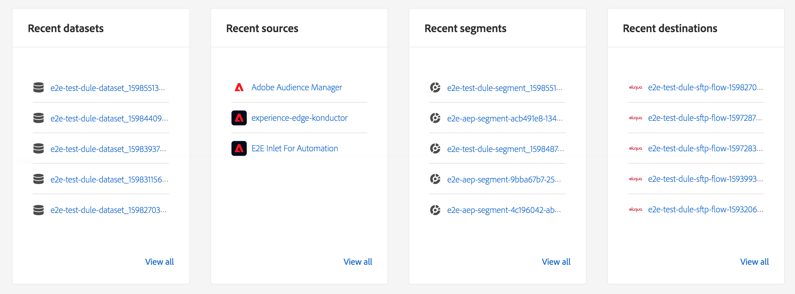

# [!DNL Real-Time Customer Data Platform] Homepage und Dashboards

Die Startseite von Adobe Real-time Customer Data Platform (Real-Time CDP) mit einem Metriken-Dashboard wird angezeigt, wenn Sie sich bei Real-Time CDP anmelden.

Die Startseite ist nur einer der Orte, an denen Metrikkarten angezeigt werden. Real-Time CDP bietet Metrikkarten für das gesamte Erlebnis. Diese Metriken informieren Sie über die Daten-, Profil- und Segmentzielgruppen im System.

Wenn bei der Anmeldung bei Real-Time CDP keine Daten im System vorhanden sind, wird das Dashboard auf der Startseite nicht angezeigt. In dem Fall enthält die Startseite Lernmaterial für die erstmalige Nutzung. Im Zuge der Sammlung von Daten, d. h. wenn <!--sources-->Datensätze, Profile, Segmente und Ziele erstellt werden und Daten in das System fließen, wird das Dashboard automatisch aktualisiert, um Informationen zu diesen Daten anzuzeigen<!-- in metric cards-->.

## Dashboard-Ansicht auf der Startseite

<!--The dashboard shows information in several areas. Each category of information displays for the time range shown beneath the data.-->

Das Dashboard ist wie folgt unterteilt<!-- two areas.-->:

* Das **Leaderboard** befindet sich oben im Dashboard. Im Leaderboard wird die Zahl der Datensätze, Profile, Segmente und Ziele im System angezeigt.

   

<!-- * **Metric cards** display beneath the leaderboard. Metric cards show additional information, such as percentages or trends. Metric cards appear as data is collected.
    
Some information is shown in different ways on both the leaderboard and metric cards. -->
* Unter **Letzte Elemente** werden die fünf Datensätze, Quellen, Segmente und Ziele aufgeführt, die dem System zuletzt hinzugefügt wurden.

   

Zusätzliche Metriken - beispielsweise für Profile und Segmente - sind in anderen Teilen von Real-time Customer Data Platform verfügbar.

### Datensätze

Die **[!UICONTROL Datensätze]** Zähler zeigt die Anzahl der Datensätze im System und die Datenmenge in [!DNL Platform]. Dieser Zähler wird aktualisiert, sobald ein neuer Datensatz erstellt wird.

Weiterführende Informationen über Datensätze finden Sie in der [Datensatzübersicht](../catalog/datasets/overview.md).

### Profile

Die **[!UICONTROL Profile]** count zeigt die Gesamtzahl der Personen mit Profilen in der [!DNL Real-time Customer Profile]. Profilfragmente werden nicht einbezogen. Dabei handelt es sich um Ihre gesamte adressierbare Zielgruppe.

Der Zähler nutzt die standardmäßige [Zusammenführungsrichtlinie](profile/merge-policies.md), die in der Konfiguration der Zusammenführungsrichtlinien im einheitlichen Profil festgelegt ist.

Die Zahl der Profile wird alle 24 Stunden aktualisiert.

Weitere Informationen zu Profilen finden Sie unter [Einheitliche Sicht auf Ihren Kunden in Real-Time CDP](profile/profile-overview.md).

### Segmente

**[!UICONTROL Segmente]** gibt die Gesamtzahl der für das Unternehmen erstellten Segmente an. Diese Zahl wird aktualisiert, sobald neue Segmente erstellt werden.

Weitere Informationen zu Segmenten finden Sie unter [Segmentation Service – Übersicht](segmentation/segmentation-overview.md).

### Ziele

**[!UICONTROL Ziele]** gibt die Gesamtzahl der Ziele an, die für das Unternehmen erstellt wurden. Diese Zahl wird aktualisiert, sobald neue Ziele erstellt werden.

Weiterführende Informationen zu Zielen finden Sie unter [Zielübersicht](destinations/overview.md).

<!-- ### Successful profile records

In the leaderboard **[!UICONTROL Successful profile records]** shows the total number of records that have been successfully processed into the profile.

There is also a metric card that shows the percentage of successful records. Select **[!UICONTROL View datasets]** to see more details about the profile records. Hover over the colored area of the graph to see additional details:

The number of successful profile records is updated hourly. 

For more information about profiles, see [A unified view of your customer in Real-Time CDP](profile/profile-overview.md).

### Total profile records

The **[!UICONTROL Total profile records]** metric card shows the total number of data records enabled to feed into the profiles, and the percentage that are successful, updated once per day. This does not include all data in the data lake, because some data might not be enabled to feed into the profiles.

 Hover over the colored area of the graph to see additional details about the successful profiles:

Select **[!UICONTROL View profiles]** to see more details about the profile records.

For more information about profiles, see [A unified view of your customer in Real-Time CDP](profile/profile-overview.md).

For more information about viewing a specific profile, see [Profile viewer](profile/profile-viewer.md).

### Failed profile records

In the leaderboard, **[!UICONTROL Failed profile records]** counts the number of records that failed to process into the profile.

The **[!UICONTROL Failed profile records]** metric card shows this count, and includes a graphical representation that helps you see how failures have trended during the time shown below the graphic. This chart is updated hourly. Select **[!UICONTROL View datasets]** to see more details about the profile records.

The number of failed profile records is updated hourly. -->

### Letzte Datensätze

Auf der Karte **[!UICONTROL Letzte Datensätze]** werden die fünf letzten Datensätze angezeigt, die im Unternehmen erstellt wurden. Diese Liste wird aktualisiert, sobald ein neuer Datensatz erstellt wird.

einen Datensatz auswählen, um die Details zu diesem Element anzuzeigen, oder **[!UICONTROL Alle anzeigen]** um die Liste der Datensätze anzuzeigen. Dort können Sie eine bestimmte Quelle für Details auswählen.

Weiterführende Informationen über Datensätze finden Sie in der [Datensatzübersicht](../catalog/datasets/overview.md).

### Letzte Quellen

Auf der Metrikkarte **[!UICONTROL Letzte Quellen]** werden die fünf Quellen angezeigt, die im Unternehmen zuletzt erstellt wurden. Diese Liste wird aktualisiert, sobald eine neue Quelle erstellt wird.

Wählen Sie eine Quelle aus, um die Details für dieses Element anzuzeigen, oder **[!UICONTROL Alle anzeigen]** um die Liste der Quellen anzuzeigen. Dort können Sie eine bestimmte Quelle für Details auswählen.

Weiterführende Informationen zu Quellen finden Sie in der [Quellenübersicht](sources/sources-overview.md).

### Letzte Segmente

Auf der Metrikkarte **[!UICONTROL Letzte Segmente]** werden die fünf Segmente angezeigt, die im Unternehmen zuletzt erstellt wurden. Diese Liste wird aktualisiert, sobald ein neues Segment erstellt wird.

Wählen Sie ein Segment aus, um die Details für dieses Element anzuzeigen, oder **[!UICONTROL Alle anzeigen]** , um Informationen zu weiteren Segmenten anzuzeigen.

Weitere Informationen zu Segmenten finden Sie unter [Segmentation Service – Übersicht](segmentation/segmentation-overview.md).

### Letzte Ziele

Auf der Metrikkarte **[!UICONTROL Letzte Ziele]** werden die fünf Ziele angezeigt, die im Unternehmen zuletzt erstellt wurden. Diese Liste wird aktualisiert, sobald ein neues Ziel erstellt wird.

Wählen Sie ein Ziel aus, um die Details zu diesem Element anzuzeigen, oder **[!UICONTROL Alle anzeigen]** , um Informationen über weitere Ziele anzuzeigen.

Weiterführende Informationen zu Zielen finden Sie unter [Zielübersicht](destinations/overview.md).
