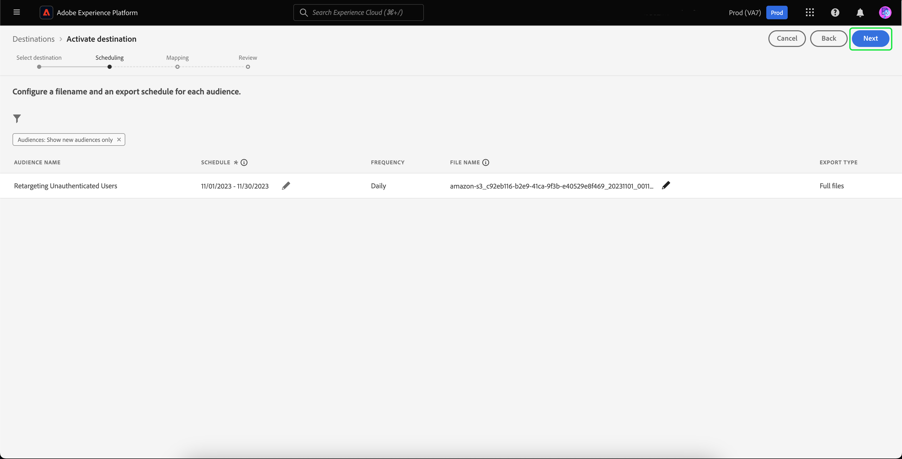

# Offsite-Retargeting nicht authentifizierter Besucher

>[!AVAILABILITY]
>
>Diese Funktion steht Kunden zur Verfügung, die Real-Time CDP (App Service), Adobe Experience Platform Activation, Real-Time CDP, Real-Time CDP Prime, Real-Time CDP Ultimate lizenziert haben. Weitere Informationen zu diesen Paketen finden Sie in den [Produktbeschreibungen](https://helpx.adobe.com/de/legal/product-descriptions.html) und erhalten Sie von Ihrem Adobe-Support-Team.

Erfahren Sie, wie Sie eine Zielgruppe nicht authentifizierter Besucher erstellen und diese mithilfe von durch Partner bereitgestellten dauerhaften IDs erneut ansprechen.

## Gründe für die Berücksichtigung dieses Anwendungsfalls {#why-use-case}

Mit der Einstellung von Drittanbieter-Cookies müssen digitale Marketer ihre Strategien für die erneute Interaktion mit anonymen Besuchern neu überdenken. Marken, die sich für die Echtzeit-Besuchererkennung mit Identitätsanbietern integrieren lassen, können auch von Partnern bereitgestellte dauerhafte Kennungen für das Off-site Paid-Media-Retargeting nutzen.

Trotz des hohen Traffic-Volumens sehen viele Marken einen signifikanten Rückgang bei der Konversionsphase. Besucher interagieren mit Inhalten und Produktdemos, gehen aber ohne sich anzumelden oder einen Kauf zu tätigen.

Sie können Zielgruppen nicht nur auf der Grundlage der Site-Interaktion erstellen, um Marketingnachrichten zu personalisieren, sondern auch die Adobe-Unterstützung für Partner-IDs verwenden, um Besucher über Paid-Media-Ziele hinweg erneut zu erreichen.

## Voraussetzungen und Planung {#prerequisites-and-planning}

Beachten Sie bei der Planung des erneuten Targetings nicht authentifizierter Besucher während Ihres Planungsprozesses die folgenden Voraussetzungen:

- Habe ich die Partner-IDs mit den richtigen Identitäts-Namespaces eingerichtet?

Um den Anwendungsfall zu implementieren, nutzen Sie außerdem die folgenden Real-Time CDP-Funktionen und Benutzeroberflächenelemente. Stellen Sie sicher, dass Sie über die erforderlichen attributbasierten Zugriffssteuerungsberechtigungen für alle diese Bereiche verfügen, oder bitten Sie Ihren Systemadministrator, Ihnen die erforderlichen Berechtigungen zu erteilen.

- [Zielgruppen](../../segmentation/home.md)
- [Berechnete Attribute](../../profile/computed-attributes/overview.md)
- [Ziele](../../destinations/home.md)
- [Web SDK](../../web-sdk/home.md)

## Partnerdaten in Real-Time CDP abrufen {#get-data-in}

Um eine Zielgruppe nicht authentifizierter Besucher zu erstellen, müssen Sie zunächst Ihre Partnerdaten in Real-Time CDP einbringen.

Informationen zum bestmöglichen Importieren von Daten in Real-Time CDP mithilfe des Web SDK finden Sie in den Abschnitten [Datenverwaltung und Ereignisdatenerfassung](./onsite-personalization.md#data-management) des Anwendungsbeispiels zur Personalisierung vor Ort.

## Weiterleiten von vom Partner bereitgestellten IDs {#bring-partner-ids-forward}

Nachdem Sie die vom Partner bereitgestellten IDs in einen Ereignis-Datensatz importiert haben, müssen Sie diese Daten in die Profildatensätze übertragen. Dazu können Sie berechnete Attribute verwenden.

Mithilfe berechneter Attribute können Sie Verhaltensdaten von Profilen schnell in aggregierte Werte auf Profilebene konvertieren. Daher können Sie diese Ausdrücke wie z. B. &quot;Kaufsumme über die gesamte Lebensdauer&quot;für das Profil verwenden, um die einfache Verwendung des berechneten Attributs innerhalb Ihrer Zielgruppen zu ermöglichen. Weitere Informationen zu berechneten Attributen finden Sie in der [Übersicht über berechnete Attribute](../../profile/computed-attributes/overview.md).

Um auf berechnete Attribute zuzugreifen, wählen Sie **[!UICONTROL Profile]** , gefolgt von **[!UICONTROL Berechnete Attribute]** und **[!UICONTROL Berechnetes Attribut erstellen]**.

![Die Schaltfläche [!UICONTROL Berechnete Attribute erstellen] wird zusätzlich zur Registerkarte [!UICONTROL Berechnete Attribute] im Arbeitsbereich [!UICONTROL Profile] markiert.](../assets/offsite-retargeting/create-ca.png)

Die Seite **[!UICONTROL Berechnetes Attribut erstellen]** wird angezeigt. Auf dieser Seite können Sie die Komponenten verwenden, um Ihr berechnetes Attribut zu erstellen.

>[!NOTE]
>
>Ausführlichere Informationen zum Erstellen berechneter Attribute finden Sie im Benutzerhandbuch zur [Benutzeroberfläche für berechnete Attribute](../../profile/computed-attributes/ui.md).

Für diesen Anwendungsfall können Sie ein berechnetes Attribut erstellen, das, wenn die Partner-ID vorhanden ist, den neuesten Wert der Partner-ID innerhalb der letzten 24 Stunden erhält.

Mithilfe der Suchleiste können Sie das Ereignis &quot;Partner-ID&quot;, das Sie während des Anwendungsfalls der Personalisierung vor Ort ](#get-data-in) erstellt haben, suchen und der berechneten Attributarbeitsfläche hinzufügen.[

![Die Registerkarte [!UICONTROL Ereignisse] und die Suchleiste werden hervorgehoben.](../assets/offsite-retargeting/ca-add-partner-id.png)

Nachdem Sie das Ereignis &quot;Partner-ID&quot;zur Definition hinzugefügt haben, legen Sie die Filterbedingung für das Ereignis auf &quot;**[!UICONTROL Vorhanden]**&quot;fest, legen Sie als Filterbedingung für das Ereignis den Wert &quot;**[!UICONTROL Zuletzt verwendet]**&quot;der hinzugefügten Partner-ID fest und legen Sie einen Lookback-Zeitraum von 24 Stunden fest.

Geben Sie dem berechneten Attribut einen geeigneten Namen (z. B. &quot;Partner-ID&quot;) und eine Beschreibung und wählen Sie dann **[!UICONTROL Publish]** aus, um den Vorgang zur Erstellung des berechneten Attributs abzuschließen.

## Erstellen einer Zielgruppe mithilfe des berechneten Attributs {#create-audience}

Nachdem Sie das berechnete Attribut erstellt haben, können Sie dieses berechnete Attribut verwenden, um eine Zielgruppe zu erstellen. In diesem Beispiel erstellen Sie eine Zielgruppe aus Besuchern, die Ihre Website in diesem Monat mehr als fünfmal besucht haben, sich aber noch nicht angemeldet haben.

Um eine Zielgruppe zu erstellen, wählen Sie **[!UICONTROL Zielgruppen]** und danach **[!UICONTROL Zielgruppe erstellen]** aus.

![Die Schaltfläche [!UICONTROL Audience erstellen] ist hervorgehoben.](../assets/offsite-retargeting/create-audience.png)

Es wird ein Dialogfeld angezeigt, in dem Sie aufgefordert werden, zwischen [!UICONTROL Audience erstellen] und [!UICONTROL Regel erstellen] zu wählen. Wählen Sie **[!UICONTROL Regel erstellen]** und danach **[!UICONTROL Erstellen]** aus.

![ Die Schaltfläche [!UICONTROL Regel erstellen] ist hervorgehoben.](../assets/offsite-retargeting/select-build-rule.png)

Die Seite Segment Builder wird angezeigt. Auf dieser Seite können Sie die Komponenten zum Erstellen Ihrer Audience verwenden.

>[!NOTE]
>
>Weitere Informationen zur Verwendung von Segment Builder finden Sie im [UI-Handbuch für Segment Builder](../../segmentation/ui/segment-builder.md).

Um diese Besucher zu finden, müssen Sie zunächst ein **[!UICONTROL Seitenansichtsereignis]** zu Ihrer Zielgruppe hinzufügen. Wählen Sie die Registerkarte **[!UICONTROL Ereignisse]** unter **[!UICONTROL Felder]** aus, ziehen Sie das Ereignis **[!UICONTROL Seitenansicht]** per Drag-and-Drop und fügen Sie es der Arbeitsfläche des Ereignisabschnitts hinzu.

![Die Registerkarte [!UICONTROL Ereignisse] im Abschnitt [!UICONTROL Felder] wird beim Anzeigen des Ereignisses [!UICONTROL Seitenansicht] hervorgehoben.](../assets/offsite-retargeting/add-page-view.png)

Wählen Sie das neu hinzugefügte Ereignis **[!UICONTROL Seitenansicht]** aus. Ändern Sie den Lookback-Zeitraum von **[!UICONTROL Beliebige Zeit]** in **[!UICONTROL Diesen Monat]** und ändern Sie die Ereignisregel in **Mindestens 5**.

![Details des hinzugefügten Ereignisses [!UICONTROL Seitenansicht] werden angezeigt.](../assets/offsite-retargeting/edit-event.png)

Nachdem Sie Ihr Ereignis hinzugefügt haben, müssen Sie ein Attribut hinzufügen. Da Sie mit nicht authentifizierten Besuchern arbeiten, können Sie das soeben erstellte berechnete Attribut hinzufügen. Mit diesem neu erstellten berechneten Attribut können Sie Partner-IDs mit einer Zielgruppe verknüpfen.

Um das berechnete Attribut hinzuzufügen, wählen Sie unter **[!UICONTROL Attribute]** die Option **[!UICONTROL XDM Individual Profile]**, gefolgt von **[der Mandanten-ID Ihres Unternehmens](../../xdm/api/getting-started.md#know-your-tenant-id).**, **[!UICONTROL SystemComputedAttributes]** und **[!UICONTROL PartnerID]**. Fügen Sie nun den **[!UICONTROL Wert]** des berechneten Attributs zum Abschnitt &quot;Attribute&quot;der Arbeitsfläche hinzu.

Suchen Sie außerdem nach **[!UICONTROL Persönliche E-Mail]** und fügen Sie das Attribut **[!UICONTROL Adresse]** unter **[!UICONTROL PartnerID]** zum Abschnitt &quot;Attribute&quot;der Arbeitsfläche hinzu.

![Das berechnete Attribut [!UICONTROL PartnerID] und das Attribut [!UICONTROL Persönliche E-Mail-Adresse] werden auf der Arbeitsfläche des Segmentaufbaus hervorgehoben.](../assets/offsite-retargeting/added-attributes.png)

Nachdem Sie Ihre Attribute hinzugefügt haben, müssen Sie ihre Bewertungskriterien festlegen. Setzen Sie für **[!UICONTROL PartnerID]** das Kriterium auf **[!UICONTROL existiert]** und für **[!UICONTROL Adresse]** setzen Sie das Kriterium auf **[!UICONTROL ist nicht vorhanden]**.

Sie haben jetzt erfolgreich eine Zielgruppe erstellt, die nach Besuchern mit hoher Intensität sucht, die über eine von Partnern bereitgestellte ID verfügen, sich aber noch nicht für Ihre Site angemeldet haben. Benennen Sie Ihre Zielgruppe mit &quot;Retargeting nicht authentifizierter Benutzer&quot;und wählen Sie **[!UICONTROL Speichern]** aus, um die Erstellung der Zielgruppe abzuschließen.

## Aktivieren der Zielgruppe {#activate-audience}

Nach erfolgreicher Erstellung Ihrer Audience können Sie diese Audience jetzt für nachgelagerte Ziele aktivieren. Wählen Sie **[!UICONTROL Zielgruppen]** in der linken Navigationsleiste aus, suchen Sie nach der neu erstellten Zielgruppe, wählen Sie das Auslassungssymbol aus und wählen Sie **[!UICONTROL Für Ziel aktivieren]**.

![Die Schaltfläche [!UICONTROL Auf Ziel aktivieren] ist hervorgehoben.](../assets/offsite-retargeting/activate-to-destination.png)

>[!NOTE]
>
>Alle Zieltypen, einschließlich dateibasierter Ziele, unterstützen die Aktivierung der Zielgruppe mit Partner-IDs.
>
>Weiterführende Informationen zum Aktivieren von Zielgruppen für ein Ziel finden Sie in der [Aktivierungsübersicht](../../destinations/ui/activation-overview.md).

Die Seite **[!UICONTROL Ziel aktivieren]** wird angezeigt. Auf dieser Seite können Sie auswählen, für welches Ziel Sie Ihr Ziel aktivieren möchten. Wählen Sie nach Auswahl des gewünschten Ziels **[!UICONTROL Weiter]** aus.

Die Seite **[!UICONTROL Planung]** wird angezeigt. Auf dieser Seite können Sie einen Zeitplan erstellen, der bestimmt, wie oft die Zielgruppe aktiviert werden soll. Wählen Sie **[!UICONTROL Zeitplan erstellen]** aus, um einen Zeitplan für die Aktivierung der Zielgruppe zu erstellen.

![ Die Schaltfläche [!UICONTROL Zeitplan erstellen] ist hervorgehoben.](../assets/offsite-retargeting/select-create-schedule.png)

Das Popup [!UICONTROL Planung] wird angezeigt. Auf dieser Seite können Sie den Zeitplan für die Aktivierung Ihrer Audience erstellen. Wählen Sie nach dem Konfigurieren des Zeitplans **[!UICONTROL Erstellen]** aus, um fortzufahren.

Wählen Sie nach Bestätigung der Planungsdetails **[!UICONTROL Weiter]** aus.

Die Seite **[!UICONTROL Attribute auswählen]** wird angezeigt. Auf dieser Seite können Sie auswählen, welche Attribute Sie mit der aktivierten Zielgruppe exportieren möchten. Sie möchten mindestens die Partner-ID angeben, da Sie so die Besucher identifizieren können, die Sie erneut ansprechen möchten. Wählen Sie **[!UICONTROL Neue Zuordnung hinzufügen]** und suchen Sie nach dem berechneten Attribut. Wählen Sie nach dem Hinzufügen der erforderlichen Attribute **[!UICONTROL Weiter]** aus.

![Sowohl die Schaltfläche [!UICONTROL Neues Mapping hinzufügen] als auch das berechnete Attribut sind hervorgehoben.](../assets/offsite-retargeting/add-new-mapping.png)

Die Seite **[!UICONTROL Überprüfen]** wird angezeigt. Auf dieser Seite können Sie die Details Ihrer Zielgruppenaktivierung überprüfen. Wenn Sie mit den angegebenen Details zufrieden sind, wählen Sie **[!UICONTROL Beenden]**.

![Die Seite [!UICONTROL Überprüfung] wird mit Details zur Aktivierung der Zielgruppe angezeigt.](../assets/offsite-retargeting/review-destination-activation.png)

Sie haben jetzt eine Zielgruppe nicht authentifizierter Benutzer für ein nachgelagertes Ziel aktiviert, um das Retargeting fortzusetzen.

## Andere Anwendungsfälle {#other-use-cases}

Weitere Anwendungsfälle, die über die Unterstützung von Partnerdaten in Real-Time CDP aktiviert wurden, werden untersucht:

- [Engage and acquisition new customer](./prospecting.md) by using partner data.
- [Personalisieren von Onsite-Erlebnissen](./offsite-retargeting.md) mit der Partnererkennung für Besucher.
- [ Ergänzung von Erstanbieterprofilen](./supplement-first-party-profiles.md) durch von Partnern bereitgestellte Attribute.
