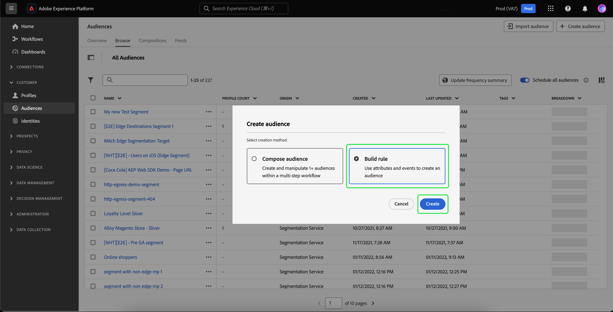

# Offsite-Retargeting nicht authentifizierter Besucher

>[!AVAILABILITY]
>
>Diese Funktion steht Kunden zur Verfügung, die Real-Time CDP (App Service), Adobe Experience Platform Activation, Real-Time CDP, Real-Time CDP Prime, Real-Time CDP Ultimate lizenziert haben. Weitere Informationen zu diesen Paketen finden Sie in den [Produktbeschreibungen](https://helpx.adobe.com/de/legal/product-descriptions.html) und erhalten Sie von Ihrem Adobe-Support-Team.

Erfahren Sie, wie Sie eine Zielgruppe nicht authentifizierter Besucher erstellen und diese mithilfe von durch Partner bereitgestellten dauerhaften IDs erneut ansprechen.

## Gründe für die Berücksichtigung dieses Anwendungsfalls {#why-use-case}

Mit der Einstellung von Drittanbieter-Cookies müssen digitale Marketer ihre Strategien für die erneute Interaktion mit anonymen Besuchern neu überdenken. Marken, die sich für die Echtzeit-Besuchererkennung mit Identitätsanbietern integrieren lassen, können auch von Partnern bereitgestellte dauerhafte Kennungen für das Off-site Paid-Media-Retargeting nutzen.

Trotz des hohen Traffic-Volumens sehen viele Marken einen signifikanten Rückgang bei der Konversionsphase. Besucher interagieren mit Inhalten und Produktdemos, gehen aber ohne sich anzumelden oder einen Kauf zu tätigen.

Sie können Zielgruppen nicht nur auf der Grundlage der Site-Interaktion erstellen, um Marketingnachrichten zu personalisieren, sondern auch die Adobe-Unterstützung für Partner-IDs verwenden, um Besucher über Paid-Media-Ziele hinweg erneut zu erreichen.

## Voraussetzungen und Planung {#prerequisites-and-planning}

Beachten Sie bei der Planung des erneuten Targetings nicht authentifizierter Besucher während Ihres Planungsprozesses die folgenden Voraussetzungen:

- Habe ich die Partner-IDs mit den richtigen Identitäts-Namespaces eingerichtet?

Um den Anwendungsfall zu implementieren, nutzen Sie außerdem die folgenden Real-Time CDP-Funktionen und Benutzeroberflächenelemente. Stellen Sie sicher, dass Sie über die erforderlichen attributbasierten Zugriffssteuerungsberechtigungen für alle diese Bereiche verfügen, oder bitten Sie Ihren Systemadministrator, Ihnen die erforderlichen Berechtigungen zu erteilen.

- [Zielgruppen](../../segmentation/home.md)
- [Berechnete Attribute](../../profile/computed-attributes/overview.md)
- [Ziele](../../destinations/home.md)
- [Web SDK](../../edge/home.md)

## Partnerdaten in Real-Time CDP abrufen {#get-data-in}

Um eine Zielgruppe nicht authentifizierter Besucher zu erstellen, müssen Sie zunächst Ihre Partnerdaten in Real-Time CDP einbringen.

Informationen zum optimalen Importieren von Daten in Real-Time CDP mithilfe des Web SDK finden Sie in der [Datenverwaltung und Abschnitte zur Ereignisdatenerfassung](./onsite-personalization.md#data-management) des Anwendungsbeispiels zur Personalisierung vor Ort.

## Weiterleiten von vom Partner bereitgestellten IDs {#bring-partner-ids-forward}

Nachdem Sie die vom Partner bereitgestellten IDs in einen Ereignis-Datensatz importiert haben, müssen Sie diese Daten in die Profildatensätze übertragen. Dazu können Sie berechnete Attribute verwenden.

Mithilfe berechneter Attribute können Sie Verhaltensdaten von Profilen schnell in aggregierte Werte auf Profilebene konvertieren. Daher können Sie diese Ausdrücke wie z. B. &quot;Kaufsumme über die gesamte Lebensdauer&quot;für das Profil verwenden, um die einfache Verwendung des berechneten Attributs innerhalb Ihrer Zielgruppen zu ermöglichen. Weitere Informationen zu berechneten Attributen finden Sie im Abschnitt [Übersicht über berechnete Attribute](../../profile/computed-attributes/overview.md).

Um auf berechnete Attribute zuzugreifen, wählen Sie **[!UICONTROL Profile]** gefolgt von **[!UICONTROL Berechnete Attribute]** und **[!UICONTROL Berechnetes Attribut erstellen]**.

![Die [!UICONTROL Berechnete Attribute erstellen] neben dem [!UICONTROL Berechnete Attribute] innerhalb der [!UICONTROL Profile] Arbeitsbereich.](../assets/offsite-retargeting/create-ca.png)

Die **[!UICONTROL Berechnetes Attribut erstellen]** angezeigt. Auf dieser Seite können Sie die Komponenten verwenden, um Ihr berechnetes Attribut zu erstellen.

>[!NOTE]
>
>Weitere Informationen zum Erstellen berechneter Attribute finden Sie im Abschnitt [UI-Handbuch für berechnete Attribute](../../profile/computed-attributes/ui.md).

Für diesen Anwendungsfall können Sie ein berechnetes Attribut erstellen, das, wenn die Partner-ID vorhanden ist, den neuesten Wert der Partner-ID innerhalb der letzten 24 Stunden erhält.

Mithilfe der Suchleiste können Sie das Ereignis &quot;Partner-ID&quot;suchen und der Arbeitsfläche für berechnete Attribute hinzufügen.

![Die [!UICONTROL Veranstaltungen] und die Suchleiste hervorgehoben werden.](../assets/offsite-retargeting/ca-add-partner-id.png)

Nachdem Sie das Ereignis &quot;Partner-ID&quot;zur Definition hinzugefügt haben, legen Sie die Filterbedingung für das Ereignis auf **[!UICONTROL Exists]** festlegen, legen Sie die Filterbedingung für das Ereignis auf **[!UICONTROL Zuletzt verwendet]** -Wert der hinzugefügten Partner-ID und mit einem Lookback-Zeitraum von 24 Stunden angeben.

Geben Sie dem berechneten Attribut einen geeigneten Namen (z. B. &quot;Partner-ID&quot;) und eine Beschreibung, und wählen Sie dann **[!UICONTROL Veröffentlichen]** , um den Vorgang zur Erstellung berechneter Attribute abzuschließen.

## Erstellen einer Zielgruppe mithilfe des berechneten Attributs {#create-audience}

Nachdem Sie das berechnete Attribut erstellt haben, können Sie dieses berechnete Attribut verwenden, um eine Zielgruppe zu erstellen. In diesem Beispiel erstellen Sie eine Zielgruppe aus Besuchern, die Ihre Website in diesem Monat mehr als fünfmal besucht haben, sich aber noch nicht angemeldet haben.

Um eine Zielgruppe zu erstellen, wählen Sie **[!UICONTROL Zielgruppen]**, gefolgt von **[!UICONTROL Erstellen einer Zielgruppe]**.

![Die [!UICONTROL Erstellen einer Zielgruppe] -Schaltfläche markiert ist.](../assets/offsite-retargeting/create-audience.png)

Ein Dialogfeld wird angezeigt, in dem Sie aufgefordert werden, zwischen [!UICONTROL Erstellen einer Zielgruppe] und [!UICONTROL Regel erstellen]. Auswählen **[!UICONTROL Regel erstellen]** gefolgt von **[!UICONTROL Erstellen]**.

Die Seite Segment Builder wird angezeigt. Auf dieser Seite können Sie die Komponenten zum Erstellen Ihrer Audience verwenden.

>[!NOTE]
>
>Weitere Informationen zur Verwendung von Segment Builder finden Sie im Abschnitt [Handbuch zur Benutzeroberfläche von Segment Builder](../../segmentation/ui/segment-builder.md).

Um das Ziel zu erreichen, diese Besucher zu finden, müssen Sie zunächst eine **[!UICONTROL Seitenansicht]** -Ereignis Ihrer Zielgruppe hinzufügen. Wählen Sie die **[!UICONTROL Veranstaltungen]** Registerkarte unter **[!UICONTROL Felder]** und ziehen Sie dann die **[!UICONTROL Seitenansicht]** -Ereignis und fügen Sie es der Arbeitsfläche des Ereignisabschnitts hinzu.

![Die [!UICONTROL Veranstaltungen] im [!UICONTROL Felder] -Abschnitt beim Anzeigen der [!UICONTROL Seitenansicht]-Ereignis.](../assets/offsite-retargeting/add-page-view.png)

Wählen Sie die neu hinzugefügte **[!UICONTROL Seitenansicht]** -Ereignis. Ändern des Lookback-Zeitraums von **[!UICONTROL Beliebige Zeit]** nach **[!UICONTROL Diesen Monat]** und ändern Sie die Ereignisregel, um **Mindestens 5**.

![Details des hinzugefügten [!UICONTROL Seitenansicht] -Ereignis angezeigt.](../assets/offsite-retargeting/edit-event.png)

Nachdem Sie Ihr Ereignis hinzugefügt haben, müssen Sie ein Attribut hinzufügen. Da Sie mit nicht authentifizierten Besuchern arbeiten, können Sie das soeben erstellte berechnete Attribut hinzufügen. Mit diesem neu erstellten berechneten Attribut können Sie Partner-IDs mit einer Zielgruppe verknüpfen.

So fügen Sie das berechnete Attribut hinzu: unter **[!UICONTROL Attribute]** auswählen **[!UICONTROL Individuelles XDM-Profil]**, gefolgt von **[!UICONTROL _atag]**, **[!UICONTROL SystemComputedAttributes]**, und **[!UICONTROL PartnerID]**. Fügen Sie nun die **[!UICONTROL Wert]** des berechneten Attributs zum Abschnitt &quot;Attribute&quot;der Arbeitsfläche.

Suchen Sie außerdem nach **[!UICONTROL Persönliche E-Mail]** und fügen Sie **[!UICONTROL Adresse]** Attribut unten **[!UICONTROL PartnerID]** zum Abschnitt &quot;Attribute&quot;der Arbeitsfläche.

![Die [!UICONTROL PartnerID] berechnetes Attribut und die [!UICONTROL Persönliche Email-Adresse] -Attribut auf der Arbeitsfläche des Segmentaufbaus hervorgehoben werden.](../assets/offsite-retargeting/added-attributes.png)

Nachdem Sie Ihre Attribute hinzugefügt haben, müssen Sie ihre Bewertungskriterien festlegen. Für **[!UICONTROL PartnerID]** setzen Sie das Kriterium auf **[!UICONTROL exists]** und für **[!UICONTROL Adresse]** setzen Sie das Kriterium auf **[!UICONTROL nicht vorhanden]**.

Sie haben jetzt erfolgreich eine Zielgruppe erstellt, die nach Besuchern mit hoher Intensität sucht, die über eine von Partnern bereitgestellte ID verfügen, sich aber noch nicht für Ihre Site angemeldet haben. Benennen Sie Ihre Zielgruppe &quot;Retargeting nicht authentifizierter Benutzer&quot;und wählen Sie **[!UICONTROL Speichern]** , um die Erstellung der Audience abzuschließen.

## Aktivieren der Zielgruppe {#activate-audience}

Nach erfolgreicher Erstellung Ihrer Audience können Sie diese Audience jetzt für nachgelagerte Ziele aktivieren. Auswählen **[!UICONTROL Zielgruppen]** Suchen Sie in der linken Navigationsleiste nach der neu erstellten Zielgruppe, wählen Sie das Auslassungssymbol aus und wählen Sie **[!UICONTROL Auf Ziel aktivieren]**.

>[!NOTE]
>
>Alle Zieltypen, einschließlich dateibasierter Ziele, unterstützen die Aktivierung der Zielgruppe mit Partner-IDs.
>
>Weitere Informationen zum Aktivieren von Zielgruppen für ein Ziel finden Sie im Abschnitt [Aktivierungsübersicht](../../destinations/ui/activation-overview.md).

Die **[!UICONTROL Ziel aktivieren]** angezeigt. Auf dieser Seite können Sie auswählen, für welches Ziel Sie Ihr Ziel aktivieren möchten. Nachdem Sie das gewünschte Ziel ausgewählt haben, wählen Sie **[!UICONTROL Nächste]**.

Die **[!UICONTROL Planung]** angezeigt. Auf dieser Seite können Sie einen Zeitplan erstellen, der bestimmt, wie oft die Zielgruppe aktiviert werden soll. Auswählen **[!UICONTROL Zeitplan erstellen]** um einen Zeitplan für die Aktivierung der Zielgruppe zu erstellen.

![Die [!UICONTROL Zeitplan erstellen] -Schaltfläche markiert ist.](../assets/offsite-retargeting/select-create-schedule.png)

Die [!UICONTROL Planung] Popover angezeigt. Auf dieser Seite können Sie den Zeitplan für die Aktivierung Ihrer Audience erstellen. Nachdem Sie den Zeitplan konfiguriert haben, wählen Sie **[!UICONTROL Erstellen]** , um fortzufahren.

Wählen Sie nach Bestätigung der Planungsdetails **[!UICONTROL Nächste]**.

Die **[!UICONTROL Attribute auswählen]** angezeigt. Auf dieser Seite können Sie auswählen, welche Attribute Sie mit der aktivierten Zielgruppe exportieren möchten. Sie möchten mindestens die Partner-ID angeben, da Sie so die Besucher identifizieren können, die Sie erneut ansprechen möchten. Auswählen **[!UICONTROL Neues Mapping hinzufügen]** und suchen Sie nach dem berechneten Attribut. Nachdem Sie die erforderlichen Attribute hinzugefügt haben, wählen Sie **[!UICONTROL Nächste]**.

![Beide [!UICONTROL Neues Mapping hinzufügen] -Schaltfläche und das berechnete Attribut hervorgehoben werden.](../assets/offsite-retargeting/add-new-mapping.png)

Die **[!UICONTROL Überprüfen]** angezeigt. Auf dieser Seite können Sie die Details Ihrer Zielgruppenaktivierung überprüfen. Wenn Sie mit den bereitgestellten Details zufrieden sind, wählen Sie **[!UICONTROL Beenden]**.

![Die [!UICONTROL Überprüfen] angezeigt, auf der Details zur Aktivierung der Zielgruppe angezeigt werden.](../assets/offsite-retargeting/review-destination-activation.png)

Sie haben jetzt eine Zielgruppe nicht authentifizierter Benutzer für ein nachgelagertes Ziel aktiviert, um das Retargeting fortzusetzen.

## Andere Anwendungsfälle {#other-use-cases}

Weitere Anwendungsfälle, die über die Unterstützung von Partnerdaten in Real-Time CDP aktiviert wurden, werden untersucht:

- [Engagieren und Akquirieren neuer Kunden](./prospecting.md) durch Verwendung von Partnerdaten.
- [Personalisieren von Onsite-Erlebnissen](./offsite-retargeting.md) mit der von Partnern unterstützten Besuchererkennung.
- [Hinzufügen von Erstanbieterprofilen](./supplement-first-party-profiles.md) mit von Partnern bereitgestellten Attributen.
