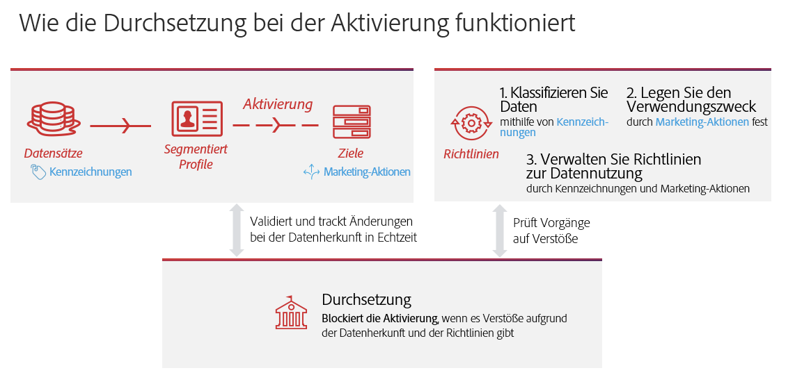
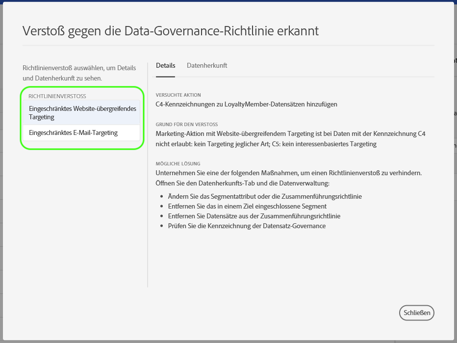
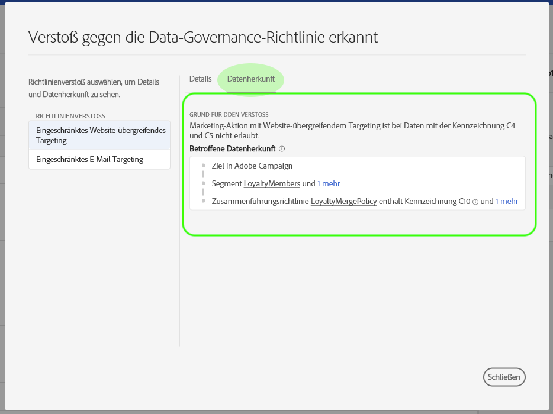

# Data Governance in der Echtzeit-Kundendatenplattform

Die Echtzeit-Kundendatenplattform führt Daten aus verschiedenen Unternehmenssystemen zusammen, damit Marketer ihre Kunden besser ermitteln, verstehen und ansprechen können. Diese Daten können Nutzungsbeschränkungen unterliegen, die von Ihrem Unternehmen oder durch gesetzliche Bestimmungen festgelegt werden. Daher muss sichergestellt sein, dass die Echtzeit-Kundendatenplattform bei der Verarbeitung Ihrer Daten mit den Nutzungsrichtlinien konform ist.

Mit Data Governance in Adobe Experience Platform können Sie Kundendaten verwalten und bei der Verwendung von Daten die Einhaltung von Vorschriften, Einschränkungen und Richtlinien sicherstellen. Data Governance spielt in der Echtzeit-Kundendatenplattform eine zentrale Rolle und erlaubt es Ihnen, Nutzungsrichtlinien zu definieren, Daten anhand dieser Richtlinien zu kategorisieren und bei Ausführung bestimmter Marketing-Aktionen auf Richtlinienverletzungen zu prüfen.

Die Echtzeit-Kundendatenplattform basiert auf Adobe Experience Platform. Daher werden die meisten Data Governance-Funktionen in der Experience Platform-Dokumentation behandelt. Dieses Dokument dient als Ergänzung zu [Data Governance – Übersicht](../../data-governance/home.md) für Experience Platform und bietet Informationen zu den Governance-Funktionen, die in der Echtzeit-Kundendatenplattform verfügbar sind. Folgende Themen werden behandelt:

* [Nutzungsbezeichnungen auf Daten anwenden](#labels)
* [Richtlinien zur Datennutzung verwalten](#policies)
* [Einhaltung von Datennutzungsrichtlinien durchsetzen](#enforce-data-usage-compliance)

## Nutzungsbezeichnungen auf Daten anwenden {#labels}

Mit Data Governance können Sie Nutzungsbezeichnungen auf Ihre Daten anwenden, entweder auf der Datensatz- oder der Datensatzfeldebene. Mit Datennutzungsbezeichnungen können Sie Daten anhand der für diese Daten geltenden Nutzungsrichtlinien kategorisieren.

Genauere Informationen zum Arbeiten mit Datennutzungsbezeichnungen finden Sie im [Benutzerhandbuch für Datennutzungsbezeichnungen](../../data-governance/labels/overview.md) für Adobe Experience Platform.

## Anwendungsfälle für das Marketing für Ziele konfigurieren {#destinations}

Sie können Datenverwendungsbeschränkungen für ein Ziel festlegen, indem Sie Anwendungsfälle für das Marketing (auch als Marketingaktionen bezeichnet) für dieses Ziel definieren. Ein Anwendungsfall für das Marketing für ein Ziel gibt den Zweck der Daten an, die an dieses Ziel exportiert werden.

>[!NOTE]
>
>Weitere Informationen zu Marketingaktionen und deren Verwendung in Datenverwendungsrichtlinien finden Sie in der Übersicht über die [Datenverwendungsrichtlinien](../../data-governance/policies/overview.md) in der Dokumentation zur Experience Platform.

Durch die Definition von Anwendungsfällen für das Marketing an Zielen können Sie sicherstellen, dass alle an diese Ziele gesendeten Profil oder Segmente mit den Datenverwendungsrichtlinien übereinstimmen. Daher sollten Sie Ihren Zielen entsprechend den Anforderungen Ihres Unternehmens, Richtlinienbeschränkungen für die Aktivierung durchzusetzen, geeignete Anwendungsfälle für das Marketing hinzufügen.

Anwendungsfälle für Marketing können nur beim erstmaligen Einrichten eines Ziels ausgewählt werden. Je nach Zieltyp, mit dem Sie arbeiten, wird die Möglichkeit zur Konfiguration von Anwendungsfällen für das Marketing an verschiedenen Punkten im Setup-Arbeitsablauf angezeigt. Anweisungen zum Konfigurieren des jeweiligen Ziels finden Sie in der [Zieldokumentation](../destinations/destinations-overview.md) .

## Datennutzungsrichtlinien verwalten {#policies}

Damit Datennutzungsbezeichnungen die Datenkonformität effektiv unterstützen können, müssen Sie Datennutzungsrichtlinien definieren und aktivieren. Datennutzungsrichtlinien sind Regeln, die die Arten von Marketing-Aktionen beschreiben, die Sie für Daten in der Echtzeit-Kundendatenplattform ausführen bzw. nicht ausführen dürfen. Weiterführende Informationen dazu finden Sie im Abschnitt „Datennutzungsrichtlinien“ unter [Data Governance – Übersicht](../../data-governance/home.md) für Experience Platform.

Adobe Experience Platform bietet verschiedene **zentrale Richtlinien** für gängige Anwendungsfälle bei Kundenerlebnissen. Diese Richtlinien können in der Benutzeroberfläche angezeigt werden, indem Sie zum Arbeitsbereich &quot; **[!UICONTROL Richtlinien]** &quot;navigieren und die Registerkarte &quot; **[!UICONTROL Durchsuchen]** &quot;auswählen. Detailliertere Anweisungen zum Arbeiten mit Richtlinien in der Benutzeroberfläche finden Sie im Benutzerhandbuch zu [Richtlinien](../../data-governance/policies/user-guide.md) in der Dokumentation zur Experience Platform, einschließlich der Erstellung eigener benutzerdefinierter Richtlinien.

## Einhaltung von Datennutzungsrichtlinien durchsetzen {#enforce-data-usage-compliance}

Nachdem Sie Daten gekennzeichnet und Nutzungsrichtlinien definiert haben, können Sie die Einhaltung von Datennutzungsrichtlinien erzwingen. Beim Aktivieren von Zielgruppensegmenten in der Echtzeit-CDP erzwingt Data Governance automatisch Nutzungsrichtlinien, falls Verstöße auftreten sollten.

Das folgende Diagramm zeigt, wie die Richtliniendurchsetzung in den Datenfluss der Segmentaktivierung integriert wird:

Wenn ein Segment zum ersten Mal aktiviert wird, prüft der DULE Policy Service anhand der folgenden Faktoren, ob Richtlinienverletzungen vorliegen:

* Die Datennutzungsbezeichnungen, die auf Felder und Datensätze innerhalb des zu aktivierenden Segments angewendet werden.
* Marketing-Zweck des Ziels.

>[!NOTE]
>
>Wenn es Datenverwendungsbeschriftungen gibt, die nur auf bestimmte Felder innerhalb eines Datensatzes angewendet wurden (und nicht auf den gesamten Datensatz), erfolgt die Durchsetzung dieser Beschriftungen auf Feldebene bei der Aktivierung nur unter folgenden Bedingungen:
>* Die Felder werden in der Segmentdefinition verwendet.
>* Die Felder sind als projizierte Attribute für das Ziel der Zielgruppe konfiguriert.

### Meldungen zu Richtlinienverstößen {#enforcement}

Wenn ein Richtlinienverstoß beim Versuch auftritt, ein Segment zu aktivieren (oder [ein bereits aktiviertes Segment zu bearbeiten](#policy-enforcement-for-activated-segments)), wird die Aktion verhindert und in einem Popup angezeigt, dass gegen eine oder mehrere Richtlinien verstoßen wurden. Wählen Sie einen Richtlinienverstoß in der linken Spalte des Popups aus, um Details zu diesem Verstoß anzuzeigen.

Die Registerkarte *Details* des Popup-Fensters zeigt die Aktion an, die den Verstoß ausgelöst hat, den Grund für den Verstoß und Vorschläge, wie das Problem möglicherweise gelöst werden kann.

Klicken Sie auf **Datenherkunft**, um die Ziele, Segmente, Zusammenführungsrichtlinien oder Datensätze zu verfolgen, deren Datenbezeichnungen den Verstoß ausgelöst haben.

Nachdem ein Verstoß ausgelöst wurde, wird die Schaltfläche **Speichern** für die Aktivierung deaktiviert, bis die entsprechenden Komponenten aktualisiert wurden, um den Datennutzungsrichtlinien zu entsprechen.

### Richtliniendurchsetzung für aktivierte Segmente {#policy-enforcement-for-activated-segments}

Die Richtliniendurchsetzung gilt auch für Segmente, nachdem sie aktiviert wurden. Dadurch werden Änderungen an einem Segment oder seinem Ziel eingeschränkt, die zu einem Richtlinienverstoß führen würden. Aufgrund der zahlreichen Komponenten, die beim Aktivieren von Segmenten zu Zielen beteiligt sind, kann eine der folgenden Aktionen möglicherweise einen Verstoß auslösen:

* Aktualisieren von Datennutzungsbezeichnungen
* Ändern von Datensätzen für ein Segment
* Ändern von Segmenteigenschaften
* Ändern von Zielkonfigurationen

Wenn eine der oben genannten Aktionen einen Verstoß auslöst, wird verhindert, dass diese Aktion gespeichert wird, und eine Richtlinienverstoßmeldung wird angezeigt. Dadurch wird sichergestellt, dass Ihre aktivierten Segmente nach dem Ändern weiterhin den Datennutzungsrichtlinien entsprechen.

## Nächste Schritte

Nach der Vorstellung der wichtigsten Data Governance-Funktionen in der Echtzeit-Kundendatenplattform und deren Aktivierung durch Experience Platform lesen Sie nun die [Data Governance-Dokumentation für Adobe Experience Platform](../../data-governance/home.md). Die Dokumentation bietet einen Überblick über wesentliche Data Governance-Konzepte sowie schrittweise Workflows zum Verwalten von Datennutzungsbezeichnungen und -richtlinien.

Das folgende Video bietet einen Überblick über die Datenverwaltung in CDP in Echtzeit, einschließlich der Verwendung von Anwendungsfällen für das Marketing an Zielen und Workflows für verschiedene Szenarien:

>[!VIDEO](https://video.tv.adobe.com/v/33631?quality=12&learn=on)