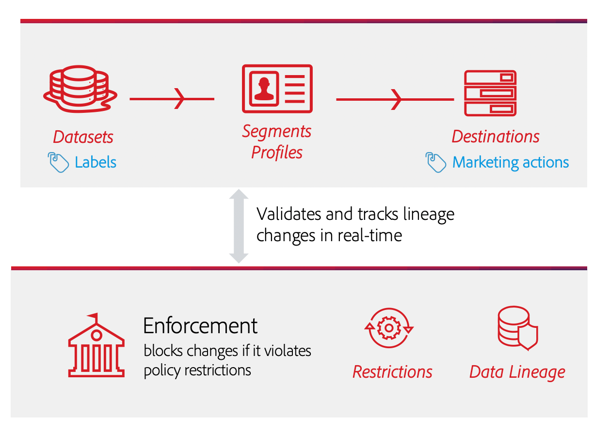

# [!DNL Data Governance] in Echtzeit-CDP

[!DNL Real-time Customer Data Platform] (Echtzeit-CDP) führt Daten aus mehreren Unternehmenssystemen zusammen, sodass Marketingexperten ihre Kunden besser identifizieren, verstehen und binden können. Diese Daten können Nutzungsbeschränkungen unterliegen, die von Ihrem Unternehmen oder durch gesetzliche Bestimmungen festgelegt werden. Daher muss sichergestellt sein, dass die Echtzeit-Kundendatenplattform bei der Verarbeitung Ihrer Daten mit den Nutzungsrichtlinien konform ist.

Adobe Experience Platform [!DNL Data Governance] allows you to manage customer data and ensure compliance with regulations, restrictions, and policies applicable to data use. Data Governance spielt in der Echtzeit-Kundendatenplattform eine zentrale Rolle und erlaubt es Ihnen, Nutzungsrichtlinien zu definieren, Daten anhand dieser Richtlinien zu kategorisieren und bei Ausführung bestimmter Marketing-Aktionen auf Richtlinienverletzungen zu prüfen.

Real-time CDP is built on top of Adobe Experience Platform, and therefore the majority of [!DNL Data Governance] capabilities are covered in the [!DNL Experience Platform] documentation. Dieses Dokument dient als Ergänzung zu [Data Governance – Übersicht](../../data-governance/home.md) für und bietet Informationen zu den Governance-Funktionen, die in der Echtzeit-Kundendatenplattform verfügbar sind.[!DNL Experience Platform] Folgende Themen werden behandelt:

* [Nutzungsbezeichnungen auf Daten anwenden](#labels)
* [Richtlinien zur Datennutzung verwalten](#policies)
* [Einhaltung von Datennutzungsrichtlinien durchsetzen](#enforce-data-usage-compliance)

## Nutzungsbezeichnungen auf Daten anwenden  {#labels}

[!DNL Data Governance]Mit können Sie Nutzungsbezeichnungen auf Ihre Daten anwenden, entweder auf der Datensatz- oder der Datensatzfeldebene. Mit Datennutzungsbezeichnungen können Sie Daten anhand der für diese Daten geltenden Nutzungsrichtlinien kategorisieren.

Genauere Informationen zum Arbeiten mit Datennutzungsbezeichnungen finden Sie im [Benutzerhandbuch für Datennutzungsbezeichnungen](../../data-governance/labels/overview.md) für Adobe Experience Platform.

## Anwendungsfälle für das Marketing für Ziele konfigurieren {#destinations}

Sie können Datenverwendungsbeschränkungen für ein Ziel festlegen, indem Sie Anwendungsfälle für das Marketing (auch als Marketingaktionen bezeichnet) für dieses Ziel definieren. Ein Anwendungsfall für das Marketing für ein Ziel gibt den Zweck der Daten an, die an dieses Ziel exportiert werden.

>[!NOTE]
>
>Weitere Informationen zu Marketingaktionen und deren Verwendung in Datenverwendungsrichtlinien finden Sie in der Übersicht über die [Datenverwendungsrichtlinien](../../data-governance/policies/overview.md) in der [!DNL Experience Platform] Dokumentation.

Durch die Definition von Anwendungsfällen für das Marketing an Zielen können Sie sicherstellen, dass alle an diese Ziele gesendeten Profil oder Segmente mit den Datenverwendungsrichtlinien übereinstimmen. Daher sollten Sie Ihren Zielen entsprechend den Anforderungen Ihres Unternehmens, Richtlinienbeschränkungen für die Aktivierung durchzusetzen, geeignete Anwendungsfälle für das Marketing hinzufügen.

Anwendungsfälle für Marketing können nur beim erstmaligen Einrichten eines Ziels ausgewählt werden. Je nach Zieltyp, mit dem Sie arbeiten, wird die Möglichkeit zur Konfiguration von Anwendungsfällen für das Marketing an verschiedenen Punkten im Setup-Arbeitsablauf angezeigt. Anweisungen zum Konfigurieren des jeweiligen Ziels finden Sie in der Dokumentation [zu](../destinations/overview.md) Zielen.

## Datennutzungsrichtlinien verwalten {#policies}

Damit Datennutzungsbezeichnungen die Datenkonformität effektiv unterstützen können, müssen Sie Datennutzungsrichtlinien definieren und aktivieren. Datennutzungsrichtlinien sind Regeln, die die Arten von Marketing-Aktionen beschreiben, die Sie für Daten in der Echtzeit-Kundendatenplattform ausführen bzw. nicht ausführen dürfen. Weiterführende Informationen dazu finden Sie im Abschnitt „Datennutzungsrichtlinien“ unter [!DNL Experience Platform][Data Governance – Übersicht](../../data-governance/home.md) für 

Adobe Experience Platform bietet verschiedene zentrale Richtlinien für gängige Anwendungsfälle bei Kundenerlebnissen. Diese Richtlinien können in der Benutzeroberfläche angezeigt werden, indem Sie zum Arbeitsbereich &quot; **[!UICONTROL Richtlinien]** &quot;navigieren und die Registerkarte &quot; **[!UICONTROL Durchsuchen]** &quot;auswählen. Detailliertere Schritte zum Arbeiten mit Richtlinien in der Benutzeroberfläche finden Sie im Benutzerhandbuch [zu](../../data-governance/policies/user-guide.md) Richtlinien in der [!DNL Experience Platform] Dokumentation, einschließlich der Erstellung eigener benutzerdefinierter Richtlinien.

## Einhaltung von Datennutzungsrichtlinien durchsetzen {#enforce-data-usage-compliance}

Nachdem Sie Daten gekennzeichnet und Nutzungsrichtlinien definiert haben, können Sie die Einhaltung von Datennutzungsrichtlinien erzwingen. When activating audience segments to destinations in Real-time CDP, [!DNL Data Governance] automatically enforces usage policies should any violations occur.

Das folgende Diagramm zeigt, wie die Richtliniendurchsetzung in den Datenfluss der Segmentaktivierung integriert wird:

When a segment is first activated, [!DNL Policy Service] checks for policy violations based on the following factors:

* Die Datennutzungsbezeichnungen, die auf Felder und Datensätze innerhalb des zu aktivierenden Segments angewendet werden.
* Marketing-Zweck des Ziels.

>[!NOTE]
>
>Wenn es Datenverwendungsbeschriftungen gibt, die nur auf bestimmte Felder innerhalb eines Datensatzes angewendet wurden (und nicht auf den gesamten Datensatz), erfolgt die Durchsetzung dieser Beschriftungen auf Feldebene bei der Aktivierung nur unter folgenden Bedingungen:
>* Die Felder werden in der Segmentdefinition verwendet.
>* Die Felder sind als projizierte Attribute für das Ziel der Zielgruppe konfiguriert.

### Datenleitung {#lineage}

Bei CDP in Echtzeit spielt die Datenleitung eine Schlüsselrolle bei der Durchsetzung von Richtlinien. Generell bezieht sich die Datenlineage auf die Herkunft eines Datensatzes und was mit der Zeit geschieht (oder wo sie sich bewegt).

Im Zusammenhang mit [!DNL Data Governance]der ermöglicht die Lineage die Übertragung von Datenverwendungsetiketten von Datasets auf nachgelagerte Dienste, die ihre Daten verbrauchen, wie z. B. Echtzeit-Kundendaten und Zielorte. Dies ermöglicht die Bewertung und Durchsetzung von Richtlinien an mehreren wichtigen Punkten auf der Datenreise durch die Plattform und bietet den Datenverbrauchern einen Kontext darüber, warum eine Richtlinienverletzung aufgetreten ist.

Bei CDP in Echtzeit geht es bei der Durchsetzung von Richtlinien um folgende Linie:

1. Daten werden in Echtzeit-CDP erfasst und in **Datensätzen** gespeichert.
1. Kunden-Profil werden anhand dieser Datensätze identifiziert und erstellt, indem Datenfragmente gemäß der **Zusammenführungsrichtlinie** zusammengeführt werden.
1. Gruppen von Profilen werden basierend auf allgemeinen Attributen in **Segmente** unterteilt.
1. Segmente werden an nachgelagerten **Zielen** aktiviert.

Jede Phase in der oben genannten Zeitschiene stellt eine Entität dar, die, wie in der folgenden Tabelle dargestellt, zu einer verletzten Richtlinie beitragen kann:

| Datenleitungsphase | Rolle bei der Durchsetzung der Vorschriften |
| --- | --- |
| Datensatz | Datensätze enthalten Datenverwendungsbeschriftungen (auf Datensatzebene oder Feldebene angewendet), mit denen festgelegt wird, für welche Anwendungsfälle der gesamte Datensatz oder bestimmte Felder verwendet werden können. Richtlinienverletzungen treten auf, wenn ein Datensatz oder ein Feld mit bestimmten Beschriftungen für einen Zweck verwendet wird, den eine Richtlinie einschränkt. |
| Richtlinie zusammenführen | Richtlinien zum Zusammenführen sind die Regeln, die Plattform verwendet, um festzulegen, wie Daten beim Zusammenführen von Fragmenten aus mehreren Datensätzen priorisiert werden. Richtlinienverletzungen treten auf, wenn Ihre Zusammenführungsrichtlinien so konfiguriert sind, dass Datensätze mit eingeschränkten Beschriftungen für ein Ziel aktiviert werden. See the guide on [merge policies](../../profile/ui/merge-policies.md) for more information. |
| Segment | Segmentregeln definieren, welche Attribute aus den Profilen der Kunden einbezogen werden sollen. Je nachdem, welche Felder eine Segmentdefinition enthält, übernimmt das Segment alle angewendeten Nutzungsbezeichnungen für diese Felder. Richtlinienverletzungen treten auf, wenn Sie ein Segment aktivieren, dessen geerbte Beschriftungen aufgrund der jeweiligen Richtlinien des Zielorts der Zielgruppe je nach Anwendungsfall für das Marketing eingeschränkt sind. |
| Ziel | Beim Einrichten eines Ziels kann eine Marketingaktion (manchmal auch als Marketing-Anwendungsfall bezeichnet) definiert werden. Dieser Verwendungsfall korreliert mit einer Marketingaktion, wie in einer Datenverwendungsrichtlinie definiert. Mit anderen Worten, der Marketing-Verwendungsfall, den Sie für ein Ziel definieren, bestimmt, welche Datenverwendungsrichtlinien für dieses Ziel gelten. Richtlinienverletzungen treten auf, wenn Sie ein Segment aktivieren, dessen Nutzungsbeschriftungen durch die geltenden Richtlinien des Zielgruppen-Ziels eingeschränkt sind. |

Wenn Richtlinienverletzungen auftreten, bieten die in der Benutzeroberfläche angezeigten Meldungen nützliche Werkzeuge, um die beitragende Datenlinie der Verletzung zu untersuchen und so zur Lösung des Problems beizutragen. Weitere Informationen finden Sie im nächsten Abschnitt.

### Meldungen zu Richtlinienverstößen  {#enforcement}

Wenn ein Richtlinienverstoß beim Versuch auftritt, ein Segment zu aktivieren (oder [ein bereits aktiviertes Segment zu bearbeiten](#policy-enforcement-for-activated-segments)), wird die Aktion verhindert und in einem Popup angezeigt, dass gegen eine oder mehrere Richtlinien verstoßen wurden. Once a violation has triggered, the **[!UICONTROL Save]** button is disabled for the entity you are modifying until the appropriate components are updated to comply with data usage policies.

Wählen Sie einen Richtlinienverstoß in der linken Spalte des Popups aus, um Details zu diesem Verstoß anzuzeigen.

Die Meldung &quot;Verletzung&quot;enthält eine Zusammenfassung der verletzten Richtlinie, einschließlich der Bedingungen, nach denen die Richtlinie überprüft werden soll, der spezifischen Aktion, die die Verletzung ausgelöst hat, und eine Liste möglicher Lösungen für das Problem.

Unter der Übersicht über die Verletzung wird ein Datenlinien-Diagramm angezeigt, das Ihnen veranschaulicht, welche Datensätze, Zusammenführungsrichtlinien, Segmente und Ziele an der Richtlinienverletzung beteiligt waren. Die Entität, die Sie derzeit ändern, wird im Diagramm hervorgehoben, was angibt, welcher Punkt im Fluss die Verletzung verursacht. Sie können einen Entitätsnamen im Diagramm auswählen, um die Detailseite für die betreffende Entität zu öffnen.

Sie können die angezeigten Entitäten auch über das Symbol **[!UICONTROL Filter]** () nach Kategorie filtern. Damit Daten angezeigt werden, müssen mindestens zwei Kategorien ausgewählt werden.

Wählen Sie &quot; **[!UICONTROL Liste-Ansicht]** &quot;, um die Datenzeile als Liste anzuzeigen. Um zum visuellen Diagramm zurückzukehren, wählen Sie &quot; **[!UICONTROL Pfad-Ansicht]**&quot;aus.

### Richtliniendurchsetzung für aktivierte Segmente  {#policy-enforcement-for-activated-segments}

Die Richtliniendurchsetzung gilt auch für Segmente, nachdem sie aktiviert wurden. Dadurch werden Änderungen an einem Segment oder seinem Ziel eingeschränkt, die zu einem Richtlinienverstoß führen würden. Aufgrund der Funktionsweise der [Datenreihenbildung](#lineage) bei der Durchsetzung von Richtlinien kann eine der folgenden Aktionen möglicherweise eine Verletzung auslösen:

* Aktualisieren von Datennutzungsbezeichnungen
* Ändern von Datensätzen für ein Segment
* Ändern von Segmenteigenschaften
* Ändern von Zielkonfigurationen

Wenn eine der oben genannten Aktionen einen Verstoß auslöst, wird verhindert, dass diese Aktion gespeichert wird, und eine Richtlinienverstoßmeldung wird angezeigt. Dadurch wird sichergestellt, dass Ihre aktivierten Segmente nach dem Ändern weiterhin den Datennutzungsrichtlinien entsprechen.

## Nächste Schritte

Now that you have been introduced to the key [!DNL Data Governance] features on Real-time CDP and how [!DNL Experience Platform] enables them, please continue to the [documentation for Data Governance on Adobe Experience Platform](../../data-governance/home.md). The documentation provides overviews of essential [!DNL Data Governance] concepts, as well as step-by-step workflows for managing data usage labels and policies.

Das folgende Video bietet einen Überblick über [!DNL Data Governance] die CDP in Echtzeit, einschließlich der Verwendung von Marketing-Anwendungsfällen für Ziele und Workflows für verschiedene Szenarien:

>[!VIDEO](https://video.tv.adobe.com/v/33631?quality=12&learn=on)