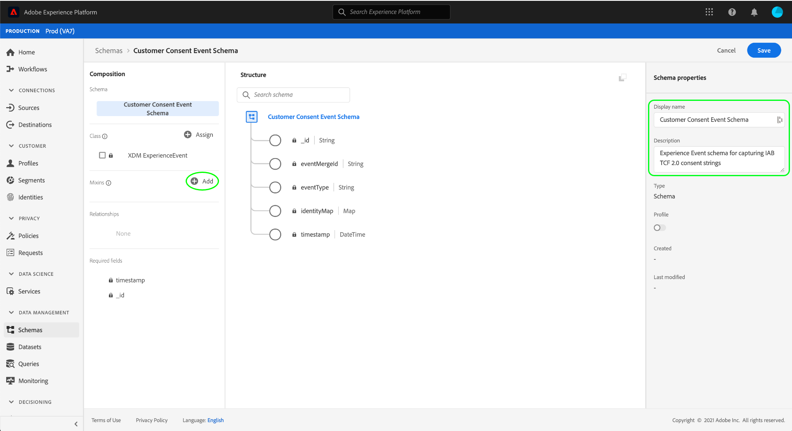

# Erstellen von Datensätzen zur Erfassung von IAB TCF 2.0-Genehmigungsdaten

Damit [!DNL Real-time Customer Data Platform] die Daten zur Kundengenehmigung gemäß IAB [!DNL Transparency & Consent Framework] (TCF) 2.0 verarbeitet werden können, müssen diese Daten an Datensätze gesendet werden, deren Schemas TCF 2.0-Einwilligungsfelder enthalten.

Für die Erfassung von TCF 2.0-Genehmigungsdaten sind insbesondere zwei Datensätze erforderlich:

* Ein auf der [!DNL XDM Individual Profile] Klasse basierender Datensatz, der für die Verwendung in aktiviert ist [!DNL Real-time Customer Profile].
* Ein Datensatz, der auf der [!DNL XDM ExperienceEvent] Klasse basiert.

In diesem Dokument werden Schritte zur Einrichtung dieser beiden Datensätze zur Erhebung der IAB TCF 2.0-Genehmigungsdaten beschrieben. Eine Übersicht über den vollständigen Arbeitsablauf zur Konfiguration [!DNL Real-time CDP] für TCF 2.0 finden Sie in der [IAB TCF 2.0 Compliance-Übersicht](./overview.md).

## Voraussetzungen 

Dieses Tutorial setzt ein Grundverständnis der folgenden Komponenten von Adobe Experience Platform voraus:

* [Experience-Datenmodell (XDM)](../../../xdm/home.md)[!DNL Experience Platform]: Das standardisierte Framework, mit dem Kundenerlebnisdaten organisiert.
   * [Grundlagen der Schemakomposition](../../../xdm/schema/composition.md): Erfahren Sie mehr über die Grundbausteine von XDM-Schemata.
   * [Erstellen Sie ein Schema in der Benutzeroberfläche](../../../xdm/tutorials/create-schema-ui.md): Ein Lernprogramm, das die Grundlagen der Arbeit mit dem Schema-Editor behandelt.
* [Adobe Experience Platform-Identitätsdienst](../../../identity-service/home.md): Ermöglicht Ihnen, Kunden-Identitäten von unterschiedlichen Datenquellen über Geräte und Systeme hinweg zu überbrücken.
* [Echtzeit-Profil](../../../profile/home.md): Ermöglicht [!DNL Identity Service] die Erstellung detaillierter Kundendaten aus Ihren Datensätzen in Echtzeit. [!DNL Real-time Customer Profile] ruft Daten aus dem Data Lake ab und behält die Profil der Kunden in einem eigenen separaten Datenspeicher bei.

## Struktur des Schemas für Zustimmung {#structure}

Es gibt zwei XDM-Mixins, die Felder für die Kundengenehmigung bereitstellen, die für die Unterstützung von TCF 2.0 erforderlich sind: eine für Datensatzbasierte Daten ([!DNL XDM Individual Profile]) und eine andere für zeitreihenbasierte Daten ([!DNL XDM ExperienceEvent]):

| Schema | Beschreibung |
| --- | --- |
| Profil Privacy mixen | Dieses Mixin erfasst die aktuellen Voreinstellungen für die Zustimmung eines Kunden. Bei Verwendung in einem [!DNL Profile]aktivierten Schema werden die in diesem Mixin angegebenen Werte als Wahrheitsquelle für die Art und Weise betrachtet, wie die Durchsetzung der Zustimmung auf die Daten eines Kunden angewendet werden sollte. |
| [!DNL Experience Event] Datenschutzmischung | Dieses Mixin erfasst die Präferenzen eines Kunden zur Einwilligung zu einem bestimmten Zeitpunkt. Die in diesen Feldern erfassten Daten können verwendet werden, um Änderungen in den Voreinstellungen für die Zustimmung des Kunden im Laufe der Zeit zu verfolgen. |

Während der Anwendungsfall der einzelnen Mixins unterschiedlich ist, sind die angegebenen Felder ungefähr gleich. Diese Felder werden im folgenden Abschnitt näher erläutert.

### Felder für Zustimmungsmixes {#privacy-mixin}

Während jede Kombination aus Datenschutz und Struktur der darin enthaltenen Felder unterschiedlich ist, stellen beide das `xdm:consentString` Attribut bereit, dessen Unterfelder für die TCF 2.0-Durchsetzung erforderlich sind. Die Struktur dieser Felder und die erwarteten Werte sind nachfolgend dargestellt:

```json
{
  "xdm:consentString": {
    "xdm:consentStandard": "IAB TCF",
    "xdm:consentStandardVersion": "2.0",
    "xdm:consentStringValue": "BObdrPUOevsguAfDqFENCNAAAAAmeAAA.PVAfDObdrA.DqFENCAmeAENCDA",
    "xdm:gdprApplies": true,
    "xdm:containsPersonalData": false
  }
}
```

| Eigenschaft | Beschreibung |
| --- | --- |
| `xdm:consentString` | Enthält die aktualisierten Zustimmungsdaten des Kunden und andere Kontextinformationen. |
| `xdm:consentStandard` | Der Rahmen für die Zustimmung, für den die Daten gelten. Für die TCF-Konformität sollte der Wert &quot;IAB TCF&quot;lauten. |
| `xdm:consentStandardVersion` | Die Versionsnummer des Genehmigungsrahmens, angegeben durch `xdm:consentStandard`. Bei TCF 2.0-Kompatibilität sollte der Wert &quot;2.0&quot;lauten. |
| `xdm:consentStringValue` | Die auf der Grundlage der vom Kunden ausgewählten Einstellungen für die Zustimmung generierte Zeichenfolge. |
| `xdm:gdprApplies` | Ein boolescher Wert, der angibt, ob der GDPR für diesen Kunden gilt. Der Wert muss auf &quot;true&quot;gesetzt werden, damit eine TCF 2.0-Durchsetzung erfolgt. Die Standardeinstellung lautet &quot;false&quot;(falsch), wenn sie nicht enthalten ist. |
| `xdm:containsPersonalData` | Ein boolescher Wert, der angibt, ob die Aktualisierung der Zustimmung personenbezogene Daten enthält. Die Standardeinstellung lautet &quot;false&quot;(falsch), wenn sie nicht enthalten ist. |

## Schemas zur Kundengenehmigung erstellen {#create-schemas}

In the Platform UI, click **[!UICONTROL Schemas]** in the left navigation to open the **[!UICONTROL Schemas]** workspace. Gehen Sie von hier aus wie folgt vor, um jedes erforderliche Schema zu erstellen.

>[!NOTE]
>
>Wenn Sie vorhandene XDM-Schema haben, die Sie stattdessen zur Erfassung von Genehmigungsdaten verwenden möchten, können Sie diese Schema bearbeiten, anstatt neue zu erstellen. Bei der Bearbeitung vorhandener Schema ist es jedoch wichtig, die [Grundsätze der Schema-Evolution](../../../xdm/schema/composition.md#evolution) zu beachten, um Veränderungen zu vermeiden.

### Erstellen eines Schemas für die Einwilligung in einen Datensatz {#profile-schema}

Erstellen Sie auf der Registerkarte &quot; **[!UICONTROL Durchsuchen]** &quot;im Arbeitsbereich &quot; **[!UICONTROL Schemas] &quot;ein neues Schema, das auf der**[!DNL XDM Individual Profile] Klasse basiert. Nachdem Sie das Schema im Schema-Editor geöffnet haben, klicken Sie auf der linken Seite der Arbeitsfläche unter dem Abschnitt &quot; **[!UICONTROL Mixins]** &quot;auf **[!UICONTROL Hinzufügen]** .


The **[!UICONTROL Add mixin]** dialog appears. Wählen Sie hier in der Liste die Option **[!UICONTROL Profil Privacy]** . Sie können optional die Suchleiste verwenden, um die Ergebnisse einzuschränken, um das Mixin einfacher zu finden. Klicken Sie nach Auswahl des Mixins auf **[!UICONTROL Hinzufügen Mixin]**.


Die Arbeitsfläche des Schema-Editors wird wieder angezeigt, sodass Sie die Struktur der hinzugefügten Felder für die Zustimmungszeichenfolge überprüfen können.


Wiederholen Sie von hier aus die oben genannten Schritte, um dem Schema die folgenden zusätzlichen Mixins hinzuzufügen:

* [!UICONTROL IdentityMap]
* [!UICONTROL Datenerfassungsregion für Profil]
* [!UICONTROL Angaben zur Person des Profils]
* [!UICONTROL Persönliche Angaben zum Profil]


Wenn Sie ein vorhandenes Schema bearbeiten, das bereits für die Verwendung in aktiviert wurde, klicken Sie auf [!DNL Real-time Customer Profile]&quot; **[!UICONTROL Speichern]** &quot;, um die Änderungen zu bestätigen, bevor Sie mit dem Abschnitt zum [Erstellen eines Datensatzes auf der Grundlage Ihres Schemas](#dataset)für die Zustimmung fortfahren. Wenn Sie ein neues Schema erstellen, führen Sie die im Unterabschnitt unten beschriebenen Schritte aus.

#### Schema zur Verwendung in [!DNL Real-time Customer Profile]

Damit die [!DNL Real-time CDP] von ihr erhaltenen Daten mit bestimmten Profilen verknüpft werden können, muss das Schema für die Zustimmung zur Verwendung in diesem Bereich aktiviert werden [!DNL Real-time Customer Profile].

>[!NOTE]
>
>Das in diesem Schema gezeigte Beispiel verwendet sein `identityMap` Feld als primäre Identität. Wenn Sie ein anderes Feld als primäre Identität festlegen möchten, stellen Sie sicher, dass Sie einen indirekten Bezeichner wie eine Cookie-ID verwenden und nicht ein direkt identifizierbares Feld, das nicht in interessensbasierter Werbung wie einer E-Mail-Adresse verwendet werden darf. Wenden Sie sich an Ihren Rechtsbeistand, wenn Sie nicht sicher sind, welche Felder eingeschränkt sind.
>
>Schritte zum Festlegen eines primären Identitätsfelds für ein Schema finden Sie im Lernprogramm zur Erstellung von [Schemas](../../../xdm/tutorials/create-schema-ui.md#identity-field).

Um das Schema zu aktivieren, [!DNL Profile]klicken Sie in der linken Leiste auf den Namen des Schemas, um das Dialogfeld &quot; **[!UICONTROL Schema-Eigenschaften]** &quot;in der rechten Leiste zu öffnen. Klicken Sie von hier auf die Schaltfläche zum Umschalten des **[!UICONTROL Profils]** .


Es wird ein Popup mit einer fehlenden primären Identität angezeigt. Aktivieren Sie das Kontrollkästchen für die Verwendung einer alternativen primären Identität, da die primäre Identität im Feld identityMap enthalten sein wird.

<br>

Klicken Sie abschließend auf **[!UICONTROL Speichern]** , um die Änderungen zu bestätigen.


### Erstellen eines zeitreihenbasierten Schemas für die Zustimmung {#event-schema}

Erstellen Sie auf der Registerkarte &quot; **[!UICONTROL Durchsuchen]** &quot;im Arbeitsbereich &quot; **[!UICONTROL Schemas]** &quot;ein neues Schema, das auf der [!DNL XDM ExperienceEvent] Klasse basiert. Nachdem Sie das Schema im Schema-Editor geöffnet haben, klicken Sie auf der linken Seite der Arbeitsfläche unter dem Abschnitt &quot; **[!UICONTROL Mixins]** &quot;auf **[!UICONTROL Hinzufügen]** .



The **[!UICONTROL Add mixin]** dialog appears. Wählen Sie von hier aus **[!UICONTROL Experience Ereignis Privacy mixin]** der Liste. Sie können optional die Suchleiste verwenden, um die Ergebnisse einzuschränken, um das Mixin einfacher zu finden. Klicken Sie nach Auswahl des Mixins auf **[!UICONTROL Hinzufügen Mixin]**.


Die Arbeitsfläche des Schema-Editors wird wieder angezeigt und zeigt die Felder mit der hinzugefügten Zustimmungszeichenfolge an.


Wiederholen Sie von hier aus die oben genannten Schritte, um dem Schema die folgenden zusätzlichen Mixins hinzuzufügen:

* [!UICONTROL IdentityMap]
* [!UICONTROL Details zur ExperienceEvent-Umgebung]
* [!UICONTROL ExperienceEvent-Webdetails]
* [!UICONTROL Details zur ExperienceEvent-Implementierung]

Nachdem die Mixins hinzugefügt wurden, klicken Sie auf **[!UICONTROL Speichern]**.


## Erstellen Sie Datensätze basierend auf Ihren Schemas zur Einwilligung {#datasets}

Für jedes der oben beschriebenen erforderlichen Schema müssen Sie einen Datensatz erstellen, der letztendlich die Daten zur Einwilligung Ihrer Kunden erfasst. Der auf dem [!DNL XDM Individual Profile] Schema basierende Datensatz muss aktiviert werden, [!DNL Real-time Customer Profile]während der auf dem [!DNL XDM ExperienceEvent] Schema basierende Datensatz nicht [!DNL Profile]aktiviert werden sollte.

Wählen Sie zunächst **[!UICONTROL Datasets]** in der linken Navigation und klicken Sie dann in der oberen rechten Ecke auf Dataset **[!UICONTROL erstellen]** .


On the next page, select **[!UICONTROL Create dataset from schema]**.


Der **[!UICONTROL Arbeitsablauf zum Erstellen eines Datensatzes aus Schema]** wird angezeigt, beginnend mit dem Schritt zum **[!UICONTROL Auswählen des Schemas]** . Suchen Sie in der bereitgestellten Liste nach einem der Schema für die Zustimmung, die Sie zuvor erstellt haben. Sie können die Suche optional verwenden, um die Ergebnisse einzugrenzen und Ihr Schema einfacher zu finden. Klicken Sie auf das Optionsfeld neben dem Schema, um es auszuwählen, und klicken Sie dann auf **[!UICONTROL Weiter]** , um fortzufahren.


Der Schritt **[!UICONTROL Datensatz konfigurieren]** wird angezeigt. Geben Sie einen eindeutigen, leicht identifizierbaren Namen und eine Beschreibung für den Datensatz ein, bevor Sie auf **[!UICONTROL Fertig stellen]** klicken.


Die Detailseite für den neu erstellten Datensatz wird angezeigt. Wenn der Datensatz auf Ihrem [!DNL XDM ExperienceEvent] Schema basiert, ist der Vorgang abgeschlossen. Wenn der Datensatz auf Ihrem [!DNL XDM Individual Profile] Schema basiert, besteht der letzte Schritt darin, den Datensatz zur Verwendung in zu aktivieren [!DNL Real-time Customer Profile]. Klicken Sie in der rechten Leiste auf die Schaltfläche zum Umschalten des **[!UICONTROL Profils]** , um den Datensatz zu aktivieren.


Führen Sie die oben genannten Schritte erneut aus, um den anderen erforderlichen Datensatz für die TCF 2.0-Kompatibilität zu erstellen.

## Nächste Schritte

In diesem Lernprogramm haben Sie zwei Datensätze erstellt, die jetzt zur Erfassung von Daten zur Kundeneinwilligung verwendet werden können:

* Ein [!DNL Profile]aktivierter Datensatz, der auf Ihrem [!DNL XDM Individual Profile] Schema basiert.
* Ein auf Ihrem [!DNL XDM ExperienceEvent] Schema basierender Datensatz, für den nicht aktiviert ist [!DNL Profile].

Sie können nun zum [IAB TCF 2.0-Überblick](./overview.md#merge-policies) zurückkehren, um den Prozess der Konfiguration [!DNL Real-time CDP] für TCF 2.0-Compliance fortzusetzen.