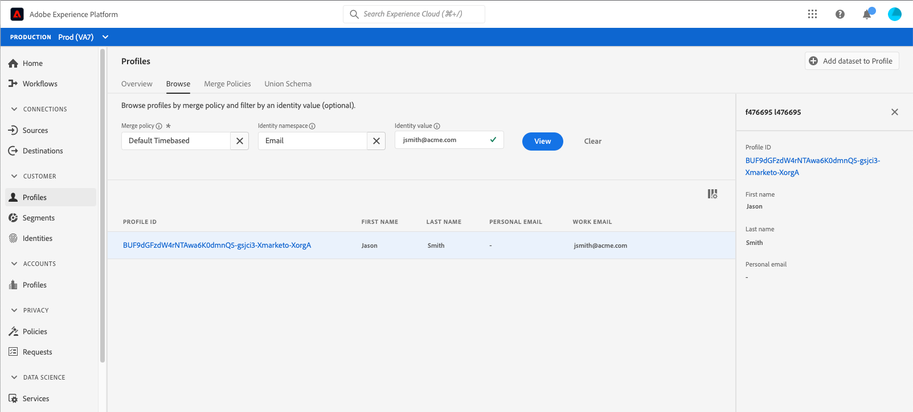
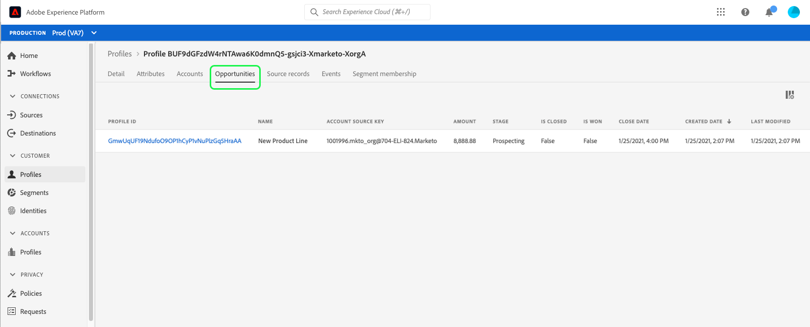

# Profile in Real-time Customer Data Platform durchsuchen

Das Echtzeit-Kundenprofil erstellt eine ganzheitliche Sicht Ihrer einzelnen Kunden und fasst Daten aus mehreren Kanälen (einschließlich Online-, Offline-, CRM- und Drittanbieter-Daten) zusammen. Da einzelne Profile auf Grundlage von Daten aggregiert werden, die aus unterschiedlichen Quellen in das System eingespeist werden, wird jedes Profil zu einem umsetzbaren Konto mit Zeitstempel für jede Interaktion, die ein Kunde mit Ihrer Marke hat.

In der Adobe Experience Platform-Benutzeroberfläche können Sie diese schreibgeschützten Profile anzeigen und wichtige Informationen zu jedem Ihrer Kunden anzeigen, einschließlich der Voreinstellungen, vergangener Ereignisse, Interaktionen und der Segmente, zu denen der Kontakt gehört.

Real-time Customer Data Platform basiert auf Adobe Experience Platform und kann so die Funktionen zur Profilanzeige in der Experience Platform-Benutzeroberfläche nutzen. Eine ausführliche Anleitung zum Anzeigen von Kundenprofilen in der Benutzeroberfläche von Platform finden Sie im [Echtzeit-Kundenprofil-Benutzerhandbuch](../../profile/ui/user-guide.md).

## Profilverbesserungen für die Echtzeit-Kundendatenplattform, B2B Edition

>[!IMPORTANT]
>
>Real-time Customer Data Platform B2B Edition befindet sich derzeit in der Beta-Phase. Dokumentation und Funktionalität können sich ändern.

Zusätzlich zu den von Adobe Experience Platform unterstützten Funktionen zum Durchsuchen von Profilen können Benutzer der Echtzeit-Kundendatenplattform und B2B Edition auf B2B-Attribute und -Ereignisse innerhalb des Kundenprofils auf den Registerkarten [!UICONTROL Attribute] bzw. [!UICONTROL Ereignisse] zugreifen. B2B-Daten können auch für die Segmentierung verwendet werden, wobei diese Segmente neben Nicht-B-Segmenten auf der Registerkarte [!UICONTROL Segmentmitgliedschaft] des Kunden angezeigt werden.

Mit der Echtzeit-Kundendatenplattform B2B Edition können Sie auch [!UICONTROL Konten], [!UICONTROL Chancen] und [!UICONTROL Quelldatensätze] aus all Ihren Unternehmensquellen durchsuchen, die mit einem einzelnen Kunden verknüpft sind.

Um diese Verbesserungen zu untersuchen, führen Sie zunächst die Schritte aus, die im [Echtzeit-Kundenprofil-Benutzerhandbuch](../../profile/ui/user-guide.md) beschrieben sind, um ein Profil nach Zusammenführungsrichtlinie oder Identitäts-Namespace zu durchsuchen.

Die Profildetails enthalten Zugriff auf die Registerkarten [!UICONTROL Konten], [!UICONTROL Chancen] und [!UICONTROL Quelldatensätze] sowie die Standardinformationen im Kundenprofil, die ebenfalls mit B2B-Ereignissen und -Attributen erweitert wurden.

### Registerkarte „Konten“

Wählen Sie **[!UICONTROL Konten]** aus, um eine Liste der mit dem Profil verbundenen Konten anzuzeigen. Diese Liste enthält grundlegende Informationen aus dem Kontoprofil wie den Namen, die Website und die Branche des Kontos sowie einen Link zum Kontoprofil.

Weitere Informationen zum Anzeigen und Erkunden von Kontoprofilen finden Sie in der [Übersicht über Kontoprofile](../accounts/account-profile-overview.md).

### Registerkarte &quot;Chancen&quot;

Der Tab **[!UICONTROL Chancen]** enthält Details zu offenen und geschlossenen Gelegenheiten im Zusammenhang mit dem Konto. Diese Möglichkeiten können aus verschiedenen Quellen in die Experience Platform aufgenommen werden. Die Echtzeit-Kundendatenplattform B2B Edition erleichtert es jedoch Marketern, all diese Möglichkeiten an einem Ort zu sehen.

Jede Gelegenheit umfasst Informationen wie den Namen der Gelegenheit, ihren Umfang, die Phase und ob die Gelegenheit offen, geschlossen, gewonnen oder verloren ist.

### Registerkarte &quot;Quelldatensätze&quot;

Im Tab **[!UICONTROL Quelldatensätze]** können Sie mühelos die verschiedenen Quelldatensätze aus Ihren Unternehmensquellen sehen, die zum einzelnen Kundenprofil beitragen. Zusätzlich zum [!UICONTROL Personen-Quellschlüssel] und der E-Mail-Adresse stellt jeder Quelldatensatz auch den Typ des Datensatzes (z. B. einen &quot;Kontakt&quot;- oder &quot;Lead&quot;-Datensatz) sowie die Quelle bereit.

