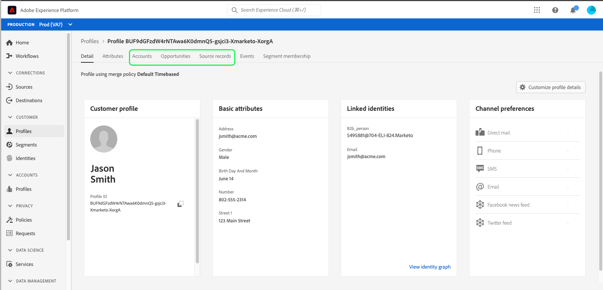
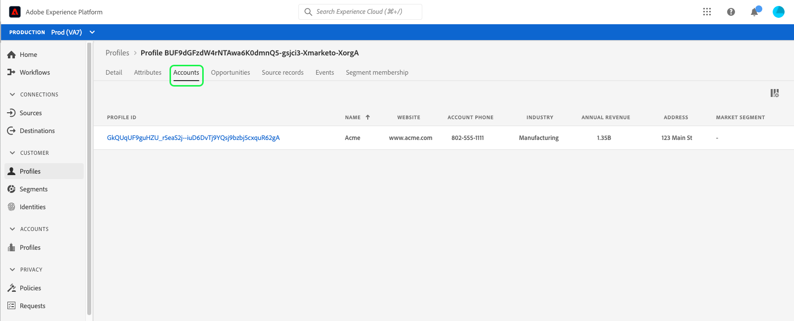
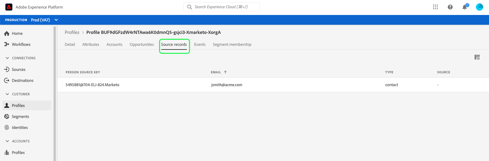

# Durchsuchen von Profilen in Real-Time Customer Data Platform

Das Echtzeit-Kundenprofil erstellt eine ganzheitliche Sicht auf Ihre einzelnen Kunden und führt Daten aus verschiedenen Kanälen (Online-, Offline-, CRM- und Drittanbieter-Daten) zusammen. Da einzelne Profile auf Grundlage von Daten aggregiert werden, die aus unterschiedlichen Quellen in das System eingespeist werden, wird jedes Profil zu einem umsetzbaren Konto mit Zeitstempel für jede Interaktion, die ein Kunde mit Ihrer Marke hat.

In der Benutzeroberfläche von Adobe Experience Platform können Sie diese schreibgeschützten Profile anzeigen und wichtige Informationen zu Ihren einzelnen Kundinnen und Kunden anzeigen, einschließlich ihrer Voreinstellungen, vergangener Ereignisse, Interaktionen und der Zielgruppen, zu denen die Person gehört.

Adobe Real-Time Customer Data Platform basiert auf Adobe Experience Platform und kann daher die Funktionen zur Profilanzeige in der Benutzeroberfläche von Experience Platform nutzen. Eine detaillierte Anleitung zum Anzeigen von Kundenprofilen in der Benutzeroberfläche von Experience Platform finden Sie [ Benutzerhandbuch zum Echtzeit-Kundenprofil](../../profile/ui/user-guide.md).

## Profilverbesserungen für Real-Time CDP, B2B Edition

Zusätzlich zu den von Adobe Experience Platform, Real-Time CDP unterstützten Funktionen zum Durchsuchen von Profilen können B2B edition-Benutzende auf den Registerkarten [!UICONTROL Attributes] bzw. [!UICONTROL Events] auf B2B-Attribute und -Ereignisse innerhalb des Kundenprofils zugreifen. B2B-Daten können auch für die Segmentierung verwendet werden, wobei diese Zielgruppen neben Nicht-B2B-Zielgruppen auf der Registerkarte &quot;[!UICONTROL Audience membership]&quot; des Kunden angezeigt werden.

Mit Real-Time CDP, B2B edition können Sie auch [!UICONTROL Accounts], [!UICONTROL Opportunities] und [!UICONTROL Source records] aus allen Ihren Unternehmensquellen durchsuchen, die mit einem einzelnen Kunden verbunden sind.

Um sich diese Verbesserungen anzusehen, folgen Sie zunächst den Schritten, die im [Benutzerhandbuch zum Echtzeit-Kundenprofil](../../profile/ui/user-guide.md) beschrieben sind, um ein Profil nach Zusammenführungsrichtlinie oder Identity-Namespace zu durchsuchen.

Die Profildetails umfassen neben den Standardinformationen im Kundenprofil, die auch um B2B-Ereignisse und -Attribute erweitert wurden, auch den Zugriff auf die Registerkarten [!UICONTROL Accounts], [!UICONTROL Opportunities] und [!UICONTROL Source records] .

Weitere Informationen zu den in der Benutzeroberfläche von Experience Platform bereitgestellten Profildetails finden Sie im Abschnitt [Details“ der Dokumentation zum Dashboard „Profile](../../dashboards/guides/profiles.md#browse-profiles).

### Registerkarte „Konten“

Wählen Sie **[!UICONTROL Accounts]** aus, um eine Liste der mit dem Profil verbundenen Konten anzuzeigen. Diese Liste enthält grundlegende Informationen aus dem Kontoprofil, wie z. B. den Namen, die Website und die Branche des Kontos, sowie einen Link zum Kontoprofil.

Um weitere Informationen zum Anzeigen und Untersuchen von Account-Profilen zu erhalten, lesen Sie zunächst die [Übersicht über Account-Profile](../accounts/account-profile-overview.md).

### Registerkarte „Opportunitys“

Die Registerkarte **[!UICONTROL Opportunities]** enthält Details zu offenen und geschlossenen Opportunitys im Zusammenhang mit dem Account. Diese Opportunitys können aus verschiedenen Quellen in Experience Platform aufgenommen werden. Real-Time CDP, B2B edition, erleichtert es Marketing-Experten jedoch, all diese Opportunitys an einem Ort zu sehen.

Jede Opportunity umfasst Informationen wie den Namen der Opportunity, ihren Umfang, die Phase und ob die Opportunity offen, geschlossen, gewonnen oder verloren ist.

### Registerkarte &quot;Source-Einträge“

Auf der Registerkarte **[!UICONTROL Source records]** können Sie die verschiedenen Quelldatensätze aus Ihren Unternehmensquellen, die zu dem einzelnen Kundenprofil beitragen, leicht einsehen. Zusätzlich zur [!UICONTROL Person source key] und E-Mail-Adresse enthält jeder Quelldatensatz auch den Typ des Datensatzes (z. B. einen „Kontakt“- oder „Lead“-Datensatz) sowie die Quelle.

