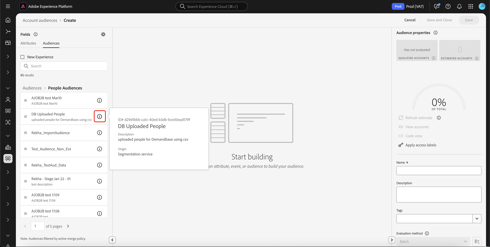

# Audience Builder in Real-Time Customer Data Platform

[!DNL Adobe Real-Time Customer Data Platform] basiert auf Adobe Experience Platform und kann alle Funktionen von Audience Builder nutzen, die Teil von [!DNL Experience Platform] sind. Der Arbeitsbereich bietet intuitive Steuerelemente zum Erstellen und Bearbeiten von Regeln, z. B. Drag-and-Drop-Kacheln, die Dateneigenschaften entsprechen.

{zoomable="yes"}

## Felder {#fields}

>[!CONTEXTUALHELP]
>id="platform_b2b_audiencebuilder_showfullxdmschema"
>title="Gesamtes XDM-Schema anzeigen"
>abstract="Standardmäßig werden nur Felder angezeigt, die Daten enthalten. Aktivieren Sie diese Option, um alle Felder im XDM-Schema anzuzeigen."

>[!CONTEXTUALHELP]
>id="platform_b2b_audiencebuilder_showrelationselectors"
>title="Beziehungsselektoren anzeigen"
>abstract="Standardmäßig werden die Standardbeziehungen für Ihre Organisation verwendet. Aktivieren Sie diese Option, um die verwendeten Beziehungsselektoren anzuzeigen."

>[!CONTEXTUALHELP]
>id="platform_b2b_audiencebuilder_showconstrainedfields"
>title="Eingeschränkte Felder anzeigen"
>abstract="Standardmäßig werden nur Felder ohne Einschränkungen angezeigt. Aktivieren Sie diese Option, um Felder mit Einschränkungen anzuzeigen."

Bei Verwendung von Audience Builder für -Konten können Sie Kontoattribute oder vorhandene Zielgruppen als Felder Ihrer Zielgruppe verwenden.

Sie können das Symbol  auswählen, um die Einstellungen für die angezeigten Felder anzupassen.

{zoomable="yes"}

>[!NOTE]
>
>Der Abschnitt **[!UICONTROL Feldoptionen]** befindet sich derzeit in der Beta-Phase und steht nur ausgewählten Kundinnen und Kunden zur Verfügung. Wenden Sie sich an die Adobe-Kundenunterstützung, um weitere Informationen zu erhalten.

Der [!UICONTROL Einstellungen] wird angezeigt. In diesem Abschnitt können Sie festlegen, welche Felder angezeigt werden und wie die Beziehung der Felder aussieht.

Für die **[!UICONTROL Feldoptionen]** können Sie entweder nur die Felder anzeigen, die Daten enthalten, oder das vollständige XDM-Schema.

Für die **[!UICONTROL Beziehung von Feldern]** können Sie entweder die Standardbeziehungen für Ihre Organisation verwenden oder die Beziehungsselektoren anzeigen.

{width="300"}

### Attribute {#attributes}

Auf [!UICONTROL &#x200B; Registerkarte &#x200B;]Attribute“ können Sie Account-Attribute, die zur Klasse XDM Business Account gehören, sowie Opportunities und personenbasierte Attribute durchsuchen. Jeder Ordner kann erweitert werden, um zusätzliche Attribute anzuzeigen. Jedes Attribut ist eine Kachel, die in der Mitte des Arbeitsbereichs auf [ Arbeitsfläche ](#rule-builder-canvas)Regel-Builders“ gezogen werden kann.

Bei der Auswahl eines Attributs können Sie Zusammenfassungsdaten anzeigen, indem Sie auf das [Informationssymbol](../../images/icons/info.png) klicken. Die Zusammenfassungsdaten enthalten Informationen wie Spitzenwerte, eine Erläuterung des Felds sowie den Prozentsatz der Konten, die Werte für dieses Attribut enthalten.

{width="300"}

Wenn ein Attribut in weniger als 25 % der Konten eingetragen ist, wird stattdessen  angezeigt. Unabhängig davon werden für das Attribut dieselben Zusammenfassungsdaten angezeigt.

{width="300"}

>[!NOTE]
>
>Zusammenfassungsdaten sind nur verfügbar, wenn das Attribut zum Schema Konto, Person oder Opportunity gehört. Darüber hinaus werden die oberen Werte nur angezeigt, wenn das Feld **nicht** zu viele verschiedene Werte enthält und wenn die Werte dieser Felder häufig wiederholt werden.
>
>Diese Zusammenfassungsdaten werden **täglich**.

Eine detailliertere Anleitung zum Audience Builder finden Sie im [Audience Builder-Benutzerhandbuch](../../segmentation/ui/segment-builder.md){target="_blank"}.

### Zielgruppen {#audiences}

Auf **[!UICONTROL Registerkarte]** Zielgruppen“ werden alle personenbasierten und kontobasierten Zielgruppen aufgelistet, die in Experience Platform verfügbar sind.

Sie können den Mauszeiger über das  neben einer Zielgruppe bewegen, um Informationen über die Zielgruppe anzuzeigen, einschließlich ihrer ID, Beschreibung und der Ordnerhierarchie zum Auffinden der Zielgruppe.

{zoomable="yes"}

## Arbeitsfläche des Regel-Builders {#rule-builder-canvas}

Eine in Audience Builder erstellte Zielgruppe ist eine Sammlung von Regeln, mit denen wichtige Merkmale oder Verhaltensweisen einer Zielgruppe beschrieben werden. Diese Regeln werden mithilfe der Arbeitsfläche des Regel-Builders in der Mitte von Audience Builder erstellt.

Um Ihrer Segmentdefinition eine neue Regel hinzuzufügen, ziehen Sie eine Kachel aus der Registerkarte **[!UICONTROL Felder]** und legen Sie sie auf der Arbeitsfläche des Regel-Builders ab.

{zoomable="yes"}

Weitere Informationen zur Verwendung der Arbeitsfläche des Regel-Builders finden Sie in der [Segment Builder-Dokumentation](../../segmentation/ui/segment-builder.md#rule-builder-canvas){target="_blank"}.

### Container {#containers}

Zielgruppenregeln werden in der Reihenfolge ausgewertet, in der sie aufgelistet sind. Sie können Container verwenden, um die Ausführungsreihenfolge durch die Verwendung verschachtelter Abfragen besser steuern zu können.

Weitere Informationen zu Containern finden Sie in der [Segment Builder-Dokumentation](../../segmentation/ui/segment-builder.md#containers){target="_blank"}.

## Zielgruppen-Eigenschaften {#properties}

Im Abschnitt **[!UICONTROL Zielgruppeneigenschaften]** werden Informationen zur Zielgruppe angezeigt, einschließlich einer geschätzten Größe der Zielgruppe. Sie können auch Details zu Ihrer Audience angeben, einschließlich Name, Beschreibung und Tags.

{width="300"}

Die **[!UICONTROL Qualifizierte Konten]** gibt die tatsächliche Anzahl von Konten an, die den Regeln der Zielgruppe entsprechen. Diese Zahl wird nach Ausführung des Segmentierungsauftrags alle 24 Stunden aktualisiert.

Die **[!UICONTROL Geschätzte Konten]** gibt die ungefähre Anzahl von Konten basierend auf dem Beispielvorgang an. Sie können diesen Wert aktualisieren, nachdem Sie neue Regeln oder Bedingungen hinzugefügt und **[!UICONTROL Schätzung aktualisieren]** ausgewählt haben.

{width="300"}

Sie können auf **[!UICONTROL Konten anzeigen]** klicken, um ein Stichprobenverfahren für die Konten anzuzeigen, die mit den aktuellen Regeln für die Zielgruppe qualifiziert wären.

{width="300"}

Die **[!UICONTROL Code]** Ansicht) bietet eine textbasierte Code-Beschreibung der Regeln der Zielgruppe.

Sie können **[!UICONTROL Zugriffskennzeichnungen anwenden]** auswählen, um die entsprechenden Zugriffskennzeichnungen für die Zielgruppe anzuwenden. Weitere Informationen zu Zugriffsbeschriftungen finden Sie im [Handbuch zum Verwalten von Beschriftungen](../../access-control/abac/ui/labels.md){target="_blank"}.

Der Rest des Abschnitts „Zielgruppeneigenschaften“ ermöglicht die Bearbeitung von Details, die sich auf die Konto-Zielgruppe beziehen, einschließlich Name, Beschreibung und Tags.

{width="300"}

Sie **die Auswertungsmethode** Konto-Zielgruppen nicht ändern, da alle Konto-Zielgruppen mithilfe der Batch-Segmentierung ausgewertet werden.

## Nächste Schritte {#next-steps}

Audience Builder bietet einen umfangreichen Workflow, mit dem Sie Zielgruppen aus Ihren XDM Business-Kontodaten erstellen können.

Weitere Informationen zum Segmentierungs-Service für Kundenprofildaten finden Sie unter [Segmentierungs-Service - Übersicht](../../segmentation/home.md){target="_blank"}.
