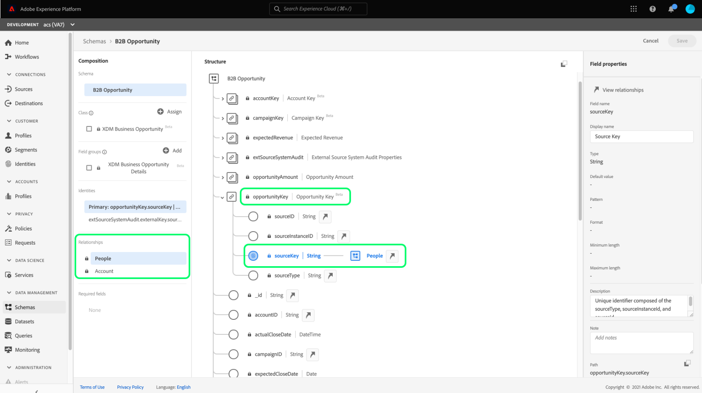

# Anwendungsfälle für die Segmentierung für Real-Time Customer Data Platform B2B edition

Dieses Dokument enthält Beispiele für Segmentdefinitionen in Adobe Real-Time Customer Data Platform B2B edition und dafür, wie verschiedene Attributtypen für gängige B2B-Anwendungsfälle kombiniert werden können. Informationen dazu, wie Ziele in Ihren B2B-Workflow passen, finden Sie im [End-to-End-Tutorial](../b2b-tutorial.md#create-a-segment-to-evaluate-your-data).

>[!NOTE]
>
>Die für diese Segmentierungsanwendungsfälle erforderlichen Attribute stehen nur Kunden von Real-Time Customer Data Platform B2B edition zur Verfügung. Wenn Sie Real-Time Customer Data Platform B2B edition nicht verwenden, lesen Sie stattdessen [Segmentierungsübersicht](./segmentation-overview.md).

>[!BEGINSHADEBOX]

## Änderung der Zusammenführungsrichtlinie

Bei der Aktualisierung der Real-Time CDP B2B edition-Architektur unterstützen Zielgruppen mit mehreren Entitäten mit B2B-Attributen jetzt nur noch eine einzige Zusammenführungsrichtlinie (die standardmäßige Zusammenführungsrichtlinie) anstelle mehrerer Zusammenführungsrichtlinien. Darüber hinaus können sich Änderungen, bei denen Profile für Audiences qualifiziert werden können, auf nachgelagerte Workflows auswirken, z. B. Aktivierung, Journey-Orchestrierung und Kampagnen-Targeting. Es wird empfohlen, Folgendes durchzuführen, um sicherzustellen, dass Ihre Daten erwartungsgemäß funktionieren:

- Überprüfen und testen Sie alle Zielgruppen, die nicht auf die standardmäßige Zusammenführungslogik angewiesen sind, um die potenziellen Auswirkungen dieser Aktualisierung zu verstehen.
- Bewerten Sie die Kriterien für die Zielgruppen-Qualifizierung neu, um zu verstehen, ob sich die Änderungen in der Zusammenführungslogik auf Qualifikationen auswirken können.
- Überwachen Sie Ihre Aktivierungsergebnisse, um Verschiebungen in den Zielgruppenergebnissen zu erkennen, die durch die Änderung der Zusammenführungsrichtlinie verursacht werden.

>[!ENDSHADEBOX]

## Voraussetzungen {#prerequisites}

Bevor Sie die Segmentierungsattribute für B2B-Klassen verwenden können, müssen Sie die folgenden Schritte ausführen:

1. Erstellen Sie Schemas, die die B2B-Klassen verwenden. Zu den B2B edition-Klassen gehören Konto, Kampagne, Opportunity, Marketing-Liste und mehr. Informationen zum [ von Schemas zur Verwendung mit B2B-Klassen ](../schemas/b2b.md) Sie in der Schemadokumentation .
2. Erstellen Sie Beziehungen zwischen Ihren B2B-Schemata des Experience-Datenmodells (XDM). Zielgruppen, die auf B2B edition-Attributen basieren, erfordern Beziehungen zwischen den -Klassen, um die erweiterte B2B-Segmentierungsfunktion in vollem Umfang nutzen zu können. Weitere Informationen finden Sie in der Dokumentation [Definieren einer Beziehung zwischen zwei B2B](../../xdm/tutorials/relationship-b2b.md)Schemata“.
3. Nehmen Sie Daten mithilfe von Datensätzen auf der Grundlage Ihrer B2B-Schemata auf. Informationen zur Datenaufnahme finden [ in der Quellendokumentation ](../../sources/connectors/adobe-applications/marketo/marketo.md).
4. Eine detailliertere Anleitung [ Erstellen von Zielgruppen ](../../segmentation/ui/segment-builder.md) Sie im Segment Builder-Benutzerhandbuch .

Sobald diese Anforderungen erfüllt sind, können Sie diese Attribute für gängige B2B-Anwendungsfälle kombinieren.

## Erste Schritte {#getting-started}

Sobald die Vereinigungsschemata für die B2B-Klassen Beziehungen hergestellt haben und zur Aufnahme von Daten verwendet wurden, werden ihre Attribute in der linken Leiste von Segment Builder verfügbar gemacht.

B2B-Klassen und ihre Attribute werden im Segmentierungsarbeitsbereich mit einer `B2B`-Kennzeichnung versehen, um sie von den in Real-Time Customer Data Platform standardmäßig verfügbaren Unterschieden werden zu können.

Um Zielgruppen für B2B-Anwendungsfälle effektiv erstellen zu können, ist es wichtig, über genaue Kenntnisse des Schemas zu verfügen und zu verstehen, wie das Datenmodell aussieht. Es ist auch nützlich, sich des Pfads bewusst zu sein, den die Daten von einem Datenobjekt zum anderen nehmen.

Die folgende Abbildung zeigt die Beziehungen zwischen den B2B-Klassen, die in Real-Time CDP B2B edition verfügbar sind.

Da Ihr Datenmodell kompliziert sein kann, können Sie über die Platform-Benutzeroberfläche eine detailliertere visuelle Darstellung Ihres Datenmodells anzeigen, um die relevanten Attribute für Ihren Anwendungsfall zu finden. Navigieren Sie zunächst zur Platform-Benutzeroberfläche und wählen Sie im linken Navigationsbereich Schemas aus.

Wählen Sie das entsprechende Schema aus der verfügbaren Liste und wählen Sie die entsprechende Beziehung aus der Seitenleiste [!UICONTROL Komposition] aus. Im folgenden Beispiel wird bei Auswahl der Beziehung „Person“ angezeigt, welches Attribut im aktuellen Schema auf das zugehörige Schema „Person“ verweist (wenn es das Quellschema in der Beziehung ist) oder vom Schema „Person“ referenziert wird (wenn es das Referenzschema in der Beziehung ist).

Diese Beziehung spiegelt sich in Segment Builder durch die Verwendung von `Key` wider, wie in der Abbildung unten dargestellt.

Weitere Informationen zu den verfügbaren B2B[Klassen finden Sie ](../schemas/b2b.md) der Dokumentation zu Schemas in Real-Time Customer Data Platform B2B edition .

Die folgenden Anwendungsfälle enthalten Informationen darüber, welche Klassen verwendet werden, um Beziehungen zwischen den verschiedenen Schemas herzustellen und so diese Ergebnisse zu erzielen. Diese Beispiele können bei der Erstellung eigener Zielgruppen verwendet werden.

## Beispiele für verschiedene Anwendungsfälle für die Segmentierung {#use-cases}

Die folgenden Anwendungsfälle sind für die Segmentierung mit der B2B edition verfügbar. Jedes Beispiel enthält eine Beschreibung der Aktionen der Zielgruppe und eine Beschreibung der Klassen, mit denen sie erstellt wurde. Die bereitgestellten Bilder heben den Dateipfad in der Seitenleiste [!UICONTROL Attribute] hervor, die die Struktur des Schemas widerspiegelt. Der [!UICONTROL Segmenteigenschaften] auf der rechten Seite der Anzeige enthält eine schriftliche Aufschlüsselung der Attribute der Zielgruppe.

### Beispiel 1: „Entscheidungsträger“ für B2B-Opportunities suchen {#find-decision-maker}

Finden Sie alle Personen, die bei jeder Gelegenheit „Entscheidungsträger“ sind. Diese Zielgruppe erfordert eine Verknüpfung zwischen der Klasse [!UICONTROL XDM Individual Profile] und der Klasse [!UICONTROL XDM Business Opportunity Person Relation].

### Beispiel 2: B2B-Profile suchen, die Opportunities über einem bestimmten Dollarbetrag zugewiesen wurden {#find-opportunities-amount}

Findet alle Personen, die direkt einer Opportunity zugewiesen sind, deren Opportunity-Betrag den angegebenen Betrag ($1 Million) übersteigt. Diese Zielgruppe erfordert eine Verknüpfung zwischen der Klasse [!UICONTROL XDM Individual Profile], der Klasse [!UICONTROL XDM Business Opportunity Person Relation] und der Klasse [!UICONTROL XDM Business Opportunity].

### Beispiel 3: B2B-Profile suchen, die Vertriebschancen zugewiesen wurden, nach Standort {#find-opportunities-location}

Alle Personen suchen, die einer Opportunity direkt zugewiesen sind, bei der sich das Konto an einem bestimmten Ort (Kanada) befindet. Diese Zielgruppe erfordert eine Verknüpfung zwischen der Klasse [!UICONTROL XDM Individual Profile], der Klasse [!UICONTROL XDM Business Opportunity Person Relation], der Klasse [!UICONTROL XDM Business Opportunity] und der Klasse [!UICONTROL XDM Business Account].

### Beispiel 4: Finden Sie „Entscheidungsträger“ für Chancen nach Branche und Browser-Verhalten {#find-industry-browsing-behavior}

Finden Sie alle Personen, die „Entscheidungsträger“ für eine Opportunity sind, bei denen das Konto in der „Finanzbranche“ angesiedelt ist, und haben die Preisseite in den letzten drei Tagen besucht.

Um diese Zielgruppe zu erstellen, müssen Sie „Segmente von Segmenten“ verwenden, indem Sie eine Basis-Zielgruppe aller Personen erstellen, die die Preisseite in den letzten drei Tagen besucht haben.

Nachdem Sie die erste Zielgruppe erstellt haben, können Sie sie mit einer anderen Zielgruppe von Personen kombinieren, die ein „Entscheidungsträger“ jeder Gelegenheit sind, bei der der Account in der „Finanzbranche“ liegt.

### Beispiel 5: B2B-Profile für Opportunitys nach Abteilungsname und Opportunity-Betrag suchen {#find-department-opportunity-amount}

Finden Sie alle Personen, die in einer Personalabteilung arbeiten und über ein Konto verfügen, über das mindestens eine offene Opportunity im Wert von mindestens 1 Million Dollar verfügt. Diese Zielgruppe erfordert eine Verknüpfung zwischen der Klasse [!UICONTROL XDM Individual Profile], der Klasse [!UICONTROL XDM Business Account] und der Klasse [!UICONTROL XDM Business Opportunity].

### Beispiel 6: B2B-Profile nach Tätigkeitsbezeichnung und jährlichem Kontoumsatz suchen {#find-by-job-title-and-revenue}

Finden Sie alle Personen, deren Berufsbezeichnung Vizepräsident ist und die über ein Konto mit einem Jahresumsatz in Höhe des angegebenen Betrags (100 Millionen US-Dollar) oder mehr verfügen und die Preisseite im letzten Monat mindestens drei Mal besucht haben. Diese Zielgruppe erfordert eine Verknüpfung zwischen der Klasse [!UICONTROL XDM Individual Profile], der Klasse [!UICONTROL XDM Business Account] und der Klasse [!UICONTROL XDM ExperienceEvent].

### Beispiel 7: Finden Sie „Entscheidungsträger“ nach Opportunity-Status und Browser-Verhalten {#find-by-opportunity-status-and-browsing-behavior}

Finden Sie alle Personen, die „Entscheidungsträger“ für eine abgeschlossene Opportunity sind und die die Preisseite in den letzten drei Tagen besucht haben.

Um diese Zielgruppe zu erstellen, müssen Sie „Segmente von Segmenten“ verwenden, indem Sie eine Basis-Zielgruppe aller Personen erstellen, die die Preisseite in den letzten drei Tagen besucht haben.

Nachdem Sie die erste Zielgruppe erstellt haben, können Sie sie mit einer anderen Zielgruppe von Personen kombinieren, die „Entscheidungsträger“ jeder Gelegenheit sind, bei der sowohl die „Geschlossene Markierung“ auf „true“ als auch die „Verlorene Markierung“ auf „false“ gesetzt ist.

### Beispiel 8: Verwenden verwandter Konten, um den Segmentierungsbereich zu erweitern {#related-accounts}

Finden Sie alle Personen, die in einer Personalabteilung arbeiten und mit einem Konto (*einem der zugehörigen Konten des Kontos) verbunden sind,* mindestens eine offene Opportunity im Wert des angegebenen Betrags (1 Million USD) oder höher hat. Diese Zielgruppe erfordert eine Verknüpfung zwischen der Klasse [!UICONTROL XDM Individual Profile], der Klasse [!UICONTROL XDM Business Account] und der Klasse [!UICONTROL XDM Business Opportunity].

### Beispiel 9: Lead- und/oder Kontobewertungen zur Profilqualifizierung verwenden {#account-scoring}

Findet alle Profile mit einer Lead-Bewertung von über 80.

### Beispiel 10: B2B-Profile suchen, die mit Konten verknüpft sind, deren übergeordnete Organisation über einen bestimmten Dollarbetrag Umsatz hat {#find-parent-org-amount}

Ermitteln Sie alle Personen, die mit Konten verknüpft sind, deren übergeordnete Organisation einen Umsatz hat, der über dem angegebenen Betrag (100.000.000 $) liegt.

### Beispiel 11: B2B-Profile nach Auftragstitel und Kontoname mit einer aktiven Beziehung suchen {#find-by-job-title-and-account-name}

Finden Sie alle Personen, die „Manager“ sind, auf dem Konto „Acme“, wobei die Kontobeziehung „Aktiv“ ist.

### Beispiel 12: B2B-Profile für Kampagnen suchen, bei denen die Ist-Kosten die budgetierten Kosten überschreiten {#find-actualcost-exceed-budgetcost}

Ermitteln Sie alle Personen, die für Kampagnen vorgesehen sind, bei denen die Ist-Kosten die budgetierten Kosten überschritten haben.

### Beispiel 13: B2B-Profile finden, die zu einer statischen Marketo-Liste gehören, und isDeleted=false {#find-marketo-static-list}

Suchen Sie alle Personen, die zur statischen Marketo-Liste „Anniversary users“ gehören, wobei isDeleted=false ist.

<!-- 
### Example 14: Find "decision makers" by opportunity status using streaming or edge segmentation {#find-decision-makers-personalization}

>[!NOTE]
>
>This example uses **streaming or edge** segmentation, as opposed to batch segmentation.

Find all the people who are a "Decision Maker" of any closed-lost opportunity and visited the pricing page in the last 24 hours. This example can be evaluated using streaming or edge segmentation, to support more real-time use cases.

To create this audience, you must use "segment of segments" by creating a base audience of all the people who visited the pricing page in the last 24 hours.

After creating the first audience, you can combine that with another audience of  people who are a "Decision Maker" of any opportunity where both the "Closed Flag" is set to true and the "Lost Flag" is set to false.

 -->

## Nächste Schritte {#next-steps}

Nach dem Lesen dieser Übersicht haben Sie jetzt ein Verständnis der Segmentierungsmöglichkeiten, die mit Real-Time CDP, B2B edition verfügbar sind. Weitere Informationen zum Segmentierungs-Service finden Sie in der [Segmentierungsdokumentation](../../segmentation/home.md).
