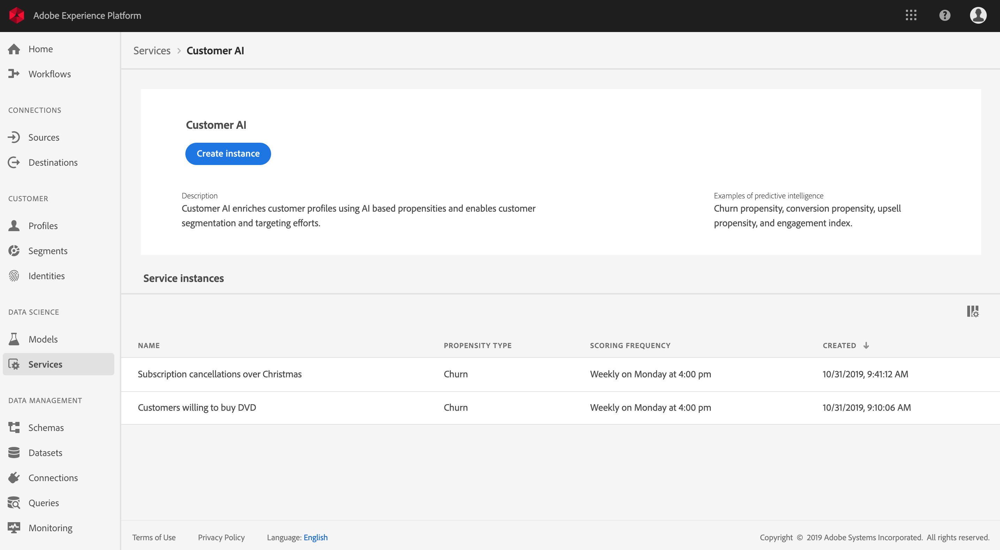

# Mit Customer AI kundenspezifische Tendenzwerte prognostizieren (Alpha)

>[!NOTE]
>Die in diesem Dokument beschriebene Funktion Customer AI befindet sich in der Alpha-Phase. Dokumentation und Funktionalität können sich ändern.

Mit Customer AI in Adobe Experience Platform auf der Basis von Adobe Sensei können Sie benutzerdefinierte Tendenzwerte generieren, ohne sich um die Aspekte des maschinellen Lernens kümmern zu müssen.

In diesem Tutorial werden die Schritte zum Arbeiten mit Customer AI unter Verwendung der Benutzeroberfläche von Experience Platform beschrieben. Schritte werden für folgende Themen aufgeführt:

* [Instanz konfigurieren](#configure-an-instance)
* [Kundensegmente mit prognostizierten Werten erstellen](#create-customer-segments-with-predicted-scores)

## Erste Schritte

Dieser Leitfaden setzt Kenntnis der verschiedenen Platform-Dienste voraus, die an der Verwendung von Customer AI beteiligt sind. Bevor Sie mit dem Tutorial beginnen, lesen Sie folgende Dokumente:

* [Übersicht über das Echtzeit-Kundenprofil](https://www.adobe.io/apis/experienceplatform/home/profile-identity-segmentation/profile-identity-segmentation-services.html#!api-specification/markdown/narrative/technical_overview/unified_profile_architectural_overview/unified_profile_architectural_overview.md)
* [Übersicht über den Segmentierungsdienst](https://www.adobe.io/apis/experienceplatform/home/profile-identity-segmentation/profile-identity-segmentation-services.html#!end-user/markdown/segmentation_overview/segmentation.md)
* [Segment Builder-Benutzerhandbuch](https://www.adobe.io/apis/experienceplatform/home/profile-identity-segmentation/profile-identity-segmentation-services.html#!end-user/markdown/segmentation_overview/segment-builder-guide.md)

## Instanz konfigurieren

Experience Platform stellt Customer AI als anwenderfreundlichen Adobe Sensei-Dienst bereit, der für verschiedene Anwendungsfälle konfiguriert werden kann. Die folgenden Abschnitte enthalten Schritte zum Konfigurieren einer Instanz von Customer AI.

### Instanz einrichten

Klicken Sie in der Benutzeroberfläche von Platform im linken Navigationsbereich auf **Dienste**. Der Browser für **Dienste** erscheint und zeigt alle Dienste an, die Ihnen zur Verfügung stehen. Klicken Sie im Container für Customer AI auf **Öffnen**.

Im Bildschirm *Customer AI* werden alle vorhandenen Customer AI-Instanzen angezeigt. Klicken Sie auf **Instanz erstellen**.

Der Workflow für die Instanzerstellung wird angezeigt, beginnend mit dem Schritt *Einrichtung*.

Im Folgenden finden Sie wichtige Informationen zu Werten, die Sie für die Instanz angeben müssen:

* Der Name der Instanz wird an allen Stellen verwendet, an denen der Customer AI-Wert angezeigt wird. Daher sollten Namen beschreiben, was die Prognosewerte darstellen, z. B. „Wahrscheinlichkeit einer Kündigung eines Zeitschriftenabonnements“.

* Der Tendenztyp bestimmt den Zweck des Wertes und die Metrikpolarität. Sie können entweder **Abwanderung** oder **Konversion** wählen.

* Die Datenquelle bezieht sich auf den Eingabedatensatz, der zur Prognose von Werten verwendet wird. Standardmäßig nutzt Customer AI Kundenerlebnis-Ereignisdaten, um Tendenzwerte zu berechnen. Wenn Sie einen Datensatz in der Dropdown-Auswahl wählen, werden nur Datensätze aufgelistet, die mit Customer AI kompatibel sind.

* Standardmäßig werden Tendenzwerte für alle Profile generiert, es sei denn, es wurde eine qualifizierte Zielgruppe angegeben. Sie können eine qualifizierte Zielgruppe angeben, indem Sie Bedingungen festlegen, um Profile auf Grundlage von Ereignissen ein- oder auszuschließen.

Geben Sie die erforderlichen Werte ein und klicken Sie auf **Weiter**.

### Ziel definieren

Der Schritt *Ziel definieren* wird angezeigt und bietet eine interaktive Umgebung, in der Sie ein Ziel visuell festlegen können. Ein Ziel besteht aus einem oder mehreren Ereignissen, bei denen das Auftreten eines jeden Ereignisses auf der Bedingung basiert, die es enthält. Ziel einer Customer AI-Instanz ist es, die Wahrscheinlichkeit zu bestimmen, mit der ihr Ziel innerhalb eines bestimmten Zeitraums erreicht wird.

Klicken Sie auf **Feldnamen eingeben** und wählen Sie ein Feld aus der Dropdown-Liste aus. Klicken Sie auf die zweite Eingabe und wählen Sie eine Klausel für die Ereignisbedingung. Geben Sie dann einen Zielwert ein, um das Ereignis fertigzustellen. Weitere Ereignisse können durch Klicken auf **Ereignis hinzufügen** konfiguriert werden. Schließen Sie das Ziel ab, indem Sie einen Prognosezeitrahmen (Zahl der Tage) anwenden, und klicken Sie dann auf **Weiter**.

### Zeitplan konfigurieren *(optional)*

Der Schritt *Erweitert* wird angezeigt. In diesem optionalen Schritt können Sie einen Zeitplan konfigurieren, um die Ausführung von Prognosen zu automatisieren, Prognoseausschlüsse zum Filtern bestimmter Ereignisse definieren oder auf **Fertig stellen** klicken, wenn nichts mehr erforderlich ist.

Richten Sie einen Bewertungszeitplan ein, indem Sie die *Bewertungshäufigkeit* festlegen. Die Ausführung automatisierter Prognosen kann entweder wöchentlich oder monatlich geplant werden.

Unter der Zeitplankonfiguration können Sie Prognoseausschlüsse definieren, um zu verhindern, dass bei der Generierung von Werten Ereignisse ausgewertet werden, die bestimmte Bedingungen erfüllen. Mit dieser Funktion können irrelevante Dateneingaben herausgefiltert werden.

Um bestimmte Ereignisse auszuschließen, klicken Sie auf **Ausschluss hinzufügen** und definieren Sie das Ereignis auf dieselbe Weise wie das Ziel. Um einen Ausschluss zu entfernen, klicken Sie auf die Auslassungspunkte (**...**) oben rechts neben dem Ereignis-Container und dann auf **Container entfernen**.

Schließen Sie Ereignisse nach Bedarf aus und klicken Sie dann auf **Fertig stellen**, um die Instanz zu erstellen.

Wenn die Instanz erfolgreich erstellt wurde, wird sofort eine Prognose ausgeführt; nachfolgende Ausführungen erfolgen dann gemäß Ihrem definierten Zeitplan.

>   **Hinweis:** Je nach Umfang der Eingabedaten kann die Ausführung von Prognosen bis zu 24 Stunden dauern.

In diesem Abschnitt haben Sie eine Instanz von Customer AI konfiguriert und eine Prognose durchgeführt. Nach erfolgreicher Ausführung sorgen Bewertungsdaten für ein automatisches Ausfüllen von Profilen mit Prognosewerten. Warten Sie 24 Stunden, bevor Sie mit dem nächsten Abschnitt dieses Tutorials fortfahren.

## Kundensegmente mit prognostizierten Werten erstellen

Nach Abschluss einer Prognose werden die prognostizierten Tendenzwerte von Profilen automatisch übernommen. Ein Anreichern von Profilen mit Customer AI-Werten ermöglicht eine Erstellung von Kundensegmenten, die auf Tendenzwerten basieren. In diesem Abschnitt werden Schritte zum Erstellen von Segmenten mit Segment Builder beschrieben. Eine genauere Anleitung zum Erstellen von Segmenten finden Sie im [Segment Builder-Benutzerhandbuch](https://www.adobe.io/apis/experienceplatform/home/profile-identity-segmentation/profile-identity-segmentation-services.html#!end-user/markdown/segmentation_overview/segment-builder-guide.md).

Klicken Sie in der Benutzeroberfläche von Platform im linken Navigationsbereich auf **Segmente** und dann auf **Segment erstellen**.

*Segment Builder* wird angezeigt. Klicken Sie in der linken Spalte *Felder* und auf der Registerkarte *Attribute* auf den Ordner **Individuelles XDM-Profil** und dann auf den Ordner mit dem Namespace Ihres Unternehmens. Der Ordner **Customer AI** enthält die Ergebnisse von Prognoseausführungen und wird nach der Instanz benannt, zu der die Werte gehören. Klicken Sie auf die Ergebnisse der gewünschten Instanz und rufen Sie sie auf.

Ziehen Sie das Attribut **Wert**, das sich in der Mitte von Segment Builder befindet, in die *Arbeitsfläche zum Erstellen von Regeln*, um eine Regel zu definieren.

Wählen Sie unter der rechten Spalte *Segmenteigenschaften* eine *Zusammenführungsrichtlinie* aus und geben Sie einen Namen für das Segment ein. Klicken Sie dann auf **Speichern**, um das Segment zu erstellen.

## Nächste Schritte

In diesem Tutorial haben Sie erfolgreich eine Instanz von Customer AI konfiguriert, Tendenzwerte generiert und unter Verwendung von Segment Builder ein Segment erstellt, das mit Tendenzwerten durchgesetzt wird. Ihr Kundensegment kann nun von aktivierten Zielen zum Ansprechen Ihrer Zielgruppen verwendet werden. Weiterführende Informationen dazu finden Sie unter [Ziele – Übersicht](../destinations/destinations-overview.md).
