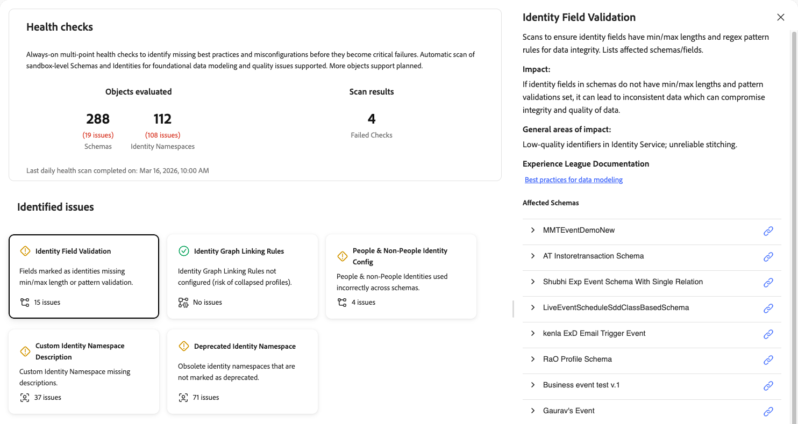

# Konsistenzprüfungen

Konsistenzprüfungen scannen Ihre Schemata und Identitäten, die in Ihrer Sandbox verwendet werden, und bieten eine Zusammenfassung von Problemen, die Sie verwenden können, um mit [!UICONTROL AI Assistant] zu untersuchen und Fehler zu beheben. In Zukunft können weitere Objekte auf einen umfassenderen Bericht überprüft werden.

Schlechte Schema- und Identitätskonfigurationen führen zu erheblichen nachgelagerten Problemen, einschließlich falscher Profilerstellung, fehlgeschlagener Segmentqualifikation und ungenauer Aktivierung. Diese Probleme sind schwer zu erkennen und erfordern oft spezielles Fachwissen zur Diagnose. Konsistenzprüfungen verlagern Ihren Ansatz von der reaktiven Fehlerbehebung auf die proaktive, präventive Wartung.

Mit Konsistenzprüfungen können Sie:

* **Konfigurationsprobleme frühzeitig erkennen**: Identifizieren Sie fehlende Best Practices, Fehlkonfigurationen und Muster, die zu Ineffizienzen bei Personalisierung, Aktivierung und mehr führen.
* **Erhalten Sie angeleitete Problembehebung**: Erhalten Sie klare Anleitungen dazu, was jedes Problem ist und was Sie dagegen tun können.
* **Fortlaufend überwachen**: In diesem Moment führen Konsistenzprüfungen tägliche automatische Scans durch, damit Sie Probleme erkennen können, bevor sie zu kritischen Fehlern werden. Der Zeitplan kann sich in zukünftigen Versionen ändern.

## Voraussetzungen {#prerequisites}

Für den Zugriff auf Konsistenzprüfungen benötigen Sie die **[!UICONTROL View Health Checks]** [Zugriffssteuerungsberechtigung](/help/access-control/home.md#permissions). Wenden Sie sich an Ihren Systemadministrator, um sicherzustellen, dass Sie über die entsprechenden Berechtigungen verfügen.

## Zugreifen auf Konsistenzprüfungen {#access-health-checks}

So greifen Sie über die [!UICONTROL Experience Platform]-Benutzeroberfläche auf Konsistenzprüfungen zu:

1. Wählen Sie **[!UICONTROL Run and Operate]** in der linken Navigationsleiste aus.
1. Wählen Sie **[!UICONTROL Health Checks]** aus.

Das Dashboard für Konsistenzprüfungen zeigt eine Zusammenfassung Ihrer letzten Suchergebnisse an.

## Das Dashboard verstehen {#understanding-dashboard}

Das Dashboard für Konsistenzprüfungen enthält drei Informationsbereiche, mit denen Sie den Status Ihrer Implementierung bewerten können.

### Ausgewertete Objekte {#objects-evaluated}

Im Abschnitt **[!UICONTROL Objects evaluated]** wird die Gesamtzahl der gescannten Schemata und Identitäts-Namespaces sowie die Anzahl der festgestellten Probleme für jede Kategorie angezeigt. Auf diese Weise erhalten Sie einen schnellen Überblick über den Umfang und das Ausmaß der Konfigurationsprobleme in Ihrer Sandbox.

### Scan-Ergebnisse {#scan-results}

Im Abschnitt **[!UICONTROL Scan results]** wird die Anzahl fehlgeschlagener Prüfungen angezeigt. Eine fehlgeschlagene Prüfung zeigt an, dass bei einer oder mehreren Konsistenzprüfungen Konfigurationsprobleme erkannt wurden, die behoben werden müssen. Der Zeitstempel **Letzter abgeschlossener täglicher Konsistenzscan am** gibt an, wann der letzte Scan ausgeführt wurde.

### Identifizierte Probleme {#identified-issues}

Im **[!UICONTROL Identified issues]** Abschnitt wird für jede Konsistenzprüfung eine Karte angezeigt. Jede Karte zeigt:

* Name der Konsistenzprüfung und kurze Beschreibung des Problems.
* Die Anzahl der gefundenen Probleme oder eine Bestätigung, dass keine Probleme vorhanden sind.
* Eine Statusanzeige, die anzeigt, ob die Prüfung bestanden wurde oder beachtet werden muss.

Wählen Sie eine beliebige Karte aus, um die Details dieser Konsistenzprüfung zu überprüfen.

## Verfügbare Konsistenzprüfungen {#available-health-checks}

Konsistenzprüfungen bewerten derzeit fünf grundlegende Bereiche der Schema- und Identitätskonfiguration. Diese Prüfungen zielen auf die wirkungsvollsten Datenmodellierungsprobleme in der gesamten Plattform ab.

### Validierung von Identitätsfeldern {#identity-field-validation}

Sucht, um sicherzustellen, dass Identitätsfelder für die Datenintegrität über minimale und maximale Längenbeschränkungen und Regex-Musterregeln verfügen.

| Detail | Beschreibung |
| --- | --- |
| **Problem** | Als Identitäten markierte Felder haben keine Mindest-/Maximallänge oder Mustervalidierung. |
| **Impact** | Ohne Validierung können Speicherbereinigungswerte [!UICONTROL Identity Service] eingeben. Werte wie „0“, „Guest“ oder nicht übereinstimmende Groß-/Kleinschreibung (z. B. „xyz123“ versus „XYZ123„) beeinträchtigen die Integrität des Profils, das während der Segmentierung und Aktivierung zusammengestellt wird. |
| **Behebung** | Legen Sie die minimale/maximale Länge und Musterbeschränkungen für benutzerdefinierte Felder fest, die als Identitäten markiert sind. Verwenden Sie reguläre Ausdrücke, um Regeln wie nur Ziffern, Groß- oder Kleinbuchstaben oder bestimmte Zeichenkombinationen durchzusetzen. |

Wenn Sie die Karte **[!UICONTROL Identity Field Validation]** auswählen, wird auf der rechten Seite ein Detailbereich geöffnet. Das Bedienfeld zeigt:

* **[!UICONTROL Description]**: Sucht, um sicherzustellen, dass Identitätsfelder Min./Max. Längen und Regex-Musterregeln für die Datenintegrität haben. Listet die betroffenen Schemata und Felder auf.
* **[!UICONTROL Impact]**: Wenn in Identitätsfeldern in Schemata keine Min./Max. Länge festgelegt ist und Mustervalidierungen nicht festgelegt sind, kann dies zu inkonsistenten Daten führen, was die Integrität und Qualität der Daten beeinträchtigen kann.
* **[!UICONTROL General areas of impact]**: Kennungen niedriger Qualität in [!UICONTROL Identity Service]; unzuverlässiges Zusammenfügen.
* **[!UICONTROL Experience League Documentation]**: Ein Link zu Best Practices für die Datenmodellierung.
* **[!UICONTROL Affected Schemas]**: Eine Liste der betroffenen Schemata, jedes mit einem Expander, um weitere Details anzuzeigen, und einem Link, um das Schema zu öffnen.

Weitere Informationen finden Sie unter [Tipps zur Datenintegrität](/help/xdm/schema/best-practices.md#data-integrity-tips) in der Dokumentation zu Best Practices für Schemata.

### Verknüpfungsregeln für Identitätsdiagramme {#identity-graph-linking-rules}

Überprüft, ob die Verknüpfungsregeln für Identitätsdiagramme für eine Sandbox konfiguriert sind, um ausgeklappte Profile zu verhindern.

| Detail | Beschreibung |
| --- | --- |
| **Problem** | Für diese Sandbox sind keine Verknüpfungsregeln für Identitätsdiagramme konfiguriert. |
| **Impact** | Ohne Verknüpfungsregeln können mehrere unterschiedliche Profile zu einem einzigen Profil zusammengeführt werden (Diagrammausblendung). Bestimmte Daten von gemeinsam genutzten Geräten oder nicht eindeutigen Identitäten können unerwünschte Zusammenführungen in Trigger bringen, was zu ungenauer Personalisierung führt. |
| **Behebung** | Navigieren Sie zum Menü **[!UICONTROL Identities]**, wählen Sie **[!UICONTROL Settings]** und mindestens eine eindeutige Identität pro Diagramm aus. Dies ermöglicht Regeln zur Identitätsdiagramm-Verknüpfung und verhindert das Reduzieren von Profilen. |

Wenn Sie die Karte **[!UICONTROL Identity Graph Linking Rules]** auswählen, wird auf der rechten Seite ein Detailbereich geöffnet. Das Bedienfeld zeigt:

* **[!UICONTROL Description]**: Stellt sicher, dass korrekte Verknüpfungsregeln konfiguriert werden, um das Ausblenden von Profilen zu verhindern. Es zeigt den aktuellen Regelstatus und eindeutige Identitäten pro Diagramm an.
* **[!UICONTROL Impact]**: Wenn keine Regeln für die Identitätsdiagramm-Verknüpfung festgelegt sind, können bestimmte Daten versuchen, mehrere unterschiedliche Profile in einem einzigen Profil zusammenzuführen. Um unerwünschte Zusammenführungen zu verhindern, sollten Konfigurationen verwendet werden, die über Regeln zur Identitätsdiagramm-Verknüpfung bereitgestellt werden.
* **[!UICONTROL General areas of impact]**: Reduzierte oder zusammengeführte Profile.
* **[!UICONTROL Experience League Documentation]**: Ein Link zur Übersicht über die Verknüpfungsregeln für Identitätsdiagramme, um weitere Informationen zu erhalten.
* **[!UICONTROL Configure linking rules]**: Wenn die Prüfung fehlschlägt, wird eine Schaltfläche angezeigt, mit der Sie Verknüpfungsregeln direkt über das Bedienfeld konfigurieren können.

Weitere Informationen finden Sie unter [Übersicht über Identitätsdiagramm-Verknüpfungsregeln](/help/identity-service/identity-graph-linking-rules/overview.md) und im [Implementierungshandbuch](/help/identity-service/identity-graph-linking-rules/implementation-guide.md).

### Konfiguration von Personen und Nicht-Personen-Identitäten {#people-non-people-identity}

Validiert die richtige Verwendung von Identitätstypen von Personen und Nicht-Personen in Schemaklassen.

| Detail | Beschreibung |
| --- | --- |
| **Problem** | Nicht-Personen-IDs werden in Schemata von einzelnen Profilen oder Erlebnisereignis-Klassen verwendet, oder Personen-IDs werden in Suchschemata verwendet. |
| **Impact** | Nicht-Personen-IDs in Profilschemata werden nicht in das Identitätsdiagramm einbezogen, was zu einer unvollständigen Identitätsauflösung führt. Personenkennungen in Lookup-Schemata erhöhen die Profilanzahl und machen die Daten für Lookup-Anwendungsfälle nicht mehr geeignet. In beiden Fällen besteht das Risiko, dass zukünftige Produktverbesserungen Ihre Implementierung beeinträchtigen. |
| **Behebung** | Überprüfen Sie gekennzeichnete Schemata und korrigieren Sie die Zuweisungen des Identitätstyps. Entfernen Sie nach Möglichkeit Nicht-Personen-IDs aus individuellen Profilschemata. Informationen zu Schemata, die bereits von Datensätzen verwendet werden, finden Sie unter [Schemaentwicklungsregeln](/help/xdm/schema/composition.md#evolution). |

Wenn Sie die Karte **[!UICONTROL People & Non-People Identity Config]** auswählen, wird auf der rechten Seite ein Detailbereich geöffnet. Das Bedienfeld zeigt:

* **[!UICONTROL Description]**: Validiert die ordnungsgemäße Verwendung von Identitätstypen in Schemaklassen. Listet falsch konfigurierte Schemata auf und markiert falsche Zuweisungen.
* **[!UICONTROL Impact]**: Wenn einer Nicht-Personen-Entität eine Personen-Identität zugewiesen wird, erhöht dies die Profilanzahl und macht diese Daten als Suche ungeeignet. Wenn einer Personenentität eine Nicht-Personen-Identität zugewiesen wird, sind die Daten nicht für Streaming oder Edge-Segmentierung verfügbar.
* **[!UICONTROL General areas of impact]**: Unvollständige Identitätsdiagramme; überhöhte Profilzahlen; Missbrauch bei der Suche.
* **[!UICONTROL Affected Schemas]**: Eine Liste von Schemata mit Problemen. Erweitern Sie eine Schemazeile, um den Pfad, den Identitätsnamen und den Schematyp für jede Fehlkonfiguration anzuzeigen. Öffnen Sie das Schema mithilfe des Link-Symbols.

Weitere Informationen finden Sie unter [Dokumentation zum Identitätstyp](/help/identity-service/features/namespaces.md#identity-type) und in den [Best Practices für Schemata](/help/xdm/schema/best-practices.md).

### Beschreibung des benutzerdefinierten Identity-Namespace {#namespace-missing-description}

Sucht, um sicherzustellen, dass benutzerdefinierte Identity-Namespace-Metadaten und Beschreibungen vollständig sind.

| Detail | Beschreibung |
| --- | --- |
| **Problem** | Benutzerdefinierte Identity-Namespaces verfügen nicht über das Beschreibungsfeld. |
| **Impact** | Fehlende Beschreibungen können zu Verwirrung bei der Verwendung und beim Debugging führen. |
| **Behebung** | Dokumentieren Sie jeden benutzerdefinierten Namespace, indem Sie das Feld Beschreibung ausfüllen. Schließen Sie Validierungskriterien (minimale/maximale Länge, Muster) und Lebenszyklusinformationen ein, die identifizieren, welches externe Quellsystem diese Identitäten erstellt. |

Wenn Sie die Karte **[!UICONTROL Custom Identity Namespace Description]** auswählen, wird auf der rechten Seite ein Detailbereich geöffnet. Das Bedienfeld zeigt:

* **[!UICONTROL Description]**: Durchsucht, um sicherzustellen, dass Namespace-Metadaten und Beschreibungen vollständig sind. Zeigt Namespaces und Inhaber mit leeren Beschreibungsfeldern an.
* **[!UICONTROL Impact]**: Das Festlegen einer Beschreibung für einen benutzerdefinierten Identity-Namespace erhöht die Klarheit, indem der Kontext des Zwecks jedes Namespace bereitgestellt wird. Dies hilft Team-Mitgliedern und Stakeholdern, die Funktion jedes Namespace schnell zu verstehen, ohne Verwirrung zu stiften.
* **[!UICONTROL General areas of impact]**: Debugging oder Verwirrung bei der Verwendung; unklare Validierungsabsicht.
* **[!UICONTROL Experience League Documentation]**: Ein Link zum Erstellen benutzerdefinierter Namespaces für weitere Informationen.
* **[!UICONTROL Affected namespaces]**: Eine Liste benutzerdefinierter Identity-Namespaces, denen Beschreibungen fehlen. Verwenden Sie das Link-Symbol neben jedem Namespace, um ihn anzuzeigen oder zu bearbeiten.

Weitere Informationen finden Sie in der Dokumentation unter [Erstellen benutzerdefinierter Namespaces](/help/identity-service/features/namespaces.md#create-namespaces).

### Veralteter Identity-Namespace {#deprecated-namespace}

Erkennt veraltete oder nicht verwendete Identity-Namespaces, die zur Bereinigung markiert werden sollten.

| Detail | Beschreibung |
| --- | --- |
| **Problem** | Veraltete Identity-Namespaces werden nicht als veraltet markiert. |
| **Impact** | Nicht verwendete oder veraltete Namespaces schaffen Verwirrung darüber, was aktiv verwendet wird, und erhöhen das Risiko einer falschen Kennzeichnung von Identitätsfeldern. |
| **Behebung** | Benennen Sie nicht verwendete Namespaces um, um das Präfix „Nicht verwenden“ einzufügen (z. B. „Nicht verwenden - [Originalname]). Adobe Experience Platform unterstützt derzeit nicht das Löschen von Namespaces. Daher wird ein Umbenennen empfohlen. |

Wenn Sie die Karte **[!UICONTROL Deprecated Identity Namespace]** auswählen, wird auf der rechten Seite ein Detailbereich geöffnet. Das Bedienfeld zeigt:

* **[!UICONTROL Description]**: Erkennt veraltete oder nicht verwendete Identity-Namespaces für die Bereinigung. Listet nicht verwendete Namespaces mit dem letzten Verwendungszeitstempel oder der letzten Schemareferenz auf.
* **[!UICONTROL Impact]**: Identitäts-Namespaces, die in keinem Schema verwendet werden, sollten zur Entfernung markiert werden, indem zu ihren Namen ein Tag des Typs „VERALTET“ oder „NICHT VERWENDEN“ hinzugefügt wird. Das Löschen von Identity-Namespaces wird derzeit nicht unterstützt.
* **[!UICONTROL General areas of impact]**: Verwechslungsgefahr und Gefahr der falschen Kennzeichnung.
* **[!UICONTROL Experience League Documentation]**: Ein Link zu veralteten Identity-Namespaces für weitere Dokumentationen.
* **[!UICONTROL Affected namespaces]**: Eine Liste veralteter oder nicht verwendeter Identity-Namespaces. Verwenden Sie das Link-Symbol neben jedem Namespace, um ihn anzuzeigen oder zu verwalten.

Weitere Informationen finden Sie im [Experience Cloud Knowledge Base-Artikel zu veralteten Namespaces](https://experienceleague.adobe.com/en/docs/experience-cloud-kcs/kbarticles/ka-18155){target="_blank"}.

## Nächste Schritte {#next-steps}

Nachdem Sie die Ergebnisse Ihrer Konsistenzprüfung überprüft haben, können Sie die folgenden Ressourcen analysieren, um Ihr Verständnis zu vertiefen:

* Erfahren Sie mehr über [Best Practices für Schemas](/help/xdm/schema/best-practices.md) zum Entwerfen zuverlässiger Datenmodelle.
* Verstehen Sie [Regeln zur Identitätsdiagramm-Verknüpfung](/help/identity-service/identity-graph-linking-rules/overview.md), um das Ausblenden von Profilen zu verhindern.
* Lesen Sie [Dokumentation zu Identitäts-Namespaces](/help/identity-service/features/namespaces.md) für Best Practices bei der Namespace-Verwaltung.
* Informieren Sie sich [&#x200B; anderen Tools zum Ausführen und &#x200B;](/help/run-and-operate/overview.md), einschließlich [[!UICONTROL Job Schedules]](/help/run-and-operate/job-schedules.md) für die Sichtbarkeit von Batch-Vorgängen.
