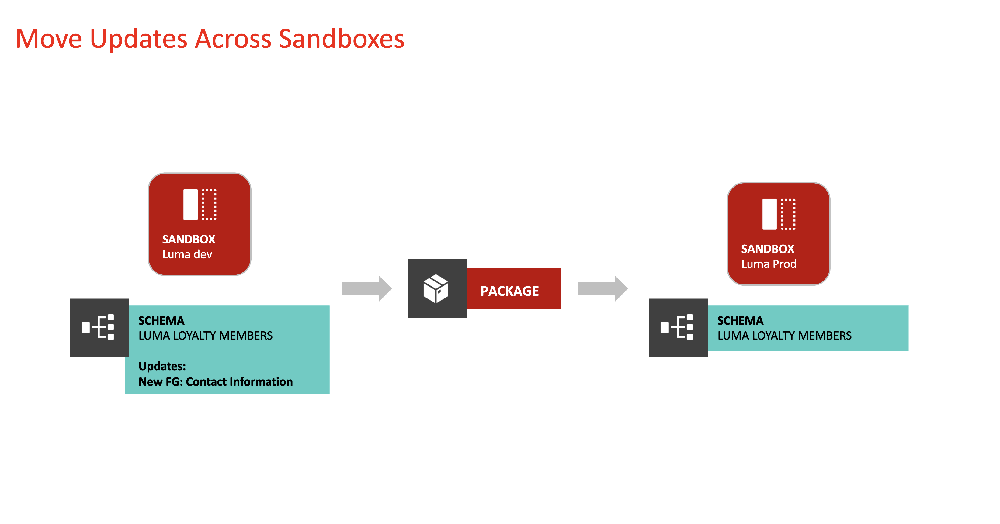
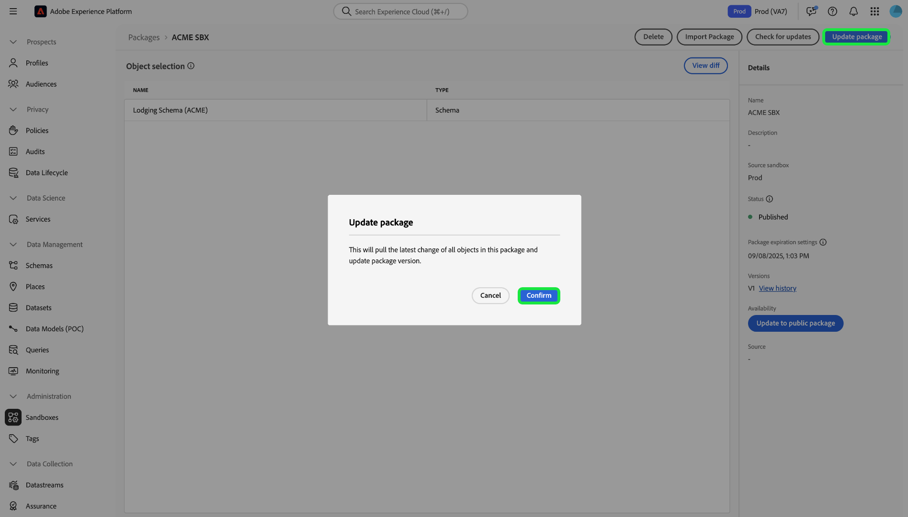

# Sandbox-Werkzeuge

>[!NOTE]
>
>Sandbox-Tools sind eine grundlegende Funktion, die sowohl [!DNL Real-Time Customer Data Platform] als auch [!DNL Journey Optimizer] unterstützt, um die Effizienz des Entwicklungszyklus und die Konfigurationsgenauigkeit zu verbessern.  Für die Verwendung der Sandbox-Tooling-Funktion sind die folgenden beiden rollenbasierten Zugriffssteuerungsberechtigungen erforderlich: - `manage-sandbox` oder `view-sandbox` - `manage-package`

Verbessern Sie die Konfigurationsgenauigkeit über Sandboxes hinweg und exportieren und importieren Sie Sandbox-Konfigurationen zwischen Sandboxes mit der Sandbox-Tooling-Funktion nahtlos. Verwenden Sie die Sandbox-Tools, um die Wertschöpfungszeit für den Implementierungsprozess zu reduzieren und erfolgreiche Konfigurationen über Sandboxes hinweg zu verschieben.

Sie können die Sandbox-Tooling-Funktion verwenden, um verschiedene Objekte auszuwählen und sie in ein Paket zu exportieren. Ein Paket kann aus einem oder mehreren Objekten bestehen. <!--or an entire sandbox.-->Alle Objekte, die in einem Paket enthalten sind, müssen aus derselben Sandbox stammen.

## Für Sandbox-Tools unterstützte Objekte {#supported-objects}

Die Sandbox-Tooling-Funktion bietet Ihnen die Möglichkeit, [!DNL Adobe Real-Time Customer Data Platform] und [!DNL Adobe Journey Optimizer] Objekte in ein Paket zu exportieren.

### Real-time Customer Data Platform-Objekte {#real-time-cdp-objects}

>[!BEGINSHADEBOX]

### Änderungen an Audience-Importen mit mehreren Entitäten

Mit den [B2B-](../../rtcdp/b2b-architecture-upgrade.md) können Sie keine Zielgruppen mit mehreren Entitäten mit B2B-Attributen und Erlebnisereignissen mehr importieren, wenn ein Paket, das diese Zielgruppen enthält, vor dem Upgrade veröffentlicht wurde. Diese Zielgruppen können nicht importiert werden und können nicht automatisch in die neue Architektur konvertiert werden.

Um diese Einschränkung zu umgehen, müssen Sie ein neues Paket mit den aktualisierten Zielgruppen erstellen und sie dann mithilfe von Sandbox-Tools in ihre jeweiligen Ziel-Sandboxes importieren.

>[!ENDSHADEBOX]

In der folgenden Tabelle sind [!DNL Adobe Real-Time Customer Data Platform] Objekte aufgeführt, die derzeit für Sandbox-Tools unterstützt werden:

| Plattform | Objekt | Details |
| --- | --- | --- |
| Customer Data Platform | Quellen | <ul><li>Die Anmeldeinformationen für das Quellkonto werden aus Sicherheitsgründen nicht in der Ziel-Sandbox repliziert und müssen manuell aktualisiert werden.</li><li>Der Quelldatenfluss wird standardmäßig in den Entwurfsstatus kopiert.</li></ul> **HINWEIS** Derzeit unterstützt das Sandbox-Tool nur Batch-basierte Quelldatenflüsse. Streaming-basierte Quelldatenflüsse werden nicht unterstützt. |
| Customer Data Platform | Zielgruppen | <ul><li>Es wird nur der **[!UICONTROL Customer Audience]** Typ **[!UICONTROL Segmentation service]** unterstützt.</li><li>Vorhandene Kennzeichnungen für Einverständnis und Governance werden im selben Importvorgang kopiert.</li><li> Das System wählt beim Überprüfen der Abhängigkeiten von Zusammenführungsrichtlinien automatisch die standardmäßige Zusammenführungsrichtlinie in der Ziel-Sandbox mit derselben XDM-Klasse aus.</li><li>Wenn beim Importieren von Zielgruppen ein vorhandenes Objekt mit demselben Namen erkannt wird, verwenden die Sandbox-Tools das vorhandene Objekt immer wieder, um die Vermehrung von Objekten zu vermeiden.</li></ul> |
| Customer Data Platform | Identitäten | <ul><li>Das System dedupliziert beim Erstellen von Identitäts-Namespaces für Adobe Standard automatisch in der Ziel-Sandbox.</li><li>Zielgruppen können nur kopiert werden, wenn alle Attribute in Zielgruppenregeln im Vereinigungsschema aktiviert sind. Die erforderlichen Schemata müssen zunächst verschoben und für das einheitliche Profil aktiviert werden.</li></ul> |
| Customer Data Platform | Schemata/Feldergruppen/Datentypen | <ul><li>Vorhandene Kennzeichnungen für Einverständnis und Governance werden im selben Importvorgang kopiert.</li><li>Sie haben die Flexibilität, Schemas zu importieren, ohne die Option Einheitliches Profil zu aktivieren. Die Edge-Fall-Schemabeziehungen sind nicht im Paket enthalten.</li><li>Wenn beim Importieren von Schemata/Feldergruppen ein vorhandenes Objekt mit demselben Namen erkannt wird, verwenden die Sandbox-Tools das vorhandene Objekt immer wieder, um eine Objektproliferation zu vermeiden.</li></ul> |
| Customer Data Platform | Datensätze | Datensätze werden kopiert, wobei die Einstellung „Einheitliches Profil“ standardmäßig deaktiviert ist. |
| Customer Data Platform | Einverständnis- und Governance-Richtlinien | Hinzufügen benutzerdefinierter Richtlinien, die von einem Benutzer erstellt wurden, zu einem Paket und Verschieben der Richtlinien über Sandboxes hinweg. |

Die folgenden Objekte werden importiert, haben jedoch den Status „Entwurf“ oder „Deaktiviert“:

| Funktion | Objekt | Status |
| --- | --- | --- |
| Importstatus | Source-Datenfluss | Entwurf |
| Importstatus | Journey | Entwurf |
| Einheitliches Profil | Datensatz | Einheitliches Profil deaktiviert |
| Richtlinien | Data Governance-Richtlinien | Deaktiviert |

### Adobe Journey Optimizer-Objekte {#abobe-journey-optimizer-objects}

In der folgenden Tabelle sind [!DNL Adobe Journey Optimizer] Objekte aufgeführt, die derzeit für Sandbox-Tools und Einschränkungen unterstützt werden:

| Plattform | Objekt | Unterstützte abhängige Objekte | Details |
| --- | --- | --- | --- |
| [!DNL Adobe Journey Optimizer] | Zielgruppe | | Eine Zielgruppe kann als abhängiges Objekt des Journey-Objekts kopiert werden. Sie können eine neue Zielgruppe erstellen oder eine vorhandene in der Ziel-Sandbox wiederverwenden. |
| [!DNL Adobe Journey Optimizer] | Schema | | Die auf der Journey verwendeten Schemata können als abhängige Objekte kopiert werden. Sie können ein neues Schema erstellen oder ein vorhandenes in der Ziel-Sandbox wiederverwenden. |
| [!DNL Adobe Journey Optimizer] | Zusammenführungsrichtlinie | | Die auf der Journey verwendeten Zusammenführungsrichtlinien können als abhängige Objekte kopiert werden. In der Ziel-Sandbox **Sie (**) keine neue Zusammenführungsrichtlinie erstellen, sondern nur eine vorhandene verwenden. |
| [!DNL Adobe Journey Optimizer] | Journey | Die folgenden Objekte, die auf der Journey verwendet werden, werden als abhängige Objekte kopiert. Während des Import-Workflows können Sie für jeden **[!UICONTROL Create new]** oder **[!UICONTROL Use existing]** auswählen: <ul><li>Zielgruppen</li><li>Canvas-Details</li><li>Inhaltsvorlagen</li><li>Benutzerdefinierte Aktionen</li><li>Datenquellen</li><li>Ereignisse</li><li>Feldergruppen</li><li>Fragmente</li><li>Schemata</li></ul> | Wenn Sie während des Importvorgangs **[!UICONTROL Use existing]** auswählen, um eine Journey in eine andere Sandbox zu kopieren, **die ausgewählten benutzerdefinierten Aktionen** exakt mit der benutzerdefinierten Quellaktion übereinstimmen. Wenn sie nicht übereinstimmen, erzeugt die neue Journey unlösbare Fehler. Das System kopiert die auf der Journey verwendeten Ereignisse und Ereignisdetails und erstellt eine neue Version in der Ziel-Sandbox. |
| [!DNL Adobe Journey Optimizer] | Aktion | | Auf der Journey verwendete E-Mail- und Push-Nachrichten können als abhängige Objekte kopiert werden. Die in den Journey-Feldern verwendeten Kanalaktionsaktivitäten, die in der Nachricht zur Personalisierung verwendet werden, werden nicht auf Vollständigkeit überprüft. Inhaltsbausteine werden nicht kopiert.  Die auf der Journey verwendete Aktion Profil aktualisieren kann kopiert werden. Benutzerdefinierte Aktionen können einem Paket unabhängig hinzugefügt werden. Auf der Journey verwendete Aktionsdetails werden ebenfalls kopiert. Es wird immer eine neue Version in der Ziel-Sandbox erstellt. |
| [!DNL Adobe Journey Optimizer] | Benutzerdefinierte Aktionen |  | Benutzerdefinierte Aktionen können einem Paket unabhängig hinzugefügt werden. Nachdem eine benutzerdefinierte Aktion einer Journey zugewiesen wurde, kann sie nicht mehr bearbeitet werden. Um Aktualisierungen an benutzerdefinierten Aktionen vorzunehmen, sollten Sie: <ul><li>Verschieben benutzerdefinierter Aktionen vor dem Migrieren einer Journey</li><li>Aktualisieren Sie Konfigurationen (z. B. Anfragekopfzeilen, Abfrageparameter und Authentifizierung) für benutzerdefinierte Aktionen nach der Migration</li><li>Migrieren von Journey-Objekten mit den benutzerdefinierten Aktionen, die Sie im ersten Schritt hinzugefügt haben</li></ul> |
| [!DNL Adobe Journey Optimizer] | Inhaltsvorlage | | Eine Inhaltsvorlage kann als abhängiges Objekt des Journey-Objekts kopiert werden. Eigenständige Vorlagen ermöglichen die einfache Wiederverwendung benutzerdefinierter Inhalte in Journey Optimizer-Kampagnen und -Journey. |
| [!DNL Adobe Journey Optimizer] | Fragment | Alle verschachtelten Fragmente. | Ein Fragment kann als abhängiges Objekt des Journey-Objekts kopiert werden. Fragmente sind wiederverwendbare Komponenten, die in einer oder mehreren Journey Optimizer-Kampagnen und -Journey-Umgebungen referenziert werden können. |
| [!DNL Adobe Journey Optimizer] | Kampagnen | Die folgenden in der Kampagne verwendeten Objekte werden als abhängige Objekte kopiert: <ul><li>Kampagnen</li><li>Zielgruppen</li><li>Schemata</li><li>Inhaltsvorlagen</li><li>Fragmente</li><li>Nachricht/Inhalt</li><li>Kanalkonfiguration</li><li>Einheitliche Entscheidungsobjekte</li><li>Experimenteinstellungen/-varianten</li></ul> | <ul><li>Kampagnen können zusammen mit allen Elementen kopiert werden, die sich auf das Profil, die Zielgruppe, das Schema, Inline-Nachrichten und abhängige Objekte beziehen. Einige Elemente werden nicht kopiert, z. B. Datennutzungsbeschriftungen und Spracheinstellungen. Eine vollständige Liste der Objekte, die nicht kopiert werden können, finden Sie im Handbuch [Exportieren von Objekten in eine andere Sandbox](https://experienceleague.adobe.com/de/docs/journey-optimizer/using/configuration/copy-objects-to-sandbox) .</li><li>Das System erkennt automatisch ein vorhandenes Kanalkonfigurationsobjekt in der Ziel-Sandbox und verwendet es erneut, wenn eine identische Konfiguration vorhanden ist. Wenn keine übereinstimmende Konfiguration gefunden wird, wird die Kanalkonfiguration beim Import übersprungen und Benutzende müssen die Kanaleinstellungen in der Ziel-Sandbox für diese Journey manuell aktualisieren.</li><li>Benutzer können vorhandene Experimente und Zielgruppen in der Ziel-Sandbox als abhängige Objekte ausgewählter Kampagnen wiederverwenden.</li></ul> |
| [!DNL Adobe Journey Optimizer] | Entscheidungsfindung | Vor dem Kopieren von Decisioning-Objekten müssen die folgenden Objekte in der Ziel-Sandbox vorhanden sein: <ul><li>In allen Decisioning-Objekten verwendete Profilattribute</li><li>Die Feldergruppe der benutzerdefinierten Angebotsattribute</li><li>die Schemata von Datenströmen, die für Kontextattribute in Regeln, Rangfolgen oder Begrenzungen verwendet werden.</li></ul> | <ul><li>Das Kopieren von Rangfolgeformeln, die KI-Modelle verwenden, wird derzeit nicht unterstützt.</li><li>Entscheidungselemente (Angebotselemente) werden nicht automatisch einbezogen. Um sicherzustellen, dass sie übertragen werden, fügen Sie sie manuell mit der Option **Zum Paket hinzufügen** hinzu.</li><li>Richtlinien, die eine Auswahlstrategie verwenden, erfordern, dass die zugehörigen Entscheidungselemente während des Kopiervorgangs manuell hinzugefügt werden. Bei Richtlinien, die manuelle oder Fallback-Entscheidungselemente verwenden, werden diese Elemente automatisch als direkte Abhängigkeiten einbezogen.</li><li>Entscheidungselemente müssen zuerst und vor allen anderen zugehörigen Objekten kopiert werden.</li><li>Eine vollständige Liste der unterstützten Objekte finden Sie im Handbuch [Exportieren von Objekten in eine andere Sandbox](https://experienceleague.adobe.com/de/docs/journey-optimizer/using/configuration/copy-objects-to-sandbox).</li></ul> |

## Exportieren von Objekten in ein Paket {#export-objects}

>[!NOTE]
>
>Alle Exportaktionen werden in den Auditprotokollen aufgezeichnet.

>[!CONTEXTUALHELP]
>id="platform_sandbox_tooling_remove_object"
>title="Entfernen eines Objekts"
>abstract="Um ein Objekt aus dem Paket zu entfernen, wählen Sie die zu entfernende Zeile aus und verwenden Sie dann die Löschoption, die bei der Auswahl zur Verfügung gestellt wird. Beachten Sie, dass Sie keine Objekte aus veröffentlichten Paketen entfernen können."

>[!CONTEXTUALHELP]
>id="platform_sandbox_package_expiry"
>title="Ablaufeinstellungen des Pakets"
>abstract="Pakete laufen nach einiger Zeit der Inaktivität im Entwurfsstatus ab. Das standardmäßige Datum ist auf 90 Tage ab heute festgelegt. Dieses Datum verändert sich, bis das Paket veröffentlicht wird. Wenn Sie das Paket morgen im Entwurfsstatus besuchen, wird das Datum um +1 Tag verschoben (es sei denn, Sie legen es manuell fest)."

>[!CONTEXTUALHELP]
>id="platform_sandbox_tooling_package_status"
>title="Paketstatus"
>abstract="Standardmäßig ist der Status auf „Entwurf“ gesetzt. Sobald das Paket veröffentlicht wurde, wird der Status in „veröffentlicht“ geändert. Nach der Veröffentlichung des Pakets können keine Änderungen vorgenommen werden."

>[!NOTE]
>
>Sie können ein Paket nur importieren, wenn Sie über die Berechtigung zum Zugriff auf die Objekte verfügen.

In diesem Beispiel wird der Prozess des Exports eines Schemas und dessen Hinzufügen zu einem Paket dokumentiert. Sie können denselben Prozess verwenden, um andere Objekte zu exportieren, z. B. Datensätze, Journey und viele mehr.

### Objekt zu einem neuen Paket hinzufügen {#add-object-to-new-package}

Wählen Sie in der linken Navigationsleiste die Option **[!UICONTROL Schemas]** und dann die Registerkarte **[!UICONTROL Browse]** aus, auf der die verfügbaren Schemata aufgeführt sind. Klicken Sie als Nächstes auf das Auslassungszeichen (`...`) neben dem ausgewählten Schema, und in einem Dropdown-Menü werden dann Steuerelemente angezeigt. Wählen Sie **[!UICONTROL Add to package]** aus dem Dropdown-Menü aus.

![Liste der Schemata mit dem Dropdown-Menü, in dem das [!UICONTROL Add to package] hervorgehoben ist.](../images/ui/sandbox-tooling/add-to-package.png)

Wählen Sie im Dialogfeld **[!UICONTROL Add to package]** die Option **[!UICONTROL Create new package]** aus. Geben Sie einen [!UICONTROL Name] für Ihr Paket und einen optionalen [!UICONTROL Description] an und wählen Sie dann **[!UICONTROL Add]** aus.

![Das Dialogfeld &quot;[!UICONTROL Add to package]&quot; mit [!UICONTROL Create new package] ausgewählten und hervorgehobenen [!UICONTROL Add].](../images/ui/sandbox-tooling/create-new-package.png)

Sie kehren zur **[!UICONTROL Schemas]** zurück. Sie können jetzt dem von Ihnen erstellten Paket zusätzliche Objekte hinzufügen, indem Sie die nächsten Schritte ausführen, die unten aufgeführt sind.

### Objekt zu einem vorhandenen Paket hinzufügen und veröffentlichen {#add-object-to-existing-package}

Um eine Liste der verfügbaren Schemata anzuzeigen, wählen Sie im linken Navigationsbereich **[!UICONTROL Schemas]** und dann die Registerkarte **[!UICONTROL Browse]** aus. Klicken Sie als Nächstes auf das Auslassungszeichen (`...`) neben dem ausgewählten Schema, um die Steuerungsoptionen in einem Dropdown-Menü anzuzeigen. Wählen Sie **[!UICONTROL Add to package]** aus dem Dropdown-Menü aus.

![Liste der Schemata mit dem Dropdown-Menü, in dem das [!UICONTROL Add to package] hervorgehoben ist.](../images/ui/sandbox-tooling/add-to-package.png)

Das Dialogfeld **[!UICONTROL Add to package]** wird angezeigt. Wählen Sie die Option **[!UICONTROL Existing package]** aus, klicken Sie dann auf das Dropdown-Menü **[!UICONTROL Package name]** und wählen Sie das erforderliche Paket aus. Wählen Sie abschließend **[!UICONTROL Add]** aus, um Ihre Auswahl zu bestätigen.

![[!UICONTROL Add to package] Dialogfeld, in dem ein ausgewähltes Paket aus dem Dropdown-Menü angezeigt wird.](../images/ui/sandbox-tooling/add-to-existing-package.png)

Die Liste der dem Paket hinzugefügten Objekte wird aufgelistet. Um das Paket zu veröffentlichen und es für den Import in Sandboxes verfügbar zu machen, wählen Sie **[!UICONTROL Publish]** aus.

![Eine Liste der Objekte im Paket, wobei die Option &quot;[!UICONTROL Publish]&quot; hervorgehoben wird.](../images/ui/sandbox-tooling/publish-package.png)

Wählen Sie **[!UICONTROL Publish]** aus, um die Veröffentlichung des Pakets zu bestätigen.

![Bestätigungsdialogfeld „Paket veröffentlichen“, wobei die Option &quot;[!UICONTROL Publish]&quot; hervorgehoben wird.](../images/ui/sandbox-tooling/publish-package-confirmation.png)

>[!NOTE]
>
>Nach der Veröffentlichung kann der Inhalt des Pakets nicht mehr geändert werden. Um Kompatibilitätsprobleme zu vermeiden, stellen Sie sicher, dass alle erforderlichen Assets ausgewählt wurden. Wenn Änderungen vorgenommen werden müssen, müssen Sie ein neues Paket erstellen.

Sie kehren zur Registerkarte **[!UICONTROL Packages]** in der [!UICONTROL Sandboxes] zurück, wo Sie das neue veröffentlichte Paket sehen können.

## Paket in eine Ziel-Sandbox importieren {#import-package-to-target-sandbox}

>[!NOTE]
>
>Alle Importaktionen werden in den Auditprotokollen aufgezeichnet.

Um das Paket in eine Ziel-Sandbox zu importieren, navigieren Sie zur Registerkarte Sandbox-**[!UICONTROL Browse]** und wählen Sie die Option Plus (+) neben dem Sandbox-Namen aus.

![Die Registerkarte „Sandbox-**[!UICONTROL Browse]**&quot;, auf der die Auswahl des Importpakets hervorgehoben ist.](../images/ui/sandbox-tooling/browse-sandboxes.png)

Wählen Sie über das Dropdown-Menü die **[!UICONTROL Package name]** aus, die Sie in die Ziel-Sandbox importieren möchten. Fügen Sie eine **[!UICONTROL Job name]** hinzu, die für die zukünftige Überwachung verwendet wird. Standardmäßig wird Unified Profile deaktiviert, wenn die Schemata des Pakets importiert werden. Schalten Sie **Schemata für Profil aktivieren** um dies zu aktivieren, und wählen Sie dann **[!UICONTROL Next]** aus.

![Die Seite mit den Importdetails, auf der die Dropdown-Auswahl &quot;[!UICONTROL Package name]&quot; angezeigt wird](../images/ui/sandbox-tooling/import-package-to-sandbox.png)

Die Seite [!UICONTROL Package object and dependencies] enthält eine Liste aller Assets, die in diesem Paket enthalten sind. Das System erkennt automatisch abhängige Objekte, die für den erfolgreichen Import ausgewählter übergeordneter Objekte erforderlich sind. Alle fehlenden Attribute werden oben auf der Seite angezeigt. Wählen Sie **[!UICONTROL View details]** aus, um eine detailliertere Aufschlüsselung zu erhalten.

![Auf der [!UICONTROL Package object and dependencies] Seite fehlen Attribute.](../images/ui/sandbox-tooling/missing-attributes.png)

>[!NOTE]
>
>Abhängige Objekte können durch vorhandene in der Ziel-Sandbox ersetzt werden, sodass Sie vorhandene Objekte wiederverwenden können, anstatt eine neue Version zu erstellen. Wenn Sie beispielsweise ein Paket importieren, das Schemata enthält, können Sie vorhandene benutzerdefinierte Feldergruppen und Identitäts-Namespaces in der Ziel-Sandbox wiederverwenden. Alternativ können Sie beim Importieren eines Pakets, das Journey enthält, vorhandene Segmente in der Ziel-Sandbox wiederverwenden.
>
>Sandbox-Tools unterstützen derzeit nicht das Aktualisieren oder Überschreiben vorhandener Objekte. Sie können ein neues Objekt erstellen oder das vorhandene Objekt ohne Änderungen weiter verwenden. Wenn ein vorhandenes Objekt mit demselben Namen erkannt wird, verwenden die Sandbox-Tools das vorhandene Objekt immer wieder, auch wenn Sie die Option [!UICONTROL Create new] auswählen, um einen Überhang von Objekten zu vermeiden.

Um ein vorhandenes Objekt zu verwenden, wählen Sie das Stiftsymbol neben dem abhängigen Objekt aus.

![Auf der Seite [!UICONTROL Package object and dependencies] wird eine Liste der im Paket enthaltenen Assets angezeigt.](../images/ui/sandbox-tooling/package-objects-and-dependencies.png)

Die Optionen zum Erstellen neuer oder zum Verwenden vorhandener werden angezeigt. Wählen Sie **[!UICONTROL Use existing]** aus.

![Die [!UICONTROL Package object and dependencies] mit abhängigen Objektoptionen [!UICONTROL Create new] und [!UICONTROL Use existing].](../images/ui/sandbox-tooling/use-existing-object.png)

Das Dialogfeld **[!UICONTROL Field group]** zeigt eine Liste der für das Objekt verfügbaren Feldergruppen an. Wählen Sie die erforderlichen Feldergruppen aus und klicken Sie dann auf **[!UICONTROL Save]**.

![Eine Liste der Felder, die im Dialogfeld &quot;[!UICONTROL Field group]&quot; angezeigt werden und die [!UICONTROL Save] Auswahl hervorheben.](../images/ui/sandbox-tooling/field-group-list.png)

Sie kehren zur Seite [!UICONTROL Package object and dependencies] zurück. Wählen Sie hier **[!UICONTROL Finish]** , um den Package-Import abzuschließen.

![Auf der Seite &quot;[!UICONTROL Package object and dependencies]&quot; wird eine Liste der im Paket enthaltenen Assets angezeigt, wobei [!UICONTROL Finish] hervorgehoben wird.](../images/ui/sandbox-tooling/finish-object-dependencies.png)

## Gesamte Sandbox exportieren und importieren

>[!NOTE]
>
>Derzeit werden beim Exportieren oder Importieren einer gesamten Sandbox nur Real-time Customer Data Platform-Objekte unterstützt. Adobe Journey Optimizer-Objekte wie Journey werden derzeit nicht unterstützt.

Sie können alle unterstützten Objekttypen in ein vollständiges Sandbox-Paket exportieren und dann das Paket über verschiedene Sandboxes hinweg importieren, um Objektkonfigurationen zu replizieren. Mit dieser Funktion können Sie beispielsweise:

- Importieren Sie eine Sandbox erneut, um alle Konfigurationen des -Objekts zu reproduzieren, wenn Sie die Sandbox zurücksetzen müssen
- Importieren Sie das Paket in andere Sandboxes und verwenden Sie es als Blueprint-Sandbox, um den Entwicklungsprozess zu beschleunigen.

### Gesamte Sandbox exportieren {#export-entire-sandbox}

Um eine gesamte Sandbox zu exportieren, navigieren Sie zur Registerkarte [!UICONTROL Sandboxes]-**[!UICONTROL Packages]** und wählen Sie **[!UICONTROL Create package]** aus.

![Die [!UICONTROL Sandboxes] Registerkarte &quot;**[!UICONTROL Packages]**&quot; mit hervorgehobenen [!UICONTROL Create package].](../images/ui/sandbox-tooling/create-sandbox-package.png)

Wählen Sie **[!UICONTROL Entire sandbox]** für die [!UICONTROL Type of package] im Dialogfeld &quot;[!UICONTROL Create package]&quot; aus. Geben Sie einen [!UICONTROL Package name] für Ihr neues Paket an und wählen Sie die **[!UICONTROL Sandbox]** aus der Dropdown-Liste aus. Wählen Sie abschließend **[!UICONTROL Create]** aus, um Ihre Eingaben zu bestätigen.

![Das Dialogfeld &quot;[!UICONTROL Create package]&quot; mit ausgefüllten Feldern und Hervorhebung von [!UICONTROL Create].](../images/ui/sandbox-tooling/create-package-dialog.png)

Das Paket wurde erfolgreich erstellt. Wählen Sie **[!UICONTROL Publish]** aus, um das Paket zu veröffentlichen.

Sie kehren zur Registerkarte **[!UICONTROL Packages]** in der [!UICONTROL Sandboxes] zurück, wo Sie das neue veröffentlichte Paket sehen können.

### Importieren des gesamten Sandbox-Pakets {#import-entire-sandbox-package}

>[!NOTE]
>
>Alle Objekte werden als neue Objekte in die Ziel-Sandbox importiert. Es empfiehlt sich, ein vollständiges Sandbox-Paket in eine leere Sandbox zu importieren.

Um das Paket in eine Ziel-Sandbox zu importieren, navigieren Sie zur Registerkarte [!UICONTROL Sandboxes]-**[!UICONTROL Browse]** und wählen Sie die Option Plus (+) neben dem Sandbox-Namen aus.

![Die Registerkarte „Sandbox-**[!UICONTROL Browse]**&quot;, auf der die Auswahl des Importpakets hervorgehoben ist.](../images/ui/sandbox-tooling/browse-entire-package-sandboxes.png)

Wählen Sie mithilfe des Dropdown-Menüs die vollständige Sandbox mithilfe des Dropdown-Menüs **[!UICONTROL Package name]** aus. Fügen Sie eine **[!UICONTROL Job name]** für die zukünftige Überwachung und eine optionale **[!UICONTROL Job description]** hinzu und wählen Sie dann **[!UICONTROL Next]** aus.

![Die Seite mit den Importdetails, auf der die Dropdown-Auswahl &quot;[!UICONTROL Package name]&quot; angezeigt wird](../images/ui/sandbox-tooling/import-full-sandbox-package.png)

>[!NOTE]
>
>Sie müssen über vollständige Berechtigungen für alle Objekte verfügen, die im Paket enthalten sind. Wenn Sie nicht über die erforderlichen Berechtigungen verfügen, schlägt der Importvorgang fehl und es werden Fehlermeldungen angezeigt.

Sie gelangen auf die Seite [!UICONTROL Package object and dependencies], auf der die Anzahl der Objekte und Abhängigkeiten angezeigt wird, die importierte und ausgeschlossene Objekte sind. Wählen Sie hier **[!UICONTROL Import]** , um den Package-Import abzuschließen.

![Die [!UICONTROL Package object and dependencies] zeigt die Inline-Meldung von nicht unterstützten Objekttypen an und hebt [!UICONTROL Import] hervor.](../images/ui/sandbox-tooling/finish-dependencies-entire-sandbox.png)

Warten Sie etwas, bis der Import abgeschlossen ist. Die Dauer des Vorgangs kann von der Anzahl der Objekte im Paket abhängen. Sie können den Importvorgang über die Registerkarte [!UICONTROL Sandboxes]-**[!UICONTROL Jobs]** überwachen.

## Importdetails überwachen {#view-import-details}

Um die importierten Details anzuzeigen, navigieren Sie zur Registerkarte [!UICONTROL Sandboxes]-**[!UICONTROL Jobs]** und wählen Sie das Paket aus der Liste aus. Alternativ können Sie über die Suchleiste nach dem Paket suchen.

![Auf der Registerkarte Sandbox-[!UICONTROL Jobs] wird die Auswahl des Importpakets hervorgehoben.](../images/ui/sandbox-tooling/imports-tab.png)

<!--### View imported objects {#view-imported-objects}

On the **[!UICONTROL Jobs]** tab in the [!UICONTROL Sandboxes] environment, select **[!UICONTROL View imported objects]** from the right details pane.

Select **[!UICONTROL View imported objects]** from the right details pane on the **[!UICONTROL Jobs]** tab in the [!UICONTROL Sandboxes] environment.

![The sandboxes [!UICONTROL Imports] tab highlights the [!UICONTROL View imported objects] selection in the right pane.](../images/ui/sandbox-tooling/view-imported-objects.png)

Use the arrows to expand objects to view the full list of fields that have been imported into the package.

![The sandboxes [!UICONTROL Imported objects] showing a list of objects imported into the package.](../images/ui/sandbox-tooling/expand-imported-objects.png)-->

Wählen Sie **[!UICONTROL View import summary]** aus dem rechten Detailbereich auf der Registerkarte **[!UICONTROL Jobs]** in der Sandbox-Umgebung aus.

![Die Registerkarte „Sandbox-[!UICONTROL Imports]&quot; hebt die [!UICONTROL View import details] im rechten Bereich hervor.](../images/ui/sandbox-tooling/view-import-details.png)

Das Dialogfeld **[!UICONTROL Import summary]** zeigt eine Aufschlüsselung der Importe mit Fortschritt in Prozent an.

>[!NOTE]
>
>Sie können eine Liste von Objekten anzeigen, indem Sie zu bestimmten Inventarseiten navigieren.

![Das Dialogfeld &quot;[!UICONTROL Import details]&quot; mit einer detaillierten Aufschlüsselung der Importe.](../images/ui/sandbox-tooling/import-details.png)

Nach Abschluss des Imports erhalten Sie eine Benachrichtigung über den Import in der Experience Platform-Benutzeroberfläche. Sie können auf diese Benachrichtigungen über das Warnhinweissymbol zugreifen. Wenn ein Vorgang nicht erfolgreich war, können Sie von hier aus zur Fehlerbehebung navigieren.

## Übertragen von Aktualisierungen der iterativen Objektkonfigurationen über Sandbox-Tools hinweg {#move-configs}

Sie können Sandbox-Tools verwenden, um Objektkonfigurationen zwischen verschiedenen Sandboxes zu übertragen. Zuvor mussten Konfigurationsaktualisierungen an Ihren Objekten (z. B. Schemata, Feldergruppen und Datentypen) manuell neu erstellt oder neu importiert werden, um in andere Sandboxes übertragen zu werden. Mit dieser Funktion können Sie Sandbox-Tools verwenden, um Ihre Workflows zu beschleunigen und potenzielle Fehler zu reduzieren, indem Sie Ihre Konfigurationsaktualisierungen nahtlos über verschiedene Sandboxes hinweg übertragen.

>[!TIP]
>
> Stellen Sie sicher, dass Sie die folgenden Voraussetzungen haben, bevor Sie versuchen, Ihre Objektkonfigurationen über verschiedene Sandboxes hinweg zu übertragen.
>
>- Die entsprechenden Berechtigungen für den Zugriff auf Sandbox-Tools.
>- Ein neu erstelltes oder aktualisiertes Objekt (z. B. ein Schema) in Ihrer Quell-Sandbox.

>[!BEGINSHADEBOX]

### Unterstützte Objekttypen für den Aktualisierungsvorgang

Die folgenden Objekttypen werden für die Aktualisierung unterstützt:

- Schemata
- Feldergruppen
- Datentypen

| Unterstützte Updates | Nicht unterstützte Aktualisierungen |
| --- | --- |
| <ul><li>Hinzufügen neuer Felder/Feldergruppen zur Ressource.</li><li>Festlegen eines erforderlichen Felds als optional.</li><li>Einführung neuer Pflichtfelder.</li><li>Ein neues Beziehungsfeld wird eingeführt.</li><li>Ein neues Identitätsfeld wird eingeführt.</li><li>Anzeigename und Beschreibung der Ressource ändern.</li></ul> | <ul><li>Entfernen zuvor definierter Felder.</li><li>Umdefinieren vorhandener Felder, wenn das Schema für das Echtzeit-Kundenprofil aktiviert ist.</li><li>Entfernen oder Einschränken zuvor unterstützter Feldwerte.</li><li>Verschieben vorhandener Felder an eine andere Position in der Schemastruktur - Dadurch wird ein neues Feld in der Ziel-Sandbox erstellt, das vorherige Feld wird jedoch nicht entfernt.</li><li>Aktivieren oder Deaktivieren des Schemas für die Teilnahme am Profil : Dieser Vorgang wird beim Vergleichsvorgang übersprungen.</li><li>Zugriffssteuerungsbeschriftungen.</li></ul> |

>[!ENDSHADEBOX]

Gehen Sie wie folgt vor, um zu erfahren, wie Sie mit den Sandbox-Tools Ihre Objektkonfigurationen über verschiedene Sandboxes hinweg übertragen können.

### Zuvor importierte Objekte

Führen Sie diese Schritte aus, wenn Ihr Anwendungsfall vorhandene Objekte in Ihrer Quell-Sandbox betrifft, die Konfigurationsaktualisierungen erfordern, nachdem sie bereits in andere Sandboxes gepackt und in diese importiert wurden.

Aktualisieren Sie zunächst das -Objekt in Ihrer Quell-Sandbox. Navigieren Sie beispielsweise zum Arbeitsbereich &quot;**[!UICONTROL Schemas]**&quot;, wählen Sie Ihr Schema aus und fügen Sie eine neue Feldergruppe hinzu.

Nachdem Sie Ihr Schema aktualisiert haben, navigieren Sie zu **[!UICONTROL Sandboxes]**, wählen Sie **[!UICONTROL Packages]** aus und suchen Sie nach dem vorhandenen Paket.

Überprüfen Sie Ihre Änderungen über die Package-Oberfläche. Wählen Sie **[!UICONTROL Check for updates]** aus, um alle Änderungen an den Artefakten in Ihrem Paket anzuzeigen. Wählen Sie als Nächstes **[!UICONTROL View diff]** aus, um eine detaillierte Zusammenfassung aller Änderungen zu erhalten, die an Ihren Artefakten vorgenommen wurden.

Die [!UICONTROL View diff] wird angezeigt. Weitere Informationen zu Ihren Quell- und Zielartefakten sowie die darauf anzuwendenden Änderungen finden Sie unter diesem Tool .

In diesem Schritt können Sie auch [!UICONTROL Summarize with AI] auswählen, um eine schrittweise Zusammenfassung aller Änderungen zu erhalten.

Wenn Sie bereit sind, klicken Sie auf **[!UICONTROL Update package]** und wählen Sie dann im Popup-Fenster, das angezeigt wird, **[!UICONTROL Confirm]** aus. Sobald der Auftrag abgeschlossen ist, können Sie die Seite aktualisieren und **[!UICONTROL View history]** auswählen, um die Version Ihres Pakets zu überprüfen.

Um Ihre Änderungen zu importieren, navigieren Sie zurück zum [!UICONTROL Packages] Verzeichnis und wählen Sie die Auslassungszeichen (`...`) neben Ihrem Paket aus. Wählen Sie dann **[!UICONTROL Import package]** aus. Experience Platform wählt [!UICONTROL Update existing objects] automatisch aus. Überprüfen Sie die Änderungen und wählen Sie dann **[!UICONTROL Finish]** aus.

>[!NOTE]
>
>Alle abhängigen Objekte werden im Rahmen dieses Workflows automatisch in der Ziel-Sandbox aktualisiert.

Um Ihren Importprozess weiter zu überprüfen, navigieren Sie zu Ihrer Ziel-Sandbox und zeigen Sie das aktualisierte Objekt manuell aus dieser Sandbox an.

### Manuell in der Ziel-Sandbox erstellte Objekte

Führen Sie diese Schritte aus, wenn Ihr Anwendungsfall das Anwenden von Konfigurationsänderungen auf Objekte umfasst, die manuell in separaten Sandboxes erstellt wurden.

Erstellen und veröffentlichen Sie zunächst ein neues Paket mit Ihrem aktualisierten Objekt.

Importieren Sie anschließend Ihr Paket in die Ziel-Sandbox, die die Objekte enthält, die Sie auch aktualisieren möchten. Wählen Sie während des Importvorgangs **[!UICONTROL Update existing objects]** aus und verwenden Sie dann den Objekt-Navigator, um die Zielobjekte manuell auszuwählen, auf die die Aktualisierungen angewendet werden sollen.

>[!NOTE]
>
>- Es ist optional, für abhängige Objekte ein Zielgruppen-Mapping in einer anderen Sandbox auszuwählen. Wenn keine ausgewählt ist, wird eine neue erstellt.
>- Bei Identity-Namespaces erkennt das System automatisch, ob eine neue Identität erstellt werden muss, wenn eine vorhandene in der Ziel-Sandbox wiederverwendet werden muss.

Nachdem Sie die Zielobjekte identifiziert haben, die Sie aktualisieren möchten, wählen Sie **[!UICONTROL Finish]** aus.

## Video-Tutorial

Das folgende Video soll Ihnen dabei helfen, die Sandbox-Tools besser zu verstehen, und beschreibt, wie Sie ein neues Paket erstellen, ein Paket veröffentlichen und ein Paket importieren.

>[!VIDEO](https://video.tv.adobe.com/v/3424763/?learn=on)

## Nächste Schritte

In diesem Dokument wurde gezeigt, wie die Sandbox-Tooling-Funktion in der Experience Platform-Benutzeroberfläche verwendet wird. Informationen zu Sandboxes finden Sie im [Sandbox-Benutzerhandbuch](../ui/user-guide.md).

Anweisungen zum Ausführen verschiedener Vorgänge mit der Sandbox-API finden Sie im [Sandbox-Entwicklerhandbuch](../api/getting-started.md). Eine allgemeine Übersicht zu Sandboxes in Experience Platform finden Sie in der [Übersichtsdokumentation](../home.md).
