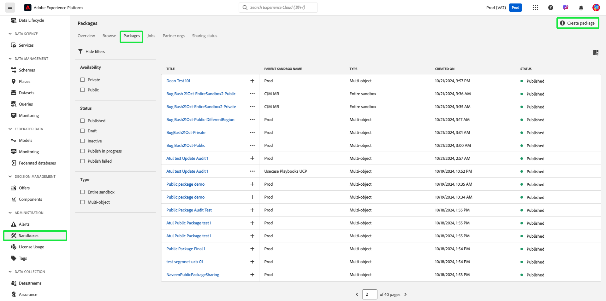

# Freigeben von Paketen in Unternehmen mithilfe von Sandbox Tooling

Dank der Sandbox-Tool-Funktion können Sie die Konfigurationsgenauigkeit über Sandboxes hinweg verbessern und Sandbox-Konfigurationen zwischen Sandboxes nahtlos exportieren und importieren. In diesem Dokument wird beschrieben, wie Sie Sandbox-Tools in Adobe Experience Platform verwenden, um Pakete unternehmensübergreifend freizugeben. Es gibt zwei Typen von freigegebenen Paketen:

- **Privates Paket**

[Private Pakete](#private-packages) können nur für Organisationen freigegeben werden, die die Freigabeanfrage von der Quellorganisation genehmigt haben.

- **Öffentliches Paket**

[Öffentliche Pakete](#public-packages) können ohne zusätzliche Genehmigung importiert werden. Diese Pakete können auf der Website, dem Blog oder der Plattform eines Partners freigegeben werden. Mit der Paket-Payload können Pakete kopiert und aus diesen Kanälen in die Zielorganisation eingefügt werden.

## Private Pakete {#private-packages}

>[!NOTE]
>
>Um eine Freigabeanforderung zu starten und zu genehmigen und Pakete unternehmensübergreifend freizugeben, benötigen Sie die rollenbasierte Zugriffssteuerungsberechtigung **package-share** .

Verwenden Sie die Sandbox Tooling-Funktion, um Partnerschaften zu erstellen, Statistiken zu Partneranfragen zu verfolgen, bestehende Partnerschaften zu verwalten und Pakete mit Partnerorganisationen zu teilen.

### Erstellen einer Partnerschaft für eine Organisation

Navigieren Sie zum Erstellen einer Anforderung für eine Partnerschaft innerhalb der Organisation zur Registerkarte **[!UICONTROL Sandboxes]** **[!UICONTROL Partner-Organisationen]** . Wählen Sie dann **[!UICONTROL Partnerorganisationen verwalten]** aus.

Geben Sie im Dialogfeld [!UICONTROL Package Partner Management] die Organisations-ID in **[!UICONTROL Enter Org ID]** ein und drücken Sie die Eingabetaste (Windows) oder die Eingabetaste (Mac). Die Organisations-ID wird im Abschnitt **[!UICONTROL Ausgewählte Organisations-IDs]** unten angezeigt. Wählen Sie nach dem Hinzufügen der IDs **[!UICONTROL Bestätigen]** aus.

>[!TIP]
>
>Sie können mehrere Organisations-IDs gleichzeitig mithilfe kommagetrennter Listen oder durch Eingabe jeder Organisations-ID und anschließender Eingabe eingeben.

Die Freigabeanforderung wurde erfolgreich an die Partnerorganisation gesendet und Sie werden zur Registerkarte [!UICONTROL Sandboxes] **[!UICONTROL Partner-Organisationen]** zurückgeleitet, auf der die **[!UICONTROL Ausgehende Anforderung]** angezeigt wird.

### Partnerschaftserfordernis genehmigen {#authorize-request}

Navigieren Sie zum Autorisieren einer Partneranfrage für eine Organisation zur Registerkarte [!UICONTROL Sandboxes] **[!UICONTROL Partner-Organisationen]** . Wählen Sie als Nächstes **[!UICONTROL Eingehende Anforderung]** aus.

Der aktuelle **[!UICONTROL Status]** für die Anfrage lautet in dieser Phase **Ausstehend**. Um die Anforderung zu genehmigen, wählen Sie die Auslassungszeichen (`...`) neben der ausgewählten Anforderung aus und wählen Sie dann **[!UICONTROL Genehmigen]** aus der Dropdown-Liste aus.

Das Dialogfeld **[!UICONTROL Anfrage zur Partnerorg überprüfen]** enthält Details zur Anforderung der Unternehmenspartnerschaft. Geben Sie einen [!UICONTROL Grund] für die Genehmigung ein und wählen Sie dann **[!UICONTROL Genehmigen]** aus.

Sie werden zur Seite [!UICONTROL Eingehende Anfrage] zurückgeleitet und der Status der Anfrage wurde auf **[!UICONTROL Genehmigt]** aktualisiert.

Verwenden Sie diesen Workflow/Prozess, um Pakete zwischen Ihrer Organisation und der Quellorganisation freizugeben.

### Freigeben von Paketen für Partnerorganisationen {#share-package}

>[!NOTE]
>
>Es können nur Pakete mit dem Status **Veröffentlicht** freigegeben werden.

Um ein Paket für eine genehmigte Partnerorganisation freizugeben, navigieren Sie zur Registerkarte [!UICONTROL Sandboxes] **[!UICONTROL Pakete]** . Wählen Sie als Nächstes das Auslassungszeichen (`...`) neben dem Paket und dann **[!UICONTROL Paket freigeben]** aus dem Dropdown-Menü aus.

Wählen Sie im Dialogfeld **[!UICONTROL Package freigeben]** das freizugebende Paket aus der Dropdown-Liste **[!UICONTROL Freigabeeinstellungen]** und dann **[!UICONTROL Bestätigen]** aus.

>[!TIP]
>
>Es ist möglich, mehrere Organisationen auszuwählen. Ausgewählte Organisationen werden unter dem Dropdown-Menü [!UICONTROL Freigabeeinstellungen] angezeigt.

## Öffentliche Pakete {#public-packages}

Verwenden Sie die Sandbox Tooling-Funktion, um gemeinsam nutzbare öffentliche Pakete zu erstellen, die keine zusätzliche Genehmigung erfordern und mit der Payload des Pakets einfach importiert werden können.

### Aktualisieren der Paketverfügbarkeit auf öffentlich {#update-package}

Um den Verfügbarkeitstyp eines Pakets zu aktualisieren, navigieren Sie zur Registerkarte [!UICONTROL Sandboxes] **[!UICONTROL Pakete]** . Wählen Sie als Nächstes das Auslassungszeichen (`...`) neben dem Paket und dann **[!UICONTROL Auf öffentliches Paket aktualisieren]** aus dem Dropdown-Menü aus.

Überprüfen Sie im Dialogfeld **[!UICONTROL Paketverfügbarkeit in &quot;Öffentlich&quot;]** ändern den Paketnamen und wählen Sie **[!UICONTROL Bestätigen]** aus.

>[!IMPORTANT]
>
> Sobald ein Paket veröffentlicht wurde, kann es nicht mehr in privat geändert werden.

### Pakete mithilfe der Package-Payload freigeben

Um das öffentliche Paket freizugeben, wählen Sie die Auslassungszeichen (`...`) neben dem Paket aus und wählen Sie dann **[!UICONTROL Paket-Payload kopieren]**.

Im Dialogfeld **[!UICONTROL Paket-Payload kopieren]** werden der Paketname und die Payload angezeigt. Wählen Sie **[!UICONTROL Paket-Payload kopieren]** aus, um die mit dem Paket verknüpfte Payload zu kopieren.

### Erstellen eines neuen Pakets mit einer Paket-Payload

Um ein Paket mit einer Paket-Payload zu erstellen, navigieren Sie zur Registerkarte [!UICONTROL Sandboxes] **[!UICONTROL Pakete]** . Wählen Sie als Nächstes **[!UICONTROL Paket erstellen]** aus.

Wählen Sie im Dialogfeld **[!UICONTROL Paket erstellen]** die Option &quot;**[!UICONTROL Paket-Payload einfügen]**&quot;und dann &quot;**[!UICONTROL Auswählen]**&quot;.

Fügen Sie die kopierte Paket-Payload in das Textfeld ein und wählen Sie **[!UICONTROL Erstellen]** aus.

Um den aktuellen Status Ihrer Freigabeanfrage anzuzeigen, navigieren Sie zum **[!UICONTROL Freigabestatus]**. Der aktuelle Status der Anforderung wird in der Spalte **[!UICONTROL Freigabestatus]** angezeigt.

## Nächste Schritte {#next-steps}

In diesem Dokument erfahren Sie, wie Sie mit der Sandbox-Tool-Funktion Pakete unternehmensübergreifend freigeben können. Weitere Informationen finden Sie im [Sandbox-Tool-Handbuch](../ui/sandbox-tooling.md).

Informationen zum Ausführen verschiedener Vorgänge mithilfe der Sandbox-API finden Sie im [Sandbox-Entwicklerhandbuch](../api/getting-started.md). Eine allgemeine Übersicht über Sandboxes im Experience Platform finden Sie in der [Übersichtsdokumentation](../home.md).
