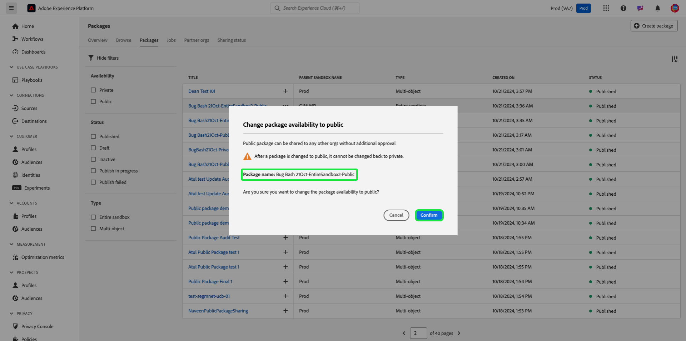

# Freigeben von Paketen über Organisationen hinweg mithilfe von Sandbox-Tools

Verbessern Sie die Konfigurationsgenauigkeit über Sandboxes hinweg und exportieren und importieren Sie Sandbox-Konfigurationen zwischen Sandboxes über verschiedene Organisationen hinweg mit der Sandbox-Tooling-Funktion nahtlos. In diesem Dokument wird beschrieben, wie Sie in Adobe Experience Platform Sandbox-Tools verwenden können, um Pakete unternehmensübergreifend freizugeben. Es gibt zwei Arten von freigegebenen Paketen:

- **Privates Paket**

[Private Pakete](#private-packages) können nur für Organisationen freigegeben werden, die die Freigabeanfrage von der Quellorganisation genehmigt haben.

- **Öffentliches Paket**

[Öffentliche Pakete](#public-packages) können ohne zusätzliche Genehmigung importiert werden. Diese Pakete können auf der Website, im Blog oder auf der Plattform eines Partners geteilt werden. Die Paket-Payload ermöglicht das Kopieren und Einfügen von Paketen aus diesen Kanälen in die Zielorganisation.

## Private Pakete {#private-packages}

>[!NOTE]
>
>Um eine Freigabeanfrage zu initiieren und zu genehmigen und Pakete organisationsübergreifend freizugeben, benötigen Sie **rollenbasierte Zugriffssteuerungsberechtigung** Package-Freigabe“.

Verwenden Sie die Sandbox-Tooling-Funktion, um Partnerschaften zu erstellen, den Status von Partnerschaftsanfragen zu verfolgen, bestehende Partnerschaften zu verwalten und Pakete für Partnerorganisationen freizugeben.

### Erstellen einer Organisations-Partnerschaftsanfrage

Um eine Organisations-Partnerschaftsanfrage zu erstellen, navigieren Sie zur Registerkarte **[!UICONTROL Sandboxes]** **[!UICONTROL Partnerorganisationen]**. Wählen Sie anschließend **[!UICONTROL Partnerorganisationen verwalten]** aus.

Geben Sie im Dialogfeld [!UICONTROL Package-]-Verwaltung“ die Organisations-ID in **[!UICONTROL Organisations-ID eingeben]** ein und drücken Sie die Eingabetaste (Windows) oder die Eingabetaste (Mac). Die Organisations-ID wird im Abschnitt **[!UICONTROL Ausgewählte Organisations-IDs]** unten angezeigt. Klicken Sie nach dem Hinzufügen der IDs **[!UICONTROL Bestätigen]**.

>[!TIP]
>
>Sie können mehrere Organisations-IDs gleichzeitig über kommagetrennte Listen oder durch Eingabe jeder Organisations-ID und anschließender Eingabe eingeben.

Die Freigabeanfrage wurde erfolgreich an die Partnerorganisation gesendet und Sie kehren zur Registerkarte [!UICONTROL Sandboxes] **[!UICONTROL Partnerorganisationen]** zurück, auf der die **[!UICONTROL Ausgehende Anfrage]** angezeigt wird.

### Partnerschaftsanfrage autorisieren {#authorize-request}

Um eine Organisations-Partnerschaftsanfrage zu autorisieren, gehen Sie zur Registerkarte [!UICONTROL Sandboxes] **[!UICONTROL Partnerorganisationen]**. Wählen Sie als Nächstes **[!UICONTROL Eingehende Anfrage]** aus.

Der aktuelle **[!UICONTROL Status]** für die Anfrage ist in dieser Phase **Ausstehend**. Um die Anfrage zu genehmigen, klicken Sie auf das Auslassungszeichen (`...`) neben der ausgewählten Anfrage und wählen Sie dann **[!UICONTROL Genehmigen]** aus der Dropdown-Liste aus.

Das **[!UICONTROL Dialogfeld „Partnerorg-Anfrage überprüfen]** zeigt Details zur Organisations-Partnerschaftsanfrage an. Geben Sie einen [!UICONTROL Grund] für die Genehmigung ein und wählen Sie dann **[!UICONTROL Genehmigen]**.

Sie kehren zur Seite [!UICONTROL Eingehende Anfrage] zurück und der Status der Anfrage wurde auf &quot;**[!UICONTROL &quot;]**.

Verwenden Sie diesen Workflow/Prozess, um Pakete zwischen Ihrer Organisation und der Quellorganisation freizugeben.

### Freigeben von Paketen für Partnerorganisationen {#share-package}

>[!NOTE]
>
>Nur Pakete mit dem Status **Veröffentlicht** können freigegeben werden.

Um ein Paket für eine genehmigte Partnerorganisation freizugeben, navigieren Sie zur Registerkarte [!UICONTROL Sandboxes] **[!UICONTROL Pakete]**. Klicken Sie als Nächstes auf das Auslassungszeichen (`...`) neben dem Paket und wählen Sie dann **[!UICONTROL Paket freigeben]** aus dem Dropdown-Menü.

Wählen **[!UICONTROL Dialogfeld Paket freigeben]** aus dem Dropdown-Menü **[!UICONTROL Freigabeeinstellungen]** das freizugebende Paket aus und klicken Sie auf **[!UICONTROL Bestätigen]**.

>[!TIP]
>
>Es ist möglich, mehr als eine Organisation auszuwählen. Ausgewählte Organisationen werden unterhalb der Dropdown-Liste [!UICONTROL Freigabeeinstellungen] angezeigt.

## Öffentliche Pakete {#public-packages}

Verwenden Sie die Sandbox-Tooling-Funktion , um öffentliche Pakete zu erstellen, die mit Freigabe versehen werden können, keine zusätzliche Genehmigung erfordern und einfach mit der Payload des Pakets importiert werden können.

### Paketverfügbarkeit auf öffentlich aktualisieren {#update-package}

Um den Verfügbarkeitstyp eines Pakets zu aktualisieren, navigieren Sie zur Registerkarte [!UICONTROL Sandboxes] **[!UICONTROL Pakete]**. Klicken Sie als Nächstes auf das Auslassungszeichen (`...`) neben dem Paket und wählen Sie dann **[!UICONTROL Auf öffentliches Paket aktualisieren]** aus dem Dropdown-Menü aus.

Stellen Sie im Dialogfeld **[!UICONTROL Paketverfügbarkeit in öffentlich ändern]** sicher, dass der Paketname korrekt ist, und wählen Sie **[!UICONTROL Bestätigen]** aus.

>[!IMPORTANT]
>
> Nachdem ein Paket veröffentlicht wurde, kann es nicht mehr in „privat“ geändert werden.

### Freigeben von Paketen über die Paket-Payload

Um das öffentliche Paket freizugeben, klicken Sie auf die Auslassungszeichen (`...`) neben dem Paket und wählen Sie **[!UICONTROL Paket-Payload kopieren]**.

Das Dialogfeld **[!UICONTROL Paket-Payload kopieren]** zeigt den Paketnamen und die Payload an. Wählen Sie **[!UICONTROL Paket-Payload kopieren]** aus, um die mit dem Paket verknüpfte Payload zu kopieren.

### Erstellen eines neuen Pakets mithilfe einer Paket-Payload

Um ein Paket mit einer Paket-Payload zu erstellen, navigieren Sie zur Registerkarte [!UICONTROL Sandboxes] **[!UICONTROL Pakete]**. Wählen Sie anschließend **[!UICONTROL Paket erstellen]** aus.

Wählen **[!UICONTROL Dialogfeld „Paket]**&quot; die Option **[!UICONTROL Paket-Payload einfügen]** und klicken Sie dann auf **[!UICONTROL Auswählen]**.

Fügen Sie die kopierte Paket-Payload in das Textfeld ein und wählen Sie **[!UICONTROL Erstellen]** aus.

Um den aktuellen Status Ihrer Freigabeanfrage anzuzeigen, navigieren Sie zum **[!UICONTROL Freigabestatus]**. Der aktuelle Status der Anfrage wird in der Spalte **[!UICONTROL Freigabestatus]** angezeigt.

## Nächste Schritte {#next-steps}

In diesem Dokument wurde gezeigt, wie die Sandbox-Tooling-Funktion verwendet wird, um Pakete über verschiedene Organisationen hinweg freizugeben. Weitere Informationen finden Sie im [Sandbox-Tool-Handbuch](../ui/sandbox-tooling.md).

Informationen zum Ausführen verschiedener Vorgänge mit der Sandbox-API finden Sie im [Sandbox-Entwicklerhandbuch](../api/getting-started.md). Eine allgemeine Übersicht zu Sandboxes in Experience Platform finden Sie in der [Übersichtsdokumentation](../home.md).
