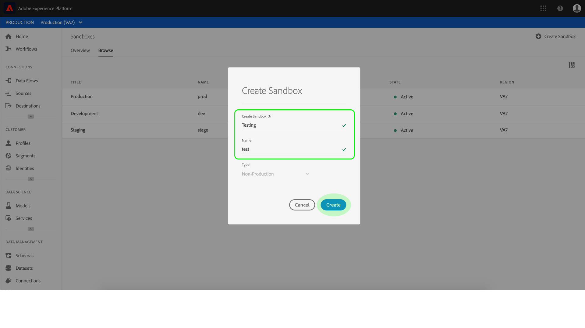

# Sandbox-Benutzerhandbuch

In diesem Dokument erfahren Sie, wie Sie in der Benutzeroberfläche von Adobe Experience Platform verschiedene Vorgänge im Zusammenhang mit Sandboxes ausführen können.

## Sandboxes anzeigen

Klicken Sie in der Benutzeroberfläche von Experience Platform im linken Navigationsbereich auf **Sandboxes**, um das Dashboard _Sandboxes_ zu öffnen. Im Dashboard werden alle für Ihre Organisation verfügbaren Sandboxes aufgeführt, einschließlich Sandbox-Typ (Produktion oder Entwicklung) und Status (aktiv, wird erstellt, gelöscht oder fehlgeschlagen).

## Zwischen Sandboxes wechseln

Das Steuerelement **Sandbox-Umschalter** oben links im Bildschirm zeigt die derzeit aktive Sandbox an.

Um zwischen Sandboxes zu wechseln, klicken Sie auf den Sandbox-Umschalter und wählen Sie die gewünschte Sandbox aus der Dropdown-Liste aus.

Sobald eine Sandbox ausgewählt ist, wird der Bildschirm aktualisiert; die ausgewählte Sandbox wird jetzt im Sandbox-Umschalter angezeigt.

## Neue Sandbox erstellen

Im folgenden Video erhalten Sie einen schnellen Überblick über die Verwendung [!DNL Sandboxes] in [!DNL Experience Platform].

>[!VIDEO](https://video.tv.adobe.com/v/29838/?quality=12&learn=on)

Um in der Benutzeroberfläche eine neue Sandbox zu erstellen, klicken Sie im linken Navigationsbereich auf **Sandboxes** und dann auf **Sandbox erstellen**.

Der Dialog _Sandbox erstellen_ wird angezeigt, in dem Sie aufgefordert werden, einen Anzeigetitel und einen Namen für die Sandbox anzugeben. Der **Anzeigetitel** sollte für Menschen lesbar und deskriptiv genug sein, damit er leicht zu erkennen ist. Der **Name** der Sandbox ist eine in Kleinbuchstaben verfasste Kennung zur Verwendung in API-Aufrufen und sollte daher eindeutig und kurz sein.

Klicken Sie abschließend auf **Erstellen**.

>[!NOTE]
>
>Da Sie nur Nicht-Produktions-Sandboxes erstellen können, ist die Option **Typ** bei „Nicht-Produktion“ gesperrt und kann nicht bearbeitet werden.

Nachdem Sie die Sandbox fertig eingerichtet haben, aktualisieren Sie die Seite; die neue Sandbox wird im Dashboard _Sandboxes_ mit dem Status „Wird erstellt“ angezeigt. Bei neuen Sandboxes dauert es etwa 15 Minuten, bis sie vom System bereitgestellt werden. Danach ändert sich ihr Status in „Aktiv“.

## Sandbox zurücksetzen

>[!NOTE]
>
>Diese Funktion ist nur bei Nicht-Produktions-Sandboxes verfügbar. Produktions-Sandboxes können nicht zurückgesetzt werden.

Beim Zurücksetzen einer Nicht-Produktions-Sandbox werden alle mit dieser Sandbox verbundenen Ressourcen (Schemas, Datensätze usw.) gelöscht, wobei der Name der Sandbox und die zugehörigen Berechtigungen beibehalten werden. Diese „saubere“ Sandbox ist für Benutzer, die Zugriff darauf haben, unter demselben Namen weiter verfügbar.

Um eine Sandbox in der Benutzeroberfläche zurückzusetzen, klicken Sie im linken Navigationsbereich auf **Sandboxes** und dann auf die Sandbox, die Sie zurücksetzen möchten. Klicken Sie im Dialog auf der rechten Seite des Bildschirms auf **Sandbox zurücksetzen**.

Es wird ein Dialog angezeigt, in dem Sie aufgefordert werden, Ihre Auswahl zu bestätigen. Klicken Sie auf **Zurücksetzen**, um fortzufahren.

 

Eine Bestätigungsmeldung wird angezeigt und der Status der Sandbox ändert sich in „Wird zurückgesetzt“. Sobald sie vom System bereitgestellt wurde, aktualisiert sich der Status der Sandbox in „Aktiv“ oder „Fehlgeschlagen“.

## Sandbox löschen

>[!NOTE]
>
>Diese Funktion ist nur bei Nicht-Produktions-Sandboxes verfügbar. Produktions-Sandboxes können nicht gelöscht werden.

Wenn Sie eine Nicht-Produktions-Sandbox löschen, werden alle mit dieser Sandbox verbundenen Ressourcen (einschließlich Berechtigungen) endgültig gelöscht.

Um eine Sandbox in der Benutzeroberfläche zu löschen, klicken Sie im linken Navigationsbereich auf **Sandboxes** und dann auf die Sandbox, die Sie löschen möchten. Klicken Sie im Dialog auf der rechten Seite des Bildschirms auf **Sandbox löschen**.

Es wird ein Dialog angezeigt, in dem Sie aufgefordert werden, Ihre Auswahl zu bestätigen. Klicken Sie auf **Löschen**, um fortzufahren.

 

Eine Bestätigungsmeldung wird angezeigt und die Sandbox wird aus dem Arbeitsbereich _Sandboxes_ entfernt.

## Nächste Schritte

In diesem Dokument haben Sie erfahren, wie Sie Sandboxes in der Benutzeroberfläche von Experience Platform verwalten können. Informationen zum Verwalten von Sandboxes mithilfe der Sandbox-API finden Sie im [Sandbox-Entwicklerhandbuch](../api/getting-started.md).