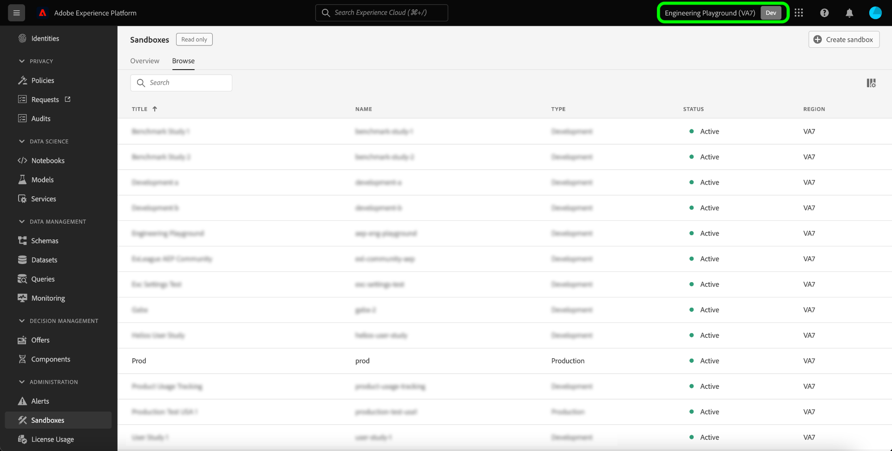
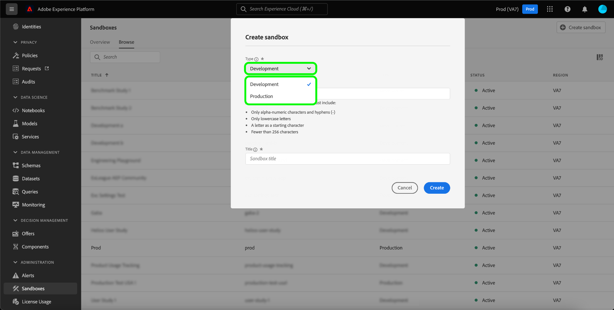
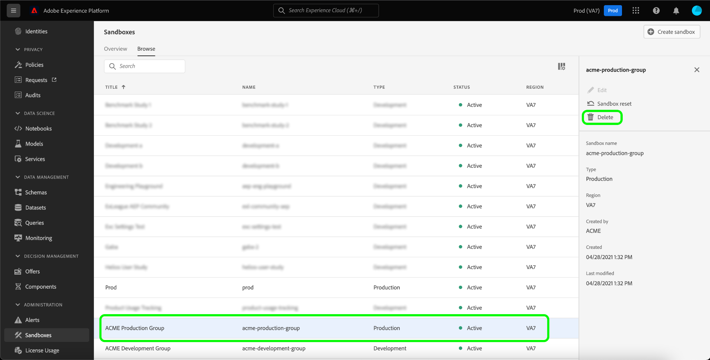

# Handbuch zur Sandbox-UI

In diesem Dokument erfahren Sie, wie Sie in der Benutzeroberfläche von Adobe Experience Platform verschiedene Vorgänge im Zusammenhang mit Sandboxes ausführen können.

## Anzeigen von Sandboxes

Klicken Sie in der Platform-Benutzeroberfläche in der linken Navigationsleiste auf die Option **[!UICONTROL Sandboxes]** und wählen Sie dann **[!UICONTROL Durchsuchen]** aus, um das [!UICONTROL Sandboxes]-Dashboard zu öffnen. Das Dashboard listet alle verfügbaren Sandboxes für Ihre Organisation auf, einschließlich des jeweiligen Typs (Produktion oder Entwicklung).

## Wechseln zwischen Sandboxes

Der Sandbox-Indikator befindet sich in der oberen Kopfzeile der Platform-Benutzeroberfläche und zeigt den Titel der derzeit aktiven Sandbox, deren Region und deren Typ an.

Um zwischen Sandboxes zu wechseln, klicken Sie auf den Sandbox-Indikator und wählen Sie die gewünschte Sandbox aus der Dropdown-Liste aus.

Sobald eine Sandbox ausgewählt ist, wird der Bildschirm mit der ausgewählten Sandbox aktualisiert.

## Erstellen einer neuen Sandbox {#create}

>[!CONTEXTUALHELP]
>id="platform_sandboxes_sandboxname"
>title="Sandbox-Name"
>abstract="Der Sandbox-Name ist der Text, der im Backend zum Erstellen einer eindeutigen ID für diese Sandbox verwendet wird."

>[!CONTEXTUALHELP]
>id="platform_sandboxes_sandboxtitle"
>title="Sandbox-Titel"
>abstract="Der Sandbox-Titel ist der Anzeigename, den die Sandbox in Menüs und Dropdown-Menüs in der Experience Platform-Benutzeroberfläche erhält."

>[!NOTE]
>
>Wenn eine neue Sandbox erstellt wird, müssen Sie diese neue Sandbox zunächst Ihrem Produktprofil in [Adobe Admin Console](https://adminconsole.adobe.com/) hinzufügen, bevor Sie sie verwenden können. Weitere Informationen zur Bereitstellung einer Sandbox für ein Produktprofil finden Sie in der Dokumentation unter [Verwalten von Berechtigungen für ein Produktprofil](../../access-control/ui/permissions.md).

Das folgende Video bietet einen schnellen Überblick über die Verwendung von Sandboxes in Experience Platform.

>[!VIDEO](https://video.tv.adobe.com/v/29838/?quality=12&learn=on)

Um eine neue Sandbox zu erstellen, wählen Sie in der rechten oberen Bildschirmecke **[!UICONTROL Sandbox erstellen]** aus.

Das Dialogfeld **[!UICONTROL Sandbox erstellen]** wird angezeigt. Wenn Sie eine Entwicklungs-Sandbox erstellen, wählen Sie im Dropdown-Feld **[!UICONTROL Entwicklung]** aus. Um eine neue Produktions-Sandbox zu erstellen, wählen Sie **[!UICONTROL Produktion]** aus.

Geben Sie nach Auswahl des Typs Ihrer Sandbox einen Namen und einen Titel ein. Der Titel sollte verständlich und aussagekräftig sein, damit er leicht zu erkennen ist. Der Name der Sandbox ist eine in Kleinbuchstaben verfasste Kennung zur Verwendung in API-Aufrufen und sollte daher eindeutig und kurz sein. Der Sandbox-Name muss mit einem Buchstaben beginnen, er darf maximal 256 Zeichen lang sein und nur aus alphanumerischen Zeichen und Bindestrichen (-) bestehen.

Klicken Sie abschließend auf **[!UICONTROL Erstellen]**.

Nachdem Sie die Sandbox fertig erstellt haben, aktualisieren Sie die Seite. Die neue Sandbox wird im Dashboard **[!UICONTROL Sandboxes]** mit dem Status „[!UICONTROL Wird erstellt]“ angezeigt. Bei neuen Sandboxes dauert es etwa 30 Minuten, bis sie vom System bereitgestellt werden. Danach ändert sich ihr Status in „[!UICONTROL Aktiv]“.

## Zurücksetzen einer Sandbox

>[!WARNING]
>
>Im Folgenden finden Sie eine Liste von Ausnahmen, die verhindern können, dass die standardmäßige Produktions-Sandbox oder eine benutzerdefinierte Produktions-Sandbox sich zurücksetzen lässt:
>* Die standardmäßige Produktions-Sandbox kann nicht zurückgesetzt werden, wenn das in der Sandbox gehostete Identitätsdiagramm auch von Adobe Analytics für die Funktion [Geräteübergreifende Analyse (Cross Device Analytics, CDA)](https://experienceleague.adobe.com/docs/analytics/components/cda/overview.html?lang=de) verwendet wird.
>* Die standardmäßige Produktions-Sandbox kann nicht zurückgesetzt werden, wenn das in der Sandbox gehostete Identitätsdiagramm auch von Adobe Audience Manager für [Benutzerbasierte Ziele (People Based Destinations, PBD)](https://experienceleague.adobe.com/docs/audience-manager/user-guide/features/destinations/people-based/people-based-destinations-overview.html?lang=de) verwendet wird.
>* Die standardmäßige Produktions-Sandbox kann nicht zurückgesetzt werden, wenn sie Daten für CDA- und PBD-Funktionen enthält.
>* Eine benutzerdefinierte Produktions-Sandbox, die für die bidirektionale Segmentfreigabe mit Adobe Audience Manager oder Audience Core Service verwendet wird, kann nach einer Warnmeldung zurückgesetzt werden.
>* Bevor Sie einen Sandbox-Reset starten, müssen Sie Ihre Kompositionen manuell löschen, um sicherzustellen, dass die zugehörigen Zielgruppendaten ordnungsgemäß bereinigt werden.

### Löschen von Zielgruppenkompositionen

Die Zielgruppenzusammensetzung ist derzeit nicht in die Sandbox-Funktion zum Zurücksetzen integriert. Daher müssen Zielgruppen vor dem Zurücksetzen der Sandbox manuell gelöscht werden.

Auswählen **[!UICONTROL Zielgruppen]** aus der linken Navigation und wählen Sie dann **[!UICONTROL Kompositionen]**.

![Die [!UICONTROL Kompositionen] im [!UICONTROL Zielgruppen] Arbeitsbereich.](../images/ui/audiences.png)

Wählen Sie als Nächstes die Auslassungszeichen (`...`) neben der ersten Zielgruppe und wählen Sie **[!UICONTROL Löschen]**.

![Das Zielgruppenmenü, das die [!UICONTROL Löschen] -Option.](../images/ui/delete-composition.png)

Eine Bestätigung des erfolgreichen Löschvorgangs wird angezeigt und Sie werden zum **[!UICONTROL Kompositionen]** Registerkarte.

Wiederholen Sie die obigen Schritte mit allen Kompositionen. Dadurch werden alle Zielgruppen aus dem Zielgruppenbestand gelöscht. Nachdem alle Zielgruppen entfernt wurden, können Sie die Sandbox weiterhin zurücksetzen.

### Zurücksetzen einer Sandbox

Beim Zurücksetzen einer Produktions- oder Entwicklungs-Sandbox werden alle mit dieser Sandbox verbundenen Ressourcen (Schemata, Datensätze usw.) gelöscht, wobei der Name der Sandbox und die zugehörigen Berechtigungen beibehalten werden. Diese „saubere“ Sandbox ist für Benutzende, die Zugriff darauf haben, unter demselben Namen weiter verfügbar.

Wählen Sie in der Sandbox-Liste die Sandbox aus, die Sie zurücksetzen möchten. Wählen Sie im sich öffnenden Navigationsfeld rechts die Option **[!UICONTROL Sandbox zurücksetzen]** aus.

Es wird ein Dialogfeld angezeigt, in dem Sie aufgefordert werden, Ihre Auswahl zu bestätigen. Klicken Sie auf **[!UICONTROL Weiter]**, um fortzufahren.

Geben Sie im letzten Bestätigungsfenster den Namen der Sandbox im Dialogfeld ein und klicken Sie auf **[!UICONTROL Zurücksetzen]**.

## Sandbox löschen

>[!WARNING]
>
>Die standardmäßige Produktions-Sandbox kann nicht gelöscht werden. Jede vom Benutzer erstellte Produktions-Sandbox, die für die bidirektionale Segmentfreigabe mit [!DNL Audience Manager] oder [!DNL Audience Core Service] verwendet wird, kann nach einer Warnmeldung gelöscht werden.

Wenn Sie eine Produktions- oder Entwicklungs-Sandbox löschen, werden alle mit dieser Sandbox verbundenen Ressourcen (einschließlich Berechtigungen) endgültig gelöscht.

Wählen Sie die Sandbox aus, die Sie aus der Sandbox-Liste löschen möchten. Klicken Sie im rechten Navigationsfeld, das sich öffnet, auf **[!UICONTROL Löschen]**.

Es wird ein Dialogfeld angezeigt, in dem Sie aufgefordert werden, Ihre Auswahl zu bestätigen. Klicken Sie auf **[!UICONTROL Weiter]**, um fortzufahren.

Geben Sie im letzten Bestätigungsfenster den Namen der Sandbox in das Dialogfeld ein und klicken Sie auf  **[!UICONTROL Weiter]**.

## Nächste Schritte

In diesem Dokument haben Sie erfahren, wie Sie Sandboxes in der Benutzeroberfläche von Experience Platform verwalten können. Informationen zum Verwalten von Sandboxes mithilfe der Sandbox-API finden Sie im [Sandbox-Entwicklerhandbuch](../api/getting-started.md).
