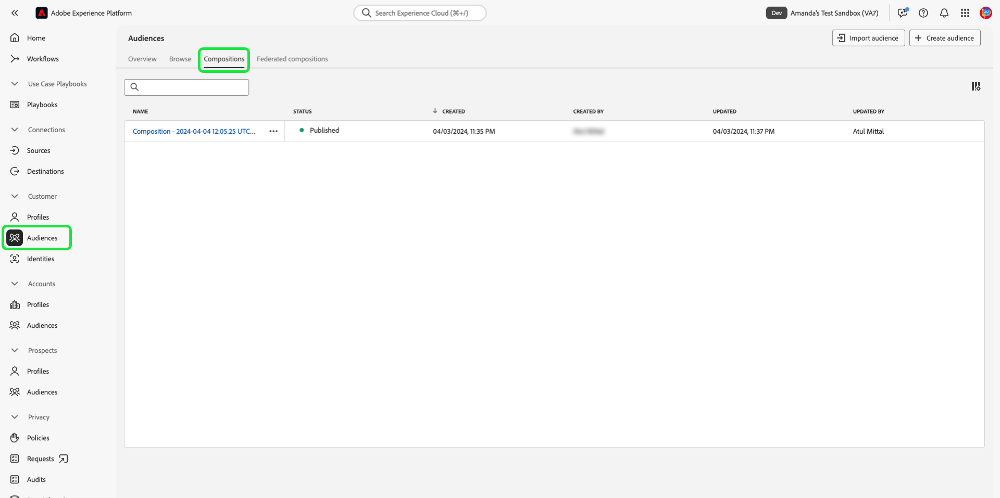

# Handbuch zur Sandbox-UI

In diesem Dokument erfahren Sie, wie Sie in der Benutzeroberfläche von Adobe Experience Platform verschiedene Vorgänge im Zusammenhang mit Sandboxes ausführen können.

## Anzeigen von Sandboxes

Wählen Sie in der Experience Platform-Benutzeroberfläche im linken Navigationsbereich die Option **[!UICONTROL Sandboxes]** und dann die Registerkarte **[!UICONTROL Browse]** aus, um das [!UICONTROL Sandboxes]-Dashboard zu öffnen. Das Dashboard listet alle verfügbaren Sandboxes für Ihre Organisation auf, einschließlich des jeweiligen Typs (Produktion oder Entwicklung).

## Wechseln zwischen Sandboxes

Der Sandbox-Indikator befindet sich in der oberen Kopfzeile der Experience Platform-Benutzeroberfläche und zeigt den Titel der derzeit aktiven Sandbox, deren Region und deren Typ an.

Um zwischen Sandboxes zu wechseln, wählen Sie den Sandbox-Indikator und dann die gewünschte Sandbox aus der Dropdown-Liste aus. Alternativ können Sie mit der Suchfunktion im Dropdown-Menü nach der gewünschten Sandbox suchen.

Sobald eine Sandbox ausgewählt ist, wird der Bildschirm mit der ausgewählten Sandbox aktualisiert.

## Erstellen einer neuen Sandbox {#create}

>[!CONTEXTUALHELP]
>id="platform_sandboxes_sandboxname"
>title="Sandbox-Name"
>abstract="Der Sandbox-Name ist der Text, der im Backend zum Erstellen einer eindeutigen ID für diese Sandbox verwendet wird."

>[!CONTEXTUALHELP]
>id="platform_sandboxes_sandboxtitle"
>title="Sandbox-Titel"
>abstract="Der Sandbox-Titel ist der Anzeigename, den die Sandbox in Menüs und Dropdown-Menüs in der Experience Platform-Benutzeroberfläche erhält."

>[!WARNING]
>
>Für die Erstellung einer neuen Sandbox müssen Sie sie einer Rolle in [[!UICONTROL Permissions]](../../access-control/abac/ui/permissions.md) hinzufügen, bevor Sie sie verwenden können. Informationen zum Bereitstellen einer Sandbox für eine Rolle finden Sie in der Dokumentation [Verwalten von Sandboxes für eine Rolle](../../access-control/abac/ui/permissions.md#managing-sandboxes-for-role).

Das folgende Video bietet einen schnellen Überblick über die Verwendung von Sandboxes in Experience Platform.

>[!VIDEO](https://video.tv.adobe.com/v/29838/?quality=12&learn=on)

Um eine neue Sandbox zu erstellen, wählen Sie oben rechts im Bildschirm **[!UICONTROL Create sandbox]** aus.

Das Dialogfeld **[!UICONTROL Create sandbox]** wird angezeigt. Wählen Sie das Dropdown-Menü **[!UICONTROL Type]** und wählen Sie entweder den Sandbox[!UICONTROL Development]Typ oder [!UICONTROL Production].

Geben Sie nach Auswahl des Typs im Feld **[!UICONTROL Name]** einen Namen für die Sandbox ein. Der Name der Sandbox ist eine in Kleinbuchstaben verfasste Kennung zur Verwendung in API-Aufrufen und sollte daher eindeutig und kurz sein. Der Sandbox-Name muss mit einem Buchstaben beginnen, er darf maximal 256 Zeichen lang sein und nur aus alphanumerischen Zeichen und Bindestrichen (-) bestehen. Geben Sie als Nächstes einen Titel für Ihre Sandbox im Feld **[!UICONTROL Title]** an. Der Titel sollte verständlich und aussagekräftig sein, damit er leicht zu erkennen ist.

Wenn Sie fertig sind, wählen Sie **[!UICONTROL Create]** aus.

Nachdem Sie die Sandbox fertig erstellt haben, aktualisieren Sie die Seite. Die neue Sandbox wird im **[!UICONTROL Sandboxes]**-Dashboard mit dem Status &quot;[!UICONTROL Creating]&quot; angezeigt. Bei neuen Sandboxes dauert es etwa 30 Sekunden, bis sie vom System bereitgestellt werden. Danach ändert sich ihr Status in &quot;[!UICONTROL Active]&quot;.

## Zurücksetzen einer Sandbox

>[!WARNING]
>
>Im Folgenden finden Sie eine Liste von Ausnahmen, die verhindern können, dass die standardmäßige Produktions-Sandbox oder eine benutzerdefinierte Produktions-Sandbox sich zurücksetzen lässt:
>
>* Eine benutzerdefinierte Produktions-Sandbox, die für die bidirektionale Segmentfreigabe mit Adobe Audience Manager oder Audience Core Service verwendet wird, kann nach einer Warnmeldung zurückgesetzt werden.
>* Vor dem Zurücksetzen einer Sandbox müssen Sie Ihre Kompositionen manuell löschen, um sicherzustellen, dass die zugehörigen Zielgruppendaten ordnungsgemäß bereinigt werden.
>* Die Sandbox-ID ändert sich, nachdem das Zurücksetzen abgeschlossen ist.
>* Für [Journey Optimizer B2B edition](https://experienceleague.adobe.com/de/docs/journey-optimizer-b2b/user/guide-overview) wird das Zurücksetzen **Sandbox derzeit nicht**. Das Zurücksetzen oder Löschen einer Sandbox, die Journey Optimizer B2B edition zugeordnet ist, kann zu dauerhaftem Datenverlust in Journey Optimizer B2B edition führen und könnte die Bereitstellung einer neuen Journey Optimizer B2B edition-Instanz erfordern.

### Audience-Kompositionen löschen

Die Zielgruppenkomposition ist derzeit nicht in die Funktion zum Zurücksetzen der Sandbox integriert, sodass Zielgruppen vor dem Zurücksetzen der Sandbox manuell gelöscht werden müssen.

Wählen Sie **[!UICONTROL Audiences]** aus dem Abschnitt **[!UICONTROL Customers]** im linken Navigationsbereich und dann die Registerkarte **[!UICONTROL Compositions]** aus.

Klicken Sie als Nächstes auf das Auslassungszeichen (`...`) neben der ersten Zielgruppe und dann auf **[!UICONTROL Delete]**.

![Das Zielgruppen-Menü mit hervorgehobener Option &quot;[!UICONTROL Delete]&quot;](../images/ui/delete-composition.png)

Eine Bestätigung des erfolgreichen Löschvorgangs wird angezeigt, und Sie kehren zur Registerkarte **[!UICONTROL Compositions]** zurück.

Wiederholen Sie die obigen Schritte mit allen Ihren Kompositionen. Dadurch werden alle Zielgruppen aus dem Zielgruppeninventar gelöscht. Nachdem alle Zielgruppen entfernt wurden, können Sie die Sandbox zurücksetzen.

### Zurücksetzen einer Sandbox

Beim Zurücksetzen einer Produktions- oder Entwicklungs-Sandbox werden alle mit dieser Sandbox verbundenen Ressourcen (Schemata, Datensätze usw.) gelöscht, wobei der Name der Sandbox und die zugehörigen Berechtigungen beibehalten werden. Diese „saubere“ Sandbox ist für Benutzende, die Zugriff darauf haben, unter demselben Namen weiter verfügbar.

Wählen Sie in der Sandbox-Liste die Sandbox aus, die Sie zurücksetzen möchten. Wählen Sie im sich öffnenden Navigationsfenster rechts die Option **[!UICONTROL Sandbox reset]** aus.

Es wird ein Dialogfeld angezeigt, in dem Sie aufgefordert werden, Ihre Auswahl zu bestätigen. Wählen Sie **[!UICONTROL Continue]** aus, um fortzufahren.

Geben Sie im letzten Bestätigungsfenster den Namen der Sandbox in das Dialogfeld ein und wählen Sie **[!UICONTROL Reset]** aus.

## Sandbox löschen

>[!WARNING]
>
>Die standardmäßige Produktions-Sandbox kann nicht gelöscht werden. Jede vom Benutzer erstellte Produktions-Sandbox, die für die bidirektionale Segmentfreigabe mit [!DNL Audience Manager] oder [!DNL Audience Core Service] verwendet wird, kann nach einer Warnmeldung gelöscht werden.

Wenn Sie eine Produktions- oder Entwicklungs-Sandbox löschen, werden alle mit dieser Sandbox verbundenen Ressourcen (einschließlich Berechtigungen) endgültig gelöscht.

Wählen Sie die Sandbox aus, die Sie aus der Sandbox-Liste löschen möchten. Wählen Sie im sich öffnenden Navigationsfenster rechts die Option **[!UICONTROL Delete]** aus.

Es wird ein Dialogfeld angezeigt, in dem Sie aufgefordert werden, Ihre Auswahl zu bestätigen. Wählen Sie **[!UICONTROL Continue]** aus, um fortzufahren.

Geben Sie im letzten Bestätigungsfenster den Namen der Sandbox in das Dialogfeld ein und wählen Sie **[!UICONTROL Continue]** aus.

## Nächste Schritte

In diesem Dokument haben Sie erfahren, wie Sie Sandboxes in der Benutzeroberfläche von Experience Platform verwalten können. Nachdem Sie nun wissen, wie Sie Sandboxes verwalten, erfahren Sie, wie Sie mit dem Handbuch Sandbox-Tools [&#x200B; die Konfigurationsgenauigkeit über Sandboxes hinweg verbessern und Sandbox-Konfigurationen zwischen Sandboxes nahtlos exportieren &#x200B;](./sandbox-tooling.md) importieren können.

Informationen zum Verwalten von Sandboxes mithilfe der Sandbox-API finden Sie im [Sandbox-Entwicklerhandbuch](../api/getting-started.md).
