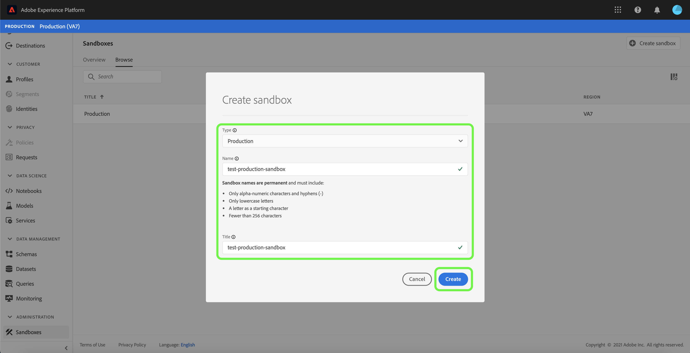
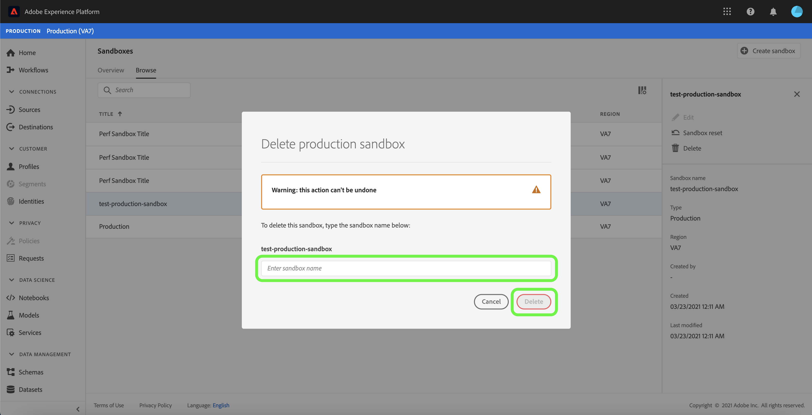

# Handbuch zur Sandbox-Benutzeroberfläche

In diesem Dokument erfahren Sie, wie Sie in der Benutzeroberfläche von Adobe Experience Platform verschiedene Vorgänge im Zusammenhang mit Sandboxes ausführen können.

## Anzeigen von Sandboxes

Wählen Sie in der Benutzeroberfläche &quot;Experience Platform&quot;in der linken Navigation **[!UICONTROL Sandboxes]** aus, um das Dashboard **[!UICONTROL Sandboxes]** zu öffnen. Im Dashboard werden alle für Ihre Organisation verfügbaren Sandboxes aufgeführt, einschließlich Sandbox-Typ (Produktion oder Entwicklung) und Status (aktiv, wird erstellt, gelöscht oder fehlgeschlagen).

## Zwischen Sandboxes wechseln

Das Steuerelement **Sandbox-Umschalter** oben links im Bildschirm zeigt die derzeit aktive Sandbox an.

Um zwischen Sandboxen zu wechseln, wählen Sie den Sandbox-Umschalter aus und wählen Sie die gewünschte Sandbox aus der Dropdown-Liste aus.

Sobald eine Sandbox ausgewählt ist, wird der Bildschirm aktualisiert; die ausgewählte Sandbox wird jetzt im Sandbox-Umschalter angezeigt.

## Suchen nach einer Sandbox

Sie können über die Suchfunktion im Menü &quot;Sandbox-Umschalter&quot;durch die Liste der Ihnen zur Verfügung stehenden Sandboxen navigieren. Geben Sie den Namen der Sandbox ein, auf die Sie zugreifen möchten, um durch alle für Ihr Unternehmen verfügbaren Sandboxen zu filtern.

## Neue Sandbox erstellen

>[!NOTE]
>
>Die Funktion &quot;Mehrere Produktions-Sandboxen&quot;befindet sich in der Betaphase.

Im folgenden Video erhalten Sie einen schnellen Überblick über die Verwendung von Sandboxen in der Experience Platform.

>[!VIDEO](https://video.tv.adobe.com/v/29838/?quality=12&learn=on)

Um eine neue Sandbox zu erstellen, klicken Sie oben rechts im Bildschirm auf die Schaltfläche **[!UICONTROL Sandbox erstellen]**.

Das Dialogfeld **[!UICONTROL Sandbox erstellen]** wird angezeigt und Sie werden aufgefordert, einen Typ, einen Titel und einen Namen für die Sandbox anzugeben. Wenn Sie eine Entwicklungs-Sandbox erstellen, wählen Sie **[!UICONTROL Entwicklung]** im Dropdown-Bedienfeld aus, das angezeigt wird. Wenn Sie eine Produktions-Sandbox erstellen, wählen Sie **[!UICONTROL Produktion]**.

Der Titel ist für Menschen lesbar und sollte so beschreibend sein, dass er leicht zu identifizieren ist. Der Sandbox-Name ist ein vollständig kleingeschriebener Bezeichner für die Verwendung in API-Aufrufen und sollte daher eindeutig und knapp sein. Der Sandbox-Name darf nur aus alphanumerischen Zeichen und Bindestrichen (`-`) bestehen, muss mit einem Buchstaben beginnen und darf nicht länger als 256 Zeichen sein.

Wenn Sie fertig sind, wählen Sie **[!UICONTROL Erstellen]**.

Nachdem Sie die Sandbox erstellt haben, aktualisieren Sie die Seite und die neue Sandbox wird im Dashboard **[!UICONTROL Sandboxes]** mit dem Status &quot;[!UICONTROL Erstellen]&quot;angezeigt. Die Bereitstellung neuer Sandboxen durch das System dauert etwa 15 Minuten, danach ändert sich ihr Status in &quot;[!UICONTROL Aktiv]&quot;.

## Zurücksetzen einer Sandbox

>[!NOTE]
>
>Sie können alle Produktions- oder Entwicklungs-Sandboxen in Ihrer Organisation zurücksetzen, mit Ausnahme der Standard-Produktions-Sandbox.

Durch Zurücksetzen einer Produktions- oder Entwicklungs-Sandbox werden alle mit dieser Sandbox verbundenen Ressourcen (Schema, Datensätze usw.) gelöscht, wobei der Name der Sandbox und die zugehörigen Berechtigungen beibehalten werden. Diese „saubere“ Sandbox ist für Benutzer, die Zugriff darauf haben, unter demselben Namen weiter verfügbar.

Wählen Sie die Sandbox aus, die Sie aus der Liste der Sandboxen zurücksetzen möchten. Wählen Sie im rechten Navigationsfenster **[!UICONTROL Sandbox reset]**.

Es wird ein Dialog angezeigt, in dem Sie aufgefordert werden, Ihre Auswahl zu bestätigen. Wählen Sie **[!UICONTROL Weiter]**, um fortzufahren.

Geben Sie im letzten Bestätigungsfenster den Namen der Sandbox in das Dialogfeld ein und wählen Sie **[!UICONTROL Zurücksetzen]**

## Sandbox löschen

>[!NOTE]
>
>Sie können alle Produktions- oder Entwicklungs-Sandboxen in Ihrer Organisation löschen, mit Ausnahme der Standard-Produktions-Sandbox.

Wenn Sie eine Produktions- oder Entwicklungs-Sandbox löschen, werden alle mit dieser Sandbox verbundenen Ressourcen, einschließlich Berechtigungen, endgültig entfernt.

Wählen Sie die Sandbox aus, die Sie aus der Liste der Sandboxen löschen möchten. Wählen Sie im rechten Navigationsfenster **[!UICONTROL Löschen]**.

Es wird ein Dialog angezeigt, in dem Sie aufgefordert werden, Ihre Auswahl zu bestätigen. Wählen Sie **[!UICONTROL Weiter]**, um fortzufahren.

Geben Sie im letzten Bestätigungsfenster den Namen der Sandbox in das Dialogfeld ein und wählen Sie **[!UICONTROL Löschen]**

## Nächste Schritte

In diesem Dokument haben Sie erfahren, wie Sie Sandboxes in der Benutzeroberfläche von Experience Platform verwalten können. Informationen zum Verwalten von Sandboxes mithilfe der Sandbox-API finden Sie im [Sandbox-Entwicklerhandbuch](../api/getting-started.md).