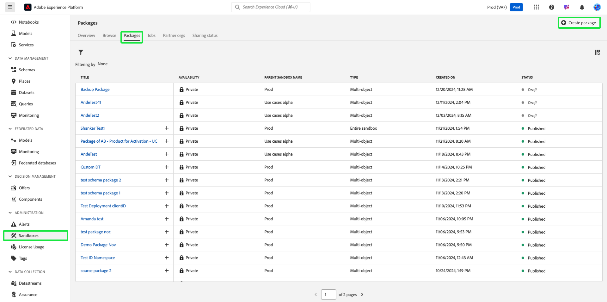

# Sichern von Objektkonfigurationen mithilfe von Sandbox-Tools

Um Sandboxes sicher zurückzusetzen und Versionierungsunterstützung hinzuzufügen, sichern Sie Objektkonfigurationen (oder Metadaten) mithilfe von Sandbox-Toolingpaketen. Backup-Pakete verhindern den Verlust wichtiger Konfigurationen wie Schemata, Datensätze und Zielgruppen, insbesondere bei Entwicklungsiterationen.

{zoomable="yes"}

## Gründe für diesen Anwendungsfall {#why-this-use-case}

Das Erstellen eines Backup-Pakets mithilfe von Sandbox-Tools stellt sicher, dass Ihre Objektkonfigurationen gespeichert und gesichert werden. Entwicklungs-Sandboxes können beim Experimentieren und Erstellen schnell gefüllt werden, während das Erstellen einer Sandbox nach dem Zurücksetzen zeitaufwendig sein kann und Platz für Fehler lässt. Mit der Leistungsfähigkeit der Sandbox-Tools können Sie ein Backup-Paket in eine neu zurückgesetzte Sandbox importieren, um sofort Ihre idealen Konfigurationen zurückzugeben, damit Sie Ihre Entwicklung fortsetzen können.

Backup-Pakete ermöglichen es Ihnen auch, die Versionierung während Ihres gesamten Entwicklungsprozesses zu unterstützen. Wenn sich Ihre Sandbox ändert, erstellen Sie zusätzliche Backup-Pakete neben Ihren vorherigen Paketen, damit Sie Ihre Sandbox einfach in jeder Ihrer Konfigurationen wiederherstellen können.

## Voraussetzungen und Planung {#prerequisites-and-planning}

Beachten Sie bei der Planung der Erstellung eines eigenen Backup-Pakets in Ihrer Organisation die folgenden Voraussetzungen bei Ihrem Planungsprozess:

- Bewerten Sie die aktuelle Verwendung der Sandboxes in Ihrer Organisation. Nähern sich Nicht-Produktions-Sandboxes ihrer Lizenzberechtigung oder überschreiten sie sie?
- Welchen Umfang haben die Metadaten, die Sie sichern möchten? Je nach Anwendungsfall können Sie eine vollständige oder partielle Sandbox sichern.
- Stellen Sie je nach Umfang der Metadaten, die Sie sichern möchten, sicher, dass Sie verstehen, wie [ Objekte manuell zu einem Paket hinzufügen ](../ui/sandbox-tooling.md#add-object-to-a-new-package) wie [ eine gesamte Sandbox exportieren ](../ui/sandbox-tooling.md#export-an-entire-sandbox).
- Stellen Sie sicher, dass Sie in Ihrer Organisation mit den richtigen Berechtigungen Zugriff auf Sandbox-Tools haben.

### Benutzeroberflächenfunktionen, Experience Platform-Komponenten und Experience Cloud-Produkte, die Sie verwenden werden {#ui-functionality-and-elements}

Um diesen Anwendungsfall erfolgreich zu implementieren, müssen Sie mehrere Bereiche von Adobe Experience Platform verwenden. Vergewissern Sie sich, dass Sie über [ erforderlichen (attributbasierten Zugriffssteuerungsberechtigungen](../../access-control/abac/overview.md) für alle diese Bereiche verfügen, oder bitten Sie Ihren Systemadministrator, Ihnen die erforderlichen Berechtigungen zu gewähren.

- [Sandbox-Werkzeuge](../ui/sandbox-tooling.md)
- [Sandbox-Verwaltung](../ui/user-guide.md)
- [Lizenznutzungs-Dashboard](../../landing/license-usage-and-guardrails/license-usage-dashboard.md)
- [Datensätze](../../catalog/datasets/overview.md)
- [Schemata](../../xdm//home.md)
- [Zielgruppen](../../segmentation/home.md)
- [Journey aus Adobe Journey Optimizer](https://experienceleague.adobe.com/en/docs/journey-optimizer/using/orchestrate-journeys/journey)

## Erreichen des Anwendungsfalls: Allgemeine Übersicht {#achieve-the-use-case-high-level}

1. Definieren Sie den Umfang der Metadaten, die Sie sichern möchten.
2. Verwenden Sie die Benutzeroberfläche der Sandbox-Tools, um Ihre gewünschten Objekte in ein Backup-Paket zu exportieren.
3. Erstellen Sie regelmäßig neue Versionen des Backup-Pakets, um sicherzustellen, dass Sandboxes weiterhin an Ihre aktuellen Konfigurationen angepasst sind.
4. Überprüfen Sie im Dashboard zur Lizenznutzung Ihre aktuelle Nutzung anhand Ihrer Berechtigungen für Nicht-Produktions-Sandboxes.
5. Setzen Sie Nicht-Produktions-Sandboxes zurück, um die Berechtigungen einzuhalten oder unnötige Ressourcen und Datenspeicher freizugeben.
6. Importieren Sie das Backup-Paket in Ihre Sandbox, nachdem Sie es zum Wiederherstellen von Objektkonfigurationen zurückgesetzt haben.

## Erreichen des Anwendungsfalls: Schrittweise Anweisungen {#step-by-step-instructions}

Lesen Sie die folgenden Abschnitte, die Links zu weiteren Dokumentationen enthalten, durch, um die einzelnen Schritte in der allgemeinen Übersicht oben abzuschließen.

### Definieren des Metadatenbereichs

Bevor Sie mit der Erstellung Ihres Backup-Pakets beginnen, sollten Sie den Anwendungsfall des Pakets berücksichtigen. Je nach Bedarf können Sie eine vollständige Sandbox sichern oder bestimmte Objekte auswählen, die Sie Ihrem Paket hinzufügen möchten, wie in den [Voraussetzungen“ ](#prerequisites-and-planning).

>[!NOTE]
>
> Wenn Sie erwägen, Ihre Sandbox zum Zurücksetzen zu sichern, beachten Sie die [Einschränkungen](../ui/user-guide.md#reset-a-sandbox) beim Zurücksetzen von Sandboxes.

### Exportieren der ausgewählten Metadaten in ein Paket

An dieser Stelle können Sie Ihre Sandbox mithilfe der Benutzeroberfläche der Sandbox-Tools sichern. Dieser Schritt umfasst sowohl das Sichern einer gesamten Sandbox als auch das Sichern bestimmter Objekte.

>[!NOTE]
>
> Nicht alle Objekte werden für Sandbox-Tools unterstützt. Eine umfassende Liste [ zulässigen Objekte finden Sie im Handbuch ](../ui/sandbox-tooling.md#objects-supported-for-sandbox-tooling)Objekte, die für Sandbox-Tools unterstützt werden“.

#### Exportieren einer vollständigen Sandbox

Um Ihre Sandbox vollständig zu sichern, befolgen Sie die Anweisungen im [Sandbox-Tool-Handbuch](../ui/sandbox-tooling.md#export-an-entire-sandbox), um ein neues Paket zu erstellen und zu veröffentlichen, das die Konfigurationen Ihrer gesamten Sandbox enthält.

#### Exportieren von einzelnen Objekten

Sie können einzelne Objekte auf eine der folgenden Arten in einem Paket sichern. Während sich diese Handbücher auf das Hinzufügen eines Schemas zum Paket konzentrieren, gelten dieselben Schritte für andere Objekte wie Datensätze, Zielgruppen oder Journey.

- Fügen Sie einem neuen Paket ein einzelnes Objekt hinzu, indem Sie dem Handbuch [ Hinzufügen von Objekten des Sandbox-Tools ](../ui/sandbox-tooling.md#add-object-to-a-new-package).
- Fügen Sie einem vorhandenen Backup-Paket ein einzelnes Objekt hinzu, indem Sie dem [Sandbox-Tool-Handbuch](../ui/sandbox-tooling.md#add-an-object-to-an-existing-package-and-publish) folgen und sicherstellen, dass Sie Ihre Änderungen veröffentlichen.
- Erstellen Sie ein leeres Paket mit mehreren Objekten, um Objekten hinzuzufügen, wie unten beschrieben.

##### Erstellen eines Pakets mit mehreren Objekten

Wählen Sie in Experience Platform **[!UICONTROL Sandboxes]** im linken Navigationsbereich aus und klicken Sie dann auf **[!UICONTROL Pakete]**. Um mit der Erstellung eines neuen Pakets zu beginnen, wählen **[!UICONTROL oben rechts]** Paket erstellen“ aus.

Das **[!UICONTROL Paket erstellen]** wird angezeigt. Wählen Sie **[!UICONTROL Objekte auswählen]** und dann **[!UICONTROL Auswählen]** aus.

Wählen Sie die **[!UICONTROL Multi-Objekt]**-Option aus. Jetzt müssen Sie einen Namen für Ihr neues Paket angeben. Geben Sie den gewünschten Namen in das Textfeld **[!UICONTROL Paketname]** ein. Klicken Sie abschließend auf **[!UICONTROL Erstellen]**.

Ihr neues Paket mit mehreren Objekten wird erstellt und ist im Dashboard [!UICONTROL Pakete] verfügbar. Wählen Sie das Paket aus der Liste aus.

Die Informationen und der Inhalt des Pakets werden angezeigt. Derzeit sind keine Objekte in unserem neuen Paket vorhanden. Um mit dem Hinzufügen von Objekten zu beginnen, folgen Sie der Anleitung [Hinzufügen von Objekten zu einem vorhandenen Paket](../ui/sandbox-tooling.md#add-object-to-a-new-package).

### Erstellen Sie bei Bedarf neue Versionen des Backup-Pakets

Nachdem Sie das erste Backup-Paket für Ihre Sandbox erstellt haben, sollten Sie neue Versionen Ihres Backup-Pakets erstellen, wenn sich Ihre Sandbox-Konfigurationen ändern.

Es ist zwar möglich, dem vorhandenen Backup-Paket neue Objekte hinzuzufügen, Sie werden jedoch ermutigt, neue Pakete zu erstellen, um die Versionierung in Ihrer Sandbox zu unterstützen. Dadurch wird sichergestellt, dass Sie beim weiteren Entwickeln jede frühere Version Ihrer Sandboxes einfach zurücksetzen und importieren können.

### Überprüfen Sie Ihre aktuelle Nutzung anhand Ihrer Lizenzberechtigungen.

Nachdem Ihr Backup-Paket fertig ist, können Sie Ihre Sandbox zurücksetzen, um Ihre Nutzung zurückzusetzen. Sie sollten Ihre Nutzung regelmäßig überwachen, um Ihre Lizenzberechtigungen anzupassen oder Ihre Sandbox nach Bedarf zurückzusetzen. Weitere Informationen zum Lizenznutzungs[Dashboard finden ](../../dashboards/guides/license-usage.md) im Abschnitt „Lizenznutzungshandbuch.

### Sandbox zurücksetzen

An dieser Stelle können Sie Ihre Sandbox sicher zurücksetzen, vorausgesetzt, Ihre Sandbox erfüllt die erforderlichen Parameter. Befolgen Sie die [Anleitung zum Zurücksetzen einer Sandbox](../ui/user-guide.md#reset-a-sandbox), um mit dem Zurücksetzen Ihrer Sandbox zu beginnen. Lesen Sie dabei unbedingt die Warnungsauflistungsfälle, die Sie möglicherweise daran hindern, Ihre Sandbox zurückzusetzen.

### Importieren Sie das neu erstellte Backup-Paket in Ihre Sandbox zum Zurücksetzen

Nachdem Sie Ihre Sandbox zurückgesetzt haben, können Sie das von Ihnen erstellte Backup-Paket verwenden. Im [Handbuch zu Sandbox-Tools](../ui/sandbox-tooling.md#import-a-package-to-a-target-sandbox) finden Sie einen schrittweisen Prozess zum Importieren eines Pakets in Ihre Ziel-Sandbox.

## Andere Anwendungsfälle, die mithilfe von Sandbox-Tools erreicht werden: {#other-use-cases}

Erkunden Sie weitere Anwendungsfälle, die über Sandbox-Tools aktiviert sind:

- [Aktivieren eines Kompetenzzentrums mithilfe von Sandbox-Tools](./center-of-excellence.md)
