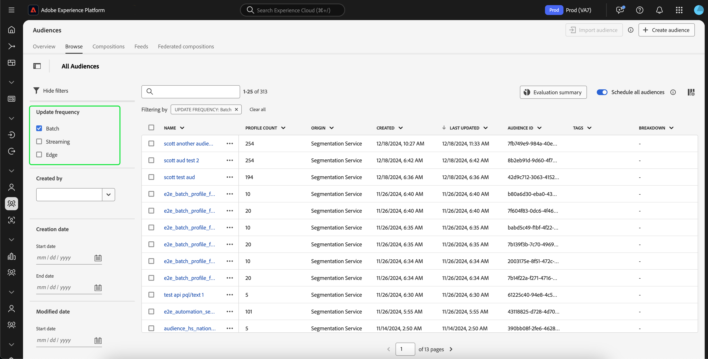

# Handbuch zur Stapelsegmentierung

Die Batch-Segmentierung ist eine Auswertungsmethode für die Segmentierung, mit der Sie Profildaten gleichzeitig verschieben können, um entsprechende Zielgruppen zu erstellen.

Mit der Batch-Segmentierung können Sie detaillierte und umfangreiche Zielgruppen erstellen und Segmentierungsaufträge ausführen, um zu bestimmen, wann diese Daten an nachgelagerte Services weitergegeben werden sollen.

## Mögliche Abfragetypen {#query-types}

Alle Abfragen sind für die Batch-Segmentierung geeignet.

## Zielgruppe erstellen {#create-audience}

Sie können eine Zielgruppe erstellen, die mithilfe der Batch-Segmentierung entweder mithilfe der Segmentierungs-Service-API oder über das Zielgruppenportal in der Benutzeroberfläche ausgewertet wird.

>[!BEGINTABS]

>[!TAB Segmentation Service-API]

**API-Format**

```http
POST /segment/definitions
```

**Anfrage**

+++ Eine Beispielanfrage zum Erstellen einer Segmentdefinition, die für die Batch-Segmentierung aktiviert ist

```shell
curl -X POST https://platform.adobe.io/data/core/ups/segment/definitions
 -H 'Authorization: Bearer {ACCESS_TOKEN}' \
 -H 'Content-Type: application/json' \
 -H 'x-gw-ims-org-id: {ORG_ID}' \
 -H 'x-api-key: {API_KEY}' \
 -H 'x-sandbox-name: {SANDBOX_NAME}'
 -d '{
        "name": "People in the USA",
        "description: "An audience that looks for people who live in the USA",
        "expression": {
            "type": "PQL",
            "format": "pql/text",
            "value": "homeAddress.country = \"US\""
        },
        "evaluationInfo": {
            "batch": {
                "enabled": true
            },
            "continuous": {
                "enabled": false
            },
            "synchronous": {
                "enabled": false
            }
        },
        "schema": {
            "name": "_xdm.context.profile"
        }
     }'
```

+++

**Antwort**

Eine erfolgreiche Antwort gibt den HTTP-Status 200 mit Details zur neu erstellten Segmentdefinition zurück.

+++Eine Beispielantwort beim Erstellen einer Segmentdefinition.

```json
{
    "id": "4afe34ae-8c98-4513-8a1d-67ccaa54bc05",
    "schema": {
        "name": "_xdm.context.profile"
    },
    "profileInstanceId": "ups",
    "imsOrgId": "{ORG_ID}",
    "sandbox": {
        "sandboxId": "28e74200-e3de-11e9-8f5d-7f27416c5f0d",
        "sandboxName": "prod",
        "type": "production",
        "default": true
    },
    "name": "People in the USA",
    "description": "An audience that looks for people who live in the USA",
    "expression": {
        "type": "PQL",
        "format": "pql/text",
        "value": "homeAddress.country = \"US\""
    },
    "evaluationInfo": {
        "batch": {
            "enabled": true
        },
        "continuous": {
            "enabled": false
        },
        "synchronous": {
            "enabled": false
        }
    },
    "dataGovernancePolicy": {
        "excludeOptOut": true
    },
    "creationTime": 0,
    "updateEpoch": 1579292094,
    "updateTime": 1579292094000
}
```

+++

Weitere Informationen zur Verwendung dieses Endpunkts finden Sie im [Handbuch zum Segmentdefinitionenendpunkt](../api/segment-definitions.md).

>[!TAB Zielgruppenportal]

Wählen Sie in Audience Portal **[!UICONTROL Zielgruppe erstellen]** aus.


Ein Popup wird angezeigt. Wählen Sie **[!UICONTROL Regeln erstellen]**, um in Segment Builder zu gelangen.


Wählen Sie nach der Erstellung Ihrer Segmentdefinition **[!UICONTROL Batch]** als **[!UICONTROL Auswertungsmethode]**.


Weitere Informationen zum Erstellen von Segmentdefinitionen finden Sie im [Segment Builder-Handbuch](../ui/segment-builder.md)

>[!ENDTABS]

## Abrufen von Zielgruppen {#retrieve-audiences}

Sie können alle Zielgruppen abrufen, die mithilfe der Batch-Segmentierung ausgewertet werden, indem Sie entweder die Segmentierungs-Service-API oder das Zielgruppenportal in der Benutzeroberfläche verwenden.

>[!BEGINTABS]

>[!TAB Segmentation Service-API]

Rufen Sie eine Liste aller Segmentdefinitionen ab, die mithilfe der Batch-Segmentierung in Ihrer Organisation ausgewertet werden, indem Sie eine GET-Anfrage an den `/segment/definitions`-Endpunkt stellen.

**API-Format**

Sie müssen den Abfrageparameter `evaluationInfo.batch.enabled=true` in den Anfragepfad aufnehmen, um Segmentdefinitionen abzurufen, die mithilfe der Batch-Segmentierung ausgewertet wurden.

```http
GET /segment/definitions?evaluationInfo.batch.enabled=true
```

**Anfrage**

+++ Eine Beispielanfrage zum Auflisten aller Batch-aktivierten Segmentdefinitionen

```shell
curl -X GET \
  'https://platform.adobe.io/data/core/ups/segment/definitions?evaluationInfo.batch.enabled=true' \
  -H 'Authorization: Bearer {ACCESS_TOKEN}' \
  -H 'Content-Type: application/json' \
  -H 'x-api-key: {API_KEY}' \
  -H 'x-gw-ims-org-id: {ORG_ID}' \
  -H 'x-sandbox-name: {SANDBOX_NAME}'
```

+++

**Antwort**

Bei einer erfolgreichen Antwort wird der HTTP-Status 200 mit einem Array von Segmentdefinitionen in Ihrer Organisation zurückgegeben, die mithilfe der Batch-Segmentierung ausgewertet werden.

+++Eine Beispielantwort, die eine Liste aller durch Batch-Segmentierung bewerteten Segmentdefinitionen in Ihrer Organisation enthält

```json
{
    "segments": [
        {
            "id": "15063cb-2da8-4851-a2e2-bf59ddd2f004",
            "schema": {
                "name": "_xdm.context.profile"
            },
            "ttlInDays": 30,
            "imsOrgId": "{ORG_ID}",
            "sandbox": {
                "sandboxId": "",
                "sandboxName": "",
                "type": "production",
                "default": true
            },
            "name": " People who are NOT on their homepage ",
            "expression": {
                "type": "PQL",
                "format": "pql/text",
                "value": "select var1 from xEvent where var1._experience.analytics.endUser.firstWeb.webPageDetails.isHomePage = false"
            },
            "evaluationInfo": {
                "batch": {
                    "enabled": true
                },
                "continuous": {
                    "enabled": false
                },
                "synchronous": {
                    "enabled": false
                }
            },
            "creationTime": 1572029711000,
            "updateEpoch": 1572029712000,
            "updateTime": 1572029712000
        },
        {
            "id": "f15063cb-2da8-4851-a2e2-bf59ddd2f004",
            "schema": {
                "name": "_xdm.context.profile"
            },
            "ttlInDays": 30,
            "imsOrgId": "{ORG_ID}",
            "sandbox": {
                "sandboxId": "",
                "sandboxName": "",
                "type": "production",
                "default": true
            },
            "name": "Homepage_continuous",
            "description": "People who are on their homepage - continuous",
            "expression": {
                "type": "PQL",
                "format": "pql/text",
                "value": "select var1 from xEvent where var1._experience.analytics.endUser.firstWeb.webPageDetails.isHomePage = true"
            },
            "evaluationInfo": {
                "batch": {
                    "enabled": true
                },
                "continuous": {
                    "enabled": true
                },
                "synchronous": {
                    "enabled": false
                }
            },
            "creationTime": 1572021085000,
            "updateEpoch": 1572021086000,
            "updateTime": 1572021086000
        }
    ],
    "page": {
        "totalCount": 2,
        "totalPages": 1,
        "sortField": "creationTime",
        "sort": "desc",
        "pageSize": 2,
        "limit": 100
    },
    "link": {}
}
```

Detailliertere Informationen zur zurückgegebenen Segmentdefinition finden Sie im [Handbuch zum Segmentdefinitionenendpunkt](../api/segment-definitions.md).

+++

>[!TAB Zielgruppenportal]

Sie können alle Zielgruppen abrufen, die für die Batch-Segmentierung in Ihrer Organisation aktiviert sind, indem Sie im Zielgruppenportal Filter verwenden. Wählen Sie das  aus, um die Liste der Filter anzuzeigen.


Gehen Sie in den verfügbaren Filtern zu **[!UICONTROL Aktualisierungshäufigkeit]** und wählen Sie &quot;[!UICONTROL Batch] aus. Mit diesem Filter werden alle Zielgruppen in Ihrer Organisation angezeigt, die mithilfe der Batch-Segmentierung ausgewertet werden.



Weitere Informationen zum Anzeigen von Zielgruppen in Platform finden Sie im [Handbuch für Zielgruppen-Portal](../ui/audience-portal.md).

>[!ENDTABS]

## Nächste Schritte

In diesem Handbuch wird beschrieben, wie Sie eine Segmentdefinition erstellen, die mithilfe der Batch-Segmentierung in Adobe Experience Platform ausgewertet werden kann.

Weitere Informationen zur Verwendung der Benutzeroberfläche von Experience Platform finden Sie im [Segmentierungs-Benutzerhandbuch](../ui/overview.md).

Häufig gestellte Fragen zur Batch-Segmentierung finden Sie [ Abschnitt zur Batch-Segmentierung der häufig gestellten Fragen](../faq.md#batch-segmentation).
