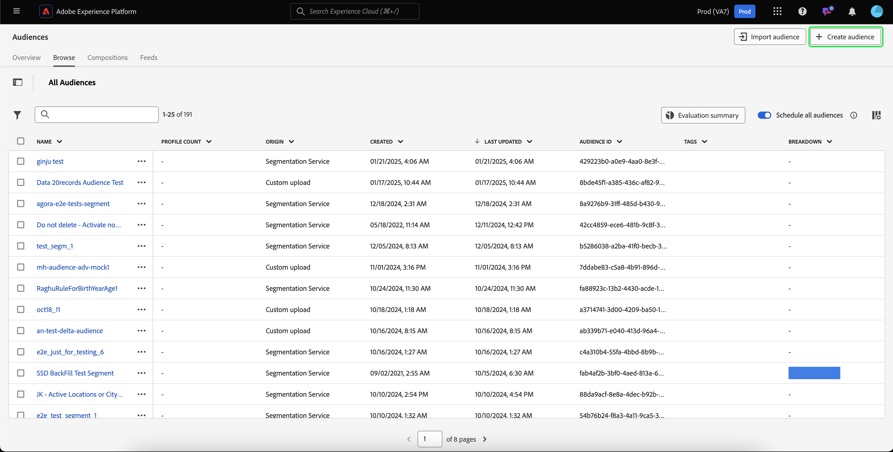
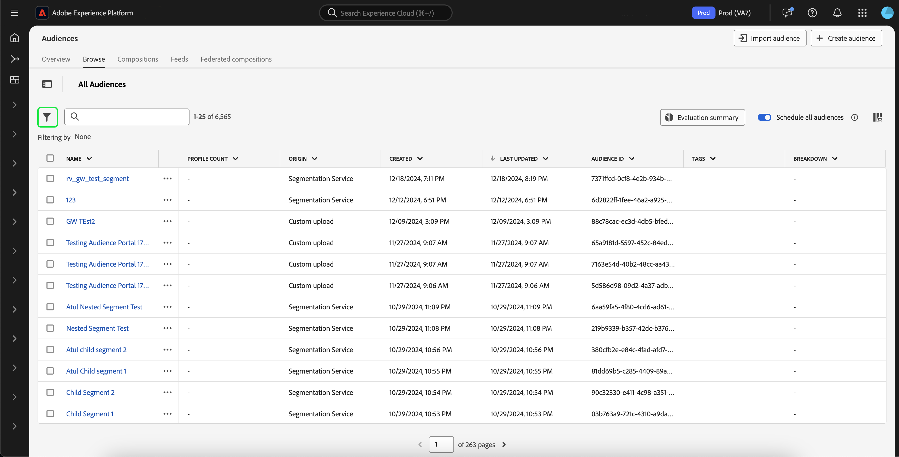

# Handbuch zur Edge-Segmentierung

Bei der Segmentierung in Edge werden Segmentdefinitionen in Adobe Experience Platform sofort ([ Edge) ausgewertet](../../landing/edge-and-hub-comparison.md) was Anwendungsfälle für die Personalisierung derselben Seite und der nächsten Seite ermöglicht.

>[!IMPORTANT]
>
> Die Edge-Daten werden an einem Edge-Server-Speicherort gespeichert, der am nächsten zu dem Ort liegt, an dem sie erfasst wurden. Diese Daten können auch an einem anderen als dem als Hub (oder Prinzipal) für das Adobe Experience Platform-Rechenzentrum festgelegten Speicherort gespeichert werden.
>
> Außerdem wird die Edge-Segmentierungs-Engine nur Edge-Anfragen berücksichtigen, wenn **eine** primär markierte Identität vorhanden ist, was im Einklang mit nicht-Edge-basierten primären Identitäten steht.

## Abfragetypen für Edge-Segmentierungen {#query-types}

Eine Abfrage kann mithilfe der Edge-Segmentierung ausgewertet werden, wenn sie eines der in der folgenden Tabelle aufgeführten Kriterien erfüllt.

>[!NOTE]
>
>Wenn die Abfrage einem der Abfragetypen in der folgenden Tabelle entspricht, wird sie automatisch mithilfe der Edge-Segmentierung ausgewertet. Das System bestimmt diese Fähigkeit automatisch anhand des Abfrageausdrucks.
>
>Wenn die Zielgruppe **nur** Profilattribute enthält, wird sie außerdem täglich ausgewertet. Wenn Ihre Zielgruppe in Echtzeit ausgewertet werden soll, müssen Sie Ihrer Zielgruppe Ereignisdaten hinzufügen.

| Abfragetyp | Details | Abfrage | Beispiel |
| ---------- | ------- | ----- | ------- |
| Einzelnes Ereignis innerhalb eines Zeitfensters von weniger als 24 Stunden | Jede Segmentdefinition, die innerhalb eines Zeitfensters von weniger als 24 Stunden auf ein einzelnes eingehendes Ereignis verweist. | `CHAIN(xEvent, timestamp, [C0: WHAT(eventType.equals("commerce.checkouts", false)) WHEN(today)])` |  |
| Nur Profil | Jede Segmentdefinition, die nur auf ein Profilattribut verweist. | `homeAddress.country.equals("US", false)` |  |
| Einzelnes Ereignis mit einem Profilattribut innerhalb eines relativen Zeitfensters von weniger als 24 Stunden | Jede Segmentdefinition, die auf ein einzelnes eingehendes Ereignis mit einem oder mehreren Profilattributen verweist und innerhalb eines relativen Zeitfensters von weniger als 24 Stunden auftritt. | `workAddress.country.equals("US", false) and CHAIN(xEvent, timestamp, [C0: WHAT(eventType.equals("commerce.checkouts", false)) WHEN(today)])` |  |
| Segment von Segmenten | Jede Segmentdefinition, die ein oder mehrere Batch- oder Edge-Segmente enthält. **Hinweis**: Wenn ein Segment von Segmenten verwendet wird, erfolgt **alle 24 Stunden** eine Profildisqualifizierung. | `inSegment("a730ed3f-119c-415b-a4ac-27c396ae2dff") and inSegment("8fbbe169-2da6-4c9d-a332-b6a6ecf559b9")` |  |

Darüber hinaus **die Segmentdefinition (**) an eine Zusammenführungsrichtlinie gebunden sein, die im Randbereich aktiv ist. Weitere Informationen zu Zusammenführungsrichtlinien finden Sie im [Handbuch zu Zusammenführungsrichtlinien](../../profile/api/merge-policies.md).

Eine Segmentdefinition ist **nicht** für die Edge-Segmentierung im folgenden Szenario geeignet:

- Die Segmentdefinition umfasst eine Kombination aus einem einzelnen Ereignis und einem `inSegment`-Ereignis.
   - Wenn die im Ereignis `inSegment` enthaltene Segmentdefinition jedoch nur ein Profil ist, **wird** die Segmentdefinition für die Edge-Segmentierung aktiviert.
- Die Segmentdefinition verwendet „Jahr ignorieren“ als Teil ihrer Zeitbeschränkungen.

## Zielgruppe erstellen {#create-audience}

Sie können eine Zielgruppe erstellen, die mithilfe der Edge-Segmentierung entweder mithilfe der Segmentierungs-Service-API oder über das Zielgruppenportal in der Benutzeroberfläche ausgewertet wird.

Eine Segmentdefinition kann Edge-aktiviert werden, wenn sie mit einem der ([ Abfragetypen) ](#eligible-query-types).

>[!BEGINTABS]

>[!TAB Segmentation Service-API]

**API-Format**

```http
POST /segment/definitions
```

**Anfrage**

+++ Eine Beispielanfrage zum Erstellen einer Segmentdefinition, die für die Edge-Segmentierung aktiviert ist

```shell
curl -X POST https://platform.adobe.io/data/core/ups/segment/definitions
 -H 'Authorization: Bearer {ACCESS_TOKEN}' \
 -H 'Content-Type: application/json' \
 -H 'x-gw-ims-org-id: {ORG_ID}' \
 -H 'x-api-key: {API_KEY}' \
 -H 'x-sandbox-name: {SANDBOX_NAME}'
 -d '{
        "name": "People in the USA",
        "description: "An audience that looks for people who live in the USA",
        "expression": {
            "type": "PQL",
            "format": "pql/text",
            "value": "homeAddress.country = \"US\""
        },
        "evaluationInfo": {
            "batch": {
                "enabled": false
            },
            "continuous": {
                "enabled": false
            },
            "synchronous": {
                "enabled": true
            }
        },
        "schema": {
            "name": "_xdm.context.profile"
        }
     }'
```

+++

**Antwort**

Eine erfolgreiche Antwort gibt den HTTP-Status 200 mit Details zur neu erstellten Segmentdefinition zurück.

+++Eine Beispielantwort beim Erstellen einer Segmentdefinition.

```json
{
    "id": "4afe34ae-8c98-4513-8a1d-67ccaa54bc05",
    "schema": {
        "name": "_xdm.context.profile"
    },
    "profileInstanceId": "ups",
    "imsOrgId": "{ORG_ID}",
    "sandbox": {
        "sandboxId": "28e74200-e3de-11e9-8f5d-7f27416c5f0d",
        "sandboxName": "prod",
        "type": "production",
        "default": true
    },
    "name": "People in the USA",
    "description": "An audience that looks for people who live in the USA",
    "expression": {
        "type": "PQL",
        "format": "pql/text",
        "value": "homeAddress.country = \"US\""
    },
    "evaluationInfo": {
        "batch": {
            "enabled": false
        },
        "continuous": {
            "enabled": false
        },
        "synchronous": {
            "enabled": true
        }
    },
    "dataGovernancePolicy": {
        "excludeOptOut": true
    },
    "creationTime": 0,
    "updateEpoch": 1579292094,
    "updateTime": 1579292094000
}
```

+++

Weitere Informationen zur Verwendung dieses Endpunkts finden Sie im [Handbuch zum Segmentdefinitionenendpunkt](../api/segment-definitions.md).

>[!TAB Zielgruppenportal]

Wählen Sie in Audience Portal **[!UICONTROL Zielgruppe erstellen]** aus.



Ein Popup wird angezeigt. Wählen Sie **[!UICONTROL Regeln erstellen]**, um in Segment Builder zu gelangen.


Erstellen Sie in Segment Builder eine Segmentdefinition, die einem der ([ Abfragetypen) ](#eligible-query-types). Wenn die Segmentdefinition für die Edge-Segmentierung geeignet ist, können Sie **[!UICONTROL Edge]** als **[!UICONTROL Auswertungsmethode]** auswählen.


Weitere Informationen zum Erstellen von Segmentdefinitionen finden Sie im [Segment Builder-Handbuch](../ui/segment-builder.md)

>[!ENDTABS]

## Abrufen von mithilfe der Edge-Segmentierung evaluierten Zielgruppen {#retrieve-audiences}

Sie können alle Zielgruppen abrufen, die mithilfe der Edge-Segmentierung ausgewertet werden, indem Sie entweder die Segmentierungs-Service-API oder das Zielgruppenportal in der Benutzeroberfläche verwenden.

>[!BEGINTABS]

>[!TAB Segmentation Service-API]

Rufen Sie eine Liste aller Segmentdefinitionen ab, die mithilfe der Edge-Segmentierung in Ihrer Organisation ausgewertet werden, indem Sie eine GET-Anfrage an den `/segment/definitions`-Endpunkt stellen.

**API-Format**

Sie müssen den Abfrageparameter `evaluationInfo.synchronous.enabled=true` in den Anfragepfad aufnehmen, um Segmentdefinitionen abzurufen, die mithilfe der Edge-Segmentierung ausgewertet wurden.

```http
GET /segment/definitions?evaluationInfo.synchronous.enabled=true
```

**Anfrage**

+++ Eine Beispielanfrage zum Auflisten aller Edge-aktivierten Segmentdefinitionen

```shell
curl -X GET \
  'https://platform.adobe.io/data/core/ups/segment/definitions?evaluationInfo.synchronous.enabled=true' \
  -H 'Authorization: Bearer {ACCESS_TOKEN}' \
  -H 'x-api-key: {API_KEY}' \
  -H 'x-gw-ims-org-id: {ORG_ID}' \
  -H 'x-sandbox-name: {SANDBOX_NAME}'
```

+++

**Antwort**

Bei einer erfolgreichen Antwort wird der HTTP-Status 200 mit einem Array von Segmentdefinitionen in Ihrer Organisation zurückgegeben, die für die Edge-Segmentierung aktiviert sind.

+++ Eine Beispielantwort, die eine Liste aller Segmentdefinitionen enthält, für die die Edge-Segmentierung in Ihrer Organisation aktiviert ist

```json
{
    "segments": [
        {
            "id": "15063cb-2da8-4851-a2e2-bf59ddd2f004",
            "schema": {
                "name": "_xdm.context.profile"
            },
            "imsOrgId": "{ORG_ID}",
            "sandbox": {
                "sandboxId": "",
                "sandboxName": "",
                "type": "production",
                "default": true
            },
            "name": " People who are NOT on their homepage ",
            "expression": {
                "type": "PQL",
                "format": "pql/text",
                "value": "select var1 from xEvent where var1._experience.analytics.endUser.firstWeb.webPageDetails.isHomePage = false"
            },
            "evaluationInfo": {
                "batch": {
                    "enabled": false
                },
                "continuous": {
                    "enabled": false
                },
                "synchronous": {
                    "enabled": true
                }
            },
            "creationTime": 1572029711000,
            "updateEpoch": 1572029712000,
            "updateTime": 1572029712000
        },
        {
            "id": "f15063cb-2da8-4851-a2e2-bf59ddd2f004",
            "schema": {
                "name": "_xdm.context.profile"
            },
            "imsOrgId": "{ORG_ID}",
            "sandbox": {
                "sandboxId": "",
                "sandboxName": "",
                "type": "production",
                "default": true
            },
            "name": "Homepage_continuous",
            "description": "People who are on their homepage - continuous",
            "expression": {
                "type": "PQL",
                "format": "pql/text",
                "value": "select var1 from xEvent where var1._experience.analytics.endUser.firstWeb.webPageDetails.isHomePage = true"
            },
            "evaluationInfo": {
                "batch": {
                    "enabled": false
                },
                "continuous": {
                    "enabled": false
                },
                "synchronous": {
                    "enabled": true
                }
            },
            "creationTime": 1572021085000,
            "updateEpoch": 1572021086000,
            "updateTime": 1572021086000
        }
    ],
    "page": {
        "totalCount": 2,
        "totalPages": 1,
        "sortField": "creationTime",
        "sort": "desc",
        "pageSize": 2,
        "limit": 100
    },
    "link": {}
}
```

Detailliertere Informationen zur zurückgegebenen Segmentdefinition finden Sie im [Handbuch zum Segmentdefinitionenendpunkt](../api/segment-definitions.md).

+++

>[!TAB Zielgruppenportal]

Sie können alle Zielgruppen abrufen, die für die Edge-Segmentierung in Ihrer Organisation aktiviert sind, indem Sie in Audience Portal Filter verwenden. Wählen Sie das  aus, um die Liste der Filter anzuzeigen.



Gehen Sie in den verfügbaren Filtern zu **Aktualisierungshäufigkeit** und wählen Sie &quot;Edge&quot; aus. Mit diesem Filter werden alle Zielgruppen in Ihrer Organisation angezeigt, die mithilfe der Edge-Segmentierung ausgewertet werden.


Weitere Informationen zum Anzeigen von Zielgruppen in Experience Platform finden Sie im [Handbuch für Zielgruppenportale](../ui/audience-portal.md).

>[!ENDTABS]

## Zielgruppendetails {#audience-details}

Sie können Details zu einer bestimmten Zielgruppe anzeigen, die mithilfe der Edge-Segmentierung ausgewertet wurde, indem Sie sie im Zielgruppen-Portal auswählen.

Nach Auswahl einer Zielgruppe in Audience Portal wird die Seite mit den Zielgruppendetails angezeigt. Dadurch werden Informationen zur Zielgruppe angezeigt, einschließlich einer Zusammenfassung der Zielgruppendetails, der Anzahl der qualifizierten Profile im Zeitverlauf sowie der Ziele, für die die Zielgruppe aktiviert wurde.


Bei Edge-aktivierten Zielgruppen wird die Karte **[!UICONTROL Profile im Zeitverlauf]** angezeigt, die die insgesamt qualifizierten und die neuen aktualisierten Metriken der Zielgruppe anzeigt.

Die **[!UICONTROL Gesamtzahl der Qualifizierten]** stellt die Gesamtzahl der qualifizierten Zielgruppen dar, die auf Edge-Auswertungen für diese Zielgruppe basieren.

Die Metrik **[!UICONTROL Neue Zielgruppe aktualisiert]** wird durch ein Liniendiagramm dargestellt, das die Änderung der Zielgruppengröße durch die Edge-Segmentierung anzeigt. Sie können das Dropdown-Menü so anpassen, dass die letzten 24 Stunden, die letzte Woche oder die letzten 30 Tage angezeigt werden.


Weitere Informationen zu Zielgruppendetails finden Sie im Abschnitt [Zielgruppenportal - Übersicht](../ui/audience-portal.md#audience-details).

## Nächste Schritte

In diesem Handbuch wird erläutert, was eine Edge-Segmentierung ist und wie Sie eine Segmentdefinition erstellen, die mithilfe der Edge-Segmentierung in Adobe Experience Platform ausgewertet werden kann.

Weitere Informationen zur Verwendung der Benutzeroberfläche von Experience Platform finden Sie im [Segmentierungs-Benutzerhandbuch](./overview.md).

Häufig gestellte Fragen zur Edge-Segmentierung finden Sie [ Abschnitt „Edge-Segmentierung“ der häufig gestellten Fragen](../faq.md#edge-segmentation).

