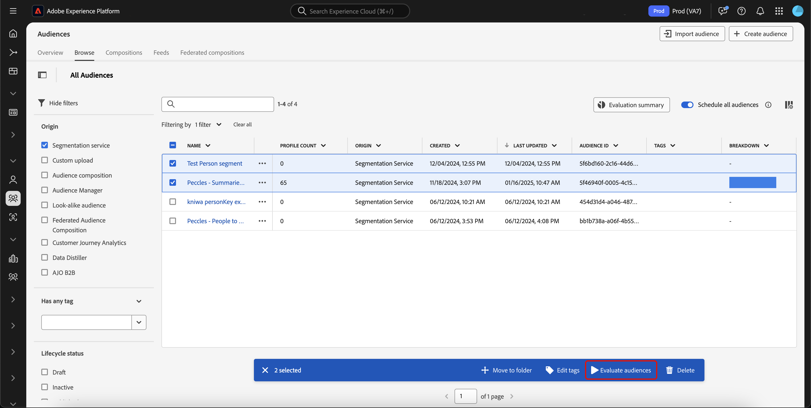

# Handbuch zur flexiblen Zielgruppenbewertung

>[!AVAILABILITY]
>
>Eine flexible Zielgruppenauswertung ist **nur** Instanzen von Experience Platform verfügbar, die auf [!DNL Microsoft Azure] ausgeführt werden. Weitere Informationen zur unterstützten Experience Platform-Infrastruktur finden Sie in der Übersicht zur [Experience Platform Multi-Cloud](../../landing/multi-cloud.md).
>
>Darüber hinaus ist eine flexible Zielgruppenauswertung **nur** für die Verwendung mit Real-Time CDP B2C Edition verfügbar.

Mit der flexiblen Zielgruppenauswertung können Sie bei Bedarf einen Batch-Segmentierungsauftrag ausführen. Mit einer flexiblen Zielgruppenauswertung können Sie Ad-hoc-Kampagnenstarts, Just-in-time-Nachrichten oder andere zeitkritische Aktivitäten ausführen.

## Leitlinien {#guardrails}

>[!CONTEXTUALHELP]
>id="platform_segmentation_browse_flexibleaudienceevaluation"
>title="Flexible Begrenzungen für Zielgruppenbewertung"
>abstract="Sie können bis zu 20 Zielgruppen in einem einzigen flexiblen Auswertungsdurchlauf auswerten.<br/><br/>Während der Auswertungsauftrag so schnell wie möglich ausgeführt wird, kann es außerdem zu Systemverzögerungen kommen, da On-Demand-Auswertungen <b>nicht</b> gleichzeitig mit einer anderen On-Demand- oder Batch-Auswertung ausgeführt werden können."

Beachten Sie bei der Ausführung der flexiblen Zielgruppenauswertung die folgenden Bedingungen:

- Sie können nur eine flexible Zielgruppenauswertung (zweimal **** pro Tag und Sandbox verwenden. Diese Beschränkung wird um Mitternacht (UTC) zurückgesetzt.
- Sie haben **maximal** 50 flexible Zielgruppenauswertungsdurchgänge pro Jahr **Produktions-/**.
- Sie haben **maximal** 100 flexible Zielgruppenauswertungsdurchgänge pro Jahr **Entwicklungs**-Sandbox.
- Alle Zielgruppen **müssen** haben den Ursprung „Segmentierungs-Service“.
- Alle Zielgruppen **müssen** mithilfe der Batch-Segmentierung ausgewertet werden.
- Alle Zielgruppen **müssen** personenbasierte Zielgruppen sein.
- Pro flexibler Zielgruppenauswertungsausführung können nur maximal 20 Zielgruppen ausgewählt werden.

>[!NOTE]
>
>Sie können zusätzliche flexible Auswertungsläufe für Zielgruppen pro Jahr erwerben. Weitere Informationen erhalten Sie bei der Adobe-Kundenunterstützung.

## Zugriff {#access}

Um eine flexible Zielgruppenbewertung verwenden zu können, müssen Sie über die folgende Berechtigung verfügen:

- **[!UICONTROL Auswerten des Segments für eine Zielgruppe]** im Abschnitt **[!DNL Profile Management]**.

Weitere Informationen zur rollenbasierten Zugriffssteuerung finden Sie unter [Zugriffssteuerung - Übersicht](../../access-control/home.md).

## Ausführen einer flexiblen Zielgruppenauswertung

Sie können eine flexible Zielgruppenbewertung ausführen, indem Sie entweder die Experience Platform-APIs oder die Benutzeroberfläche verwenden.

>[!BEGINTABS]

>[!TAB Experience Platform-APIs]

Um eine flexible Zielgruppenauswertung innerhalb der Experience Platform-APIs durchzuführen, müssen Sie einen Segmentauftrag erstellen, der die IDs aller Segmentdefinitionen (Zielgruppen) enthält, die Sie auswerten möchten.

>[!NOTE]
>
>Sie können nur eine **maximal** von 20 Segmentdefinitions-IDs pro Segmentauftrags-API-Aufruf hinzufügen.

Sie können einen neuen Segmentauftrag erstellen, indem Sie eine POST-Anfrage an den `/segment/jobs`-Endpunkt senden und die IDs der Segmentdefinitionen in den Anfragetext aufnehmen.

+++Beispielanfrage zum Erstellen eines neuen Segmentauftrags

```shell
curl -X POST https://platform.adobe.io/data/core/ups/segment/jobs \
 -H 'Authorization: Bearer {ACCESS_TOKEN}' \
 -H 'Content-Type: application/json' \
 -H 'x-gw-ims-org-id: {ORG_ID}' \
 -H 'x-api-key: {API_KEY}' \
 -H 'x-sandbox-name: {SANDBOX_NAME}' \
 -d '[
    {
        "segmentId": "7863c010-e092-41c8-ae5e-9e533186752e"
    },
    {
        "segmentId": "07d39471-05d1-4083-a310-d96978fd7c85"
    }
 ]'
```

| Eigenschaft | Beschreibung |
| -------- | ----------- |
| `segmentId` | Die ID der Segmentdefinition, die Sie auswerten möchten. Diese Segmentdefinitionen können zu verschiedenen Zusammenführungsrichtlinien gehören. |

+++

Bei einer erfolgreichen Antwort wird der HTTP-Status 200 mit Informationen zu Ihrem neu erstellten Segmentauftrag zurückgegeben.

+++ Eine Beispielantwort beim Erstellen eines neuen Segmentauftrags.

```json
{
    "id": "b31aed3d-b3b1-4613-98c6-7d3846e8d48f",
    "imsOrgId": "{ORG_ID}",
    "sandbox": {
        "sandboxId": "28e74200-e3de-11e9-8f5d-7f27416c5f0d",
        "sandboxName": "prod",
        "type": "production",
        "default": true
    },
    "profileInstanceId": "ups",
    "source": "api",
    "status": "PROCESSING",
    "batchId": "678f53bc-e21d-4c47-a7ec-5ad0064f8e4c",
    "computeJobId": 8811,
    "computeGatewayJobId": "9ea97b25-a0f5-410e-ae87-b2d85e58f399",
    "segments": [
        {
            "segmentId": "7863c010-e092-41c8-ae5e-9e533186752e",
            "segment": {
                "id": "7863c010-e092-41c8-ae5e-9e533186752e",
                "expression": {
                    "type": "PQL",
                    "format": "pql/json",
                    "value": "workAddress.country = \"US\""
                },
                "mergePolicyId": "25c548a0-ca7f-4dcd-81d5-997642f178b9",
                "mergePolicy": {
                    "id": "25c548a0-ca7f-4dcd-81d5-997642f178b9",
                    "version": 1
                }
            }
        },
        {
            "segmentId": "07d39471-05d1-4083-a310-d96978fd7c85",
            "segment": {
                "id": "07d39471-05d1-4083-a310-d96978fd7c85",
                "expression": {
                    "type": "PQL",
                    "format": "pql/json",
                    "value": "workAddress.country = \"US\""
                },
                "mergePolicyId": "25c548a0-ca7f-4dcd-81d5-997642f178b9",
                "mergePolicy": {
                    "id": "25c548a0-ca7f-4dcd-81d5-997642f178b9",
                    "version": 1
                }
            }
        }
    ],
    "metrics": {
        "totalTime": {
            "startTimeInMs": 1573203617195,
            "endTimeInMs": 1573204395655,
            "totalTimeInMs": 778460
        },
        "profileSegmentationTime": {
            "startTimeInMs": 1573204266727,
            "endTimeInMs": 1573204395655,
            "totalTimeInMs": 128928
        },
        "segmentedProfileCounter":{
            "7863c010-e092-41c8-ae5e-9e533186752e":1033
        },
        "segmentedProfileByNamespaceCounter":{
            "7863c010-e092-41c8-ae5e-9e533186752e":{
                "tenantiduserobjid":1033,
                "campaign_profile_mscom_mkt_prod2":1033
            }
        },
        "segmentedProfileByStatusCounter":{
            "7863c010-e092-41c8-ae5e-9e533186752e":{
                "exited":144646,
                "realized":2056
            }
        },
        "totalProfiles":13146432,
        "totalProfilesByMergePolicy":{
            "25c548a0-ca7f-4dcd-81d5-997642f178b9":13146432
        }
    },
    "requestId": "4e538382-dbd8-449e-988a-4ac639ebe72b-1573203600264",
    "schema": {
        "name": "_xdm.context.profile"
    },
    "properties": {
        "scheduleId": "4e538382-dbd8-449e-988a-4ac639ebe72b",
        "runId": "e6c1308d-0d4b-4246-b2eb-43697b50a149"
    },
    "_links": {
        "cancel": {
            "href": "/segment/jobs/b31aed3d-b3b1-4613-98c6-7d3846e8d48f",
            "method": "DELETE"
        },
        "checkStatus": {
            "href": "/segment/jobs/b31aed3d-b3b1-4613-98c6-7d3846e8d48f",
            "method": "GET"
        }
    },
    "updateTime": 1573204395000,
    "creationTime": 1573203600535,
    "updateEpoch": 1573204395
}
```

+++

Nachdem Sie den Segmentauftrag erstellt haben, können Sie den Status überprüfen, indem Sie eine GET-Anfrage an den `/segment/jobs`-Endpunkt stellen, wobei Sie die ID Ihres neu erstellten Segmentauftrags im Anfragepfad angeben.

+++Beispielanfrage zum Abrufen eines Segmentauftrags

```shell
curl -X GET https://platform.adobe.io/data/core/ups/segment/jobs/b31aed3d-b3b1-4613-98c6-7d3846e8d48f \
 -H 'Authorization: Bearer {ACCESS_TOKEN}' \
 -H 'x-gw-ims-org-id: {ORG_ID}' \
 -H 'x-api-key: {API_KEY}' \
 -H 'x-sandbox-name: {SANDBOX_NAME}'
```

+++

Eine erfolgreiche Antwort gibt den HTTP-Status 200 mit genauen Informationen zum angegebenen Segmentauftrag zurück.


+++ Eine Beispielantwort zum Abrufen eines Segmentauftrags.

```json
{
    "id": "b31aed3d-b3b1-4613-98c6-7d3846e8d48f",
    "imsOrgId": "{ORG_ID}",
    "sandbox": {
        "sandboxId": "28e74200-e3de-11e9-8f5d-7f27416c5f0d",
        "sandboxName": "prod",
        "type": "production",
        "default": true
    },
    "profileInstanceId": "ups",
    "source": "api",
    "status": "SUCCEEDED",
    "batchId": "678f53bc-e21d-4c47-a7ec-5ad0064f8e4c",
    "computeJobId": 8811,
    "computeGatewayJobId": "9ea97b25-a0f5-410e-ae87-b2d85e58f399",
    "segments": [
        {
            "segmentId": "7863c010-e092-41c8-ae5e-9e533186752e",
            "segment": {
                "id": "7863c010-e092-41c8-ae5e-9e533186752e",
                "expression": {
                    "type": "PQL",
                    "format": "pql/text",
                    "value": "workAddress.country = \"US\""
                },
                "mergePolicyId": "25c548a0-ca7f-4dcd-81d5-997642f178b9",
                "mergePolicy": {
                    "id": "25c548a0-ca7f-4dcd-81d5-997642f178b9",
                    "version": 1
                }
            }
        },
        {
            "segmentId": "07d39471-05d1-4083-a310-d96978fd7c85",
            "segment": {
                "id": "07d39471-05d1-4083-a310-d96978fd7c85",
                "expression": {
                    "type": "PQL",
                    "format": "pql/json",
                    "value": "workAddress.country = \"US\""
                },
                "mergePolicyId": "25c548a0-ca7f-4dcd-81d5-997642f178b9",
                "mergePolicy": {
                    "id": "25c548a0-ca7f-4dcd-81d5-997642f178b9",
                    "version": 1
                }
            }
        }
    ],
    "metrics": {
        "totalTime": {
            "startTimeInMs": 1579304313411
        },
        "profileSegmentationTime": {}
    },
    "requestId": "4e538382-dbd8-449e-988a-4ac639ebe72b-1573203600264",
    "schema": {
        "name": "_xdm.context.profile"
    },
    "_links": {
        "cancel": {
            "href": "/segment/jobs/d3b4a50d-dfea-43eb-9fca-557ea53771fd",
            "method": "DELETE"
        },
        "checkStatus": {
            "href": "/segment/jobs/d3b4a50d-dfea-43eb-9fca-557ea53771fd",
            "method": "GET"
        }
    },
    "updateTime": 1579304339000,
    "creationTime": 1579304260897,
    "updateEpoch": 1579304339
}
```

+++

>[!TAB Experience Platform-Benutzeroberfläche]

Um in der Experience Platform-Benutzeroberfläche eine flexible Zielgruppenbewertung auszuführen, wählen Sie **[!UICONTROL Zielgruppen]** im Abschnitt **[!UICONTROL Kunden]** aus.


Das Zielgruppen-Portal wird mit einer Liste aller Personen und Zielgruppen für die Organisation angezeigt. In Audience Portal können Sie die Zielgruppen auswählen, die ausgewertet werden sollen, und **[!UICONTROL Zielgruppe auswerten]**.



Das Pop **[!UICONTROL up „Zielgruppen bei]** auswerten“ wird angezeigt und zeigt die Liste der Zielgruppen an, die mit dem On-Demand-Segmentauftrag ausgewertet werden. Wenn eine Zielgruppe nicht für die On-Demand-Auswertung geeignet ist, wird sie automatisch aus dem Auswertungsauftrag entfernt. Bestätigen Sie, dass die aufgelisteten Zielgruppen diejenigen sind, die ausgewertet werden sollen.


Nachdem Sie bestätigt haben, dass die richtigen Zielgruppen aufgelistet sind, können Sie mit der Anfrage fortfahren, und die flexible Zielgruppenbewertung wird gestartet. Sie können den Status dieser Zielgruppenauswertung in der Ansicht [Überwachung von Auswertungsaufträgen“ ](../../dataflows/ui/monitor-audiences.md#evaluation-job-details).

>[!NOTE]
>
>Der Status des Segmentauftrags kann im Monitoring-Dashboard als „In Warteschlange“ gemeldet werden. Sie können den aktuellen Status des Segmentauftrags anzeigen, indem Sie eine GET-Anfrage an den `/segment/jobs`-Endpunkt senden und im Anfragepfad die ID des Segmentauftrags angeben. Weitere Informationen zur Verwendung dieses Endpunkts finden Sie auf der Registerkarte API .
>
>Wenn Sie eine flexible Zielgruppenbewertung ausführen und möchten, dass die Auswertung die Zielgruppe für ein Ziel aktiviert, müssen Sie sicherstellen, dass die Häufigkeit auf „Nach **[!UICONTROL Segmentbewertung“]** ist. Bei der Ausführung einer flexiblen Zielgruppenauswertung für Zielgruppen, für die bereits eine Aktivierung festgelegt ist [nach der Segmentevaluierung](../../destinations/ui/activate-batch-profile-destinations.md#export-full-files), werden Zielgruppen unabhängig von vorherigen täglichen Aktivierungsvorgängen sofort nach Abschluss des flexiblen Zielgruppenauswertungsauftrags aktiviert.

>[!ENDTABS]

## Video {#video}

Das folgende Video zeigt, wie Sie in Experience Platform auf eine flexible Zielgruppenbewertung zugreifen und diese verwenden können.

>[!VIDEO](https://video.tv.adobe.com/v/3453640?)

## Häufig gestellte Fragen {#faq}

Im folgenden Abschnitt finden Sie häufig gestellte Fragen zur flexiblen Zielgruppenbewertung.

### Wie schnell kann ich eine Zielgruppe mithilfe einer flexiblen Zielgruppenauswertung aktivieren?

+++ Antwort

Sie können eine Zielgruppe sofort nach ihrer Erstellung mit einer flexiblen Zielgruppenauswertung aktivieren.

+++

### Kann ich die Planung mit flexibler Zielgruppenbewertung ausführen?

+++ Antwort

Nein, es ist keine Zeitplanung für die Verwendung mit einer flexiblen Zielgruppenauswertung verfügbar.

+++

### Muss ich bei Verwendung der flexiblen Zielgruppenauswertung einen zusätzlichen Exportvorgang ausführen?

+++ Antwort

Nein, der Exportvorgang wird automatisch ausgeführt, nachdem der entsprechende Segmentvorgang abgeschlossen wurde.

+++

### Welche Services kann ich für Audiences verwenden, die mit einer flexiblen Zielgruppenbewertung ausgewertet wurden?

+++ Antwort

Sie können Zielgruppen in allen nachgelagerten -Services verwenden, einschließlich Zielen und Adobe Journey Optimizer-Journey.

+++

### Wann werden die Grenzwerte für die flexible Zielgruppenbewertung zurückgesetzt?

+++ Antwort

Das Tageslimit wird um Mitternacht (UTC) zurückgesetzt. Das jährliche Limit wird am Jahrestag Ihres Vertrags zurückgesetzt.

+++

### Welche Arten von Zielgruppen werden mit einer flexiblen Zielgruppenauswertung unterstützt?

+++ Antwort

Für die flexible Zielgruppenbewertung werden nur Zielgruppen mit der Herkunft des Segmentierungs-Service unterstützt. Andere Zielgruppen wie Kompositionen, benutzerdefinierter Upload oder Data Distiller werden für die flexible Zielgruppenbewertung nicht unterstützt.

+++

### Welche Durchgänge tragen zu meiner flexiblen Anzahl von Durchgängen zur Zielgruppenbewertung bei?

+++ Antwort

Flexible Ausführungen zur Zielgruppenauswertung, die entweder mit der API oder der Benutzeroberfläche erstellt wurden, zählen bis zum maximalen Limit. Der tägliche Batch-Segmentierungsauftrag, der nächtlich ausgeführt wird, trägt jedoch **nicht** zu diesem Limit bei.

+++

