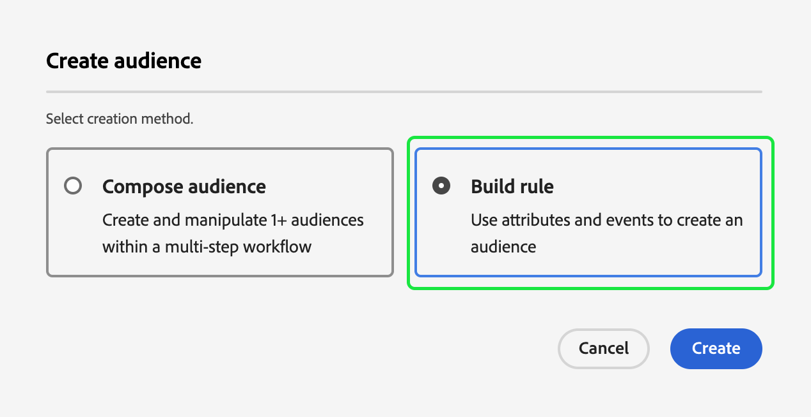
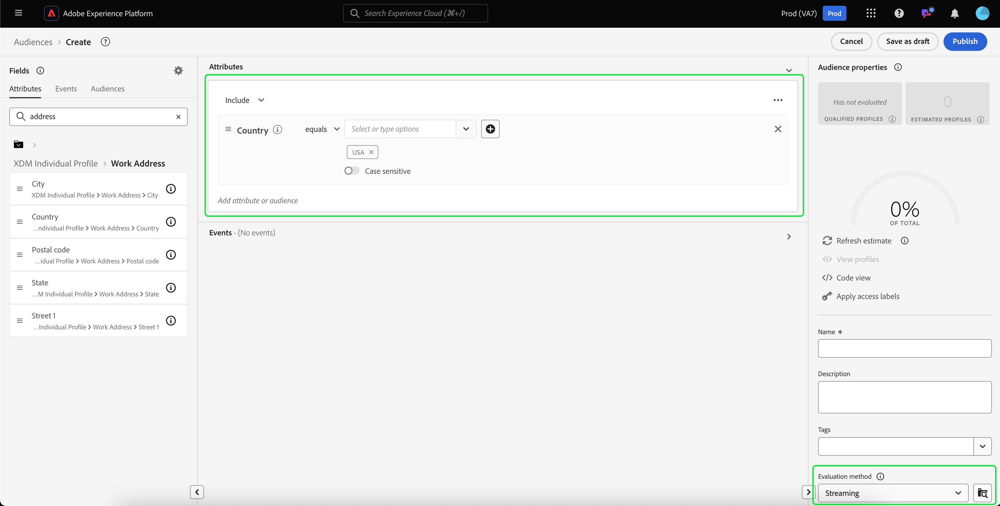

# Handbuch zur Streaming-Segmentierung

Streaming-Segmentierung bedeutet, dass Zielgruppen in Adobe Experience Platform nahezu in Echtzeit ausgewertet werden können, während der Schwerpunkt auf die Relevanz der Daten gelegt wird.

Im Rahmen der Streaming-Segmentierung erfolgt jetzt eine Zielgruppen-Qualifizierung, wenn Streaming-Daten in Experience Platform aufgenommen werden. So wird die Notwendigkeit verringert, Segmentierungsaufträge zu planen und auszuführen. Auf diese Weise können Sie Daten auswerten, während sie an Experience Platform übergeben werden, sodass die Zielgruppenzugehörigkeit automatisch auf dem neuesten Stand gehalten wird.

## Mögliche Abfragetypen {#query-types}

Eine Abfrage kommt für die Streaming-Segmentierung in Frage, wenn sie eines der in der folgenden Tabelle aufgeführten Kriterien erfüllt.

>[!NOTE]
>
>Damit die Streaming-Segmentierung funktioniert, müssen Sie die geplante Segmentierung für die Organisation aktivieren. Weitere Informationen zur Aktivierung der geplanten Segmentierung finden Sie unter [Zielgruppenportal - Übersicht](../ui/audience-portal.md#scheduled-segmentation).

| Abfragetyp | Details | Abfrage | Beispiel |
| ---------- | ------- | ----- | ------- |
| Einzelnes Ereignis innerhalb eines Zeitfensters von weniger als 24 Stunden | Jede Segmentdefinition, die innerhalb eines Zeitfensters von weniger als 24 Stunden auf ein einzelnes eingehendes Ereignis verweist. | `CHAIN(xEvent, timestamp, [C0: WHAT(eventType.equals("commerce.checkouts", false)) WHEN(today)])` |  |
| Nur Profil | Jede Segmentdefinition, die nur auf ein Profilattribut verweist. | `homeAddress.country.equals("US", false)` |  |
| Einzelnes Ereignis mit einem Profilattribut innerhalb eines relativen Zeitfensters von weniger als 24 Stunden | Jede Segmentdefinition, die auf ein einzelnes eingehendes Ereignis mit einem oder mehreren Profilattributen verweist und innerhalb eines relativen Zeitfensters von weniger als 24 Stunden auftritt. | `workAddress.country.equals("US", false) and CHAIN(xEvent, timestamp, [C0: WHAT(eventType.equals("commerce.checkouts", false)) WHEN(today)])` |  |
| Segment von Segmenten | Jede Segmentdefinition, die ein oder mehrere Batch- oder Streaming-Segmente enthält. **Hinweis**: Wenn ein Segment von Segmenten verwendet wird, erfolgt **alle 24 Stunden** eine Profildisqualifizierung. | `inSegment("a730ed3f-119c-415b-a4ac-27c396ae2dff") and inSegment("8fbbe169-2da6-4c9d-a332-b6a6ecf559b9")` |  |
| Mehrere Ereignisse mit einem Profilattribut | Jede Segmentdefinition, die **innerhalb der letzten 24 Stunden** auf mehrere Ereignisse verweist und (optional) ein oder mehrere Profilattribute hat. | `workAddress.country.equals("US", false) and CHAIN(xEvent, timestamp, [C0: WHAT(eventType.equals("directMarketing.emailClicked", false)) WHEN(today), C1: WHAT(eventType.equals("commerce.checkouts", false)) WHEN(today)])` |  |

Eine Segmentdefinition ist **nicht** für die Streaming-Segmentierung in den folgenden Szenarien geeignet:

- Die Segmentdefinition umfasst Segmente oder Merkmale aus Adobe Audience Manager (AAM).
- Die Segmentdefinition umfasst mehrere Entitäten (Abfragen mit mehreren Entitäten).
- Die Segmentdefinition umfasst eine Kombination aus einem einzelnen Ereignis und einem `inSegment`-Ereignis.
   - Wenn die im `inSegment`-Ereignis enthaltene Segmentdefinition jedoch nur ein Profil ist, wird die Segmentdefinition für die Streaming-Segmentierung **aktiviert**.
- Die Segmentdefinition verwendet „Jahr ignorieren“ als Teil ihrer Zeitbeschränkungen.

Beachten Sie die folgenden Richtlinien, die für Streaming-Segmentierungsabfragen gelten:

| Abfragetyp | Richtlinie |
| ---------- | -------- |
| Einzelereignisabfrage | Das Lookback-Fenster ist nicht beschränkt. |
| Abfrage mit Ereignisverlauf | <ul><li>Das Lookback-Fenster ist auf **einen Tag** beschränkt.</li><li>Es **muss** eine strikte Bedingung für die zeitliche Reihenfolge zwischen den Ereignissen vorhanden sein.</li><li>Abfragen mit mindestens einem negierten Ereignis werden unterstützt. Das gesamte Ereignis kann jedoch **keine** Negation sein.</li></ul> |

Wenn eine Segmentdefinition geändert wird, sodass sie die Kriterien für die Streaming-Segmentierung nicht mehr erfüllt, wird die Segmentdefinition automatisch von „Streaming“ zu „Batch“ geändert.

Darüber hinaus erfolgt die Aufhebung der Segmentqualifikation, ähnlich wie die Segmentqualifikation selbst, in Echtzeit. Wenn sich eine Zielgruppe nicht mehr für ein Segment qualifiziert, wird deren Qualifikation daher sofort aufgehoben. Wenn in der Segmentdefinition beispielsweise nach „Alle Benutzenden, die in den letzten drei Stunden rote Schuhe gekauft haben“ gefragt wird, wird die Qualifikation nach drei Stunden für alle Profile, die sich ursprünglich für die Segmentdefinition qualifiziert haben, aufgehoben.

## Zielgruppe erstellen {#create-audience}

Sie können eine Zielgruppe erstellen, die mithilfe der Streaming-Segmentierung ausgewertet wird, entweder mithilfe der Segmentierungs-Service-API oder über das Zielgruppenportal in der Benutzeroberfläche.

Eine Segmentdefinition kann für Streaming aktiviert werden, wenn sie mit einem der [ Abfragetypen übereinstimmt](#eligible-query-types).

>[!BEGINTABS]

>[!TAB Segmentation Service-API]

**API-Format**

```http
POST /segment/definitions
```

**Anfrage**

+++ Eine Beispielanfrage zum Erstellen einer Segmentdefinition, die für die Streaming-Segmentierung aktiviert ist

```shell
curl -X POST https://platform.adobe.io/data/core/ups/segment/definitions
 -H 'Authorization: Bearer {ACCESS_TOKEN}' \
 -H 'Content-Type: application/json' \
 -H 'x-gw-ims-org-id: {ORG_ID}' \
 -H 'x-api-key: {API_KEY}' \
 -H 'x-sandbox-name: {SANDBOX_NAME}'
 -d '{
        "name": "People in the USA",
        "description: "An audience that looks for people who live in the USA",
        "expression": {
            "type": "PQL",
            "format": "pql/text",
            "value": "homeAddress.country = \"US\""
        },
        "evaluationInfo": {
            "batch": {
                "enabled": false
            },
            "continuous": {
                "enabled": true
            },
            "synchronous": {
                "enabled": false
            }
        },
        "schema": {
            "name": "_xdm.context.profile"
        }
     }'
```

+++

**Antwort**

Eine erfolgreiche Antwort gibt den HTTP-Status 200 mit Details zur neu erstellten Segmentdefinition zurück.

+++Eine Beispielantwort beim Erstellen einer Segmentdefinition.

```json
{
    "id": "4afe34ae-8c98-4513-8a1d-67ccaa54bc05",
    "schema": {
        "name": "_xdm.context.profile"
    },
    "profileInstanceId": "ups",
    "imsOrgId": "{ORG_ID}",
    "sandbox": {
        "sandboxId": "28e74200-e3de-11e9-8f5d-7f27416c5f0d",
        "sandboxName": "prod",
        "type": "production",
        "default": true
    },
    "name": "People in the USA",
    "description": "An audience that looks for people who live in the USA",
    "expression": {
        "type": "PQL",
        "format": "pql/text",
        "value": "homeAddress.country = \"US\""
    },
    "evaluationInfo": {
        "batch": {
            "enabled": false
        },
        "continuous": {
            "enabled": true
        },
        "synchronous": {
            "enabled": false
        }
    },
    "dataGovernancePolicy": {
        "excludeOptOut": true
    },
    "creationTime": 0,
    "updateEpoch": 1579292094,
    "updateTime": 1579292094000
}
```

+++

Weitere Informationen zur Verwendung dieses Endpunkts finden Sie im [Handbuch zum Segmentdefinitionenendpunkt](../api/segment-definitions.md).

>[!TAB Zielgruppenportal]

Wählen Sie in Audience Portal **[!UICONTROL Zielgruppe erstellen]** aus.


Ein Popup wird angezeigt. Wählen Sie **[!UICONTROL Regeln erstellen]**, um in Segment Builder zu gelangen.



Erstellen Sie in Segment Builder eine Segmentdefinition, die einem der ([ Abfragetypen) ](#eligible-query-types). Wenn die Segmentdefinition für die Streaming-Segmentierung geeignet ist, können Sie &quot;**[!UICONTROL &quot;]** die **[!UICONTROL Auswertungsmethode]** auswählen.



Weitere Informationen zum Erstellen von Segmentdefinitionen finden Sie im [Segment Builder-Handbuch](../ui/segment-builder.md)

>[!ENDTABS]

## Abrufen von Zielgruppen {#retrieve-audiences}

Sie können alle Zielgruppen abrufen, die mithilfe der Streaming-Segmentierung ausgewertet werden, indem Sie entweder die Segmentierungs-Service-API oder das Zielgruppenportal in der Benutzeroberfläche verwenden.

>[!BEGINTABS]

>[!TAB Segmentation Service-API]

Rufen Sie eine Liste aller Segmentdefinitionen ab, die mithilfe der Streaming-Segmentierung in Ihrer Organisation ausgewertet werden, indem Sie eine GET-Anfrage an den `/segment/definitions`-Endpunkt stellen.

**API-Format**

Sie müssen den Abfrageparameter `evaluationInfo.synchronous.enabled=true` in den Anfragepfad aufnehmen, um Segmentdefinitionen abzurufen, die mithilfe der Streaming-Segmentierung bewertet wurden.

```http
GET /segment/definitions?evaluationInfo.continuous.enabled=true
```

**Anfrage**

+++ Eine Beispielanfrage zum Auflisten aller für Streaming aktivierten Segmentdefinitionen

```shell
curl -X GET 'https://platform.adobe.io/data/core/ups/segment/definitions?evaluationInfo.continuous.enabled=true' \
  -H 'Authorization: Bearer {ACCESS_TOKEN}' \
  -H 'Content-Type: application/json' \
  -H 'x-api-key: {API_KEY}' \
  -H 'x-gw-ims-org-id: {ORG_ID}' \
  -H 'x-sandbox-name: {SANDBOX_NAME}'
```

+++

**Antwort**

Bei einer erfolgreichen Antwort wird der HTTP-Status 200 mit einem Array von Segmentdefinitionen in Ihrer Organisation zurückgegeben, die für die Streaming-Segmentierung aktiviert sind.

+++Eine Beispielantwort, die eine Liste aller für Streaming-Segmentierung aktivierten Segmentdefinitionen in Ihrer Organisation enthält

```json
{
    "segments": [
        {
            "id": "15063cb-2da8-4851-a2e2-bf59ddd2f004",
            "schema": {
                "name": "_xdm.context.profile"
            },
            "ttlInDays": 30,
            "imsOrgId": "{ORG_ID}",
            "sandbox": {
                "sandboxId": "",
                "sandboxName": "",
                "type": "production",
                "default": true
            },
            "name": " People who are NOT on their homepage ",
            "expression": {
                "type": "PQL",
                "format": "pql/text",
                "value": "select var1 from xEvent where var1._experience.analytics.endUser.firstWeb.webPageDetails.isHomePage = false"
            },
            "evaluationInfo": {
                "batch": {
                    "enabled": false
                },
                "continuous": {
                    "enabled": true
                },
                "synchronous": {
                    "enabled": false
                }
            },
            "creationTime": 1572029711000,
            "updateEpoch": 1572029712000,
            "updateTime": 1572029712000
        },
        {
            "id": "f15063cb-2da8-4851-a2e2-bf59ddd2f004",
            "schema": {
                "name": "_xdm.context.profile"
            },
            "ttlInDays": 30,
            "imsOrgId": "{ORG_ID}",
            "sandbox": {
                "sandboxId": "",
                "sandboxName": "",
                "type": "production",
                "default": true
            },
            "name": "Homepage_continuous",
            "description": "People who are on their homepage - continuous",
            "expression": {
                "type": "PQL",
                "format": "pql/text",
                "value": "select var1 from xEvent where var1._experience.analytics.endUser.firstWeb.webPageDetails.isHomePage = true"
            },
            "evaluationInfo": {
                "batch": {
                    "enabled": true
                },
                "continuous": {
                    "enabled": true
                },
                "synchronous": {
                    "enabled": false
                }
            },
            "creationTime": 1572021085000,
            "updateEpoch": 1572021086000,
            "updateTime": 1572021086000
        }
    ],
    "page": {
        "totalCount": 2,
        "totalPages": 1,
        "sortField": "creationTime",
        "sort": "desc",
        "pageSize": 2,
        "limit": 100
    },
    "link": {}
}
```

Detailliertere Informationen zur zurückgegebenen Segmentdefinition finden Sie im [Handbuch zum Segmentdefinitionenendpunkt](../api/segment-definitions.md).

+++

>[!TAB Zielgruppenportal]

Sie können alle Zielgruppen abrufen, die für die Streaming-Segmentierung innerhalb Ihrer Organisation aktiviert sind, indem Sie in Audience Portal Filter verwenden. Wählen Sie das  aus, um die Liste der Filter anzuzeigen.


Gehen Sie in den verfügbaren Filtern zu **[!UICONTROL Aktualisierungshäufigkeit]** und wählen Sie &quot;[!UICONTROL Streaming] aus. Mit diesem Filter werden alle Zielgruppen in Ihrer Organisation angezeigt, die mithilfe der Streaming-Segmentierung ausgewertet werden.


Weitere Informationen zum Anzeigen von Zielgruppen in Experience Platform finden Sie im [Handbuch für Zielgruppenportale](../ui/audience-portal.md).

>[!ENDTABS]

## Zielgruppendetails {#audience-details}

Sie können Details zu einer bestimmten Zielgruppe anzeigen, die mithilfe der Streaming-Segmentierung bewertet wurde, indem Sie sie im Zielgruppenportal auswählen.

Nach Auswahl einer Zielgruppe in Audience Portal wird die Seite mit den Zielgruppendetails angezeigt. Dadurch werden Informationen zur Zielgruppe angezeigt, einschließlich einer Zusammenfassung der Zielgruppendetails, der Anzahl der qualifizierten Profile im Zeitverlauf sowie der Ziele, für die die Zielgruppe aktiviert wurde.


Bei für Streaming aktivierten Zielgruppen wird die Karte **[!UICONTROL Profile im Zeitverlauf]** angezeigt, die die Gesamtzahl der qualifizierten und die neuen aktualisierten Metriken der Zielgruppe anzeigt.

Die **[!UICONTROL Gesamtzahl der Qualifizierten]** stellt die Gesamtzahl der qualifizierten Zielgruppen basierend auf Batch- und Streaming-Auswertungen für diese Zielgruppe dar.

Die Metrik **[!UICONTROL Neue Zielgruppe aktualisiert]** wird durch ein Liniendiagramm dargestellt, das die Änderung der Zielgruppengröße durch die Streaming-Segmentierung anzeigt. Sie können das Dropdown-Menü so anpassen, dass die letzten 24 Stunden, die letzte Woche oder die letzten 30 Tage angezeigt werden.


Weitere Informationen zu Zielgruppendetails finden Sie im Abschnitt [Zielgruppenportal - Übersicht](../ui/audience-portal.md#audience-details).

## Nächste Schritte

In diesem Handbuch wird erläutert, wie für Streaming aktivierte Segmentdefinitionen in Adobe Experience Platform funktionieren und wie für Streaming aktivierte Segmentdefinitionen überwacht werden.

Weitere Informationen zur Verwendung der Benutzeroberfläche von Adobe Experience Platform finden Sie im [Benutzerhandbuch zur Segmentierung](./overview.md).

Häufig gestellte Fragen zur Streaming-Segmentierung finden Sie im Abschnitt [Streaming-Segmentierung“ der häufig gestellten ](../faq.md#streaming-segmentation).
