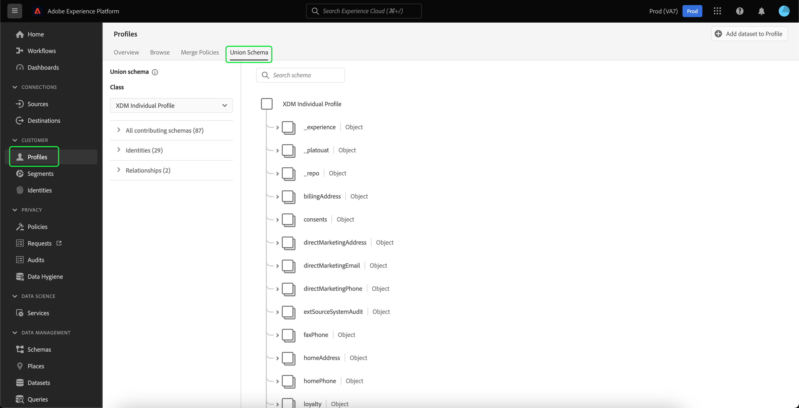

# Erstellen eines Datensatzes zum Exportieren einer Zielgruppe

[!DNL Adobe Experience Platform] ermöglicht die Segmentierung von Kundenprofilen in Zielgruppen basierend auf bestimmten Attributen. Nachdem eine Segmentdefinition erstellt wurde, können Sie die resultierende Zielgruppe in einen Datensatz exportieren, in dem sie aufgerufen und bearbeitet werden kann. Damit der Export erfolgreich ist, muss der Datensatz ordnungsgemäß konfiguriert werden.

In diesem Tutorial werden die Schritte erläutert, die zum Erstellen eines Datensatzes erforderlich sind, der zum Exportieren einer Zielgruppe mit dem [!DNL Experience Platform] Benutzeroberfläche.

Dieses Tutorial steht in direktem Zusammenhang zu den Schritten, die im Tutorial zu [Segmentierungsergebnisse bewerten und aufrufen](./evaluate-a-segment.md). Das Tutorial zur Segmentdefinitionsbewertung enthält Schritte zum Erstellen eines Datensatzes mithilfe der [!DNL Catalog Service] API. In diesem Tutorial werden die Schritte zum Erstellen eines Datensatzes mithilfe der [!DNL Experience Platform] Benutzeroberfläche.

## Erste Schritte

Um eine Zielgruppe zu exportieren, muss der Datensatz auf der [!DNL XDM Individual Profile Union Schema]. Ein Vereinigungsschema ist ein systemgeneriertes, schreibgeschütztes Schema, das die Felder aller Schemas aggregiert, die dieselbe Klasse aufweisen. Weiterführende Informationen zu Vereinigungsschemata finden Sie im Handbuch für [Grundlagen der Schemakomposition](../../xdm/schema/composition.md#union).

Um Vereinigungsschemas in der Benutzeroberfläche anzuzeigen, wählen Sie **[!UICONTROL Profile]** Wählen Sie im linken Navigationsbereich die Option **[!UICONTROL Vereinigungsschema]** wie unten dargestellt.

## Arbeitsbereich „Datensätze“

Die [!UICONTROL Datensätze] Mit Workspace können Sie alle Datensätze für Ihr Unternehmen anzeigen und verwalten.

Auswählen **[!UICONTROL Datensätze]** im linken Navigationsbereich, um auf den Arbeitsbereich zuzugreifen, und wählen Sie dann **[!UICONTROL Durchsuchen]**. Auf dieser Registerkarte wird eine Liste der Datensätze und deren Details angezeigt. Je nach Breite der einzelnen Spalten müssen Sie ggf. nach links oder rechts scrollen, um alle Spalten anzuzeigen.

>[!NOTE]
>
>Wählen Sie das Filtersymbol neben der Suchleiste aus, um Filterfunktionen zu verwenden und nur die Datensätze anzuzeigen, für die [!DNL Real-Time Customer Profile].

## Erstellen eines Datensatzes

Um einen Datensatz zu erstellen, wählen Sie **[!UICONTROL Datensatz erstellen]**.

Wählen Sie im nächsten Bildschirm **[!UICONTROL Datensatz aus Schema erstellen]**.

## XDM Individual Profile Union Schema auswählen

So wählen Sie die [!DNL XDM Individual Profile Union Schema] für die Verwendung in Ihrem Datensatz suchen Sie nach dem[!UICONTROL Individuelles XDM-Profil]&quot; Schema im **[!UICONTROL Schema auswählen]** angezeigt. Nachdem Sie das Schema ausgewählt haben, können Sie überprüfen, ob es sich um das Vereinigungsschema unter **[!UICONTROL API-Nutzung]** in der rechten Leiste. Wenn die Variable [!UICONTROL Schema] path endet mit `_union`, ist es ein Vereinigungsschema.

>[!NOTE]
>
>Obwohl Vereinigungsschemas per Definition am Echtzeit-Kundenprofil teilnehmen, werden sie als &quot;Nicht aktiviert&quot;aufgeführt, da sie nicht wie herkömmliche Schemas für Profil aktiviert sind.

Wählen Sie das Optionsfeld neben **[!UICONTROL Individuelles XDM-Profil]**, wählen Sie **[!UICONTROL Nächste]**.

## Datensatz konfigurieren

Im nächsten Bildschirm müssen Sie Ihrem Datensatz einen Namen geben. Sie können auch eine optionale Beschreibung hinzufügen.

**Hinweise zu Datensatznamen:**

* Datensatznamen sollten kurz und beschreibend sein, damit sich der Datensatz in der Bibliothek später leicht finden lässt.
* Datensatznamen müssen eindeutig sein, d. h. sie sollten so spezifisch sein, dass sie in Zukunft nicht wiederverwendet werden.
* Sie sollten mithilfe des Beschreibungsfelds zusätzliche Informationen über den Datensatz bereitstellen, da dies anderen Benutzern helfen kann, in Zukunft zwischen Datensätzen zu unterscheiden.

Sobald der Datensatz einen Namen und eine Beschreibung aufweist, wählen Sie **[!UICONTROL Beenden]**.

## Datensatzaktivität

Nachdem der Datensatz erstellt wurde, erhalten Sie die Aktivitätsseite für diesen Datensatz. Sie sollten oben links im Arbeitsbereich den Namen des Datensatzes sowie eine Benachrichtigung sehen, die Ihnen mitteilt, dass keine Batches hinzugefügt wurden. Das ist zu erwarten, da Sie dem Datensatz noch keine Batches hinzugefügt haben.

Die rechte Leiste enthält Informationen zu Ihrem neuen Datensatz, wie z. B. Datensatz-ID, Name, Beschreibung, Schema und mehr. Beachten Sie bitte die **[!UICONTROL Datensatz-ID]**, da dieser Wert erforderlich ist, um den Workflow für den Zielgruppenexport abzuschließen.

## Nächste Schritte

Nachdem Sie nun einen Datensatz erstellt haben, der auf der [!DNL XDM Individual Profile Union Schema]können Sie die Datensatz-ID verwenden, um mit der [Bewerten und Aufrufen von Segmentdefinitionsergebnissen](./evaluate-a-segment.md) Tutorial.

Kehren Sie zu diesem Zeitpunkt zum Tutorial mit den Ergebnissen der Segmentdefinition zurück und wählen Sie aus der [Generieren von Profilen für Zielgruppenmitglieder](./evaluate-a-segment.md#generate-profiles) Schritt des Export-Audience-Workflows.
