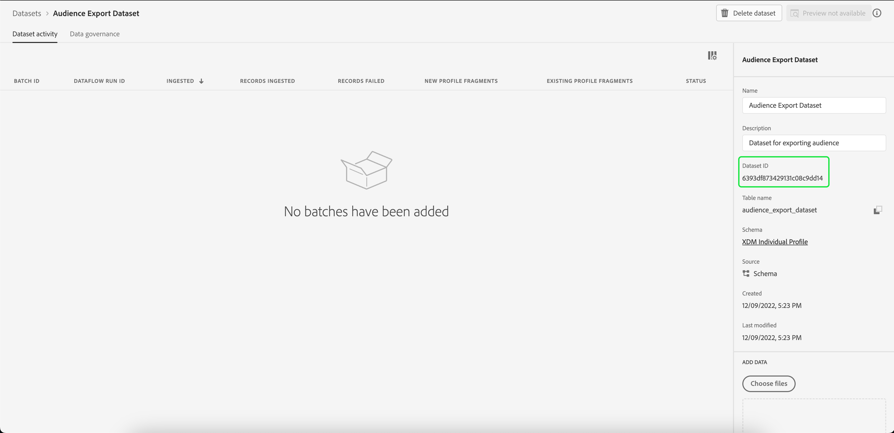

# Erstellen eines Datensatzes zum Exportieren einer Audience

Mit [!DNL Adobe Experience Platform] können Sie Kundenprofile basierend auf bestimmten Attributen in Zielgruppen segmentieren. Nachdem Sie eine Segmentdefinition erstellt haben, können Sie die resultierende Zielgruppe in einen Datensatz exportieren, wo sie aufgerufen und bearbeitet werden kann. Damit der Export erfolgreich ist, muss der Datensatz ordnungsgemäß konfiguriert sein.

In diesem Tutorial werden die Schritte erläutert, die zum Erstellen eines Datensatzes erforderlich sind, der zum Exportieren einer Audience über die [!DNL Experience Platform]-Benutzeroberfläche verwendet werden kann.

Dieses Tutorial bezieht sich direkt auf die Schritte, die im Tutorial [Bewerten und Zugreifen auf Segmentierungsergebnisse“ beschrieben ](./evaluate-a-segment.md). Das Tutorial zur Evaluierung von Segmentdefinitionen enthält Schritte zum Erstellen eines Datensatzes mithilfe der [!DNL Catalog Service]-API, während in diesem Tutorial die Schritte zum Erstellen eines Datensatzes mithilfe der [!DNL Experience Platform]-Benutzeroberfläche beschrieben werden.

## Erste Schritte

Um eine Audience zu exportieren, muss der Datensatz auf dem [!DNL XDM Individual Profile Union Schema] basieren. Ein Vereinigungsschema ist ein systemgeneriertes, schreibgeschütztes Schema, das die Felder aller Schemas aggregiert, die dieselbe Klasse haben. Weitere Informationen zu Vereinigungsschemata finden Sie im Handbuch zu [Grundlagen der Schemakomposition](../../xdm/schema/composition.md#union).

Um Vereinigungsschemata in der Benutzeroberfläche anzuzeigen, wählen Sie **[!UICONTROL linken Navigationsbereich die Option]** Profile“ und dann die Option **[!UICONTROL Vereinigungsschema]** aus, wie unten dargestellt.

## Arbeitsbereich „Datensätze“

Der [!UICONTROL Datensätze]-Arbeitsbereich ermöglicht Ihnen die Ansicht und Verwaltung aller Datensätze für Ihr Unternehmen.

Wählen **[!UICONTROL Datensätze]** in der linken Navigationsleiste aus, um auf den Arbeitsbereich zuzugreifen, und wählen Sie dann **[!UICONTROL Durchsuchen]**. Auf dieser Registerkarte wird eine Liste von Datensätzen und deren Details angezeigt. Je nach Breite der einzelnen Spalten müssen Sie möglicherweise nach links oder rechts scrollen, um alle Spalten anzuzeigen.

>[!NOTE]
>
>Wählen Sie das Filtersymbol neben der Suchleiste aus, um Filterfunktionen zu verwenden und nur die Datensätze anzuzeigen, die für die [!DNL Real-Time Customer Profile] aktiviert sind.

## Erstellen eines Datensatzes

Um einen Datensatz zu erstellen, wählen Sie **[!UICONTROL Datensatz erstellen]** aus.

Wählen Sie im nächsten Bildschirm **[!UICONTROL Datensatz aus Schema erstellen]** aus.

## XDM-Vereinigungsschema für individuelles Profil auswählen

Um die [!DNL XDM Individual Profile Union Schema] für die Verwendung in Ihrem Datensatz auszuwählen, suchen Sie das Schema &quot;[!UICONTROL XDM Individual Profile]&quot; auf dem Bildschirm **[!UICONTROL Schema auswählen]**. Nachdem Sie das Schema ausgewählt haben, können Sie in der rechten Leiste bestätigen, ob es das Vereinigungsschema unter **[!UICONTROL API-Nutzung]** ist. Wenn der [!UICONTROL Schema]-Pfad mit `_union` endet, handelt es sich um ein Vereinigungsschema.

>[!NOTE]
>
>Obwohl Vereinigungsschemata per Definition am Echtzeit-Kundenprofil teilnehmen, werden sie als „Nicht aktiviert“ aufgeführt, da sie nicht wie herkömmliche Schemata für das Profil aktiviert sind.

Klicken Sie auf das Optionsfeld neben **[!UICONTROL Individuelles XDM-Profil]** und klicken Sie dann auf **[!UICONTROL Weiter]**.

## Datensatz konfigurieren

Im nächsten Bildschirm müssen Sie Ihrem Datensatz einen Namen geben. Sie können auch eine optionale Beschreibung hinzufügen.

**Hinweise zu Datensatznamen:**

* Datensatznamen sollten kurz und beschreibend sein, damit sich der Datensatz in der Bibliothek später leicht finden lässt.
* Datensatznamen müssen eindeutig sein, d. h. sie sollten auch so spezifisch sein, dass sie in Zukunft nicht wiederverwendet werden.
* Sie sollten mithilfe des Beschreibungsfelds zusätzliche Informationen zum Datensatz bereitstellen, da dies anderen Benutzern helfen kann, in Zukunft zwischen Datensätzen zu unterscheiden.

Sobald der Datensatz einen Namen und eine Beschreibung hat, wählen Sie **[!UICONTROL Beenden]**.

## Datensatzaktivität

Nachdem der Datensatz erstellt wurde, wird die Aktivitätsseite für diesen Datensatz aufgerufen. Sie sollten oben links im Arbeitsbereich den Namen des Datensatzes sowie eine Benachrichtigung sehen, die Ihnen mitteilt, dass keine Batches hinzugefügt wurden. Das ist zu erwarten, da Sie dem Datensatz noch keine Batches hinzugefügt haben.

Die rechte Leiste enthält Informationen zu Ihrem neuen Datensatz, wie Datensatz-ID, Name, Beschreibung, Schema und mehr. Notieren Sie sich die **[!UICONTROL Datensatz-ID]**, da dieser Wert erforderlich ist, um den Workflow für den Zielgruppenexport abzuschließen.

## Nächste Schritte

Nachdem Sie nun einen Datensatz basierend auf der [!DNL XDM Individual Profile Union Schema] erstellt haben, können Sie die Datensatz-ID verwenden, um mit dem Tutorial [Auswerten von Segmentdefinitionsergebnissen und Zugreifen auf ](./evaluate-a-segment.md)) fortzufahren.

Kehren Sie jetzt zum Tutorial zum Auswerten von Segmentdefinitionsergebnissen zurück und greifen Sie auf den Schritt [Generieren von Profilen für Zielgruppenmitglieder](./evaluate-a-segment.md#generate-profiles) des Workflows zum Exportieren einer Zielgruppe zurück.
