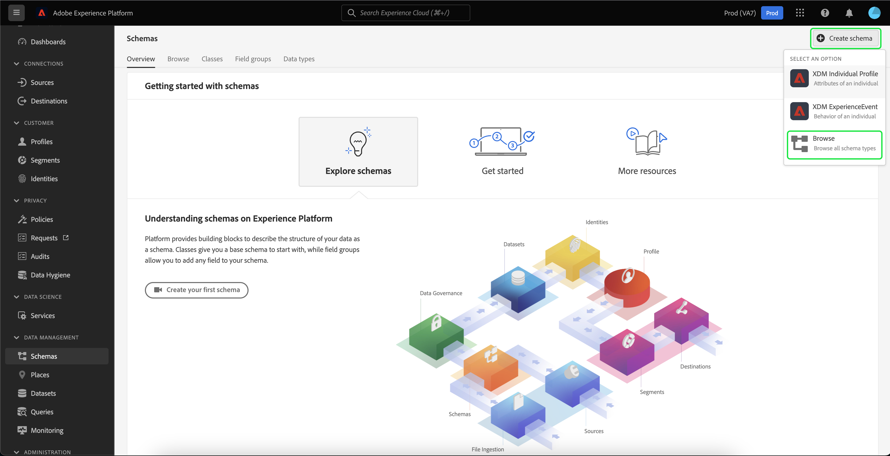

# Importieren und Verwenden externer Zielgruppen

Adobe Experience Platform unterstützt die Möglichkeit, externe Zielgruppen zu importieren, die anschließend als Komponenten für eine neue Segmentdefinition verwendet werden können. Dieses Dokument enthält ein Tutorial zum Einrichten der Experience Platform zum Importieren und Verwenden externer Zielgruppen.

## Erste Schritte

Dieses Tutorial setzt ein grundlegendes Verständnis der verschiedenen [!DNL Adobe Experience Platform]-Dienste voraus, die am Erstellen von Zielgruppensegmenten beteiligt sind. Bevor Sie mit diesem Tutorial beginnen, lesen Sie bitte die Dokumentation für die folgenden Dienste:

- [Segmentation Service](../home.md): Ermöglicht Ihnen das Erstellen von Zielgruppensegmenten aus Echtzeit-Kundenprofildaten.
- [Echtzeit-Kundenprofil](../../profile/home.md): Bietet ein einheitliches Echtzeit-Kundenprofil, das auf aggregierten Daten aus verschiedenen Quellen basiert.
- [Experience-Datenmodell (XDM)](../../xdm/home.md): Das standardisierte Framework, mit dem Platform Kundenerlebnisdaten organisiert.
- [Datensätze](../../catalog/datasets/overview.md): Das Speicher- und Verwaltungskonstrukt für Datenpersistenz in Experience Platform.
- [Streaming-Erfassung](../../ingestion/streaming-ingestion/overview.md): So erfasst und speichert Experience Platform Daten von Client- und Server-seitigen Geräten in Echtzeit.

### Segmentdaten vs. Segmentmetadaten

Bevor Sie mit dem Importieren und Verwenden externer Zielgruppen beginnen, müssen Sie den Unterschied zwischen Segmentdaten und Segmentmetadaten verstehen.

Segmentdaten beziehen sich auf die Profile, die die Segmentqualifikationskriterien erfüllen und daher Teil der Zielgruppe sind.

Segmentmetadaten sind Informationen zum Segment selbst, einschließlich Name, Beschreibung, Ausdruck (falls zutreffend), Erstellungsdatum, Datum der letzten Änderung und Kennung. Die ID verknüpft die Segmentmetadaten mit den einzelnen Profilen, die die Segmentqualifikation erfüllen und Teil der resultierenden Zielgruppe sind.

| Segmentdaten | Segmentmetadaten |
| ------------ | ---------------- |
| Profile, die die Segmentqualifikation erfüllen | Informationen zum Segment selbst |

## Erstellen eines Identitäts-Namespace für die externe Zielgruppe

Der erste Schritt zur Verwendung externer Zielgruppen besteht in der Erstellung eines Identitäts-Namespace. Identitäts-Namespaces ermöglichen es Platform, zu verknüpfen, woher ein Segment stammt.

Um einen Identitäts-Namespace zu erstellen, befolgen Sie die Anweisungen im Handbuch [Identitäts-Namespace](../../identity-service/namespaces.md#manage-namespaces). Fügen Sie beim Erstellen Ihres Identitäts-Namespace die Quelldetails zum Identitäts-Namespace hinzu und markieren Sie dessen [!UICONTROL Typ] als **[!UICONTROL Kennung für Nicht-Personen]**.

## Erstellen eines Schemas für die Segmentmetadaten

Nachdem Sie einen Identitäts-Namespace erstellt haben, müssen Sie ein neues Schema für das Segment erstellen, das Sie erstellen werden.

Um mit der Erstellung eines Schemas zu beginnen, wählen Sie zunächst **[!UICONTROL Schemas]** in der linken Navigationsleiste und dann **[!UICONTROL Schema]** in der oberen rechten Ecke des Arbeitsbereichs &quot;Schemas&quot;aus. Wählen Sie **[!UICONTROL Durchsuchen]** aus, um eine vollständige Auswahl der verfügbaren Schematypen anzuzeigen.

Da Sie eine Segmentdefinition erstellen, bei der es sich um eine vordefinierte Klasse handelt, wählen Sie **[!UICONTROL Vorhandene Klasse verwenden]** aus. Wählen Sie nun die Klasse **[!UICONTROL Segmentdefinition]** aus, gefolgt von **[!UICONTROL Klasse zuweisen]**.

Nachdem Ihr Schema erstellt wurde, müssen Sie angeben, welches Feld die Segment-ID enthalten soll. Dieses Feld sollte als primäre Identität markiert und den zuvor von Ihnen erstellten Namespaces zugewiesen werden.

Nachdem Sie das Feld `_id` als primäre Identität markiert haben, wählen Sie den Titel des Schemas aus, gefolgt von dem Umschalter **[!UICONTROL Profil]**. Wählen Sie **[!UICONTROL Aktivieren]** aus, um das Schema für [!DNL Real-time Customer Profile] zu aktivieren.

Jetzt ist dieses Schema für Profil aktiviert, wobei die primäre Identifizierung dem von Ihnen erstellten Identitäts-Namespace ohne Person zugewiesen ist. Das bedeutet, dass Segmentmetadaten, die mithilfe dieses Schemas in Platform importiert wurden, in das Profil aufgenommen werden, ohne mit anderen personenbezogenen Profildaten zusammengeführt zu werden.

## Datensatz für das Schema erstellen

Nach dem Konfigurieren des Schemas müssen Sie einen Datensatz für die Segmentmetadaten erstellen.

Um einen Datensatz zu erstellen, befolgen Sie die Anweisungen im [Benutzerhandbuch zum Datensatz](../../catalog/datasets/user-guide.md#create). Sie möchten die Option **[!UICONTROL Datensatz aus Schema]** erstellen unter Verwendung des zuvor erstellten Schemas verwenden.

Nachdem Sie den Datensatz erstellt haben, folgen Sie den Anweisungen im [Benutzerhandbuch zum Datensatz](../../catalog/datasets/user-guide.md#enable-profile), um diesen Datensatz für das Echtzeit-Kundenprofil zu aktivieren.

## Einrichten und Importieren von Zielgruppendaten

Wenn der Datensatz aktiviert ist, können Daten jetzt entweder über die Benutzeroberfläche oder über die Experience Platform-APIs an Platform gesendet werden. Um diese Daten in Platform zu erfassen, müssen Sie eine Streaming-Verbindung erstellen.

Um eine Streaming-Verbindung zu erstellen, folgen Sie den Anweisungen im [API-Tutorial](../../sources/tutorials/api/create/streaming/http.md) oder im [UI-Tutorial](../../sources/tutorials/ui/create/streaming/http.md).

Nachdem Sie Ihre Streaming-Verbindung erstellt haben, haben Sie Zugriff auf Ihren eindeutigen Streaming-Endpunkt, an den Sie Ihre Daten senden können. Informationen zum Senden von Daten an diese Endpunkte finden Sie im [Tutorial zum Streaming von Datensatzdaten](../../ingestion/tutorials/streaming-record-data.md#ingest-data).

## Erstellen von Segmenten mit importierten Zielgruppen

Nachdem die importierten Zielgruppen eingerichtet wurden, können sie im Rahmen des Segmentierungsprozesses verwendet werden. Um externe Zielgruppen zu finden, gehen Sie zum Segment Builder und wählen Sie die Registerkarte **[!UICONTROL Zielgruppen]** im Abschnitt **[!UICONTROL Felder]** aus.

## Nächste Schritte

Nachdem Sie jetzt externe Zielgruppen in Ihren Segmenten verwenden können, können Sie mit Segment Builder Segmente erstellen. Informationen zum Erstellen von Segmenten finden Sie im [Tutorial zum Erstellen von Segmenten](./create-a-segment.md).
