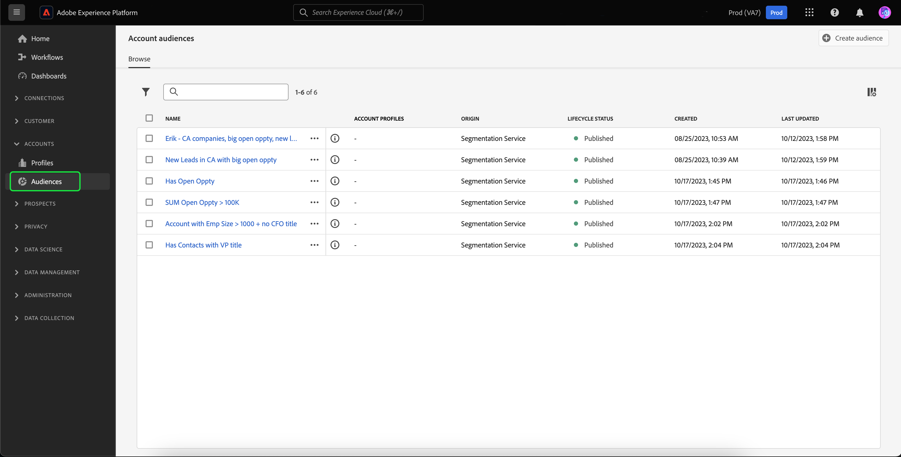

# Kontozielgruppen

>[!AVAILABILITY]
>
>Account-Zielgruppen sind nur in der [B2B edition von Real-Time Customer Data Platform](../../rtcdp/overview.md#rtcdp-b2b) und der [B2P Edition von Real-Time Customer Data Platform](../../rtcdp/overview.md#rtcdp-b2p) verfügbar.

Mit der Segmentierung von Accounts ermöglicht Ihnen Adobe Experience Platform, die volle Einfachheit und Raffinesse des Marketing-Segmentierungs-Erlebnisses von personenbasierten Zielgruppen zu Account-basierten Zielgruppen zu bringen.

Account-Zielgruppen können als Eingabe für Account-basierte Ziele verwendet werden, sodass Sie die Personen in diesen Konten in nachgelagerten Services ansprechen können. Beispielsweise können Sie Account-basierte Zielgruppen verwenden, um Datensätze für alle Konten abzurufen, die **keine** Kontaktinformationen für Personen mit dem Titel Chief Operating Officer (COO) oder Chief Marketing Officer (CMO) haben.

>[!NOTE]
>
>Im Rahmen des B2B-Architekturupgrades werden Zielgruppengrößenschätzungen für Zielgruppen mit B2B-Entitäten jetzt mit exakter Genauigkeit berechnet. Diese Schätzungen stehen während der Vorschau zur Verfügung und bieten genauere und zuverlässigere Einblicke für Zielgruppen, bei denen komplexe B2B-Beziehungen eine Rolle spielen.  Weitere Informationen finden Sie in der Übersicht über die [Real-Time CDP B2B edition-Architekturupgrades](../../rtcdp/b2b-architecture-upgrade.md).

## Terminologie {#terminology}

Bevor Sie mit Konto-Zielgruppen beginnen, überprüfen Sie die Unterschiede zwischen den verschiedenen Zielgruppentypen:

- **Konto-Zielgruppen**: Eine Konto-Zielgruppe ist eine Zielgruppe, die mithilfe von Profildaten **Konto** erstellt wird. Account-Profildaten können verwendet werden, um Audiences zu erstellen, die Personen in nachgelagerten Accounts ansprechen. Weiterführende Informationen zu Account-Profilen finden Sie in der [Account-Profilübersicht](../../rtcdp/accounts/account-profile-overview.md).
- **Personen-Zielgruppen**: Eine Personen-Zielgruppe ist eine Zielgruppe, die mithilfe von **Kunden-)** erstellt wird. Kundenprofildaten können verwendet werden, um Zielgruppen zu erstellen, die auf die Kunden Ihres Unternehmens ausgerichtet sind. Weitere Informationen zu Kundenprofilen finden Sie in der [Übersicht über das Echtzeit-Kundenprofil](../../profile/home.md).
- **Interessenten-Zielgruppen**: Eine Interessenten-Zielgruppe ist eine Zielgruppe, die mithilfe von Profildaten **Interessenten** erstellt wird. Daten von Interessentenprofilen können verwendet werden, um Zielgruppen von nicht authentifizierten Benutzern zu erstellen. Weitere Informationen zu Interessentenprofilen finden Sie im Abschnitt [Übersicht über Interessentenprofile](../../profile/ui/prospect-profile.md).

## Zugriff {#access}

Um auf Konto-Zielgruppen zuzugreifen, wählen Sie **[!UICONTROL Audiences]** im Abschnitt **[!UICONTROL Accounts]** aus.

Die Seite [!UICONTROL Browse] wird mit einer Liste aller Konto-Zielgruppen für die Organisation angezeigt.

Diese Ansicht listet Informationen zur Zielgruppe auf, einschließlich Name, Profilanzahl, Herkunft, Lebenszyklusstatus, Erstellungsdatum und Datum der letzten Aktualisierung.

Sie können auch die Such- und Filterfunktion verwenden, um schnell nach bestimmten Konto-Zielgruppen zu suchen und zu sortieren. Weitere Informationen zu dieser Funktion finden Sie im Abschnitt [Zielgruppenportal - Übersicht](../ui/audience-portal.md#manage-audiences).

## Zielgruppe erstellen {#create}

>[!NOTE]
>
>Account-Zielgruppen werden mithilfe der **Batch**-Segmentierung ausgewertet und alle 24 Stunden ausgewertet.

Um eine Konto-Zielgruppe zu erstellen, wählen Sie auf der Seite **[!UICONTROL Create audience]** die Option [!UICONTROL Browse] aus.

![Die Schaltfläche &quot;[!UICONTROL Create audience]&quot; ist auf der Seite zum Durchsuchen von Konto-Zielgruppen hervorgehoben.](../images/types/account/select-create-audience.png)

Der Segment Builder wird angezeigt. Die Kontoattribute und Zielgruppen werden in der linken Navigationsleiste angezeigt. Auf der Registerkarte [!UICONTROL Attributes] können Sie sowohl von Experience Platform erstellte als auch benutzerdefinierte Attribute hinzufügen.

Auf der Registerkarte [!UICONTROL Audiences] können Sie zuvor erstellte personenbasierte Zielgruppen hinzufügen, auf die Sie bei der Erstellung Ihrer eigenen Konto-Zielgruppe aufbauen können.

Weitere Informationen zur Verwendung von Segment Builder finden Sie im [Handbuch zur Benutzeroberfläche von Segment Builder](../ui/segment-builder.md).

### Erstellen von Beziehungen {#relationships}

Standardmäßig zeigt die Segment Builder-Benutzeroberfläche für Konto-Zielgruppen die direkte Beziehung zwischen einem Konto und einer Person an. Es sind jedoch andere Beziehungstypen für Konto-Zielgruppen verfügbar.

Um die alternativen Beziehungstypen zu verwenden, wählen Sie  aus.

Wählen Sie auf der Registerkarte [!UICONTROL Settings] im Abschnitt **[!UICONTROL Show relationship selectors]** die Option **[!UICONTROL Relationship of fields]** aus.

Wählen Sie erneut , um zur Registerkarte [!UICONTROL Fields] zurückzukehren. Jetzt können Sie den Abschnitt **[!UICONTROL Establish relationships]** sehen, in dem Sie festlegen können, wie das Konto mit der Person verbunden ist und wie die Person mit der Opportunity verbunden ist.

Beim Verbinden des Kontos mit der Person können Sie aus den folgenden Optionen auswählen:

| Option | Beschreibung |
| ------ | ----------- |
| Direkte Beziehung | Die direkte Verbindung zwischen dem Konto und der Person. Dies gibt an, mit welchen Konten jede Person über das Array von `accountID` im `personComponents`-Array im Personenschema verknüpft ist. Dieser Pfad ist der am häufigsten verwendete. |
| Konto-Personen-Beziehung | Die Beziehung zwischen dem Konto und der Person, die durch das `accountPersonRelation` definiert wird. Dieser Pfad ermöglicht es auch, dass jede Person mit mehreren Konten verbunden sein kann. Er wird verwendet, wenn Ihr Unternehmen eine explizite Beziehungstabelle aus Ihren Quelldaten definiert hat. |
| Opportunity-Person-Beziehung | Die Beziehung zwischen der Opportunity und der Person, die durch das `opportunityPersonRelation` definiert wird. Dadurch wird die Person mit einem Konto verbunden, indem von der Opportunity-Person zur Opportunity zum Konto gewechselt wird. Auf diese Weise können Sie beschreiben, bei welchen Unternehmen die Person Opportunities zugeordnet ist. |

Beim Verbinden der Opportunity mit der Person können Sie aus den folgenden Optionen wählen:

| Option | Beschreibung |
| ------ | ----------- |
| Konto | Die direkte Verbindung zwischen dem Konto und der Opportunity. Wenn Sie dies in einer Konto-Zielgruppe verwenden, verbindet dieser Pfad alle Personen im Unternehmen mit der Opportunity. |
| Opportunity-Person-Beziehung | Die Beziehung zwischen der Opportunity und der Person, die auf dem Opportunity-Person-Objekt basiert. Dieser Pfad verbindet nur Personen, die speziell als an einer Opportunity beteiligt identifiziert wurden, mit dieser Opportunity. |

Nachdem Sie die gewünschte Beziehung hergestellt haben, können Sie die erforderlichen Personen-Zielgruppen zu Ihrer Segmentdefinition hinzufügen.

## Zielgruppe aktivieren {#activate}

>[!NOTE]
>
>Nur eine begrenzte Anzahl von Zielen unterstützt Konto-Zielgruppen. Bitte stellen Sie sicher, dass das Ziel, das Sie aktivieren möchten, Konto-Zielgruppen unterstützt, bevor Sie diesen Prozess fortsetzen.

Nachdem Sie Ihr Zielgruppenkonto erstellt haben, können Sie die Zielgruppe für andere nachgelagerte Services aktivieren.

Wählen Sie die Zielgruppe aus, die Sie aktivieren möchten, und dann **[!UICONTROL Activate to destination]**.

![Die Schaltfläche &quot;[!UICONTROL Activate to destination]&quot; ist im Schnellaktionsmenü für die ausgewählte Zielgruppe hervorgehoben.](../images/types/account/activate.png)

Die Seite [!UICONTROL Activate destination] wird angezeigt. Weitere Informationen zum Aktivierungsprozess, einschließlich unterstützter Ziele und Details zu Feldzuordnungen, finden Sie im Tutorial [Aktivieren von Konto](/help/destinations/ui/activate-account-audiences.md) .

## Nächste Schritte {#next-steps}

Nach dem Lesen dieses Handbuchs wissen Sie jetzt besser, wie Sie Ihre Konto-Zielgruppen in Adobe Experience Platform erstellen und verwenden. Informationen zur Verwendung anderer Typen von Zielgruppen in Experience Platform finden Sie in der [Übersicht über Zielgruppentypen](./overview.md).

## Anhang {#appendix}

Im folgenden Abschnitt finden Sie weitere Informationen zu Konto-Zielgruppen.

### Validierung der Kontosegmentierung {#validation}

>[!CONTEXTUALHELP]
>id="platform_audiences_account_constraint_eventLookbackWindow"
>title="Lookback-Fenster"
>abstract="Verwenden Sie das Lookback-Fenster, um den vollständigen Verlauf von Ereignissen auf Personenebene anzuzeigen."

>[!CONTEXTUALHELP]
>id="platform_audiences_account_constraint_combinationMaxDepth"
>title="Fehler bei der Tiefe des maximalen verschachtelten Containers"
>abstract="Die maximale Tiefe verschachtelter Container beträgt **5**. Das bedeutet, dass Sie beim Erstellen Ihrer Zielgruppe **nicht** mehr als fünf verschachtelte Container haben dürfen."

>[!CONTEXTUALHELP]
>id="platform_audiences_account_constraint_combinationMaxBreadth"
>title="Fehler bei der maximalen Anzahl von Regeln"
>abstract="Die maximale Anzahl von Regeln in einem einzelnen Container beträgt **5**. Das bedeutet, dass ein Container beim Erstellen Ihrer Zielgruppe **nicht** mehr als fünf Regeln enthalten darf."

>[!CONTEXTUALHELP]
>id="platform_audiences_account_constraint_crossEntityMaxDepth"
>title="Fehler bei der maximalen Anzahl von übergreifenden Entitäten"
>abstract="Die maximale Anzahl von Entitäten, die in einer Zielgruppe verwendet werden können, beträgt **5**. Eine übergreifende Entität ist der Fall, wenn Sie zwischen verschiedenen Entitäten in Ihrer Zielgruppe wechseln. So können Sie beispielsweise von einem Konto zu einer Person zu einer Marketingliste wechseln."

>[!CONTEXTUALHELP]
>id="platform_audiences_account_constraint_allowCustomEntity"
>title="Fehler bei der benutzerdefinierten Entität"
>abstract="Benutzerdefinierte Entitäten sind **nicht** zulässig."

>[!CONTEXTUALHELP]
>id="platform_audiences_account_constraint_b2bBuiltInEntities"
>title="Fehler einer ungültigen B2B-Entität"
>abstract="Es dürfen nur die folgenden B2B-Entitäten verwendet werden: `_xdm.context.account`, `_xdm.content.opportunity`, `_xdm.context.profile`, `_xdm.context.experienceevent`, `_xdm.context.account-person`, `_xdm.classes.opportunity-person`, `_xdm.classes.marketing-list-member`, `_xdm.classes.marketing-list`, `_xdm.context.campaign-member` und `_xdm.classes.campaign`."

>[!CONTEXTUALHELP]
>id="platform_audiences_account_constraint_rhsMaxOptions"
>title="Maximaler Wertefehler"
>abstract="Die maximale Anzahl von Werten, die für ein einzelnes Feld überprüft werden können, beträgt **50**."

>[!CONTEXTUALHELP]
>id="platform_audiences_account_constraint_allowInSegmentByReference"
>title="inSegment-Ereignisfehler"
>abstract="inSegment-Ereignisse sind **nicht** zulässig."

>[!CONTEXTUALHELP]
>id="platform_audiences_account_constraint_allowInSegmentByValue"
>title="inSegment-Ereignisfehler"
>abstract="inSegment-Ereignisse sind **nicht** zulässig."

>[!CONTEXTUALHELP]
>id="platform_audiences_account_constraint_allowSequentialEvents"
>title="Fehler bei aufeinanderfolgenden Ereignissen"
>abstract="Aufeinanderfolgende Ereignisse sind **nicht** erlaubt."

>[!CONTEXTUALHELP]
>id="platform_audiences_account_constraint_allowMaps"
>title="Eigenschaftsfehler vom Typ „Map“"
>abstract="Eigenschaften vom Typ „Map“ sind **nicht** zulässig."

>[!CONTEXTUALHELP]
>id="platform_audiences_account_constraint_maxNestedAggregationDepth"
>title="Fehler bei der maximalen Tiefe von verschachtelten Entitäten"
>abstract="Die maximale Tiefe von verschachtelten Arrays beträgt **5**."

>[!CONTEXTUALHELP]
>id="platform_audiences_account_constraint_maxObjectNestingLevel"
>title="Fehler bei der maximalen Anzahl verschachtelter Objekte"
>abstract="Die maximale Anzahl zulässiger verschachtelter Objekte beträgt **10**."

>[!CONTEXTUALHELP]
>id="platform_audiences_account_constraint_generic"
>title="Verstoß gegen eine Einschränkung"
>abstract="Die Zielgruppe verstößt gegen eine Einschränkung. Weitere Informationen hierzu finden Sie im verknüpften Dokument."

Bei Verwendung von Konto-Zielgruppen muss **Zielgruppe** folgenden Einschränkungen einhalten:

- Die maximale Tiefe verschachtelter Container beträgt **5**.
   - Das bedeutet, dass Sie beim Erstellen Ihrer Zielgruppe **nicht** mehr als fünf verschachtelte Container haben dürfen.
- Die maximale Anzahl von Regeln innerhalb eines einzelnen Containers beträgt **5**.
   - Das bedeutet, dass Ihre Zielgruppe **kann** mehr als fünf Regeln haben kann, aus denen Ihre Zielgruppe besteht.
- Die maximale Anzahl von Cross-Entities, die verwendet werden können, beträgt **5**.
   - Eine übergreifende Entität ist der Fall, wenn Sie zwischen verschiedenen Entitäten in Ihrer Zielgruppe wechseln. So können Sie beispielsweise von einem Konto zu einer Person zu einer Marketingliste wechseln.
- Die maximale Anzahl von Werten, die für ein einzelnes Feld überprüft werden können, beträgt **50**.
   - Wenn Sie beispielsweise das Feld „Stadtname“ haben, können Sie diesen Wert mit 50 Stadtnamen vergleichen.
- Konto-Zielgruppen **können** Zuordnungen verwenden.
- Konto-Zielgruppen **können** Ereignisse verwenden.
- Die maximale Tiefe von verschachtelten Arrays beträgt **5**.
- Die maximale Anzahl verschachtelter Objekte beträgt **10**.

<!-- - The maximum lookback window for Experience Events is **30 days**. -->
<!-- - Account audiences **cannot** use `inSegment` events. -->
<!-- - Custom entities **cannot** be used. -->