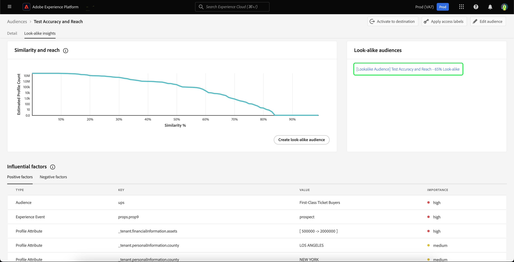

# Handbuch zu Lookalike-Zielgruppen

>[!IMPORTANT]
>
>Lookalike-Einblicke und Lookalike-Zielgruppen sind nur in der B2C **Edition**.

Lookalike-Zielgruppen in Adobe Experience Platform bieten intelligente Einblicke in jede Ihrer Zielgruppen und nutzen auf maschinellem Lernen basierende Einblicke, um mit Ihren Marketing-Kampagnen hochwertige Kunden zu identifizieren und anzusprechen.

Mit Lookalike-Zielgruppen können Sie erweiterte Zielgruppen erstellen, die Kundinnen und Kunden ähnlich Ihren hochleistungsfähigen Zielgruppen ansprechen oder Kundinnen und Kunden ähnlich wie zuvor konvertierte Zielgruppen ansprechen.

## Terminologie {#terminology}

Bevor Sie mit Lookalike-Zielgruppen beginnen, sollten Sie die folgenden Konzepte verstehen:

- **Basis-Zielgruppe**: Die Basis-Zielgruppe ist die Zielgruppe, über die Sie weitere Einblicke erhalten möchten. Dies ist die Zielgruppe, auf der das Look-alike-Modell **basiert**.
- **Lookalike-Modell**: Ein Lookalike-Modell ist ein maschinelles Lernmodell, das für jede geeignete Basiszielgruppe ohne Kundeneingabe trainiert wird. Jedes Look-alike-Modell erstellt die Einflussfaktoren und Ähnlichkeitsdiagramme. Ein Look-alike-Modell erhält **nicht** eine Bewertung.
- **Lookalike-Zielgruppe**: Eine Lookalike-Zielgruppe ist die Zielgruppe, die erstellt wird, wenn ein Lookalike-Modell mit einem ausgewählten Ähnlichkeitsschwellenwert auf die Basis-Zielgruppe angewendet wird. Sie können mit demselben Lookalike-Modell mehrere Lookalike-Zielgruppen erstellen. Lookalike-Zielgruppen werden bewertet.
- **Gesamte adressierbare Zielgruppengröße**: Die gesamte adressierbare Zielgruppengröße ist die Gesamtzahl der Profile in den letzten 30 Tagen abzüglich der Basis-Zielgruppenpopulation in den letzten 30 Tagen. Wenn beispielsweise ein Kunde in den letzten 30 Tagen 10 Millionen Profile hat und die Basis-Audience in den letzten 30 Tagen 1 Million Profile hat, beträgt die Gesamtgröße der adressierbaren Audience 9 Millionen Profile.

## Eignung {#eligibility}

Um Lookalike-Einblicke zu verwenden, muss **Basis-Zielgruppe** folgenden Eignungskriterien erfüllen:

- Die Basis-Zielgruppe **muss** in Platform erstellt werden.
   - Extern generierte Zielgruppen sind **nicht** für Lookalike-Einblicke geeignet.
- Die Basis **Zielgruppe muss** der Standard-Zusammenführungsrichtlinie entsprechen.
- Die Basis **Zielgruppe darf** Felder verwenden, die durch Data Governance eingeschränkt sind.

## Look-alike-Modell – Details {#details}

>[!CONTEXTUALHELP]
>id="platform_audiences_lookAlike_notEligible"
>title="Nicht berechtigt"
>abstract="Diese Zielgruppe ist derzeit nicht für Look-alike-Einblicke qualifiziert, da sie möglicherweise weniger als die Mindestanzahl von Profilen enthält, die für das Training erforderlich sind, oder der Profilexport noch nicht ausgelöst wurde."

>[!CONTEXTUALHELP]
>id="platform_audiences_lookAlike_processing"
>title="Verarbeitung läuft"
>abstract="Diese Zielgruppe wird derzeit verarbeitet. Die Verarbeitung des Modells kann bis zu 24 Stunden dauern. Bitte versuchen Sie es später erneut."

>[!CONTEXTUALHELP]
>id="platform_audiences_lookAlike_error"
>title="Fehler"
>abstract="Bei der Verarbeitung dieses Modells ist ein Fehler aufgetreten. Bitte löschen Sie dieses Modell und erstellen es neu oder versuchen Sie es später erneut."

In Adobe Experience Platform nutzt das Lookalike-Modell drei verschiedene Arten von Datenpunkten:

- Zielgruppenzugehörigkeit in den letzten 30 Tagen
- Erlebnisereignisse der letzten 30 Tage, die in das Echtzeit-Kundenprofil aufgenommen wurden
- Profilattribute der letzten 30 Tage, die in das Echtzeit-Kundenprofil aufgenommen wurden

Alle diese Datenpunkte werden in Schlüssel-Wert-Paare umgewandelt, die in das Look-alike-Modell eingespeist werden. Nur die Schlüsselwertpaare mit einem signifikanten Prozentsatz an übereinstimmenden Profilen werden beibehalten.

Zu diesem Zeitpunkt wird das Lookalike-Modell alle 24 Stunden ausgeführt, wobei die Einflussfaktoren und Ähnlichkeitsdiagramme für die Basis-Zielgruppen erstellt und neu erstellt werden. Auch die Bewertung für Lookalike-Zielgruppen wird häufig ausgeführt.

## Berechtigungen {#entitlements}

Die folgenden Berechtigungen gelten für die Verwendung von Lookalike-Zielgruppen:

- Real-Time CDP Prime-Kunden haben Anspruch auf **5** aktive Lookalike-Zielgruppen in Produktions-Sandboxes
- Kunden von Real-Time CDP Ultimate haben Anspruch auf **20** aktive Lookalike-Zielgruppen in Produktions-Sandboxes
- Entwicklungs-Sandboxes sind auf **5** Lookalike-Zielgruppen für alle Real-Time CDP-Kunden beschränkt

Mit Add-on-Paketen, die zu einem späteren Zeitpunkt verfügbar sein werden, erhöhen sich die Berechtigungen für Produktions-Sandboxes um 20 Lookalike-Zielgruppen pro Paket.

Wenden Sie sich an Ihren Adobe-Support-Mitarbeiter, um zu bestätigen, ob Sie Zugriff auf Lookalike-Zielgruppen haben.

## Lookalike-Einblicke anzeigen {#view}

Lookalike-Einblicke sind in der Seite mit den Zielgruppendetails integriert. Um sich die Lookalike-Einblicke für eine Zielgruppe anzuschauen, wählen Sie **[!UICONTROL Zielgruppen]** in der linken Navigationsleiste aus, gefolgt von **[!UICONTROL Durchsuchen]** und der Zielgruppe, für die Sie die Einblicke anzeigen möchten.

Die Seite mit den Details zur Zielgruppe wird angezeigt. Wählen Sie **[!UICONTROL Registerkarte]** Lookalike-Insights“ aus, um die Lookalike-Insights der Zielgruppe anzuzeigen. Die **[!UICONTROL Lookalike-Insights]** wird angezeigt. Diese Seite hat drei Hauptelemente - das Ähnlichkeits- und Reichweitendiagramm, die Lookalike-Zielgruppen und die Einflussfaktoren.

### Ähnlichkeit und Reichweite {#similarity-and-reach}

>[!CONTEXTUALHELP]
>id="platform_audiences_lookAlike_similarityAndReach"
>title="Ähnlichkeit und Reichweite"
>abstract="Das Ähnlichkeits- und Reichweitendiagramm zeichnet die erwartete Reichweite einer Look-alike-Zielgruppe aus Profilen über einem bestimmten Ähnlichkeitswert auf. Sie können den Mauszeiger über einen bestimmten Punkt im Diagramm bewegen, um den Prozentsatz der Ähnlichkeit und die erwartete Profilanzahl für den aktuell hervorgehobenen Punkt anzuzeigen."

Im Abschnitt Ähnlichkeit und Reichweite wird ein Diagramm angezeigt, das die erwartete Reichweite einer Lookalike-Zielgruppe darstellt, die aus Profilen oberhalb eines bestimmten Ähnlichkeitswerts besteht. Der Ähnlichkeitswert stellt die **Entfernung** der Ähnlichkeit zwischen dem Profil der Basis-Zielgruppe und dem Profil der Lookalike-Einsicht dar.

In diesem Diagramm misst die X-Achse den Ähnlichkeitsprozentsatz zwischen einem Profil und Mitgliedern der ausgewählten Zielgruppe. Der Ähnlichkeitswert liegt zwischen 0 % und 100 %, wobei ein höherer Ähnlichkeitswert anzeigt, dass ein Profil hinsichtlich der Einflussfaktorwerte näher an den Mitgliedern der ausgewählten Zielgruppe liegt.

Die Y-Achse zeigt die erwartete Anzahl von Profilen mit dem Ähnlichkeitsprozentsatz an, der dem übereinstimmenden Wert der X-Achse entspricht. Diese erwartete Anzahl von Profilen reicht von 0 bis zur gesamten adressierbaren Zielgruppengröße oder 25 Millionen Profilen, je nachdem, welcher Wert niedriger ist. Diese Achse wird auf einer **logarithmischen Skala** gemessen, um die Lesbarkeit des Diagramms zu verbessern.

Bitte beachten Sie, dass das Diagramm **kumulativ** von rechts nach links ist. Das bedeutet, dass der Wert der Y-Achse zu jedem Punkt des Diagramms der Anzahl der Profile entspricht, die eine Ähnlichkeit aufweisen **oberhalb** des Ähnlichkeitsschwellenwerts. Wenn die x-Achse beispielsweise bei 60 % und die y-Achse bei 10 Millionen liegt, bedeutet dies, dass es 10 Millionen Profile gibt, die eine Ähnlichkeit mit der Basis-Audience von mindestens 60 % aufweisen.

Sie können den Mauszeiger über einen bestimmten Punkt im Diagramm bewegen, um den Prozentsatz der Ähnlichkeit und die erwartete Profilanzahl für den aktuell hervorgehobenen Punkt anzuzeigen.

### Lookalike-Zielgruppen {#list}

Im Abschnitt Lookalike-Zielgruppen wird eine Liste aller Lookalike-Zielgruppen angezeigt, die zuvor für die ausgewählte Basis-Zielgruppe erstellt wurden.

### Einflussfaktoren {#influential-factors}

>[!CONTEXTUALHELP]
>id="platform_audiences_lookAlike_influentialFactors"
>title="Einflussfaktoren"
>abstract="Einflussfaktoren sind Attribute, Ereignisse und Zielgruppenmitgliedschaften, die wichtig sind, um die Ähnlichkeit eines Profils mit Mitgliedern der Basiszielgruppe zu erklären. Datennutzungskennzeichnungen und -richtlinien können verwendet werden, um bestimmte Daten davon auszuschließen, in Look-alike-Modellen als Einflussfaktoren betrachtet zu werden."

Im Abschnitt Einflussfaktoren werden die 100 wichtigsten Faktoren angezeigt, die das Lookalike-Modell für die ausgewählte Basis-Audience beeinflussen. Diese Einflussfaktoren sind die Profilattribute, die Erlebnisereignisse und die Zielgruppenzugehörigkeiten, die für die Erklärung der Ähnlichkeiten in der Basis-Zielgruppe am wichtigsten sind. Wenn Sie die wichtigsten Einflussfaktoren verstehen, können Sie Ihre Marketing-Inhalte für diese Zielgruppe und jede Lookalike-Zielgruppe, die Sie daraus erstellen, besser personalisieren. Beachten Sie, dass nicht alle Einflussfaktoren, die das Look-alike-Modell beeinflussen, angezeigt werden.

Bei numerischen Einflussfaktoren können die Schlüssel-Wert-Paare je nach der Anzahl der verschiedenen Werte, die der Schlüssel hat, in Buckets zusammengefasst werden. Wenn Sie beispielsweise einen Schlüssel von `income` haben, gibt es höchstwahrscheinlich viele eindeutige Werte. Daher werden die Schlüssel-Wert-Paare in Buckets platziert, die wie `income=[0 -> 30000]`, `income=[30000 -> 50000]` und `income=[50000 -> 100000]` aussehen könnten.

Diese Buckets werden regelmäßig neu berechnet, um sicherzustellen, dass die Daten auf dem neuesten Stand sind.

>[!NOTE]
>
>Die Einflussfaktoren werden nach Wichtigkeit sortiert und sind voneinander unabhängig.

| Feld | Beschreibung |
| ----- | ----------- |
| Typ | Die Art der Daten, von denen der Einflussfaktor abgeleitet wird. Dabei kann es sich um ein Profilattribut, ein Erlebnisereignis oder eine Zielgruppenzugehörigkeit handeln. |
| Schlüssel | Der Name des Datenfelds. Bei Schlüsseln des Zielgruppen-Zugehörigkeitstyps stellt dieser Wert den **Namespace** der Zielgruppe dar, aus der die Daten stammen. Zu den möglichen Werten gehören `ups` (Segmentierungs-Service) und `AO` (Zielgruppenorchestrierung). Bei Schlüsseln anderer Typen stellt dieser Wert den XDM-Feldpfad dar. Wenn das Unternehmen Luma beispielsweise über ein benutzerdefiniertes Feld namens „Einkommen“ verfügt, lautet der Schlüssel `_luma.income` |
| Wert | Der Wert variiert je nach dem Einflussfaktor, den er darstellt. Bei Profilattributen oder Erlebnisereignissen stellt dieses Feld den Wert oder Wertebereich des Datenfelds dar, der die Ähnlichkeit mit den Mitgliedern der Basis-Zielgruppe anzeigt. Der Wertebereich wird in das `[A -> B]` geschrieben, wobei `A` den unteren Bereich darstellt, während `B` den höheren Bereich darstellt. Bei Zielgruppenzugehörigkeiten ist dieses Feld der Name der Zielgruppe. |
| Wichtigkeit | Die relative Bedeutung des Einflussfaktors. Dies kann hoch, mittel oder niedrig sein. |

## Lookalike-Zielgruppe erstellen {#create}

>[!IMPORTANT]
>
>Eine Lookalike **Zielgruppe kann nicht** als Basis-Zielgruppe für eine andere Lookalike-Zielgruppe verwendet werden. Das heißt, Sie können **nicht** verkettete Lookalike-Zielgruppen erstellen.

Um eine Lookalike-Zielgruppe zu erstellen, müssen Sie die Zielgruppe auswählen, auf der Sie die Lookalike-Zielgruppe basieren möchten. Um auf Ihre Liste der verfügbaren Zielgruppen zuzugreifen, wählen Sie **[!UICONTROL Zielgruppen]** in der linken Navigationsleiste und dann **[!UICONTROL Durchsuchen]**. Die Liste der Zielgruppen wird angezeigt. Auf dieser Seite können Sie die Zielgruppe auswählen, die Sie als Basis-Zielgruppe verwenden möchten.

Wählen Sie auf der Seite mit den Zielgruppendetails **[!UICONTROL Lookalike-Zielgruppe erstellen]** aus, um mit der Erstellung einer Lookalike-Zielgruppe zu beginnen.

![Die Schaltfläche [!UICONTROL Lookalike-Zielgruppe erstellen] ist hervorgehoben.](../images/types/lookalike/create-look-alike-audience.png)

Das **[!UICONTROL Lookalike-Zielgruppe erstellen]** wird angezeigt. Auf dieser Seite können Sie den Ähnlichkeitsprozentsatz für die Lookalike-Zielgruppe festlegen.

![Das [!UICONTROL Lookalike-Zielgruppe erstellen] wird angezeigt.](../images/types/lookalike/create-audience.png)

Sie können diesen Ähnlichkeitsprozentsatz auf drei verschiedene Arten festlegen:

- Bewegen Sie den Schieberegler, um den Ähnlichkeitsprozentsatz festzulegen
- Geben Sie den Ähnlichkeitsprozentsatz in das numerische Eingabefeld neben dem Schieberegler ein
- Bewegen Sie den Mauszeiger über das Diagramm und wählen Sie die gewünschte Position aus, um den Ähnlichkeitsgrad festzulegen

Sie können auch Details zur Lookalike-Zielgruppe aktualisieren, einschließlich ihres Namens und ihrer Beschreibung. Standardmäßig wird der Name der Lookalike-Zielgruppe basierend auf dem Namen der Basis-Zielgruppe und dem zuvor angegebenen Ähnlichkeitsprozentsatz generiert.

![Die grundlegenden Informationen werden im Pop-up [!UICONTROL Lookalike-Zielgruppe erstellen] hervorgehoben.](../images/types/lookalike/basic-info.png)

Wählen Sie **[!UICONTROL Erstellen]** aus, um die Erstellung Ihrer Lookalike-Zielgruppe abzuschließen.

![Die Schaltfläche „Erstellen“ ist im Pop-up [!UICONTROL Lookalike-Zielgruppe erstellen] hervorgehoben.](../images/types/lookalike/create-audience.png)

Die neu erstellte Lookalike-Zielgruppe kann im Abschnitt **[!UICONTROL Lookalike-Zielgruppen]** der Seite mit den Zielgruppendetails aufgerufen werden und ist auch im Zielgruppen-Portal und für andere nachgelagerte Verwendungen verfügbar. Beachten Sie, dass es einige Zeit dauern wird, bis die Lookalike-Zielgruppe bewertet wird. Bis zur Bewertung wird die Profilanzahl mit 0 angezeigt.

## Lookalike-Zielgruppendetails anzeigen {#view-details}

Um Details einer Lookalike-Zielgruppe anzuzeigen, wählen Sie die Lookalike-Zielgruppe im Abschnitt **[!UICONTROL Lookalike]** der Basis-Zielgruppe aus.

Die Seite mit den Details zur Zielgruppe wird angezeigt. Weitere Informationen auf dieser Seite finden Sie im Abschnitt [Zielgruppendetails“ der Übersicht über das Zielgruppenportal](../ui/audience-portal.md#audience-details).

## Ausschließen von Datenfeldern von Look-alike-Modellierung {#exclude}

>[!IMPORTANT]
>
> **Sie** sind dafür verantwortlich, sicherzustellen, dass Daten, einschließlich vertraulicher Daten, angemessen gekennzeichnet werden und dass die Datennutzungsrichtlinien definiert und so aktiviert wurden, dass sie den rechtlichen und regulatorischen Verpflichtungen, unter denen Sie arbeiten, entsprechen. Sie sollten sich auch darüber im Klaren sein, dass die Datenfelder oder Segmentzugehörigkeiten, die **nicht** direkt mit Datenfeldern korreliert sind, die normalerweise mit sensiblen oder geschützten Datentypen verknüpft sind, eine Quelle potenzieller Verzerrungen sein können. **Sie** sind für die Analyse Ihrer Daten verantwortlich, um die entsprechenden Datennutzungsrichtlinien zu identifizieren, zu kennzeichnen und auf Ihre Daten anzuwenden, einschließlich aller Datenfelder, die für vertrauliche oder geschützte Datentypen einen Proxy darstellen können und von der Modellierung ausgeschlossen werden sollten.

Lookalike-Zielgruppen können so konfiguriert werden, dass Datenfelder ausgeschlossen werden, die für die Marketing-Aktion „Datenwissenschaft“ eingeschränkt sind, indem die entsprechenden Datennutzungskennzeichnungen und -richtlinien angewendet werden. Daten, die als für die Datenwissenschaft nicht verwendbar gekennzeichnet sind, werden beim Trainieren eines Lookalike-Zielgruppenmodells und beim Generieren einer Lookalike-Zielgruppe aus dem trainierten Modell aus der Erwägung entfernt. 

>[!NOTE]
>
>Es kann bis zu 48 Stunden dauern, bis Änderungen an den Datennutzungsbeschriftungen für die Basis-Audience wirksam werden.

Die Standardkennzeichnung „C9“ kann zur Kennzeichnung von Daten verwendet werden, die nicht für die Datenwissenschaft verwendet werden sollten, und kann erzwungen werden, indem die standardmäßige Richtlinie „Datenwissenschaft beschränken“ aktiviert wird. Sie können auch zusätzliche Richtlinien erstellen, um Daten mit anderen Kennzeichnungen, einschließlich sensibler Kennzeichnungen, von der Verwendung für die Datenwissenschaft auszuschließen. Weitere Informationen zur Verwaltung von Datennutzungsrichtlinien finden Sie im [Handbuch zur Benutzeroberfläche von Datennutzungsrichtlinien](../../data-governance/policies/user-guide.md). Weitere Informationen zur Verwaltung von Datennutzungskennzeichnungen finden Sie im [Handbuch zur Benutzeroberfläche von Datennutzungskennzeichnungen](../../data-governance/labels/user-guide.md).

Wenn eine Basis-Audience keine Vertragskennzeichnungen hat, schließt der Modellierungsprozess für Lookalike-Audiences basierend auf der für Ihre Organisation aktivierten Datenschutzrichtlinie **alle** Felder, Datensätze oder Audiences aus.

## Nächste Schritte

Nach dem Lesen dieses Handbuchs haben Sie gelernt, wie Sie auf der Grundlage dieser Einblicke Lookalike-Einblicke anzeigen und Lookalike-Zielgruppen erstellen können. Weitere Informationen zu Zielgruppen in der Adobe Experience Platform-Benutzeroberfläche finden Sie im [Handbuch zur Benutzeroberfläche des Segmentierungs-Services](./overview.md).
