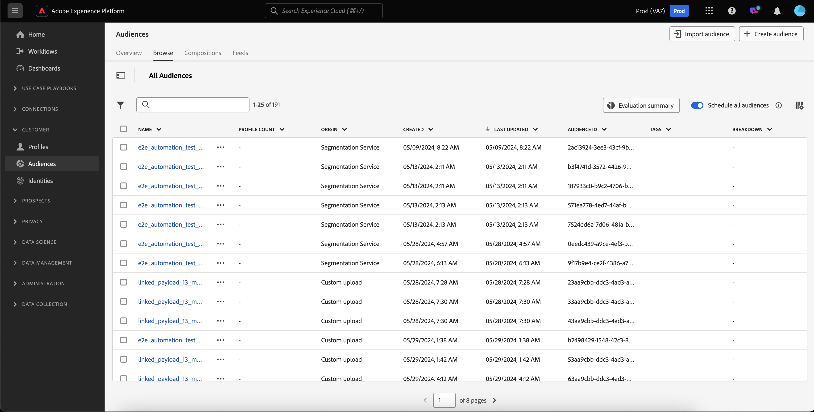

# Handbuch für Personen-Zielgruppen

In Adobe Experience Platform können Sie mit personenbasierten Zielgruppen bestimmte Personengruppen für Ihre Marketing-Kampagnen ansprechen.

Zielgruppen verwenden Kundenprofildaten, um bestimmte Märkte anzusprechen, sodass Sie besser auf bestimmte Demographien zugeschnitten sind, für die Sie werben möchten.

## Terminologie {#terminology}

Bevor Sie mit Personen und Zielgruppen beginnen, überprüfen Sie bitte die Unterschiede zwischen den verschiedenen Zielgruppentypen:

- **Konto-Zielgruppen**: Eine Konto-Zielgruppe ist eine Zielgruppe, die mithilfe von Profildaten **Konto** erstellt wird. Account-Profildaten können verwendet werden, um Audiences zu erstellen, die Personen in nachgelagerten Accounts ansprechen. Weitere Informationen zu Konto-Zielgruppen finden Sie unter [Konto-Zielgruppe - Übersicht](./account-audiences.md).
- **Personen-Zielgruppen**: Eine Personen-Zielgruppe ist eine Zielgruppe, die mithilfe von **Kunden-)** erstellt wird. Kundenprofildaten können verwendet werden, um Zielgruppen zu erstellen, die auf die Kunden Ihres Unternehmens ausgerichtet sind.
- **Interessenten-Zielgruppen**: Eine Interessenten-Zielgruppe ist eine Zielgruppe, die mithilfe von Profildaten **Interessenten** erstellt wird. Daten von Interessentenprofilen können verwendet werden, um Zielgruppen von nicht authentifizierten Benutzern zu erstellen. Weitere Informationen zu Zielgruppen potenzieller Kundinnen und Kunden finden Sie unter [Zielgruppenübersicht potenzieller Kundinnen und Kunden](./prospect-audiences.md).

## Zugriff {#access}

Um auf Personen und Zielgruppen zuzugreifen, wählen Sie **[!UICONTROL Zielgruppen]** im Abschnitt **[!UICONTROL Kunden]** aus.

Das Zielgruppen-Portal wird mit einer Liste aller Personen und Zielgruppen für die Organisation angezeigt.

Diese Ansicht listet Informationen zur Zielgruppe auf, einschließlich Name, Profilanzahl, Herkunft, Lebenszyklusstatus, Erstellungsdatum und Datum der letzten Aktualisierung.

Sie können auch die Such- und Filterfunktion verwenden, um schnell nach bestimmten Konto-Zielgruppen zu suchen und zu sortieren. Weitere Informationen zu dieser Funktion finden Sie im Abschnitt [Zielgruppenportal - Übersicht](../ui/audience-portal.md#manage-audiences).

## Zielgruppendetails {#details}

Um Details zu einer bestimmten Personen-Audience anzuzeigen, wählen Sie eine Audience im Audience Portal aus.

Die Seite mit den Zielgruppendetails wird angezeigt. Es werden Informationen wie Beschreibung, Herkunft und Lebenszyklusstatus angezeigt.

Weitere Informationen zur Seite mit Zielgruppendetails finden Sie im Abschnitt [Zielgruppendetails“ der Übersicht über das Zielgruppenportal](../ui/audience-portal.md#audience-details).

## Zielgruppe erstellen {#create}

Sie können eine Zielgruppe für Personen entweder mit Audience Composer oder Segment Builder erstellen. Um mit der Erstellung einer Zielgruppe für Personen zu beginnen, wählen Sie im Zielgruppen-Portal die Option Zielgruppe erstellen aus.

Es wird ein Pop-up angezeigt, in dem Sie auswählen können, ob Sie eine Zielgruppe oder Regeln erstellen möchten.

Ausführlichere Informationen zum Erstellen von Zielgruppen finden Sie in der [Zielgruppen-Portal - Übersicht](../ui/audience-portal.md#create-audience).

## Zielgruppe aktivieren {#activate}

Nachdem Sie Ihre Zielgruppe für Personen erstellt haben, können Sie diese Zielgruppe für andere nachgelagerte Services aktivieren.

Wählen Sie die Zielgruppe aus, die Sie aktivieren möchten, und dann **[!UICONTROL Für Ziel aktivieren]**.

Die [!UICONTROL Ziel aktivieren] wird angezeigt, wobei die Liste der verfügbaren Ziele von der Aktualisierungshäufigkeit der Zielgruppe abhängt. Weiterführende Informationen zum Aktivierungsprozess finden Sie in der [Aktivierungsübersicht](../../destinations/ui/activation-overview.md).

## Nächste Schritte

Nach dem Lesen dieses Handbuchs wissen Sie, wie Sie Ihre People -Zielgruppen in Adobe Experience Platform erstellen und verwalten. Informationen zu den verschiedenen Typen von Zielgruppen finden Sie in der [Übersicht über Zielgruppentypen](./overview.md).
