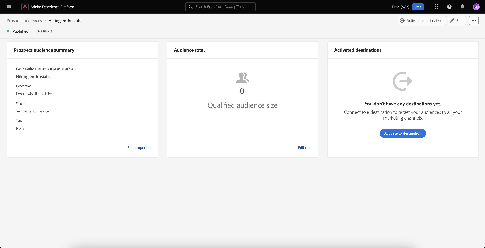

# Potenzielle Zielgruppen

Mit Adobe Experience Platform können Sie [Profile potenzieller Zielgruppen](../../profile/ui/prospect-profile.md) mit der ganzen Leichtigkeit und Raffinesse der Segmentierung versehen, die für Marketing-Fachleute hilfreich ist. Sie können die Zeit für die Zusammenstellung von Zielgruppen drastisch reduzieren, indem Sie Ihre eigenen potenziellen Zielgruppen erstellen und dabei Partnerdaten verantwortungsvoll verwenden.

## Zugriff {#access}

Um auf die potenziellen Zielgruppen zuzugreifen, wählen Sie **[!UICONTROL Zielgruppen]** im Abschnitt **[!UICONTROL Interessierte]**.

![Die Schaltfläche [!UICONTROL Zielgruppen] ist im Bereich [!UICONTROL Interessierte] hervorgehoben.](../images/types/prospect/prospect-audiences.png)

Das Zielgruppen-Portal wird mit einer Liste aller potenziellen Zielgruppen für die Organisation angezeigt.

Diese Ansicht listet Informationen zur Zielgruppe auf, einschließlich Name, Profilanzahl, Ursprung, Lebenszyklusstatus, Erstellungsdatum, Datum der letzten Aktualisierung und Aufschlüsselung.

Sie können dieser Anzeige zusätzliche Felder hinzufügen, indem Sie das  auswählen. Diese zusätzlichen Felder umfassen die Aktualisierungshäufigkeit und „Zuletzt aktualisiert von“.

Weitere Informationen zu Audience Portal, einschließlich detaillierter Informationen zu den aufgelisteten Feldern, finden Sie unter [Audience Portal - Übersicht](../ui/audience-portal.md#list).

## Zielgruppendetails {#details}

Um Details zu einer bestimmten potenziellen Zielgruppe anzuzeigen, wählen Sie eine Zielgruppe im Zielgruppenportal aus.

Die Seite mit Details zur potenziellen Zielgruppe wird angezeigt. Es werden Informationen wie die Zusammenfassung der potenziellen Zielgruppe, die Gesamtanzahl der Zielgruppen und die aktivierten Ziele angezeigt.

Weitere Informationen zur Seite mit Zielgruppendetails finden Sie im Abschnitt [Zielgruppendetails“ der Übersicht über das Zielgruppenportal](../ui/audience-portal.md#audience-details).

## Zielgruppe erstellen {#create}

Um eine Zielgruppe für Interessenten zu erstellen, wählen Sie im Zielgruppen-Portal **[!UICONTROL Zielgruppe erstellen]** aus.

![Die Schaltfläche [!UICONTROL Zielgruppe erstellen] ist auf der Seite zum Durchsuchen der potenziellen Zielgruppen hervorgehoben.](../images/types/prospect/select-create-audience.png)

Der Segment Builder wird angezeigt. Die Interessenten-Profilattribute werden in der linken Navigationsleiste angezeigt.

.

Weitere Informationen zur Verwendung von Segment Builder finden Sie im [Handbuch zur Benutzeroberfläche von Segment Builder](../ui/segment-builder.md).

## Vorgeschlagene Anwendungsfälle {#use-cases}

Informationen dazu, wie Sie die Funktion „Interessente Zielgruppen“ in Experience Platform in Kombination mit anderen Experience Platform-Funktionen verwenden können, finden Sie in der Dokumentation zum folgenden Anwendungsfall:

- [Engagieren und Akquirieren neuer Kundinnen und Kunden über die Interessentenfunktion](../../rtcdp/partner-data/prospecting.md)

## Nächste Schritte

Nach dem Lesen dieses Handbuchs wissen Sie jetzt, wie Sie Ihre potenziellen Zielgruppen in Adobe Experience Platform erstellen und verwalten können. Informationen zum Aktivieren einer potenziellen Zielgruppe für andere nachgelagerte Dienste finden Sie im Handbuch zum [Aktivieren potenzieller Zielgruppen](../../destinations/ui/activate-prospect-audiences.md).
