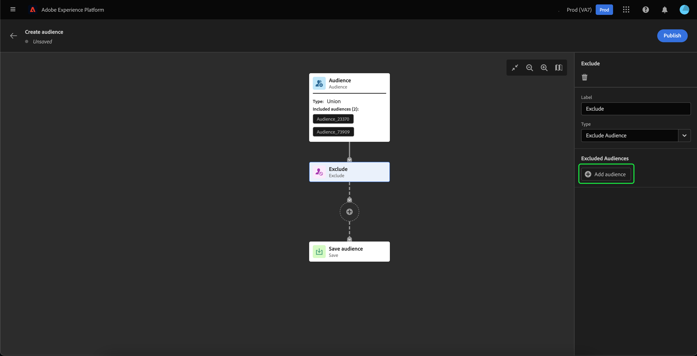
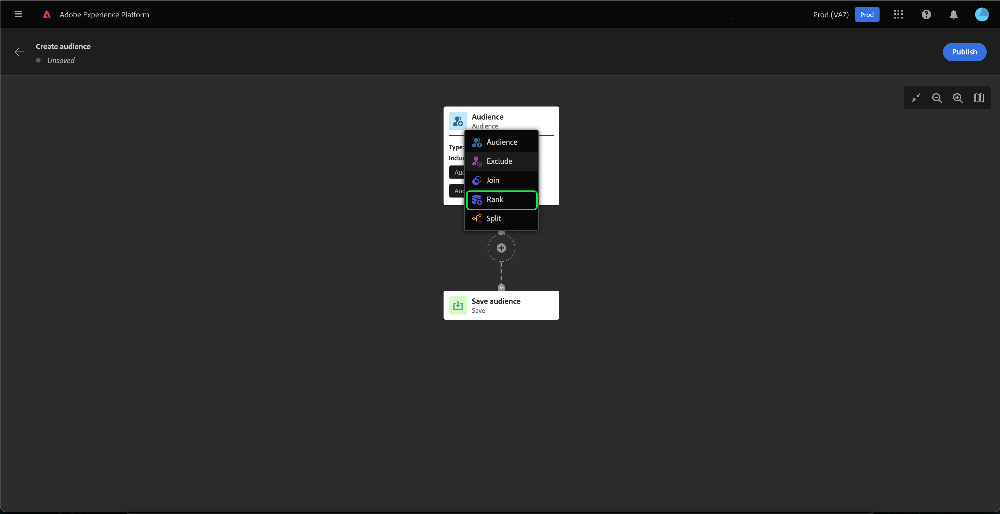
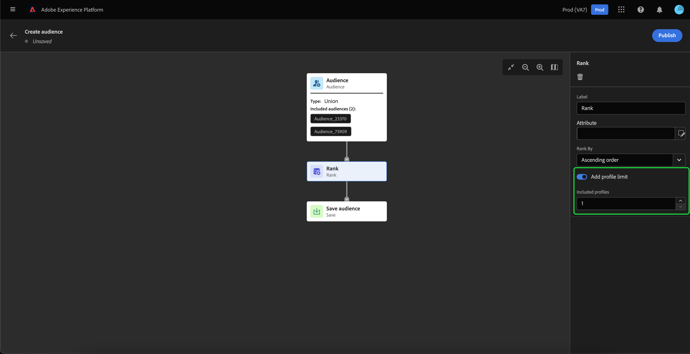

# Handbuch zur Benutzeroberfläche von Audience Builder

>[!IMPORTANT]
>
>Audience Builder befindet sich derzeit in der Beta-Phase und steht nicht allen Benutzenden zur Verfügung. Dokumentation und Funktionalitäten können sich ändern.

Audience Builder bietet einen Arbeitsbereich zum Erstellen und Bearbeiten von Zielgruppen mithilfe von Blöcken, die zur Darstellung verschiedener Aktionen verwendet werden.

Die Arbeitsfläche für die Zielgruppenkomposition besteht aus fünf verschiedenen Blocktypen: **[[!UICONTROL Zielgruppe]](#audience-block)**, **[[!UICONTROL Ausschließen]](#exclude-block)**, **[[!UICONTROL Zusammenführen]](#join-block)**, **[[!UICONTROL Rang]](#rank-block)** und **[[!UICONTROL Aufspaltung]](#split-block)**.

## [!UICONTROL Zielgruppe] {#audience-block}

Mit dem Block **[!UICONTROL Zielgruppe]** können Sie die Unterzielgruppen hinzufügen, aus denen Sie Ihre neue größere Zielgruppe erstellen möchten. Standardmäßig ist ein **[!UICONTROL Zielgruppen]**-Block oben auf der Arbeitsfläche für die Komposition enthalten.

Wenn Sie den **[!UICONTROL Zielgruppen]**-Block auswählen, werden in der rechten Leiste Steuerelemente zum Kennzeichnen und Hinzufügen von Zielgruppen zum Block angezeigt.

Nach Auswahl von **[!UICONTROL Zielgruppe hinzufügen]** wird eine Liste von Zielgruppen angezeigt. Wählen Sie die Zielgruppe aus, die Sie einbeziehen möchten, und dann **[!UICONTROL Hinzufügen]**, um sie an Ihren Zielgruppen-Block anzuhängen.

Ihre ausgewählten Zielgruppen werden jetzt in der rechten Leiste angezeigt, wenn der Block **[!UICONTROL Zielgruppe]** aktiviert ist. Von hier aus können Sie den Zusammenführungstyp der kombinierten Zielgruppen ändern.

| Zusammenführungstyp | Beschreibung |
| ---------- | ----------- |
| [!UICONTROL Vereinigung] | Die Zielgruppen werden zu einer Zielgruppe zusammengefasst. Dies entspricht einem OR-Vorgang. |
| [!UICONTROL Schnittmenge] | Die Zielgruppen werden nur mit den Zielgruppen kombiniert, die in **allen** freigegeben sind und hinzugefügt werden. Dies entspricht einem AND-Vorgang. |
| [!UICONTROL Ausschließen von Überschneidungen] | Die Zielgruppen werden kombiniert, wobei nur die Zielgruppen hinzugefügt werden, die zu genau **einer, aber nicht zu allen** gehören. Dies entspricht einem XOR-Vorgang. |

## [!UICONTROL Ausschließen] {#exclude-block}

Mit dem Blocktyp **[!UICONTROL Ausschließen]** können Sie bestimmte Unterzielgruppen oder Attribute aus Ihrer neuen größeren Zielgruppe ausschließen.

Um einen Block **[!UICONTROL Ausschließen]** hinzuzufügen, wählen Sie das Symbol **+** und dann **[!UICONTROL Ausschließen]** aus.

Der Block **[!UICONTROL Ausschließen]** wird hinzugefügt. Wenn dieser Block ausgewählt ist, werden Details zum Ausschluss in der rechten Leiste angezeigt. Dazu gehören die Kennzeichnung und der Ausschlusstyp des Blocks. Sie können [nach Zielgruppe](#exclude-audience) oder [nach Attribut](#exclude-attribute) ausschließen.

### Ausschließen nach Zielgruppe {#exclude-audience}

Wenn Sie nach Zielgruppe ausschließen, können Sie durch Auswahl von **[!UICONTROL Zielgruppe hinzufügen]** auswählen, welche Zielgruppen ausgeschlossen werden sollen.

Eine Liste von Zielgruppen wird angezeigt. Wählen Sie **[!UICONTROL Hinzufügen]** aus, um die Zielgruppen, die ausgeschlossen werden sollen, Ihrem Ausschlussblock hinzuzufügen.

### Ausschließen nach Attribut {#exclude-attribute}

Wenn Sie nach Attribut ausschließen, können Sie durch Auswahl des Symbols  innerhalb des Abschnitts **[!UICONTROL Ausschlussregel]** festlegen, welche Attribute ausgeschlossen werden sollen.

Eine Liste der Profilattribute wird angezeigt. Wählen Sie den Attributtyp aus, den Sie ausschließen möchten, und dann **[!UICONTROL Auswählen]**, um diese Attribute zu Ihrem Ausschlussblock hinzuzufügen.

## [!UICONTROL Zusammenführen] {#join-block}

Mit dem Blocktyp **[!UICONTROL Zusammenführen]** können Sie externe Zielgruppen aus Datensätzen hinzufügen, die noch nicht von Adobe Experience Platform verarbeitet wurden.

Um einen Block **[!UICONTROL Zusammenführen]** hinzuzufügen, wählen Sie das Symbol **+** und dann **[!UICONTROL Zusammenführen]** aus.

Wenn Sie den Block auswählen, werden in der rechten Leiste Details zur Zusammenführung angezeigt, einschließlich der Kennzeichnung des Blocks und der Option, Zielgruppen zum Anreicherungsdatensatz hinzuzufügen.

Nach Auswahl von **[!UICONTROL Zielgruppe hinzufügen]** wird eine Liste von Zielgruppen angezeigt. Wählen Sie die Zielgruppen aus, die Sie einbeziehen möchten, und dann **[!UICONTROL Hinzufügen]**, um sie zum Block „Zusammenführen“ hinzuzufügen.

Ihre ausgewählten Zielgruppen werden jetzt in der rechten Leiste angezeigt, wenn der Block **[!UICONTROL Zusammenführen]** aktiviert ist.

## [!UICONTROL Rang] {#rank-block}

Mit dem Blocktyp **[!UICONTROL Rang]** können Sie die Zielgruppen vor der Veröffentlichung Ihrer neuen Zielgruppe nach Rang ordnen und sortieren.

Um einen Block **[!UICONTROL Rang]** hinzuzufügen, wählen Sie das Symbol **+** und dann **[!UICONTROL Rang]** aus.

Bei der Auswahl des Blocks werden Details zum Rang in der rechten Leiste angezeigt, einschließlich der Kennzeichnung des Blocks, des nach Rang zu ordnenden Attributs, der Rangreihenfolge und eines Umschalters zur Begrenzung der Anzahl der nach Rang zu ordnenden Profile.

Um festzulegen, nach welchem Attribut die Zielgruppen geordnet werden sollen, wählen Sie das Symbol  aus.

Eine Liste der Profilattribute wird angezeigt. In diesem Popup können Sie den Attributtyp auswählen, nach dem Sie Ihre Zielgruppe ordnen möchten. Wählen Sie **[!UICONTROL Auswählen]** aus, um ihn Ihrem Block „Rang“ hinzuzufügen. Beachten Sie, dass das ausgewählte Attribut **nur** vom Typ `int` sein kann.

Nach Auswahl des Attributs können Sie die Reihenfolge auswählen, nach der geordnet werden soll. Dies geschieht entweder in aufsteigender (von niedrigster zu höchster) oder in absteigender (von höchster zu niedrigster) Reihenfolge.

Darüber hinaus können Sie die Anzahl der zurückgegebenen Zielgruppen einschränken, indem Sie den Umschalter **[!UICONTROL Profil-Limit hinzufügen]** aktivieren. Wenn dieser Umschalter aktiviert ist, können Sie die maximale Anzahl von Zielgruppen festlegen, die innerhalb des Felds **[!UICONTROL Enthaltene Profile]** zurückgegeben wird.

## [!UICONTROL Aufspaltung] {#split-block}

Mit dem Blocktyp **[!UICONTROL Aufspaltung]** können Sie Ihre neue Zielgruppe in verschiedene Unterzielgruppen unterteilen. Sie können diese Zielgruppe entweder nach Prozentsatz oder nach einem Attribut aufteilen.

Um einen Block **[!UICONTROL Aufspaltung]** hinzuzufügen, wählen Sie das Symbol **+** und dann **[!UICONTROL Aufspaltung]** aus.

### Aufspaltung nach Prozentsatz {#split-percentage}

Bei der Aufteilung nach Prozentsatz werden die Zielgruppen nach dem Zufallsprinzip auf Grundlage der Anzahl der angegebenen Pfade und Prozentsätze aufgeteilt.

Beispielsweise wären drei Pfade mit jeweils unterschiedlichen Prozentsätzen an Profilen möglich.

Darüber hinaus können Sie eine der aufgeteilten Zielgruppen als Kontrollgruppe markieren.

### Aufspaltung nach Attribut {#split-attribute}

Bei der Aufteilung nach Attribut werden die Zielgruppen anhand der bereitgestellten Attribute aufgeteilt. Um das Attribut auszuwählen, nach dem aufgeteilt werden soll, wählen Sie den Block **[!UICONTROL Aufspaltung]** und dann das Symbol  aus.

Eine Liste der Profilattribute wird angezeigt. Wählen Sie den Attributtyp und dann **[!UICONTROL Auswählen]** aus, um ihn zu Ihrem Block hinzuzufügen.

Nach Auswahl des Attributs können Sie festlegen, welche Profile zu welcher Unterzielgruppe gehören werden, indem Sie die Werte im Feld **[!UICONTROL Werte]** hinzufügen.

Darüber hinaus können Sie den Umschalter **[!UICONTROL Andere Profile]** aktivieren, um eine Unterzielgruppe, die aus allen nicht ausgewählten Profilen besteht, zu erstellen.

## Veröffentlichen der Zielgruppe

Nachdem Sie Ihre Zielgruppe erstellt haben, können Sie sie speichern und veröffentlichen, indem Sie **[!UICONTROL Veröffentlichen]** auswählen.

Wenn bei der Erstellung der Zielgruppe Fehler auftreten, wird ein Warnhinweis angezeigt, über den Sie erfahren, wie Sie das Problem beheben können.

## Nächste Schritte

Audience Builder bietet einen umfassenden Workflow, mit dem Sie Zielgruppen der verschiedenen Blocktypen erstellen können. Weitere Informationen zu anderen Teilen der Segmentierungs-Service-Benutzeroberfläche finden Sie im [Segmentierungs-Service-Benutzerhandbuch](./overview.md).
