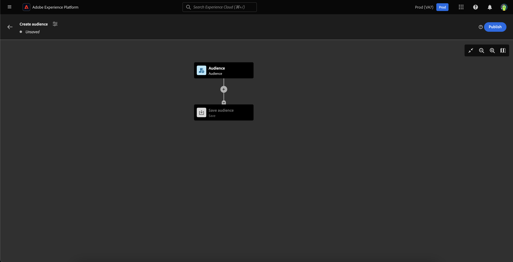
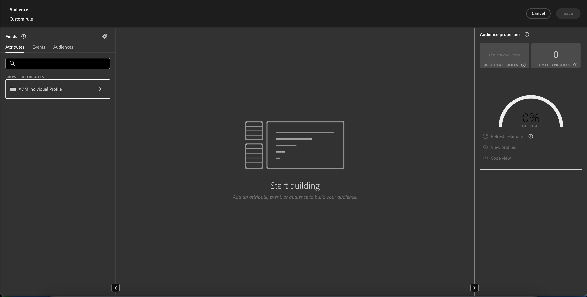
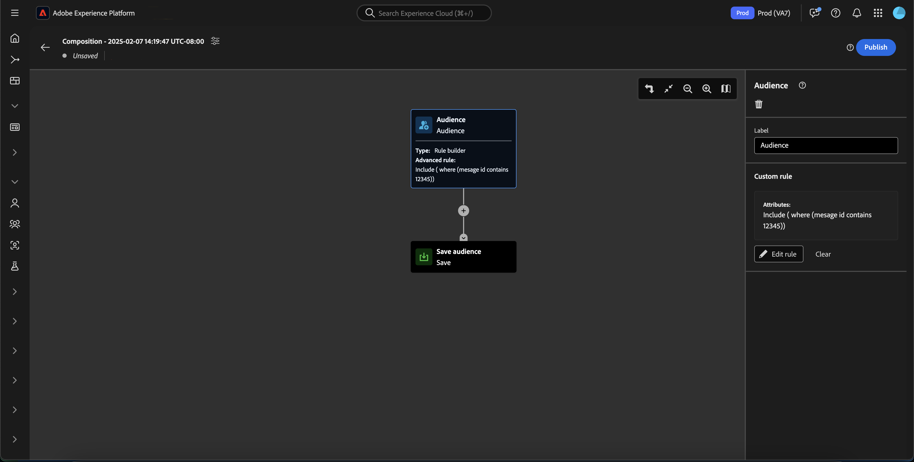
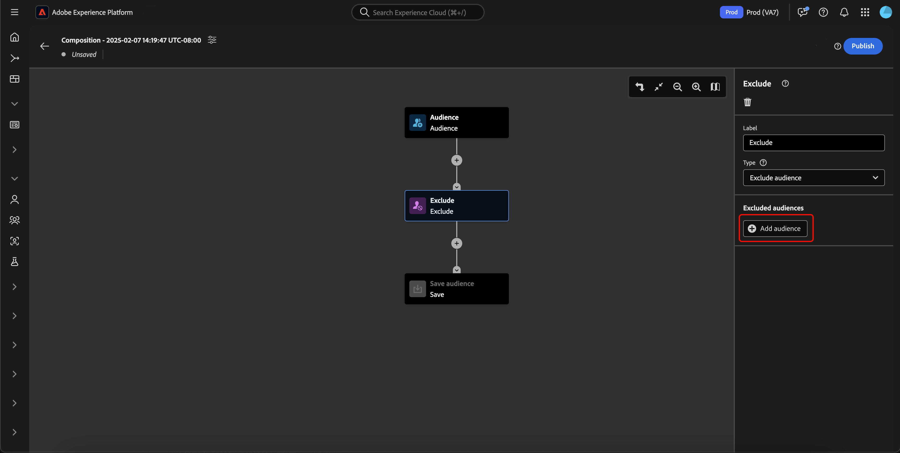
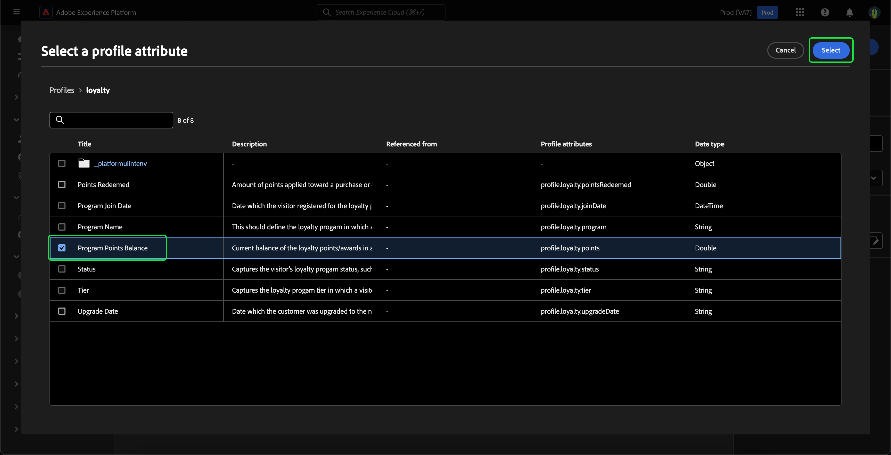
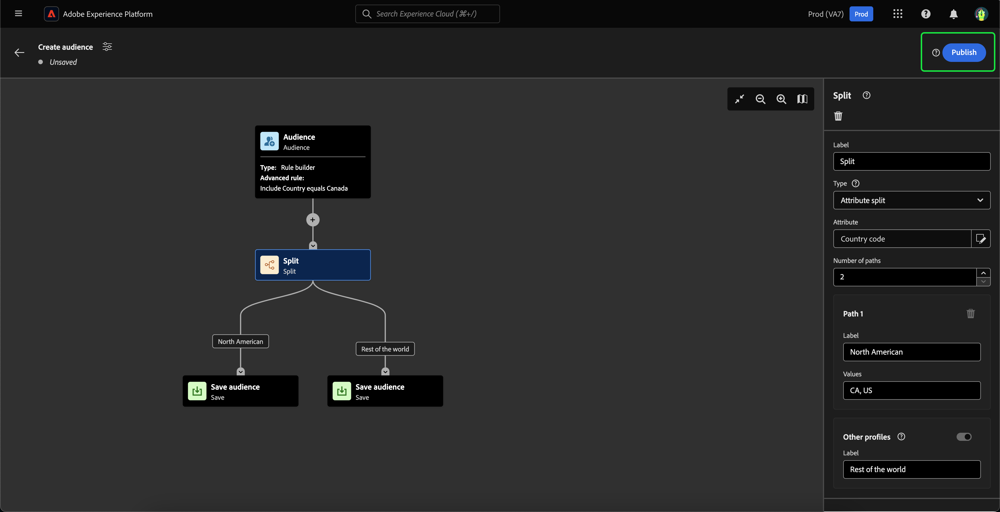

# Handbuch zur Benutzeroberfläche für Zielgruppenkomposition

Zielgruppenkomposition bietet einen Arbeitsbereich zum Erstellen und Bearbeiten von Zielgruppen mithilfe von Bausteinen, die zur Darstellung verschiedener Aktionen verwendet werden.

Um die Details der Komposition, einschließlich Titel und Beschreibung, zu ändern, wählen Sie die  Schaltfläche.

Die **[!UICONTROL Kompositionseigenschaften]** Popup angezeigt. Sie können Details zu Ihrer Komposition einfügen, einschließlich Titel und Beschreibung hier.

>[!NOTE]
>
>Wenn Sie **not** Geben Sie Ihrer Komposition einen Titel, sie hat einen Titel &quot;Komposition&quot;, gefolgt von dem Erstellungsdatum und der Erstellungszeit standardmäßig.

Nachdem Sie die Details Ihrer Komposition aktualisiert haben, wählen Sie **[!UICONTROL Speichern]** um diese Aktualisierungen zu bestätigen. Die Arbeitsfläche für die Zielgruppenzusammensetzung wird erneut angezeigt.

Die Arbeitsfläche für die Zielgruppenzusammensetzung besteht aus vier verschiedenen Baustypen: **[[!UICONTROL Zielgruppe]](#audience-block)**, **[[!UICONTROL Ausschließen]](#exclude-block)**, **[[!UICONTROL Rang]](#rank-block)** und **[[!UICONTROL Aufspaltung]](#split-block)**.

## [!UICONTROL Zielgruppe] {#audience-block}

Mit dem Block **[!UICONTROL Zielgruppe]** können Sie die Unterzielgruppen hinzufügen, aus denen Sie Ihre neue größere Zielgruppe erstellen möchten. Standardmäßig ist ein **[!UICONTROL Zielgruppen]**-Block oben auf der Arbeitsfläche für die Komposition enthalten.

Wenn Sie die **[!UICONTROL Zielgruppe]** -Baustein, zeigt die rechte Leiste Steuerelemente für die Kennzeichnung der Zielgruppe, das Hinzufügen von Zielgruppen zum Baustein sowie das Erstellen benutzerdefinierter Regeln für den Zielgruppenblock an.

>[!NOTE]
>
>Sie können entweder Zielgruppen hinzufügen **oder** eine benutzerspezifische Regel erstellen. Diese beiden Funktionen **cannot** zusammen verwendet werden.

### [!UICONTROL Audience hinzufügen] {#add-audience}

So fügen Sie Zielgruppen zum Audience -Block hinzu. select **[!UICONTROL Zielgruppe hinzufügen]**.

Eine Liste von Zielgruppen wird angezeigt. Wählen Sie die Zielgruppe aus, die Sie einbeziehen möchten, und dann **[!UICONTROL Hinzufügen]**, um sie an Ihren Zielgruppen-Block anzuhängen.

Ihre ausgewählten Zielgruppen werden jetzt in der rechten Leiste angezeigt, wenn der Block **[!UICONTROL Zielgruppe]** aktiviert ist. Von hier aus können Sie den Zusammenführungstyp der kombinierten Zielgruppen ändern.

| Zusammenführungstyp | Beschreibung |
| ---------- | ----------- |
| [!UICONTROL Vereinigung] | Die Zielgruppen werden zu einer Zielgruppe zusammengefasst. Dies entspricht einem OR-Vorgang. |
| [!UICONTROL Schnittmenge] | Die Zielgruppen werden nur mit den Zielgruppen kombiniert, die in **allen** freigegeben sind und hinzugefügt werden. Dies entspricht einem AND-Vorgang. |
| [!UICONTROL Ausschließen von Überschneidungen] | Die Zielgruppen werden kombiniert, wobei nur die Zielgruppen hinzugefügt werden, die zu genau **einer, aber nicht zu allen** gehören. Dies entspricht einem XOR-Vorgang. |

### [!UICONTROL Regel erstellen] {#build-rule}

Um eine benutzerdefinierte Regel zum Audience-Block hinzuzufügen, wählen Sie **[!UICONTROL Regel erstellen]**.

Segment Builder wird angezeigt. Sie können den Segment Builder verwenden, um eine benutzerdefinierte Regel für die Zielgruppe zu erstellen. Weitere Informationen zur Verwendung von Segment Builder finden Sie im Abschnitt [Segment Builder-Handbuch](./segment-builder.md).

Nachdem Sie eine benutzerdefinierte Regel hinzugefügt haben, wählen Sie **[!UICONTROL Speichern]** , um die Regel Ihrer Zielgruppe hinzuzufügen.

## [!UICONTROL Ausschließen] {#exclude-block}

Mit dem Blocktyp **[!UICONTROL Ausschließen]** können Sie bestimmte Unterzielgruppen oder Attribute aus Ihrer neuen größeren Zielgruppe ausschließen.

Um einen Block **[!UICONTROL Ausschließen]** hinzuzufügen, wählen Sie das Symbol **+** und dann **[!UICONTROL Ausschließen]** aus.

Der Block **[!UICONTROL Ausschließen]** wird hinzugefügt. Wenn dieser Block ausgewählt ist, werden Details zum Ausschluss in der rechten Leiste angezeigt. Dazu gehören die Kennzeichnung und der Ausschlusstyp des Blocks. Sie können [nach Zielgruppe](#exclude-audience) oder [nach Attribut](#exclude-attribute) ausschließen.

### Ausschließen nach Zielgruppe {#exclude-audience}

Wenn Sie nach Zielgruppe ausschließen, können Sie durch Auswahl von **[!UICONTROL Zielgruppe hinzufügen]** auswählen, welche Zielgruppen ausgeschlossen werden sollen.

Eine Liste von Zielgruppen wird angezeigt. Wählen Sie **[!UICONTROL Hinzufügen]** aus, um die Zielgruppen, die ausgeschlossen werden sollen, Ihrem Ausschlussblock hinzuzufügen.

### Ausschließen nach Attribut {#exclude-attribute}

Wenn Sie nach Attribut ausschließen, können Sie durch Auswahl des Symbols  innerhalb des Abschnitts **[!UICONTROL Ausschlussregel]** festlegen, welche Attribute ausgeschlossen werden sollen.

Eine Liste der Profilattribute wird angezeigt. Wählen Sie den Attributtyp aus, den Sie ausschließen möchten, und dann **[!UICONTROL Auswählen]**, um diese Attribute zu Ihrem Ausschlussblock hinzuzufügen.

<!-- ## [!UICONTROL Join] {#join-block}

The **[!UICONTROL Join]** block type allows you to add in external audiences from datasets that have not yet been processed by Adobe Experience Platform.

To add a **[!UICONTROL Join]** block, select the **+** icon, followed by **[!UICONTROL Join]**.

When you select the block, details about the join are shown in the right rail, including the block's label and the option to add audiences to the enrichment dataset.

After selecting **[!UICONTROL Add Audience]**, a list of audiences appears. Select the audiences you want to include, followed by **[!UICONTROL Add]** to add them to your join block.

Your selected audiences now appear within the right rail when the **[!UICONTROL Join]** block is selected. 

 -->

## [!UICONTROL Rang] {#rank-block}

Die **[!UICONTROL Rang]** Mit dem Blocktyp können Sie Profile nach einem bestimmten Attribut sortieren und sortieren und diese bewerteten Profile in Ihre Komposition aufnehmen.

Um einen Block **[!UICONTROL Rang]** hinzuzufügen, wählen Sie das Symbol **+** und dann **[!UICONTROL Rang]** aus.

Bei der Auswahl des Blocks werden Details zum Rang in der rechten Leiste angezeigt, einschließlich der Kennzeichnung des Blocks, des nach Rang zu ordnenden Attributs, der Rangreihenfolge und eines Umschalters zur Begrenzung der Anzahl der nach Rang zu ordnenden Profile.

Um festzulegen, nach welchem Attribut die Zielgruppen geordnet werden sollen, wählen Sie das Symbol  aus.

Eine Liste der Profilattribute wird angezeigt. In diesem Popup können Sie den Attributtyp auswählen, nach dem Sie Ihre Zielgruppe ordnen möchten. Wählen Sie **[!UICONTROL Auswählen]** aus, um ihn Ihrem Block „Rang“ hinzuzufügen. Beachten Sie, dass das ausgewählte Attribut **only** sind Zahlen.

Nach Auswahl des Attributs können Sie die Reihenfolge auswählen, nach der geordnet werden soll. Dies geschieht entweder in aufsteigender (von niedrigster zu höchster) oder in absteigender (von höchster zu niedrigster) Reihenfolge.

Darüber hinaus können Sie die Anzahl der zurückgegebenen Zielgruppen einschränken, indem Sie den Umschalter **[!UICONTROL Profil-Limit hinzufügen]** aktivieren. Wenn dieser Umschalter aktiviert ist, können Sie die maximale Anzahl von Zielgruppen festlegen, die innerhalb des Felds **[!UICONTROL Enthaltene Profile]** zurückgegeben wird.

## [!UICONTROL Aufspaltung] {#split-block}

Mit dem Blocktyp **[!UICONTROL Aufspaltung]** können Sie Ihre neue Zielgruppe in verschiedene Unterzielgruppen unterteilen. Sie können diese Zielgruppe entweder nach Prozentsatz oder nach einem Attribut aufteilen.

Um einen Block **[!UICONTROL Aufspaltung]** hinzuzufügen, wählen Sie das Symbol **+** und dann **[!UICONTROL Aufspaltung]** aus.

### Aufspaltung nach Prozentsatz {#split-percentage}

Bei der Aufteilung nach Prozentsatz werden die Zielgruppen nach dem Zufallsprinzip auf Grundlage der Anzahl der angegebenen Pfade und Prozentsätze aufgeteilt.

Beispielsweise wären drei Pfade mit jeweils unterschiedlichen Prozentsätzen an Profilen möglich.

### Aufspaltung nach Attribut {#split-attribute}

Bei der Aufteilung nach Attribut werden die Zielgruppen anhand der bereitgestellten Attribute aufgeteilt. Um das Attribut auszuwählen, nach dem aufgeteilt werden soll, wählen Sie den Block **[!UICONTROL Aufspaltung]** und dann das Symbol  aus.

Eine Liste der Profilattribute wird angezeigt. Wählen Sie den Attributtyp und dann **[!UICONTROL Auswählen]** aus, um ihn zu Ihrem Block hinzuzufügen.

Nach Auswahl des Attributs können Sie festlegen, welche Profile zu welcher Unterzielgruppe gehören werden, indem Sie die Werte im Feld **[!UICONTROL Werte]** hinzufügen.

Darüber hinaus können Sie den Umschalter **[!UICONTROL Andere Profile]** aktivieren, um eine Unterzielgruppe, die aus allen nicht ausgewählten Profilen besteht, zu erstellen.

## Veröffentlichen der Zielgruppe

Nachdem Sie Ihre Zielgruppe erstellt haben, können Sie sie speichern und veröffentlichen, indem Sie **[!UICONTROL Veröffentlichen]** auswählen.

Wenn bei der Erstellung der Zielgruppe Fehler auftreten, wird ein Warnhinweis angezeigt, über den Sie erfahren, wie Sie das Problem beheben können.

## Nächste Schritte

Zielgruppenkomposition bietet einen umfassenden Workflow, mit dem Sie Zielgruppen aus den verschiedenen Blocktypen erstellen können. Weitere Informationen zu anderen Teilen der Segmentierungs-Service-Benutzeroberfläche finden Sie im [Segmentierungs-Service-Benutzerhandbuch](./overview.md).
