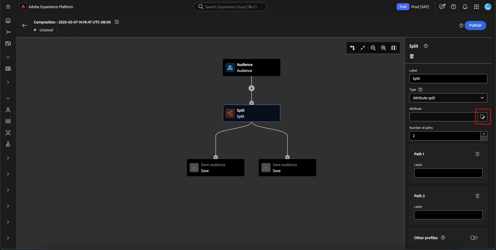
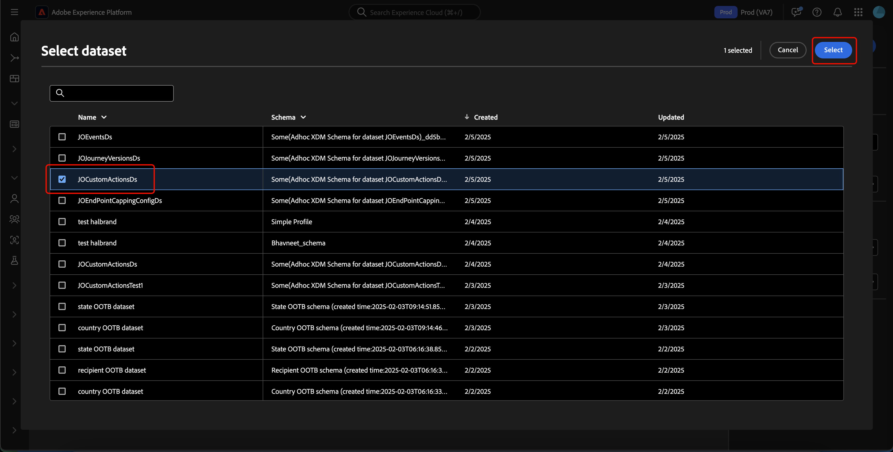
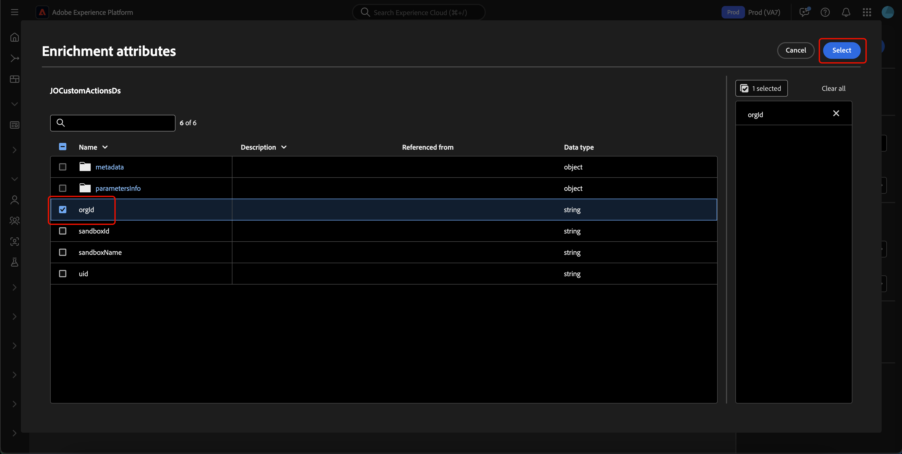

# Handbuch zur Benutzeroberfläche der Zielgruppenkomposition

>[!AVAILABILITY]
>
>Um diese Funktion verwenden zu können, müssen Sie über die folgenden Berechtigungen verfügen:
>
>- Segmente verwalten
>- Verwalten von Profilen
>- Verwalten von Zusammenführungsrichtlinien
>
>Weitere Informationen zu Berechtigungen in Platform finden Sie unter [Zugriffssteuerung - Übersicht](../../access-control/home.md#permissions).

>[!NOTE]
>
>In diesem Handbuch wird beschrieben, wie Sie Zielgruppen mithilfe der Zielgruppenkomposition erstellen. Informationen zum Erstellen von Zielgruppen durch Segmentdefinitionen mithilfe von Segment Builder finden Sie im [Handbuch zur Benutzeroberfläche von Segment Builder](./segment-builder.md).

Die Zielgruppenkomposition bietet einen Arbeitsbereich zum Erstellen und Bearbeiten von Zielgruppen mithilfe von Blöcken, die zur Darstellung verschiedener Aktionen verwendet werden.

Um die Details der Komposition, einschließlich Titel und Beschreibung, zu ändern, wählen Sie die Schaltfläche .

Das Popup-Fenster **[!UICONTROL Kompositionseigenschaften]** erscheint. Sie können hier Details zu Ihrer Komposition einfügen, einschließlich Titel und Beschreibung.

>[!NOTE]
>
>Wenn Sie **nicht** geben Sie Ihrer Komposition einen Titel, hat sie standardmäßig den Titel „Komposition“ gefolgt von Erstellungsdatum und -zeit. Darüber hinaus **jede Komposition** eigenen eindeutigen Namen haben.

Nachdem Sie die Details Ihrer Komposition aktualisiert haben, wählen Sie **[!UICONTROL Speichern]**, um diese Aktualisierungen zu bestätigen. Die Arbeitsfläche für die Zielgruppenkomposition wird erneut angezeigt.

Die Arbeitsfläche für die Zielgruppenkomposition besteht aus vier verschiedenen Blocktypen: **[[!UICONTROL Zielgruppe]](#audience-block)**, **[[!UICONTROL Ausschluss]](#exclude-block)**, **[[!UICONTROL Rang]](#rank-block)** und **[[!UICONTROL Aufteilung]](#split-block)**.

## [!UICONTROL Zielgruppe] {#audience-block}

>[!CONTEXTUALHELP]
>id="platform_segmentation_ao_audience"
>title="Block „Zielgruppe“"
>abstract="Mit dem Block „Zielgruppe“ können Sie die Unterzielgruppen hinzufügen, die Sie zum Erstellen der neuen Zielgruppe verwenden möchten."

>[!CONTEXTUALHELP]
>id="platform_segmentation_ao_merge_types"
>title="Fusionieren von Typen"
>abstract="Die Zusammenführungstypen bestimmen, wie die ausgewählten Unterzielgruppen kombiniert werden. Unterstützte Werte sind „Vereinigung“, „Schnittmenge“ und „Überschneidung ausschließen“."

Mit **[!UICONTROL Blocktyp]** Zielgruppe“ können Sie die Unterzielgruppen hinzufügen, die Sie zum Erstellen Ihrer neuen größeren Zielgruppe verwenden möchten. Standardmäßig ist ein **[!UICONTROL Zielgruppen]**-Block oben auf der Arbeitsfläche für die Komposition enthalten.

Wenn Sie den Block **[!UICONTROL Zielgruppen]** auswählen, zeigt die rechte Leiste Steuerelemente für die Kennzeichnung der Zielgruppe, das Hinzufügen von Zielgruppen zum Block sowie das Erstellen benutzerdefinierter Regeln für den Zielgruppenblock an.

>[!NOTE]
>
>Sie können entweder Zielgruppen hinzufügen **oder** eine benutzerspezifische Regel erstellen. Diese beiden Funktionen können **nicht** zusammen verwendet werden.

### [!UICONTROL Zielgruppe hinzufügen] {#add-audience}

So fügen Sie Zielgruppen zum Zielgruppenblock hinzu. Wählen Sie **[!UICONTROL Zielgruppe hinzufügen]** aus.

>[!IMPORTANT]
>
>Beachten Sie, dass **nur** Zielgruppen angezeigt werden, die mithilfe der standardmäßigen Zusammenführungsrichtlinie definiert wurden.
>
>Darüber hinaus können nur **veröffentlichte** Zielgruppen verwendet werden, die mit Segment Builder erstellt wurden. Audiences, die mithilfe der Audience-Komposition und extern generierter Audiences erstellt wurden, sind **nicht** verfügbar.

Eine Liste von Zielgruppen wird angezeigt. Wählen Sie die Zielgruppe aus, die Sie einbeziehen möchten, und dann **[!UICONTROL Hinzufügen]**, um sie an Ihren Zielgruppen-Block anzuhängen.

Ihre ausgewählten Zielgruppen werden jetzt in der rechten Leiste angezeigt, wenn der Block **[!UICONTROL Zielgruppe]** aktiviert ist. Von hier aus können Sie den Zusammenführungstyp der kombinierten Zielgruppen ändern.

| Zusammenführungstyp | Beschreibung |
| ---------- | ----------- |
| [!UICONTROL Vereinigung] | Die Zielgruppen werden zu einer Zielgruppe zusammengefasst. Dies entspricht einem OR-Vorgang. |
| [!UICONTROL Schnittmenge] | Die Zielgruppen werden nur mit den Zielgruppen kombiniert, die in **allen** freigegeben sind und hinzugefügt werden. Dies entspricht einem AND-Vorgang. |
| [!UICONTROL Ausschließen von Überschneidungen] | Die Zielgruppen werden kombiniert, wobei nur die Zielgruppen hinzugefügt werden, die zu genau **einer, aber nicht zu allen** gehören. Dies entspricht einem XOR-Vorgang. |

### [!UICONTROL Regel erstellen] {#build-rule}

>[!CONTEXTUALHELP]
>id="platform_segmentation_ao_rule_builder"
>title="Segment Builder"
>abstract="Mit dem Segment Builder können Sie eine benutzerdefinierte Regel für die Komposition hinzufügen."

Um eine benutzerdefinierte Regel zum Zielgruppenblock hinzuzufügen, wählen Sie **[!UICONTROL Regel erstellen]**.

Der Segment Builder wird angezeigt. Sie können den Segment Builder verwenden, um eine benutzerdefinierte Regel für die Zielgruppe zu erstellen. Weitere Informationen zur Verwendung von Segment Builder finden Sie im [Segment Builder-Handbuch](./segment-builder.md).

Nachdem Sie eine benutzerdefinierte Regel hinzugefügt haben, wählen Sie **[!UICONTROL Speichern]** aus, um die Regel zu Ihrer Zielgruppe hinzuzufügen.

## [!UICONTROL Ausschließen] {#exclude-block}

>[!CONTEXTUALHELP]
>id="platform_segmentation_ao_exclude"
>title="Block „Ausschließen“"
>abstract="Mit dem Block „Ausschließen“ können Sie bestimmte Zielgruppen oder Attribute aus Ihrer Komposition ausschließen."

>[!CONTEXTUALHELP]
>id="platform_segmentation_ao_exclude_type"
>title="Typ des Ausschließens"
>abstract="Sie können entweder Profile, die zu einer bestimmten Zielgruppe gehören, ausschließen (nach Zielgruppe ausschließen) oder Profile basierend auf einem bestimmten Attribut ausschließen (nach Attribut ausschließen)."

Mit **[!UICONTROL Blocktyp]** Ausschließen“ können Sie eine bestimmte Unterzielgruppe oder Attribute aus Ihrer neuen größeren Zielgruppe ausschließen.

Um einen Block **[!UICONTROL Ausschließen]** hinzuzufügen, wählen Sie das Symbol **+** und dann **[!UICONTROL Ausschließen]** aus.

Der Block **[!UICONTROL Ausschließen]** wird hinzugefügt. Wenn dieser Block ausgewählt ist, werden Details zum Ausschluss in der rechten Leiste angezeigt. Dazu gehören die Kennzeichnung und der Ausschlusstyp des Blocks. Sie können [nach Zielgruppe](#exclude-audience) oder [nach Attribut](#exclude-attribute) ausschließen.

### Ausschließen nach Zielgruppe {#exclude-audience}

Wenn Sie nach Zielgruppe ausschließen, können Sie durch Auswahl von „Zielgruppe hinzufügen“ auswählen **[!UICONTROL welche Zielgruppe ausgeschlossen]** soll.

![Die Schaltfläche [!UICONTROL Zielgruppe hinzufügen] ist ausgewählt, über die Sie wählen können, welche Zielgruppe Sie ausschließen möchten.](../images/ui/audience-composition/add-excluded-audience.png)

>[!IMPORTANT]
>
>Nur **veröffentlichte** Zielgruppen, die mit Segment Builder erstellt wurden, können verwendet werden. Audiences, die mithilfe der Audience-Komposition und extern generierter Audiences erstellt wurden, sind **nicht** verfügbar.

Eine Liste von Zielgruppen wird angezeigt. Wählen Sie **[!UICONTROL Hinzufügen]** aus, um die Zielgruppe, die ausgeschlossen werden soll, Ihrem Ausschlussblock hinzuzufügen.

### Ausschließen nach Attribut {#exclude-attribute}

>[!CONTEXTUALHELP]
>id="platform_segmentation_ao_exclude_attribute"
>title="Ausschließen nach Attribut"
>abstract="Wenn Sie nach Attribut ausschließen, können Sie bestimmte Profile basierend auf den ausgewählten Attributen davon ausschließen, in der Komposition zu erscheinen."

Wenn Sie nach Attribut ausschließen, können Sie durch Auswahl des Symbols  innerhalb des Abschnitts **[!UICONTROL Ausschlussregel]** auswählen, welche Attribute ausgeschlossen werden sollen. Durch das Ausschließen des Attributs können Sie jedes Profil, das dieses Attribut enthält, aus Ihrer resultierenden Audience ausschließen.

Eine Liste der Profilattribute wird angezeigt. Wählen Sie den Attributtyp aus, den Sie ausschließen möchten, und dann **[!UICONTROL Auswählen]**, um diese Attribute zu Ihrem Ausschlussblock hinzuzufügen.

>[!IMPORTANT]
>
>Beim Ausschluss nach Attribut können Sie nur **einen)** Wert angeben. Die Verwendung eines beliebigen Trennzeichens, z. B. eines Kommas oder Semikolons, führt nur dazu, dass dieser exakte Wert ausgeschlossen wird. Wenn Sie beispielsweise den Wert auf `red, blue` setzen, wird der Begriff `red, blue` aus dem Attribut ausgeschlossen, **jedoch** der Begriff `red` oder `blue`.

## [!UICONTROL Anreichern] {#enrich-block}

>[!CONTEXTUALHELP]
>id="platform_segmentation_ao_enrich"
>title="Block „Anreichern“"
>abstract="Mit dem Block „Anreichern“ können Sie Ihre Zielgruppe mit zusätzlichen Attributen aus Adobe Experience Platform-Datensätzen anreichern. "

>[!CONTEXTUALHELP]
>id="platform_segmentation_ao_dataset"
>title="Anreicherungsdatensatz"
>abstract="Der Anreicherungsdatensatz enthält die Daten, die mit der Komposition verknüpft werden sollen."

>[!CONTEXTUALHELP]
>id="platform_segmentation_ao_enrich_criteria"
>title="Anreicherungskriterien"
>abstract="Zu den Anreicherungskriterien gehören der Quell-Zusammenführungsschlüssel und der Zusammenführungsschlüssel für den Anreicherungsdatensatz. Diese beiden Schlüssel stimmen den Quelldatensatz und den Anreicherungsdatensatz ab."

>[!CONTEXTUALHELP]
>id="platform_segmentation_ao_enrich_attributes"
>title="Anreicherungsattribute"
>abstract="Die Anreicherungsattribute sind die Attribute, die mit der Komposition verknüpft werden sollen."

>[!IMPORTANT]
>
>Zu diesem Zeitpunkt können Anreicherungsattribute **nur** in nachgelagerten Adobe Journey Optimizer-Szenarien verwendet werden.

Mit dem Blocktyp **[!UICONTROL Anreichern]** können Sie Ihre Zielgruppe mit zusätzlichen Attributen aus einem Datensatz anreichern. Sie können diese Attribute in Anwendungsfällen der Personalisierung verwenden.

Um einen Block des Typs **[!UICONTROL Anreichern]** hinzuzufügen, wählen Sie das Symbol **+** und dann **[!UICONTROL Anreichern]** aus.

![Die Option [!UICONTROL Anreichern] ist ausgewählt.](../images/ui/audience-composition/add-enrich-block.png)

Der Block **[!UICONTROL Anreichern]** wird hinzugefügt. Wenn dieser Block ausgewählt ist, werden Details zur Anreicherung in der rechten Leiste angezeigt. Dazu gehören der Titel des Blocks und der Anreicherungsdatensatz.

Um den Datensatz auszuwählen, mit dem die Zielgruppe angereichert werden soll, wählen Sie das Symbol  aus.

![Die Schaltfläche „Filter“ ist hervorgehoben. Wenn Sie dies auswählen, gelangen Sie zum Popup-Fenster [!UICONTROL Datensatz auswählen].](../images/ui/audience-composition/enrich-select-dataset.png)

Das Popup-Fenster **[!UICONTROL Datensatz auswählen]** erscheint. Wählen Sie den Datensatz aus, den Sie zwecks Anreicherung hinzufügen möchten, gefolgt von **[!UICONTROL Auswählen]**, um den Datensatz für die Anreicherung hinzuzufügen.

>[!IMPORTANT]
>
>Der ausgewählte Datensatz **muss** die folgenden Kriterien erfüllen:
>
>- Der Datensatz **muss** vom Typ „Eintrag“ sein.
>   - Der Datensatz **darf nicht** vom Typ „Ereignis“, nicht systemgeneriert und nicht für ein Profil markiert sein.
>- Der Datensatz **muss** 1 GB oder kleiner sein.

Der Abschnitt **[!UICONTROL Anreicherungskriterien]** wird nun in der rechten Leiste angezeigt. In diesem Abschnitt können Sie den **[!UICONTROL Quell-Zusammenführungsschlüssel]** und den **[!UICONTROL Anreicherungsdatensatz-Zusammenführungsschlüssel]** auswählen, wodurch Sie den Anreicherungsdatensatz mit der Zielgruppe verknüpfen können, die Sie erstellen möchten.

![Der Bereich [!UICONTROL Anreicherungskriterien] ist hervorgehoben.](../images/ui/audience-composition/enrichment-criteria.png)

Um den **[!UICONTROL Quell-Zusammenführungsschlüssel]** auszuwählen, wählen Sie das -Symbol aus.

Das Popup-Fenster **[!UICONTROL Profilattribut auswählen]** erscheint. Wählen Sie das Profilattribut aus, das Sie als Quell-Zusammenführungsschlüssel verwenden möchten, gefolgt von **[!UICONTROL Auswählen]**, um dieses Attribut als Quell-Zusammenführungsschlüssel auszuwählen.

Um den **[!UICONTROL Anreicherungsdatensatz-Zusammenführungsschlüssel]** auszuwählen, wählen Sie das Symbol .

Das Popup-Fenster **[!UICONTROL Anreicherungsattribute]** erscheint. Wählen Sie das Attribut aus, das Sie als Anreicherungsdatensatz-Zusammenführungsschlüssel verwenden möchten, gefolgt von **[!UICONTROL Auswählen]**, um dieses Attribut als Zusammenführungsschlüssel für den Anreicherungsdatensatz auszuwählen.

Nachdem Sie nun Ihre beiden Zusammenführungsschlüssel hinzugefügt haben, erscheint der Abschnitt **[!UICONTROL Anreicherungsattribute]**. Jetzt können Sie das Attribut hinzufügen, mit dem Sie Ihre Zielgruppe erweitern möchten. Um diese Attribute hinzuzufügen, wählen Sie **[!UICONTROL Attribut hinzufügen]**.

Das Popup-Fenster **[!UICONTROL Anreicherungsattribute]** erscheint. Sie können die Attribute aus dem Datensatz auswählen, mit denen Sie Ihre Zielgruppe erweitern möchten, gefolgt von **[!UICONTROL Auswählen]**, um die Attribute zu Ihrer Zielgruppe hinzuzufügen.

<!-- ## [!UICONTROL Join] {#join-block}

The **[!UICONTROL Join]** block type allows you to add in external audiences from datasets that have not yet been processed by Adobe Experience Platform.

To add a **[!UICONTROL Join]** block, select the **+** icon, followed by **[!UICONTROL Join]**.

When you select the block, details about the join are shown in the right rail, including the block's label and the option to add audiences to the enrichment dataset.

After selecting **[!UICONTROL Add Audience]**, a list of audiences appears. Select the audiences you want to include, followed by **[!UICONTROL Add]** to add them to your join block.

Your selected audiences now appear within the right rail when the **[!UICONTROL Join]** block is selected. 

 -->

## [!UICONTROL Rang] {#rank-block}

>[!CONTEXTUALHELP]
>id="platform_segmentation_ao_ranking"
>title="Block „Rang“"
>abstract="Mithilfe des Blocks „Rang“ können Sie Profile nach einem bestimmten Attribut ordnen und in Ihre Komposition einfügen. "

>[!CONTEXTUALHELP]
>id="platform_segmentation_ao_rank_profilelimit_text"
>title="Profil-Limit hinzufügen"
>abstract="Mit dem Umschalter „Profil-Limit hinzufügen“ können Sie eine maximale Anzahl von Profilen angeben, die als Teil des Rangfolge-Prozesses eingeschlossen werden sollen."

Der Blocktyp **[!UICONTROL Rang]** ermöglicht es Ihnen, Profile anhand eines bestimmten Attributs zu bewerten und zu sortieren und diese bewerteten Profile in Ihre Komposition aufzunehmen.

Um einen Block **[!UICONTROL Rang]** hinzuzufügen, wählen Sie das Symbol **+** und dann **[!UICONTROL Rang]** aus.

Bei der Auswahl des Blocks werden Details zum Rang in der rechten Leiste angezeigt, einschließlich der Kennzeichnung des Blocks, des nach Rang zu ordnenden Attributs, der Rangreihenfolge und eines Umschalters zur Begrenzung der Anzahl der nach Rang zu ordnenden Profile.

Um festzulegen, nach welchem Attribut die Zielgruppen geordnet werden sollen, wählen Sie das Symbol  aus.

Eine Liste der Profilattribute wird angezeigt. In diesem Popup können Sie den Attributtyp auswählen, nach dem Sie Ihre Zielgruppe ordnen möchten. Wählen Sie **[!UICONTROL Auswählen]** aus, um ihn Ihrem Block „Rang“ hinzuzufügen. Bitte beachten Sie, dass die ausgewählten Attribute **nur** Zahlen sein können.

Nach Auswahl des Attributs können Sie die Reihenfolge auswählen, nach der geordnet werden soll. Dies geschieht entweder in aufsteigender (von niedrigster zu höchster) oder in absteigender (von höchster zu niedrigster) Reihenfolge.

Darüber hinaus können Sie die Anzahl der zurückgegebenen Profile einschränken, indem Sie den Umschalter **[!UICONTROL Profil-Limit hinzufügen]** aktivieren. Wenn dieser Umschalter aktiviert ist, können Sie die maximale Anzahl von Profilen festlegen, die innerhalb des Felds **[!UICONTROL Enthaltene Profile]** zurückgegeben wird.

## [!UICONTROL Aufspaltung] {#split-block}

>[!CONTEXTUALHELP]
>id="platform_segmentation_ao_split"
>title="Block „Aufspaltung“"
>abstract="Der Block „Aufspaltung“ ermöglicht es Ihnen, Ihre Komposition in mehrere Pfade zu unterteilen. "

>[!CONTEXTUALHELP]
>id="platform_segmentation_ao_split_type"
>title="Split-Typ"
>abstract="Zur Aufspaltung Ihre Komposition stehen Ihnen die Optionen „Prozentuale Aufspaltung“ und „Attributaufspaltung“ zur Verfügung. Mit der prozentualen Aufspaltung werden Profile nach dem Zufallsprinzip in mehrere Pfade aufgespalten. Mit der Attributaufspaltung werden Profile anhand eines bestimmten Attributs aufgespalten."

>[!CONTEXTUALHELP]
>id="platform_segmentation_ao_split_otherprofiles_text"
>title="Andere Profile"
>abstract="Die Option „Sonstige Profile“ ermöglicht Ihnen, einen zusätzlichen Pfad mit den verbleibenden Profilen zu erstellen, die keiner der in den anderen Pfaden angegebenen Bedingungen entsprechen."

Mit dem Blocktyp **[!UICONTROL Aufspaltung]** können Sie Ihre neue Zielgruppe in verschiedene Unterzielgruppen unterteilen. Sie können diese Zielgruppe entweder nach Prozentsatz oder nach einem Attribut aufteilen.

Um einen Block **[!UICONTROL Aufspaltung]** hinzuzufügen, wählen Sie das Symbol **+** und dann **[!UICONTROL Aufspaltung]** aus.

Bei der Aufspaltung der Zielgruppe können Sie sie entweder nach Prozentsatz aufspalten oder nach Attribut aufspalten.

### Aufspaltung nach Prozentsatz {#split-percentage}

>[!CONTEXTUALHELP]
>id="platform_segmentation_ao_split_percentage"
>title="Aufspaltung nach Prozentsatz"
>abstract="Sie können die Zielgruppe nach dem Zufallsprinzip in mehrere Zielgruppen aufspalten, basierend auf der Anzahl der bereitgestellten Pfade und Prozentsätze."

>[!CONTEXTUALHELP]
>id="platform_segmentation_ao_split_persistent"
>title="Dauerhafte Aufspaltung"
>abstract="Sie können die prozentuale Aufspaltung dauerhaft machen, indem Sie diese Option aktivieren und einen Identity-Namespace auswählen."

Bei der Aufteilung nach Prozentsatz werden die Zielgruppen nach dem Zufallsprinzip auf Grundlage der Anzahl der angegebenen Pfade und Prozentsätze aufgeteilt.

Alternativ können Sie auch eine Identität angeben, wodurch die prozentuale Aufspaltung persistent würde. Verfügbare Identitätstypen umfassen alle in Ihrer Organisation verfügbaren Identity-Namespaces.

### Aufspaltung nach Attribut {#split-attribute}

Bei der Aufteilung nach Attribut werden die Zielgruppen anhand der bereitgestellten Attribute aufgeteilt. Um das Attribut auszuwählen, nach dem aufgeteilt werden soll, wählen Sie den Block **[!UICONTROL Aufspaltung]** und dann das Symbol  aus.

Eine Liste der Profilattribute wird angezeigt. Wählen Sie den Attributtyp und dann **[!UICONTROL Auswählen]** aus, um ihn zu Ihrem Block hinzuzufügen.

Nach Auswahl des Attributs können Sie festlegen, welche Profile zu welcher Unterzielgruppe gehören werden, indem Sie die Werte im Feld **[!UICONTROL Werte]** hinzufügen.

Darüber hinaus können Sie den Umschalter **[!UICONTROL Andere Profile]** aktivieren, um eine Unterzielgruppe, die aus allen nicht ausgewählten Profilen besteht, zu erstellen.

## Veröffentlichen der Zielgruppe {#publish}

>[!CONTEXTUALHELP]
>id="platform_segmentation_ao_publish"
>title="Veröffentlichen Sie"
>abstract="Sie können die Komposition veröffentlichen, um die resultierende(n) Zielgruppe(n) in Adobe Experience Platform zu erstellen."

>[!IMPORTANT]
>
>Beachten Sie beim Veröffentlichen Ihrer Zielgruppenkomposition, dass es bis zu 48 Stunden dauern kann, bis sie für die Verwendung in nachgelagerten Services wie einem Real-Time CDP-Ziel oder Adobe Journey Optimizer-Kanal ausgewertet und aktiviert wird.

Nachdem Sie Ihre Komposition erstellt haben, können Sie sie speichern und veröffentlichen, indem Sie **[!UICONTROL Veröffentlichen]** auswählen.

Wenn bei der Erstellung der Zielgruppe Fehler auftreten, wird ein Warnhinweis angezeigt, über den Sie erfahren, wie Sie das Problem beheben können.

## Nächste Schritte

Die Zielgruppenkomposition bietet einen umfangreichen Workflow, der es Ihnen ermöglicht, Kompositionen aus den verschiedenen Blocktypen zu erstellen. Weitere Informationen zu anderen Teilen der Segmentierungs-Service-Benutzeroberfläche finden Sie im [Segmentierungs-Service-Benutzerhandbuch](./overview.md).
