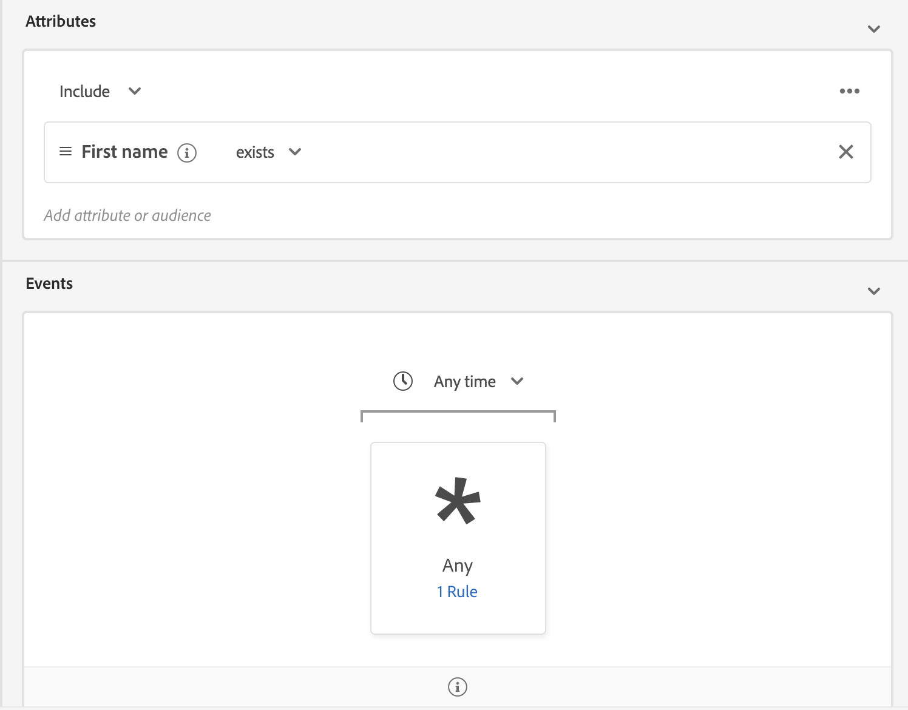

# Handbuch zur Edge-Segmentierung - Benutzeroberfläche (Beta)

>[!NOTE]
>
>Die Edge-Segmentierung befindet sich derzeit in der Betaphase. Die Dokumentation und Funktionalität können sich ändern.

Bei der Edge-Segmentierung können Segmente in Adobe Experience Platform sofort am Rand ausgewertet werden, sodass dieselben Anwendungsfälle für die Personalisierung der Seite und der nächsten Seite möglich sind.

## Abfragen zur Edge-Segmentierung

Eine Abfrage kann mit der Kantensegmentierung bewertet werden, wenn sie eines der folgenden Kriterien erfüllt:

| Abfragetyp | Details | Beispiel |
| ---------- | ------- | ------- |
| Eingehender Treffer | Eine Segmentdefinition, die auf ein einzelnes eingehendes Ereignis ohne Zeitbeschränkung verweist. |  |
| Eingehender Treffer, der sich auf ein Profil bezieht | Eine Segmentdefinition, die sich auf ein einzelnes eingehendes Ereignis ohne Zeitbeschränkung und ein oder mehrere Profil-Attribute bezieht. |  |
| Häufigkeitsangaben Abfrage | Eine Segmentdefinition, die auf ein Ereignis verweist, das mindestens eine bestimmte Anzahl von Malen ausgeführt wird. |  |
| Abfrage der Häufigkeit, die auf ein Profil verweist | Eine Segmentdefinition, die sich auf ein Ereignis bezieht, das mindestens eine bestimmte Anzahl von Malen passiert und eines oder mehrere Profil-Attribute aufweist. |  |

Wenn die Abfrage mit einem der oben genannten Segmenttypen übereinstimmt, können Sie sie für die Kantensegmentierung aktivieren, indem Sie den Umschalter **[!UICONTROL Als Streaming-Abfrage am Rand]** einschalten.

Die folgenden Abfragen werden derzeit für die Kantensegmentierung unterstützt: **not**:

| Abfragetyp | Details |
| ---------- | ------- |
| Relatives Zeitfenster | Wenn sich eine Abfrage auf ein Zeitfenster bezieht, kann sie nicht mithilfe der Kantensegmentierung ausgewertet werden. |
| Negation | Wenn eine Abfrage eine Negation enthält, kann sie nicht mithilfe der Kantensegmentierung ausgewertet werden. |
| Mehrere Ereignisse | Wenn eine Abfrage mehr als ein Ereignis enthält, kann sie nicht mithilfe der Kantensegmentierung bewertet werden. |

## Nächste Schritte

In diesem Benutzerhandbuch wird beschrieben, wie Sie Segmente mit der Segmentierung von Segmenten unter Adobe Experience Platform bewerten.

Weitere Informationen zur Verwendung der Adobe Experience Platform-Benutzeroberfläche finden Sie im [Segmentierungs-Benutzerhandbuch](./overview.md). Weitere Informationen zum Ausführen ähnlicher Aktionen und zum Arbeiten mit Segmenten mithilfe der Adobe Experience Platform-Benutzeroberfläche finden Sie im Handbuch [Edge Segmentation API guide](../api/edge-segmentation.md).
