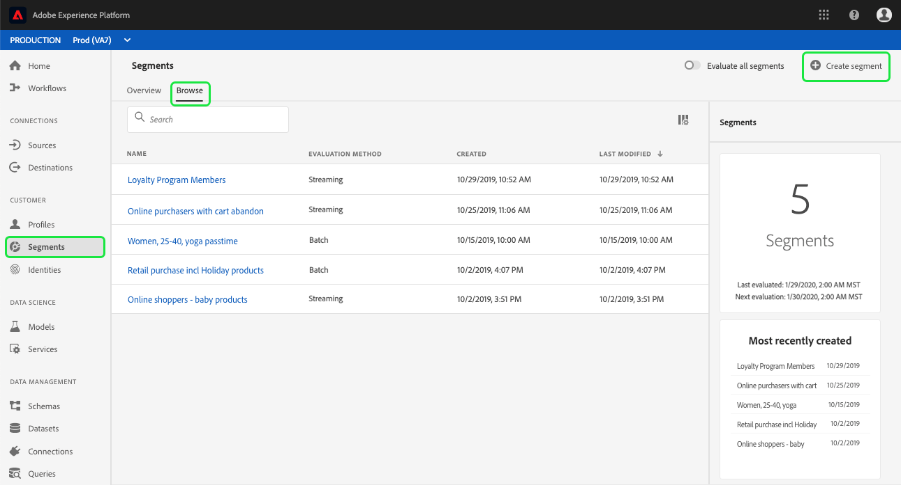
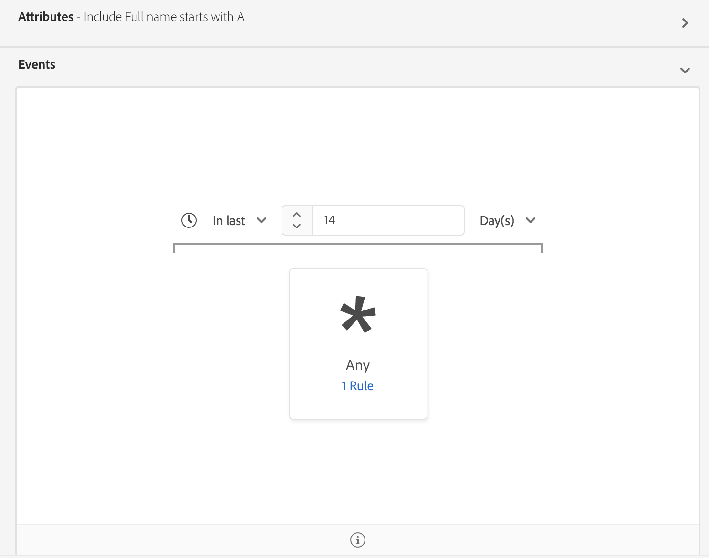
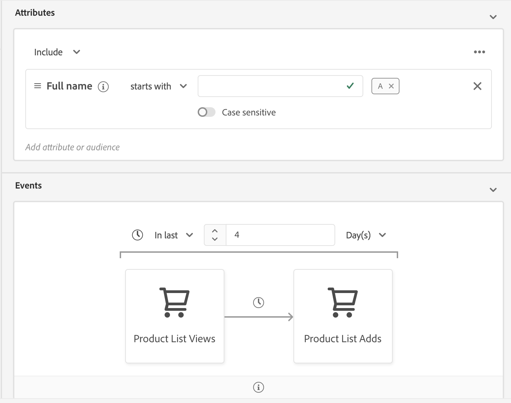

# [!UICONTROL Segment Builder-Benutzerhandbuch]

[!DNL Adobe Experience Platform Segmentation Service] stellt eine RESTful-API und eine Benutzeroberfläche zum Erstellen von Segmentdefinitionen aus [!DNL Real-time Customer Profile] Daten bereit.

## Erste Schritte

Working with segment definitions requires an understanding of the various [!DNL Experience Platform] services involved with segmentation. Bevor Sie dieses Benutzerhandbuch lesen, lesen Sie bitte die Dokumentation für folgende Dienste:

- [!DNL Segmentation Service](../home.md)[!DNL Experience Platform]: Mit Segmentation Service können Sie in gespeicherte Daten, die sich auf Einzelanwender (z. B. Kunden, potenzielle Kunden, User oder Organisationen) beziehen, in kleinere Gruppen unterteilen, die ähnliche Eigenschaften aufweisen und ähnlich auf Marketing-Strategien reagieren.
- [!DNL Real-time Customer Profile](../../profile/home.md): Bietet ein einheitliches, Echtzeit-Profil für Kunden, das auf aggregierten Daten aus mehreren Quellen basiert.
- [!DNL Identity Service](../../identity-service/home.md): Ermöglicht [!DNL Real-time Customer Profile] die Überbrückung von Identitäten aus unterschiedlichen Datenquellen, die in Plattform erfasst werden.
- [!DNL Experience Data Model (XDM)](../../xdm/home.md): Das standardisierte Framework, mit dem Kundenerlebnisdaten [!DNL Platform] organisiert werden.

Außerdem sollten Sie zwei Schlüsselbegriffe kennen, die in diesem Dokument verwendet werden, und den Unterschied zwischen ihnen verstehen:
- **Segmentdefinition**: Der Regelsatz, der zur Beschreibung wichtiger Merkmale oder Verhaltensweisen einer Ziel-Audience verwendet wird.
- **Audience**: Der resultierende Satz von Profilen, die den Kriterien einer Segmentdefinition entsprechen.

## Auf Segmentdefinitionen zugreifen

To begin working with segment definitions in [!DNL Adobe Experience Platform], click **[!UICONTROL Segments]** in the left navigation. Um alle Segmentdefinitionen für Ihre Organisation anzuzeigen, klicken Sie auf den Tab *[!UICONTROL Durchsuchen]*. Diese Ansicht listet Daten zur Segmentdefinition auf, einschließlich der Auswertungsmethode, des Erstellungsdatums und des Datums der letzten Änderung.

Die Auswertungsmethode kann entweder Streaming oder Batch sein. Streaming-Segmente werden konstant ausgewertet, sobald Daten in das System strömen. Batch-Segmente werden gemäß einem festgelegten Zeitplan ausgewertet.

Bei Batch-Segmenten werden zusätzliche Daten angezeigt, die sowohl das letzte Auswertungsdatum als auch das nächste Auswertungsdatum für den Batch umfassen.

Durch Klicken auf **[!UICONTROL Segment erstellen]** in der oberen rechten Ecke wird der Segment Builder-Arbeitsbereich geöffnet, in dem Sie mit der Erstellung einer Segmentdefinition beginnen können.

## [!UICONTROL Arbeitsbereich von Segment Builder]

[!UICONTROL Der Segmentaufbau] bietet eine umfangreiche Arbeitsfläche, mit der Sie mit [!DNL Profile] Datenelementen interagieren können. Der Arbeitsbereich bietet intuitive Steuerelemente zum Erstellen und Bearbeiten von Regeln, z. B. Drag-and-Drop-Kacheln, die zur Darstellung von Dateneigenschaften dienen.

## Bausteine einer Segmentdefinition

Die grundlegenden Bausteine von Segmentdefinitionen sind **[!UICONTROL Attribute]** und **[!UICONTROL Ereignisse]**. Darüber hinaus können die in bestehenden **[!UICONTROL Audiences]** enthaltenen Attribute und Ereignisse auch als Komponenten für neue Definitionen verwendet werden.

Sie können diese Bausteine im Abschnitt *Felder* links im Arbeitsbereich von Segment Builder sehen.  *[!UICONTROL Felder]* enthält einen Tab für jeden der Hauptbausteine: **[!UICONTROL Attribute]**, **[!UICONTROL Ereignisse]** und **[!UICONTROL Audiences]**.

### Attribute

The **[!UICONTROL Attributes]** tab allows you to browse [!DNL Profile] attributes belonging to the [!DNL XDM Individual Profile] class. Jeder Ordner lässt sich erweitern, um zusätzliche Attribute anzuzeigen. Jedes Attribut ist eine Kachel, die in der Mitte des Arbeitsbereichs in die Arbeitsfläche des Regel-Builders gezogen werden kann. Die [Arbeitsfläche des Regel-Builders](#rule-builder-canvas) wird weiter unten in diesem Handbuch erläutert.

### Ereignisse

Auf dem Tab **[!UICONTROL Ereignisse]** können Sie mit XDM ExperienceEvent-Datenelementen eine Audience erstellen, die auf stattgefundenen Ereignissen oder Aktionen basiert. Sie finden Ereignistypen auch auf dem Tab **[!UICONTROL Ereignisse]**; dabei handelt es sich um eine Kollektion häufig verwendeter Ereignisse, mit denen Sie Segmente schneller erstellen können.

In addition to being able to browse for [!DNL ExperienceEvent] elements, you can also search for Event Types. Event Types use the same coding logic as [!DNL ExperienceEvents], without requiring you to search through the [!DNL XDM ExperienceEvent] class looking for the correct event. For example, using the search bar to search &quot;cart&quot; returns the Event Types &quot;[!UICONTROL AddCart]&quot; and &quot;[!UICONTROL RemoveCart]&quot;, which are two very commonly used cart actions when building segment definitions.

Sie können nach beliebigen Komponenten suchen, indem Sie ihren Namen in die Suchleiste eingeben; diese verwendet die [Suchsyntax von Lucene](https://docs.microsoft.com/de-DE/azure/search/query-lucene-syntax). Die Suchergebnisse beginnen sich mit der Eingabe ganzer Wörter zu füllen. Wenn Sie beispielsweise eine Regel auf Grundlage des XDM-Felds `ExperienceEvent.commerce.productViews` erstellen möchten, beginnen Sie im Suchfeld mit der Eingabe von „product views“. Sobald Sie das Wort „product“ eingegeben haben, werden Suchergebnisse angezeigt. Jedes Ergebnis enthält die Objekthierarchie, zu der es gehört.

>[!NOTE]
>
>Es kann bis zu 24 Stunden dauern, bis benutzerdefinierte Schemafelder, die von Ihrer Organisation definiert wurden, angezeigt und zum Erstellen von Regeln verfügbar werden.

You can then easily drag and drop [!DNL ExperienceEvents] and [!UICONTROL Event Types] into your segment definition.

Standardmäßig werden nur ausgefüllte Schemafelder aus Ihrem Datenspeicher angezeigt. This includes [!UICONTROL Event Types]. If the [!UICONTROL Event Types] list is not visible, or you are only able to select &quot;[!UICONTROL Any]&quot; as an [!UICONTROL Event Type], click the gear icon next to *[!UICONTROL Fields]*, then select **[!UICONTROL Show full XDM schema]** under *[!UICONTROL Available Fields]*. Klicken Sie erneut auf das Zahnradsymbol, um zum Tab *[!UICONTROL Felder]* zurückzukehren. Jetzt sollten Sie mehrere Ereignistypen und Schemafelder sehen, unabhängig davon, ob diese Daten enthalten oder nicht.

### Audiences

The **[!UICONTROL Audiences]** tab lists all audiences imported from external sources, such as Adobe Audience Manager, as well as audiences created within [!DNL Experience Platform].

On the [!UICONTROL Audiences] tab, you can see all of the available sources as a group of folders. Wenn Sie in diese Ordner klicken, werden verfügbare Unterordner und Audiences angezeigt. Außerdem können Sie auf das Ordnersymbol klicken (wie im Bild ganz rechts), um die Ordnerstruktur anzuzeigen (ein Häkchen gibt den Ordner an, in dem Sie sich befinden), und durch einfaches Klicken auf den Namen eines Ordners im Baum durch die Ordnerstruktur zurück navigieren.

Wenn Sie mit dem Mauszeiger über das ⓘ neben einer Audience fahren, können Sie Informationen zur Audience anzeigen, einschließlich Kennung, Beschreibung und Ordnerhierarchie zum Auffinden der Audience.

You can also search for [!UICONTROL Audiences] using the search bar, which utilizes [Lucene&#39;s search syntax](https://docs.microsoft.com/de-DE/azure/search/query-lucene-syntax). Wenn Sie auf dem Tab *[!UICONTROL Audiences]* einen Ordner der obersten Ebene auswählen, wird die Suchleiste angezeigt, sodass Sie in diesem Ordner suchen können. Suchergebnisse beginnen sich erst dann zu füllen, wenn ganze Wörter eingegeben werden. For example, to find an [!UICONTROL Audience] named `Online Shoppers`, start typing &quot;Online&quot; in the search bar. Nach vollständiger Eingabe des Worts „Online“ erscheinen Suchergebnisse, die das Wort „Online“ enthalten.

## Arbeitsfläche des Regel-Builders {#rule-builder-canvas}

Eine Segmentdefinition ist eine Kollektion von Regeln, die zur Beschreibung der Hauptmerkmale oder Verhaltensweisen einer Ziel-Audience dienen. Diese Regeln werden mithilfe der *[!UICONTROL Arbeitsfläche des Regel-Builders]*[!UICONTROL  in der Mitte von Segment Builder erstellt].

Um Ihrer Segmentdefinition eine neue Regel hinzuzufügen, ziehen Sie eine Kachel aus dem Tab *[!UICONTROL Felder]* und legen Sie sie auf der Arbeitsfläche des Regel-Builders ab. Anschließend werden Ihnen je nach Art der hinzugefügten Daten kontextspezifische Optionen angezeigt. Available data types include: strings, dates, [!DNL ExperienceEvents], [!UICONTROL Event Types], and [!UICONTROL Audiences].

### Hinzufügen von Audiences

Sie können eine Audience per Drag-and-Drop vom Tab *[!UICONTROL Audience]* auf die Arbeitsfläche des Regel-Builders ziehen, um auf die Audience-Zugehörigkeit in der neuen Segmentdefinition zu verweisen. Auf diese Weise können Sie Audience-Zugehörigkeit als Attribut in der neuen Segmentregel ein- oder ausschließen.

For [!DNL Platform] audiences created using [!UICONTROL Segment Builder], you are given the option to convert the audience into the set of rules that were used in the segment definition for that audience. Diese Konversion erstellt eine Kopie der Regellogik, die dann ohne Beeinträchtigung der ursprünglichen Segmentdefinition verändert werden kann. Vergewissern Sie sich, dass Sie alle Änderungen an Ihrer Segmentdefinition gespeichert haben, bevor Sie sie in Regellogik konvertieren.

>[!NOTE]
>
>Beim Hinzufügen einer Audience aus einer externen Quelle wird nur auf die Audience-Zugehörigkeit verwiesen. Sie können die Audience nicht in Regeln konvertieren. Daher können die zum Erstellen der ursprünglichen Audience verwendeten Regeln in der neuen Segmentdefinition auch nicht geändert werden.

Treten beim Konvertieren von Audiencen in Regeln Konflikte auf, versucht der [!UICONTROL Segmentaufbau] , die vorhandenen Optionen optimal zu erhalten.

### Code-Ansicht

Alternativ können Sie eine codebasierte Version einer Regel, die im [!UICONTROL Segmentaufbau]erstellt wurde, Ansicht vornehmen. Nachdem Sie Ihre Regel auf der Arbeitsfläche des Regelaufbaus erstellt haben, können Sie die **[!UICONTROL Code-Ansicht]** auswählen, um Ihr Segment als PQL anzuzeigen.

Die Code-Ansicht bietet eine Schaltfläche, mit der Sie den Segmentwert kopieren können, der in API-Aufrufen verwendet werden soll. Um die neueste Version des Segments abzurufen, stellen Sie sicher, dass Sie die neuesten Änderungen am Segment gespeichert haben.

## Container

Segmentregeln werden in der Reihenfolge ausgewertet, in der sie aufgelistet sind. Container ermöglichen eine Steuerung der Ausführungsreihenfolge durch Verwendung verschachtelter Abfragen.

Nachdem Sie der Arbeitsfläche des Regel-Builders mindestens eine Kachel hinzugefügt haben, können Sie beginnen, Container hinzuzufügen. Um einen neuen Container zu erstellen, klicken Sie auf die Auslassungszeichen (...) in der oberen rechten Ecke der Kachel und dann auf **[!UICONTROL Container hinzufügen]**.

Ein neuer Container wird als untergeordnetes Element des ersten Containers angezeigt. Sie können die Hierarchie jedoch durch Ziehen und Verschieben der Container anpassen. The default behavior of a container is to &quot;[!UICONTROL Include]&quot; the attribute, event, or audience provided. You can set the rule to &quot;[!UICONTROL Exclude]&quot; profiles that match the container criteria by clicking **[!UICONTROL Include]** in the top-left corner of the tile and selecting &quot;[!UICONTROL Exclude]&quot;.

Ein untergeordneter Container kann auch extrahiert und inline zum übergeordneten Container hinzugefügt werden, indem Sie im untergeordneten Container auf „Container entpacken“ klicken. Klicken Sie auf die Auslassungszeichen (...) in der oberen rechten Ecke des untergeordneten Containers, um auf diese Option zuzugreifen.

Wenn Sie auf **[!UICONTROL Container entpacken]** klicken, wird der untergeordnete Container entfernt und die Kriterien erscheinen inline.

>[!NOTE]
>
>Achten Sie beim Entpacken von Containern darauf, dass die Logik weiterhin der gewünschten Segmentdefinition entspricht.

## Zusammenführungsrichtlinien

[!DNL Experience Platform]Mit können Sie Daten aus verschiedenen Quellen zusammenführen und kombinieren, damit Sie sich einen kompletten Überblick über einzelne Kunden verschaffen können. When bringing this data together, merge policies are the rules that [!DNL Platform] uses to determine how data will be prioritized and what data will be combined to create a profile.

You can select a merge policy that matches your marketing purpose for this audience or use the default merge policy provided by [!DNL Platform]. Sie können verschiedene, für Ihre Organisation spezifische Zusammenführungsrichtlinien erstellen, einschließlich einer eigenen standardmäßigen Zusammenführungsrichtlinie. Eine schrittweise Anleitung zum Erstellen von Zusammenführungsrichtlinien für Ihre Organisation finden Sie in der Anleitung zum [Verwenden von Zusammenführungsrichtlinien mit der Benutzeroberfläche](../../profile/ui/merge-policies.md).

Um eine Zusammenführungsrichtlinie für Ihre Segmentdefinition auszuwählen, klicken Sie auf dem Tab *[!UICONTROL Felder]* auf das Zahnradsymbol und wählen Sie dann im *Dropdown-Menü „Zusammenführungsrichtlinie“*die gewünschte Zusammenführungsrichtlinie aus.

## Segmenteigenschaften

Beim Erstellen einer Segmentdefinition zeigt der Abschnitt *[!UICONTROL Segmenteigenschaften]* auf der rechten Seite des Arbeitsbereichs eine geschätzte Größe des resultierenden Segments an, sodass Sie die Segmentdefinition nach Bedarf anpassen können, bevor Sie die eigentliche Audience erstellen.

Im Abschnitt *[!UICONTROL Segmenteigenschaften]* können Sie außerdem wichtige Informationen zur Segmentdefinition angeben, einschließlich *[!UICONTROL Name]* und *[!UICONTROL Beschreibung]*. Namen von Segmentdefinitionen dienen dazu, Ihr Segment unter den von Ihrer Organisation definierten Segmenten zu identifizieren. Sie sollten daher beschreibend, knapp und eindeutig sein.

Wenn Sie mit der Erstellung Ihrer Segmentdefinition fortfahren, können Sie durch Auswahl von **[!UICONTROL Profile anzeigen]** eine paginierte Vorschau der Audience anzeigen.

>[!NOTE]
>
>Audience-Schätzungen werden anhand einer Stichprobengröße der Beispieldaten dieses Tages erstellt. Wenn sich in Ihrem Profilspeicher weniger als 1 Million Entitäten befinden, wird der vollständige Datensatz verwendet. Bei zwischen 1 und 20 Millionen Entitäten werden 1 Million Entitäten verwendet; bei mehr als 20 Millionen Entitäten werden 5 % der Gesamtentitäten genutzt. Weiterführende Informationen zum Generieren von Segmentschätzungen finden Sie in der Anleitung zur Segmenterstellung im Abschnitt zum [Generieren von Schätzungen](../tutorials/create-a-segment.md#estimate-and-preview-an-audience).

## Geplante Segmentierung aktivieren {#enable-scheduled-segmentation}

Nachdem Sie Segmentdefinitionen erstellt haben, können Sie diese durch eine On-Demand- oder geplante (kontinuierliche) Auswertung auswerten. Evaluation means moving [!DNL Real-time Customer Profile] data through segment definitions in order to produce corresponding audiences. Once created, the audiences are saved and stored so that they can be exported using [!DNL Experience Platform] APIs.

Bei der On-Demand-Auswertung wird die API zur Durchführung von Auswertungen und zum Aufbau von Audiences nach Bedarf verwendet. Bei der geplanten Auswertung (auch „geplante Segmentierung“ genannt) können Sie hingegen einen Zeitplan erstellen, um die Segmentdefinitionen zu einem bestimmten Zeitpunkt (maximal einmal täglich) auszuwerten.

Die Aktivierung Ihrer Segmentdefinitionen für eine geplante Auswertung kann über die Benutzeroberfläche oder die API erfolgen. Kehren Sie in der Benutzeroberfläche zum Tab *[!UICONTROL Durchsuchen]* in **[!UICONTROL Segmente]** zurück und schalten Sie **[!UICONTROL Alle Segmente auswerten]** ein. Dadurch werden alle Segmente anhand des von Ihrer Organisation festgelegten Zeitplans evaluiert.

>[!NOTE]
>
>Scheduled evaluation can be enabled for sandboxes with a maximum of five (5) merge policies for [!DNL XDM Individual Profile]. If your organization has more than five merge policies for [!DNL XDM Individual Profile] within a single sandbox environment, you will not be able to use scheduled evaluation.

Zeitpläne können derzeit nur mit der API erstellt werden. Ausführliche Anweisungen zum Erstellen, Bearbeiten und Verwenden von Zeitplänen mithilfe der API finden Sie im Tutorial zum Auswerten und Aufrufen von Segmentergebnissen, insbesondere im Abschnitt zur [geplanten Auswertung mithilfe der API](../tutorials/evaluate-a-segment.md#scheduled-evaluation).

## Streaming-Segmentierung {#streaming-segmentation}

>[!NOTE]
>
>Damit Streaming-Segmentierung funktioniert, muss der Kunde die geplante Segmentierung für das Unternehmen aktivieren. Weiterführende Informationen zur Aktivierung der geplanten Segmentierung finden Sie [im vorherigen Abschnitt dieses Benutzerhandbuchs](#enable-scheduled-segmentation).

Eine Abfrage wird automatisch mit Streaming-Segmentierung bewertet, wenn sie eines der folgenden Kriterien erfüllt:

| Abfragetyp | Details | Beispiel |
| ---------- | ------- | ------- |
| Eingehender Treffer | Eine Segmentdefinition, die auf ein einzelnes eingehendes Ereignis ohne Zeitbeschränkung verweist. |  |
| Eingehender Treffer innerhalb eines relativen Zeitfensters | Eine Segmentdefinition, die auf ein einzelnes eingehendes Ereignis **innerhalb der letzten sieben Tage** verweist. |  |
| Eingehender Treffer, der sich auf ein Profil bezieht | Eine Segmentdefinition, die sich auf ein einzelnes eingehendes Ereignis ohne Zeitbeschränkung und ein oder mehrere Profil-Attribute bezieht. |  |
| Eingehender Treffer, der sich auf ein Profil innerhalb eines relativen Zeitfensters bezieht | Eine Segmentdefinition, die sich **innerhalb der letzten sieben Tage** auf ein einzelnes eingehendes Ereignis und ein oder mehrere Profil-Attribute bezieht. |  |
| Mehrere Ereignis, die auf ein Profil verweisen | Jede Segmentdefinition, die sich **innerhalb der letzten 24 Stunden** auf mehrere Ereignis bezieht und (optional) ein oder mehrere Profil-Attribute besitzt. |  |

Im folgenden Abschnitt werden Segmentdefinitionsbeispiele Liste, die für die Streaming-Segmentierung **nicht** aktiviert werden.

| Abfragetyp | Details |
| ---------- | ------- | 
| Eingehender Treffer innerhalb eines relativen Zeitfensters | Wenn sich die Segmentdefinition auf ein eingehendes Ereignis bezieht, das **nicht** innerhalb der **letzten sieben Tage** liegt. Zum Beispiel innerhalb der **letzten zwei Wochen**. |  |
| Eingehender Treffer, der sich auf ein Profil in einem relativen Fenster bezieht | Die folgenden Optionen unterstützen **keine** Streaming-Segmentierung:<ul><li>Ein eingehendes Ereignis **nicht** innerhalb der **letzten sieben Tage**.</li><li>Eine Segmentdefinition, die [!DNL Adobe Audience Manager (AAM)] Segmente oder Eigenschaften enthält.</li></ul> |  |
| Mehrere Ereignis, die auf ein Profil verweisen | Die folgenden Optionen unterstützen **keine** Streaming-Segmentierung:<ul><li>Ein Ereignis, das **nicht** innerhalb **der letzten 24 Stunden** auftritt.</li><li>Eine Segmentdefinition, die Segmente oder Eigenschaften des Adobe Audience Managers (AAM) enthält.</li></ul> |  |
| Abfragen mit mehreren Entitäten | Abfragen mit mehreren Entitäten werden durch Streaming-Segmentierung insgesamt **nicht** unterstützt. |  |

Darüber hinaus gelten einige Richtlinien für die Streaming-Segmentierung:

| Abfragetyp | Leitlinie |
| ---------- | -------- |
| Abfrage mit einem Ereignis | Das Rückblickfenster ist auf **sieben Tage** begrenzt. |
| Abfrage mit Ereignis-Verlauf | <ul><li>Das Lookback-Fenster ist auf **einen Tag** beschränkt.</li><li>Zwischen den Ereignissen **muss** eine strikte Zeitbestellbedingung bestehen.</li><li>Nur einfache Zeitreihenfolgen (vor und nach) zwischen den Ereignissen sind zulässig.</li><li>Die einzelnen Ereignis **können nicht** negiert werden. Die gesamte Abfrage **kann** jedoch negiert werden.</li></ul> |

### Überwachung der Streaming-Segmentierung

Nachdem Sie ein Streaming-fähiges Segment erstellt haben, können Sie Details zu diesem Segment überwachen.

Insbesondere werden Details zur Größe der *[!UICONTROL gesamten qualifizierten Audience]* angezeigt. Wenn ein Auftrag innerhalb der letzten 24 Stunden ausgeführt wurde, wird neben einem Liniendiagramm für die hinzugefügte Audience die **[!UICONTROL Gesamtgröße]** der Audience angezeigt. Andernfalls wird neben einer Visualisierungstrends-Linie auch die **[!UICONTROL geschätzte Audience]** angezeigt.

Weitere Informationen zur letzten Segmentauswertung erhalten Sie, wenn Sie auf die Informationsblase klicken.

### Videodemo zur Streaming-Segmentierung

Das folgende Video soll Ihr Verständnis von Streaming-Segmentierung unterstützen. Es zeigt ein Beispiel für eine Kundenerfahrung, gefolgt von einem kurzen Überblick über die wichtigsten Funktionen der [!DNL Platform] Oberfläche.

>[!VIDEO](https://video.tv.adobe.com/v/36184?quality=12&learn=on)

## Verstöße gegen DULE-Richtlinien

>[!NOTE]
>
>Verstöße gegen DULE-Richtlinien finden nur dann Anwendung, wenn Sie ein Segment erstellen, das einem Ziel zugewiesen wurde.

Once you are done creating your segment, the segment will be analyzed by [!DNL Data Governance] to ensure there are no policy violations within the segment. Weiterführende Informationen zu DULE und Richtlinienverletzungen finden Sie in der [Übersicht über die Datennutzungsbezeichnungen](../../data-governance/labels/overview.md).

## Nächste Schritte und zusätzliche Ressourcen {#next-steps}

Segment Builder provides a rich workflow allowing you to isolate marketable audiences from [!DNL Real-time Customer Profile] data. Nach dem Lesen dieses Handbuchs sollten Sie jetzt Folgendes können:

- Segmentdefinitionen mit einer Kombination aus Attributen, Ereignissen und vorhandenen Audiences als Bausteinen erstellen.
- Die Arbeitsfläche des Regel-Builders und Container verwenden, um die Reihenfolge zu steuern, in der Segmentregeln ausgeführt werden.
- Schätzungen der voraussichtlichen Audience anzeigen, sodass Sie Ihre Segmentdefinitionen nach Bedarf anpassen können.
- Alle Segmentdefinitionen für geplante Segmentierung aktivieren.
- Spezifische Segmentdefinitionen für Streaming-Segmentierung aktivieren.

Um mehr darüber zu erfahren, lesen Sie [!DNL Segmentation Service]bitte weiterhin die Dokumentation und ergänzen Sie Ihre Lernerfahrung durch die Videos unten. For step-by-step instructions on working with [!DNL Segmentation Service] using the [!DNL Segmentation Service] API, see the [creating audience segments using APIs](../tutorials/create-a-segment.md) tutorial.

>[!WARNING]
>
> Die in den folgenden Videos dargestellte [!DNL Platform] Benutzeroberfläche ist veraltet. Die neuesten Screenshots und Funktionen der Benutzeroberfläche finden Sie in der obigen Dokumentation.

**Erstellen eines Segments:**

>[!VIDEO](https://video.tv.adobe.com/v/27254?quality=12&learn=on)

**Erstellen Sie ein dynamisches Segment:**

>[!VIDEO](https://video.tv.adobe.com/v/27428?quality=12&learn=on)
