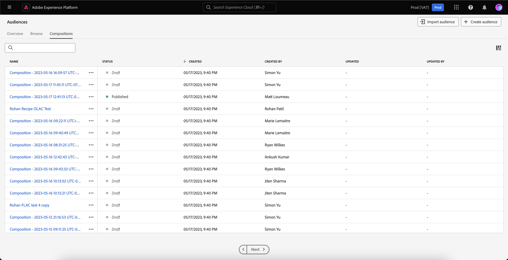

# Handbuch zur Benutzeroberfläche des Segmentierungs-Service

[!DNL Adobe Experience Platform Segmentation Service] bietet eine Benutzeroberfläche zur Erstellung und Verwaltung von Zielgruppen und Segmentdefinitionen.

## Erste Schritte

Die Arbeit mit Zielgruppen und Segmentdefinitionen erfordert ein Verständnis der verschiedenen [!DNL Experience Platform]-Dienste, die mit der Segmentierung verbunden sind. Bevor Sie dieses Benutzerhandbuch lesen, lesen Sie bitte die Dokumentation für folgende Services:

- [[!DNL Segmentation Service]](../home.md): [!DNL Segmentation Service] ermöglicht es Ihnen, in [!DNL Experience Platform] gespeicherte Daten, die sich auf Einzelpersonen (wie Kundinnen und Kunden, Interessierte, Benutzerinnen und Benutzer oder Organisationen) beziehen, in kleinere Gruppen zu unterteilen.
- [[!DNL Real-Time Customer Profile]](../../profile/home.md): Bietet ein einheitliches Echtzeit-Kundenprofil, das auf aggregierten Daten aus verschiedenen Quellen basiert.
- [[!DNL Adobe Experience Platform Identity Service]](../../identity-service/home.md): Ermöglicht die Erstellung von Kundenprofilen durch das Zusammenführen von Identitäten aus unterschiedlichen Datenquellen, die in [!DNL Platform] aufgenommen werden.
- [[!DNL Experience Data Model (XDM)]](../../xdm/home.md): Das standardisierte Framework, mit dem Kundenerlebnisdaten durch [!DNL Platform] organisiert werden. Um die Segmentierung optimal zu nutzen, stellen Sie sicher, dass Ihre Daten als Profile und Ereignisse gemäß den [Best Practices für die Datenmodellierung](../../xdm/schema/best-practices.md) aufgenommen werden.

Sie sollten auch zwei Schlüsselbegriffe verstehen, die in diesem Dokument verwendet werden, und den Unterschied zwischen ihnen verstehen:

- **Zielgruppe**: Eine Gruppe von Personen, die ähnliche Verhaltensweisen und/oder Merkmale aufweisen. Diese Personensammlung kann entweder von Adobe Experience Platform mithilfe von Segmentdefinitionen oder der Zielgruppenzusammensetzung (Platform-generierte Zielgruppe) oder aus externen Quellen wie benutzerdefinierten Uploads (extern generierte Zielgruppe) erstellt werden.
- **Segmentdefinition**: Die Regeln, die Adobe Experience Platform verwendet, um wichtige Merkmale oder Verhaltensweisen einer Zielgruppe zu beschreiben.
- **Segmentieren**: Der Vorgang der Aufteilung von Profilen in Zielgruppen.

## Übersicht

Wählen Sie in der Experience Platform-Benutzeroberfläche in der linken Navigation **[!UICONTROL Zielgruppen]**, um die Registerkarte **[!UICONTROL Überblick]** zu öffnen, auf der das Dashboard [!UICONTROL Zielgruppen] angezeigt wird.

>[!NOTE]
>
>Wenn Ihre Organisation erst seit kurzem Platform nutzt und noch keine aktiven Profildatensätze oder Zusammenführungsrichtlinien erstellt hat, ist das Dashboard [!UICONTROL Zielgruppen] nicht sichtbar. Stattdessen werden auf der Registerkarte [!UICONTROL Überblick] Links und Dokumentation angezeigt, die Ihnen bei den ersten Schritten im Zusammenhang mit Zielgruppen helfen können.

### [!UICONTROL Zielgruppen]-Dashboard {#segments-dashboard}

Das **[!UICONTROL Zielgruppen]**-Dashboard gibt einen Überblick über die wichtigsten Schlüsselmetriken in Bezug auf die Zielgruppendaten Ihrer Organisation.

Weitere Informationen finden Sie im [Handbuch zum Zielgruppen-Dashboard](../../dashboards/guides/audiences.md).

## Durchsuchen {#browse}

>[!CONTEXTUALHELP]
>id="platform_segments_browse_churncolumnname"
>title="Abwanderung"
>abstract="Die Fluktuation stellt den Prozentsatz der Profile dar, die sich innerhalb einer Zielgruppendefinition ändern, verglichen mit der letzten Ausführung des Zielgruppenvorgangs."

>[!CONTEXTUALHELP]
>id="platform_segments_browse_evaluationmethodcolumnname"
>title="Auswertungsmethode"
>abstract="Zu den Auswertungsmethoden für Zielgruppen gehören Batch, Streaming und Edge."

>[!CONTEXTUALHELP]
>id="platform_segments_browse_addallsegmentstoschedule"
>title="Alle Zielgruppen zum Zeitplan hinzufügen"
>abstract="Aktivieren Sie diese Option, um alle Zielgruppen einzubeziehen, die mit der Batch-Segmentierung in der täglich geplanten Aktualisierung ausgewertet wurden. Deaktivieren Sie sie, um alle Zielgruppen aus der geplanten Aktualisierung zu entfernen."

Wählen Sie die **[!UICONTROL Durchsuchen]** um eine Liste aller Zielgruppen für Ihre Organisation anzuzeigen. Diese Ansicht listet Informationen zu den Zielgruppen auf, einschließlich Profilanzahl, Ursprung, Erstellungsdatum, Datum der letzten Änderung, Tags und Aufschlüsselung.

Neben jeder Zielgruppe befindet sich ein Symbol mit Auslassungspunkten. Wenn Sie diese auswählen, wird eine Liste der verfügbaren Schnellaktionen für die Zielgruppe angezeigt. Diese Aktionsliste unterscheidet sich je nach Ursprung der Zielgruppe.

![Die Liste der Schnellaktionen wird für Zielgruppen mit dem Ursprung [!UICONTROL Zielgruppenkomposition] angezeigt.](../images/ui/overview/browse-audience-composition-details.png)

| Aktion | Ursprünge | Beschreibung |
| ------ | ------- | ----------- |
| [!UICONTROL Vorlage] | Segmentierungs-Service | Öffnet den Segment Builder zum Bearbeiten Ihrer Zielgruppe. Beachten Sie, dass Sie, wenn Ihre Zielgruppe über die API erstellt wurde, **not** Sie können sie mit Segment Builder bearbeiten. Weitere Informationen zur Verwendung von Segment Builder finden Sie im [Handbuch zur Benutzeroberfläche von Segment Builder](./segment-builder.md). |
| [!UICONTROL Offene Komposition] | Zielgruppenkomposition | Öffnet die Audience-Komposition, um Ihre Zielgruppe anzuzeigen. Weitere Informationen zur Komposition von Zielgruppen finden Sie im [Handbuch zur Benutzeroberfläche der Zielgruppenkomposition](./audience-composition.md). |
| [!UICONTROL Auf Ziel aktivieren] | Segmentierungs-Service | Aktiviert die Zielgruppe für ein Ziel. Ausführlichere Informationen zur Aktivierung einer Zielgruppe für ein Ziel finden Sie in der [Übersicht zur Aktivierung](../../destinations/ui/activation-overview.md). |
| [!UICONTROL Mit Partnern teilen] | Zielgruppen-Komposition, Benutzerdefinierter Upload, Segmentierungs-Service | Teilt Ihre Zielgruppe mit anderen Platform-Benutzern. Weitere Informationen zu dieser Funktion finden Sie in der [Übersicht zu Segmentübereinstimmungen](./segment-match/overview.md). |
| [!UICONTROL Tags verwalten] | Zielgruppen-Komposition, Benutzerdefinierter Upload, Segmentierungs-Service | Verwaltet die benutzerdefinierten Tags, die zur Zielgruppe gehören. Weitere Informationen zu dieser Funktion finden Sie im Abschnitt zum [Filtern und Tagging](#manage-audiences). |
| [!UICONTROL In Ordner verschieben] | Zielgruppen-Komposition, Benutzerdefinierter Upload, Segmentierungs-Service | Verwaltet, zu welchem Ordner die Zielgruppe gehört. Weitere Informationen zu dieser Funktion finden Sie im Abschnitt zum [Filtern und Tagging](#manage-audiences). |
| [!UICONTROL Kopieren] | Segmentierungs-Service | Dupliziert die ausgewählte Zielgruppe. |
| [!UICONTROL Zugriffsbeschriftungen anwenden] | Zielgruppen-Komposition, Benutzerdefinierter Upload, Segmentierungs-Service | Verwalten der Zugriffsbeschriftungen, die zur Zielgruppe gehören. Weitere Informationen zu Zugriffsbeschriftungen finden Sie in der Dokumentation zum [Verwalten von Beschriftungen](../../access-control/abac/ui/labels.md). |
| [!UICONTROL Archivieren] | Benutzerdefinierter Upload | Archiviert die ausgewählte Zielgruppe. |
| [!UICONTROL Löschen] | Zielgruppen-Komposition, Benutzerdefinierter Upload, Segmentierungs-Service | Löscht die ausgewählte Zielgruppe. |
| [!UICONTROL Zu Paket hinzufügen] | Zielgruppen-Komposition, Benutzerdefinierter Upload, Segmentierungs-Service | Verschiebt die Zielgruppe zwischen Sandboxes. Weitere Informationen zu dieser Funktion finden Sie im Abschnitt [Sandbox-Werkzeugleitfaden](../../sandboxes/ui/sandbox-tooling.md). |

>[!NOTE]
>
> Eine Zielgruppe, die in einer Zielaktivierung verwendet wird, können Sie **nicht** löschen.

Oben auf der Seite finden Sie Optionen zum Hinzufügen aller Zielgruppen zu einem Zeitplan, zum Importieren einer Zielgruppe, zum Erstellen einer neuen Zielgruppe und zum Anzeigen einer Aufschlüsselung der Aktualisierungshäufigkeit.

Durch Umschalten auf **[!UICONTROL Alle Zielgruppen planen]** wird die geplante Segmentierung aktiviert. Weitere Informationen zur geplanten Segmentierung finden Sie im [Abschnitt „Geplante Segmentierung“ in diesem Benutzerhandbuch](#scheduled-segmentation).

Auswählen **[!UICONTROL Audience importieren]** ermöglicht Ihnen den Import einer extern generierten Audience. Weiterführende Informationen zum Zielgruppenimport finden Sie im Abschnitt [Importieren einer Zielgruppe im Benutzerhandbuch](#import-audience).

Durch Auswahl von **[!UICONTROL Zielgruppe erstellen]** können Sie eine Zielgruppe erstellen. Um mehr über das Erstellen von Zielgruppen zu erfahren, lesen Sie den Abschnitt [Erstellen einer Zielgruppe](#create-audience) im Benutzerhandbuch.

Sie können **[!UICONTROL Zusammenfassung der Aktualisierungshäufigkeit]** um ein Kreisdiagramm mit der Aktualisierungshäufigkeit anzuzeigen.

Das Tortendiagramm wird mit einer Aufschlüsselung der Zielgruppen nach Aktualisierungshäufigkeit angezeigt. Das Diagramm zeigt die Gesamtzahl der Zielgruppen in der Mitte an. Wenn Sie den Mauszeiger über die verschiedenen Teile der Audience bewegen, wird die Anzahl der Zielgruppen angezeigt, die zu den verschiedenen Aktualisierungshäufigkeit gehören.

### Anpassen {#customize}

Sie können zusätzliche Felder zum [!UICONTROL Durchsuchen] Seite durch Auswahl . Diese zusätzlichen Felder umfassen: Lebenszyklusstatus, Aktualisierungshäufigkeit, Zuletzt aktualisiert von, Beschreibung, Erstellt von und Zugriffsbeschriftungen.

| Feld | Beschreibung |
| ----- | ----------- |
| [!UICONTROL Name] | Der Name der Zielgruppe. |
| [!UICONTROL Anzahl der Profile] | Die Gesamtzahl der Profile, die für die Zielgruppe qualifiziert sind. |
| [!UICONTROL Herkunft] | Die Herkunft der Zielgruppe. Hier wird angegeben, woher die Zielgruppe stammt. Mögliche Werte sind: Segmentierungsdienst, Benutzerdefinierter Upload, Zielgruppenzusammensetzung und Audience Manager. |
| [!UICONTROL Lebenszyklus-Status] | Der Status der Zielgruppe. Mögliche Werte für dieses Feld sind `Draft`, `Published` und `Archived`. |
| [!UICONTROL Aktualisierungshäufigkeit] | Ein Wert, der angibt, wie oft die Daten der Zielgruppe aktualisiert werden. Mögliche Werte für dieses Feld sind [!UICONTROL Batch], [!UICONTROL Streaming], [!UICONTROL Edge], und [!UICONTROL Nicht geplant]. |
| [!UICONTROL Zuletzt aktualisiert von] | Der Name der Person, die die Zielgruppe zuletzt aktualisiert hat. |
| [!UICONTROL Erstellt] | Datum und Uhrzeit der Erstellung der Zielgruppe in UTC. |
| [!UICONTROL Zuletzt aktualisiert] | Datum und Uhrzeit der letzten Aktualisierung der Zielgruppe in UTC. |
| [!UICONTROL Tags] | Die benutzerdefinierten Tags, die zur Zielgruppe gehören. Weitere Informationen zu diesen Tags finden Sie im [Abschnitt zu Tags](#tags). |
| [!UICONTROL Beschreibung] | Die Beschreibung der Zielgruppe. |
| [!UICONTROL Erstellt von] | Der Name der Person, die die Zielgruppe erstellt hat. |
| [!UICONTROL Zugriffsbeschriftungen] | Die Zugriffsbeschriftungen für die Zielgruppe. Mit Zugriffsbeschriftungen können Sie Datensätze und Felder entsprechend den für diese Daten geltenden Nutzungsrichtlinien kategorisieren. Diese Beschriftungen können jederzeit angewendet werden, was eine flexible Handhabung der Daten ermöglicht. Weitere Informationen zu Zugriffsbeschriftungen finden Sie in der Dokumentation unter [Verwalten von Beschriftungen](../../access-control/abac/ui/labels.md). |
| [!UICONTROL Aufschlüsselung] | Die Aufschlüsselung des Profilstatus für die Zielgruppe. Eine detailliertere Beschreibung dieser Aufschlüsselung des Profilstatus finden Sie unten. |

Wenn die Aufschlüsselung ausgewählt ist, wird ein Balkendiagramm angezeigt, das den prozentualen Anteil der Profile in jedem der folgenden berechneten Profilstatus anzeigt: [!UICONTROL Realisiert], [!UICONTROL Bestehend] und [!UICONTROL Verlassen]. Außerdem ist die auf der Registerkarte [!UICONTROL Durchsuchen] angezeigte Aufschlüsselung die genaueste Aufschlüsselung des Status der Segmentdefinition. Wenn diese Zahl von den Angaben auf der Registerkarte [!UICONTROL Übersicht] abweicht, sollten Sie als korrekte Informationsquelle die Zahlen auf der Registerkarte [!UICONTROL Durchsuchen] verwenden, da die Zahlen auf der Registerkarte [!UICONTROL Übersicht] nur einmal pro Tag aktualisiert werden.

| Status | Beschreibung |
| ------ | ----------- |
| [!UICONTROL Realisiert] | Die Anzahl der Profile, die sich in den letzten 24 Stunden seit Ausführung des letzten Batch-Segmentauftrags für das Segment **qualifiziert** haben. |
| [!UICONTROL Bestehend] | Die Anzahl der Profile, die in den letzten 24 Stunden seit Ausführung des letzten Batch-Segmentauftrags im Segment **verblieben** sind. |
| [!UICONTROL Verlassen] | Die Anzahl der Profile, die das Segment in den letzten 24 Stunden seit Ausführung des letzten Batch-Segmentauftrags **verlassen** haben. |

Nachdem Sie die anzuzeigenden Felder ausgewählt haben, können Sie auch die Breite der angezeigten Spalten anpassen. Sie können dies entweder durch Ziehen des Bereichs zwischen den Spalten oder durch Auswahl der  der Spalte, deren Größe Sie ändern möchten, gefolgt von **[!UICONTROL Größe der Spalte ändern]**.

### Filterung, Ordner und Tagging {#manage-audiences}

Um Ihre Arbeitseffizienz zu verbessern, können Sie nach vorhandenen Zielgruppen suchen, benutzerdefinierte Tags zu Zielgruppen hinzufügen, Zielgruppen in Ordnern ablegen und die angezeigten Zielgruppen filtern.

**Durchsuchen** {#search}

Mit [!DNL Unified Search] können Sie Ihre bestehenden Zielgruppen in bis zu 9 verschiedenen Sprachen suchen.

Um [!DNL Unified Search] zu verwenden, fügen Sie den gewünschten Suchbegriff in die hervorgehobene Suchleiste ein.

Für weitere Informationen über [!DNL Unified Search], einschließlich der unterstützten Funktionen, lesen Sie die [Dokumentation zur einheitlichen Suche](https://experienceleague.adobe.com/docs/core-services/interface/services/search-experience-cloud.html?lang=de).

**Tags** {#tags}

Sie können benutzerdefinierte Tags hinzufügen, um Ihre Zielgruppen besser zu beschreiben, zu finden und zu verwalten.

Um ein Tag hinzuzufügen, wählen Sie **[!UICONTROL Tags verwalten]** für die Zielgruppe, die Sie markieren möchten.

![Die Schaltfläche [!UICONTROL Tags verwalten] ist für eine bestimmte Zielgruppe ausgewählt.](../images/ui/overview/browse-manage-tags.png)

Das Popup-Fenster **[!UICONTROL Tags verwalten]** wird angezeigt. In diesem Popup-Fenster können Sie entweder ein kategorisiertes Tag oder ein nicht kategorisiertes Tag auswählen.

| Tag-Typ | Beschreibung |
| -------- | ----------- |
| Kategorisiert | Ein Tag, das von den Admins Ihrer Organisation erstellt und verwaltet wird. |
| Nicht kategorisiert | Ein Tag, das innerhalb des Popup-Fensters [!UICONTROL Tags verwalten] erstellt wird. Jeder kann diese Arten von Tags erstellen oder verwalten. |

![Das Popup-Fenster [!UICONTROL Tags verwalten] wird angezeigt. Die Optionen zur Auswahl einer kategorisierten oder nicht kategorisierten Auswahl sind hervorgehoben.](../images/ui/overview/create-tag.png)

Nachdem Sie alle Tags hinzugefügt haben, die Sie an die Zielgruppe anhängen möchten, wählen Sie **[!UICONTROL Speichern]**.

![Im Popup-Fenster [!UICONTROL Tags verwalten] sind die hinzugefügten Tags hervorgehoben.](../images/ui/overview/created-tags.png)

Weitere Informationen zum Erstellen und Verwalten von Tags finden Sie im [Handbuch zum Verwalten von Tags](../../administrative-tags/ui/managing-tags.md).

**Ordner** {#folders}

Für ein besseres Zielgruppen-Management können Sie Zielgruppen in Ordnern platzieren.

Um eine Zielgruppe in einen Ordner zu verschieben, wählen Sie **[!UICONTROL In Ordner verschieben]** für die Zielgruppe, die Sie verschieben möchten.

![Die Schaltfläche [!UICONTROL In Ordner verschieben] ist für eine bestimmte Zielgruppe ausgewählt.](../images/ui/overview/browse-move-to-folder.png)

Das Popup-Fenster **Zielgruppe in Ordner verschieben** erscheint. Wählen Sie den Ordner aus, in den Sie die Zielgruppe verschieben möchten, und wählen Sie dann **[!UICONTROL Speichern]**.

Sobald sich die Zielgruppe in einem Ordner befindet, können Sie festlegen, dass nur Zielgruppen angezeigt werden, die zu einem bestimmten Ordner gehören.

**Filter** {#filter}

Sie können Ihre Zielgruppen auch nach verschiedenen Einstellungen filtern.

Um die verfügbaren Zielgruppen zu filtern, wählen Sie das .

Die Liste der verfügbaren Filter wird angezeigt.

| Filter | Beschreibung |
| ------ | ----------- |
| [!UICONTROL Herkunft] | Ermöglicht die Filterung nach der Herkunft der Zielgruppe. Zu den verfügbaren Optionen gehören: Segmentierungs-Service, Benutzerdefinierter Upload, Zielgruppenkomposition und Audience Manager. |
| [!UICONTROL Hat ein beliebiges Tag] | Filtert nach Tags. Sie können zwischen **[!UICONTROL Hat ein beliebiges Tag]** und **[!UICONTROL Hat alle Tags]** wählen. Wenn **[!UICONTROL Hat ein beliebiges Tag]** ausgewählt ist, enthalten die gefilterten Zielgruppen **jedes** der Tags, die Sie hinzugefügt haben. Wenn **[!UICONTROL Hat alle Tags]** ausgewählt ist, müssen die gefilterten Zielgruppen **alle** der von Ihnen hinzugefügten Tags enthalten. |
| [!UICONTROL Lebenszyklusstatus] | Ermöglicht die Filterung nach dem Lebenszyklusstatus der Zielgruppe. Verfügbare Optionen umfassen [!UICONTROL Aktiv], [!UICONTROL Archiviert], [!UICONTROL Gelöscht], [!UICONTROL Entwurf], [!UICONTROL Inaktiv] und [!UICONTROL Veröffentlicht]. |
| [!UICONTROL Aktualisierungshäufigkeit] | Ermöglicht die Filterung nach der Aktualisierungshäufigkeit der Zielgruppe. Verfügbare Optionen umfassen [!UICONTROL Geplant], [!UICONTROL Kontinuierlich] und [!UICONTROL Nach Bedarf]. |
| [!UICONTROL Erstellt von] | Ermöglicht die Filterung nach der Person, die die Zielgruppe erstellt hat. |
| [!UICONTROL Erstellungsdatum] | Ermöglicht die Filterung nach dem Erstellungsdatum der Zielgruppe. Sie können einen Datumsbereich auswählen, um danach zu filtern, wann die Zielgruppe erstellt wurde. |
| [!UICONTROL Änderungsdatum] | Damit können Sie nach dem letzten Änderungsdatum der Zielgruppe filtern. Sie können einen Datumsbereich auswählen, um danach zu filtern, wann die Zielgruppe zuletzt geändert wurde. |

**Massenaktionen** {#bulk-actions}

Darüber hinaus können Sie bis zu 25 verschiedene Zielgruppen auswählen und verschiedene Aktionen für diese Zielgruppen durchführen. Zu diesen Aktionen gehören [Verschieben in einen Ordner](#folders), [Bearbeiten oder Anwenden eines Tags](#tags), [Anwenden von Zugriffsbeschriftungen](../../access-control/abac/ui/labels.md), und [Löschen](#browse).

Wenn Sie Massenaktionen auf diese Zielgruppen anwenden, gelten die folgenden Bedingungen:

- You **can** Zielgruppen aus verschiedenen Seiten auswählen.
- You **cannot** eine Zielgruppe löschen, die in einer Zielaktivierung verwendet wird.
- Wenn Sie einen Filter auswählen, werden die ausgewählten Zielgruppen **will** zurücksetzen.

### Zielgruppendetails {#audience-details}

Um weitere Details zu einer bestimmten Zielgruppe anzuzeigen, wählen Sie den Namen der Zielgruppe auf der Registerkarte **[!UICONTROL Zielgruppen]** aus.

Die Seite mit den Details zur Zielgruppe wird angezeigt. Oben finden Sie eine Zusammenfassung der Zielgruppe, Informationen zur Größe der qualifizierten Zielgruppe sowie Ziele, für die das Segment aktiviert wurde.

**Zielgruppenzusammenfassung** {#segment-summary}

Der Abschnitt **[!UICONTROL Zielgruppenzusammenfassung]** enthält Informationen wie die ID, den Namen, die Beschreibung und Details der Attribute.

Darüber hinaus haben Sie die Möglichkeit, die Zielgruppe für ein Ziel zu aktivieren, Zugriffsbeschriftungen anzuwenden oder die Zielgruppe zu bearbeiten/zu aktualisieren.

Wenn Sie **[!UICONTROL Für Ziel aktivieren]** auswählen, können Sie die Zielgruppe für ein Ziel aktivieren. Detaillierte Informationen zum Aktivieren einer Zielgruppe für ein Ziel finden Sie in der [Übersicht zur Aktivierung](../../destinations/ui/activation-overview.md).

Wenn Sie **[!UICONTROL Zugriffsbeschriftungen anwenden]** auswählen, können Sie die Zugriffsbeschriftungen verwalten, die zur Zielgruppe gehören. Weitere Informationen zu Zugriffsbeschriftungen finden Sie in der Dokumentation zum [Verwalten von Beschriftungen](../../access-control/abac/ui/labels.md).

>[!BEGINTABS]

>[!TAB Zielgruppenkomposition]

![Die Seite mit den Zielgruppendetails mit hervorgehobener Schaltfläche [!UICONTROL Offene Komposition].](../images/ui/overview/audience-details-open-composition.png)

Wenn Sie **[!UICONTROL Offene Komposition]** auswählen, können Sie Ihre Zielgruppe in der Zielgruppenkomposition anzeigen. Weitere Informationen zur Zielgruppenkomposition finden Sie im [Handbuch zur Benutzeroberfläche der Zielgruppenkomposition](./audience-composition.md).

>[!TAB Benutzerdefinierter Upload]

![Die Seite mit den Zielgruppendetails mit hervorgehobener Schaltfläche [!UICONTROL Zielgruppe aktualisieren].](../images/ui/overview/audience-details-update-audience.png)

Wenn Sie **[!UICONTROL Zielgruppe aktualisieren]** auswählen, können Sie eine extern generierten Zielgruppe erneut hochladen. Weiterführende Informationen zum Import einer extern generierten Zielgruppe finden Sie im Abschnitt zum [Importieren einer Zielgruppe](#import-audience).

>[!TAB Segmentierungs-Service]

![Die Seite mit den Zielgruppendetails mit hervorgehobener Schaltfläche [!UICONTROL Zielgruppe bearbeiten].](../images/ui/overview/audience-details-edit-audience.png)

Wenn Sie **[!UICONTROL Zielgruppe bearbeiten]** auswählen, können Sie Ihre Zielgruppe im Segment Builder bearbeiten. Detaillierte Informationen zur Verwendung des Arbeitsbereichs von [!DNL Segment Builder] finden Sie im [[!DNL Segment Builder] Benutzerhandbuch](./segment-builder.md).

>[!ENDTABS]

Wenn Sie **[!UICONTROL Eigenschaften bearbeiten]** auswählen, können Sie die grundlegenden Details der Zielgruppe bearbeiten, z. B. den Namen, die Beschreibung und die Tags.

**Zielgruppe insgesamt** {#audience-total}

Im Abschnitt **[!UICONTROL Zielgruppe insgesamt]** wird die Gesamtzahl der Profile angezeigt, die für die Zielgruppe qualifiziert sind.

Die Schätzungen werden anhand einer Stichprobengröße aus den Daten des jeweiligen Tages generiert. Wenn sich in Ihrem Profilspeicher weniger als 1 Million Entitäten befinden, wird der vollständige Datensatz verwendet. Bei zwischen 1 und 20 Millionen Entitäten werden 1 Million Entitäten verwendet; bei mehr als 20 Millionen Entitäten werden 5 % der Gesamtentitäten genutzt. Weiterführende Informationen zum Generieren von Schätzungen finden Sie im Tutorial zur Zielgruppenerstellung im Abschnitt [Generieren von Schätzungen](../tutorials/create-a-segment.md#estimate-and-preview-an-audience).

**Aktivierte Ziele** {#activated-destinations}

Der Abschnitt **[!UICONTROL Aktivierte Ziele]** zeigt die Ziele, für die diese Zielgruppe aktiviert ist.

>[!NOTE]
>
> Ziele sind eine Funktion, die mit [!DNL Adobe Real-Time Customer Data Platform] verfügbar ist und es Ihnen ermöglicht, Daten auf externe Plattformen zu exportieren. Weitere Informationen zu Zielen finden Sie unter [Ziele – Übersicht](../../destinations/home.md). Informationen zum Aktivieren eines Segments für ein Ziel finden Sie unter [Aktivierung – Übersicht](../../destinations/ui/activation-overview.md).

**Beispielprofile** {#profile-samples}

Unten finden Sie eine Auswahl von Profilen, die für das Segment qualifiziert sind, mit detaillierten Informationen, einschließlich [!DNL Profile]-ID, Vorname, Nachname und persönlicher E-Mail-Adresse.

Die Methode, mit der das Daten-Sampling ausgelöst wird, hängt von der Art der Aufnahme ab.

Bei der Batch-Aufnahme wird der Profilspeicher automatisch alle fünfzehn Minuten gescannt, um festzustellen, ob seit dem letzten Sampling-Auftrag ein neuer Batch erfolgreich aufgenommen wurde. Wenn dies der Fall ist, wird der Profilspeicher anschließend daraufhin überprüft, ob sich die Anzahl der Datensätze um mindestens 5 % geändert hat. Wenn diese Bedingungen erfüllt sind, wird ein neuer Sampling-Auftrag ausgelöst.

Bei der Streaming-Aufnahme wird der Profilspeicher automatisch jede Stunde überprüft, um festzustellen, ob sich die Anzahl der Datensätze um mindestens 5 % geändert hat. Wenn diese Bedingung erfüllt ist, wird ein neuer Sampling-Auftrag ausgelöst.

Die Stichprobengröße der Überprüfung hängt von der Gesamtzahl der Entitäten in Ihrem Profilspeicher ab. Diese Stichprobengrößen sind in der folgenden Tabelle dargestellt:

| Entitäten im Profilspeicher | Stichprobengröße |
| ------------------------- | ----------- |
| Weniger als 1 Million | Vollständiger Datensatz |
| 1 bis 20 Millionen | 1 Million |
| Über 20 Millionen | 5 % der Gesamtgröße |

Ausführlichere Informationen zu jedem [!DNL Profile] erhalten Sie, wenn Sie auf die [!DNL Profile]-ID klicken. Um mehr über die Details eines Profils zu erfahren, lesen Sie bitte das [[!DNL Real-Time Customer Profile] Benutzerhandbuch](../../profile/ui/user-guide.md#profile-detail).

### Erstellen einer Zielgruppe {#create-audience}

Sie können **[!UICONTROL Zielgruppe erstellen]** auswählen, um eine Zielgruppe zu erstellen.

Es wird ein Pop-up angezeigt, in dem Sie auswählen können, ob Sie eine Zielgruppe oder Regeln erstellen möchten.

**Zielgruppenkomposition** {#audience-composition}

Durch Auswählen von **[!UICONTROL Zielgruppen erstellen]** gelangen Sie zur Zielgruppenkomposition. Der Arbeitsbereich bietet intuitive Steuerelemente zum Erstellen und Bearbeiten von Zielgruppen, z. B. Drag-and-Drop-Kacheln, die verschiedenen Aktionen entsprechen. Weitere Informationen zum Erstellen von Zielgruppen finden Sie im [Handbuch zur Zielgruppenkomposition](./audience-composition.md).

**Segment Builder** {#segment-builder}

Wenn Sie **[!UICONTROL Regel erstellen]** auswählen, gelangen Sie zum Segment Builder. Der Arbeitsbereich bietet intuitive Steuerelemente zum Erstellen und Bearbeiten von Segmentdefinitionen, z. B. Drag-and-Drop-Kacheln, die Dateneigenschaften entsprechen. Weitere Informationen zum Erstellen von Segmentdefinitionen finden Sie im [Segment Builder-Handbuch](./segment-builder.md)

### Importieren einer Zielgruppe {#import-audience}

Sie können **[!UICONTROL Zielgruppe importieren]** auswählen, um eine extern generierte Zielgruppe zu importieren.

Der Workflow **[!UICONTROL Zielgruppen-CSV importieren]** wird angezeigt. Sie können eine CSV-Datei auswählen, die als extern generierte Zielgruppe importiert werden soll.

![Im Workflow [!UICONTROL Zielgruppen-CSV importieren] ist das Kontrollkästchen [!UICONTROL Dateien per Drag-and-Drop verschieben] hervorgehoben und zeigt an, wo Sie Ihre extern generierten Zielgruppen hochladen können.](../images/ui/overview/import-audience-csv.png)

>[!NOTE]
>
>Die extern generierte Zielgruppe **muss** im CSV-Format vorliegen, darf **maximal** 25 Spalten enthalten und muss kleiner als 1 GB sein.

Nach Auswahl der zu importierenden CSV-Datei wird eine Liste mit Beispieldaten für diese extern generierte Zielgruppe angezeigt. Nachdem Sie die Richtigkeit der Beispieldaten bestätigt haben, wählen Sie **[!UICONTROL Weiter]** aus.

Die Seite **[!UICONTROL Zielgruppendetails]** erscheint. Sie können Informationen über Ihre Zielgruppe hinzufügen, einschließlich Name, Beschreibung, primäre Identität und Identity-Namespace-Wert.

Beim Import der extern generierten Zielgruppe müssen Sie eine der Spalten auswählen, die das primäre Identitätsfeld sein soll, und den Namespace-Wert angeben. Bitte beachten Sie, dass alle verbleibenden Felder berücksichtigt werden **Payload-Attribute**. Diese Attribute werden berücksichtigt **nicht haltbar**, da sie nur zum Zwecke der Personalisierung mit dieser Zielgruppe verknüpft werden und **not** mit dem Profil verbunden.

![Die Seite [!UICONTROL Zielgruppendetails] wird angezeigt.](../images/ui/overview/import-audience-audience-details.png)

Nachdem Sie die Zielgruppendetails ausgefüllt haben, wählen Sie **[!UICONTROL Weiter]** aus.

![Die Schaltfläche [!UICONTROL Weiter] ist auf der Seite [!UICONTROL Zielgruppendetails] hervorgehoben.](../images/ui/overview/import-audience-filled-details.png)

Die Seite **[!UICONTROL Überprüfen]** wird angezeigt. Sie können die Details Ihrer neu importierten, extern generierten Zielgruppe überprüfen.

![Die Seite [!UICONTROL Überprüfen] wird angezeigt und gibt Details zu Ihren neu importierten, extern generierten Zielgruppen an.](../images/ui/overview/import-audience-review-details.png)

Nachdem Sie bestätigt haben, dass die Details korrekt sind, wählen Sie **[!UICONTROL Beenden]** aus, um Ihre extern generierte Zielgruppe in Adobe Experience Platform zu importieren.

>[!IMPORTANT]
>
>Standardmäßig haben extern erstellte Zielgruppen einen Datenablauf von 30 Tagen. Die Datengültigkeit wird zurückgesetzt, wenn die Audience aktualisiert oder geändert wird.
>
>Wenn Ihre extern generierte Zielgruppe sensible und/oder gesundheitsbezogene Informationen enthält, müssen Sie außerdem **must** wenden Sie die erforderlichen Datennutzungsbezeichnungen an, bevor Sie sie für ein beliebiges Ziel aktivieren. Weitere Informationen zum Anwenden von Datennutzungsbezeichnungen finden Sie in der Dokumentation unter [Verwalten von Bezeichnungen](../../access-control/abac/ui/labels.md).

## Geplante Segmentierung {#scheduled-segmentation}

Nachdem Sie Zielgruppen erstellt haben, können Sie diese durch eine bedarfsgesteuerte oder geplante (kontinuierliche) Auswertung auswerten. Auswertung bedeutet, dass [!DNL Real-Time Customer Profile]-Daten durch Segmentaufträge bewegt werden, um entsprechende Zielgruppen zu produzieren. Nach der Erstellung werden die Zielgruppen gespeichert und aufbewahrt, sodass sie über die APIs von [!DNL Experience Platform] exportiert werden können.

Bei der bedarfsgesteuerten Auswertung wird die API zur Durchführung von Auswertungen und zum Aufbau von Zielgruppen nach Bedarf verwendet. Bei der geplanten Auswertung (auch „geplante Segmentierung“ genannt) können Sie hingegen einen wiederkehrenden Zeitplan erstellen, um die Zielgruppen zu einem bestimmten Zeitpunkt (maximal einmal täglich) auszuwerten.

### Aktivieren der geplanten Segmentierung {#enable-scheduled-segmentation}

Die Aktivierung Ihrer Zielgruppen für eine geplante Auswertung kann über die Benutzeroberfläche oder die API erfolgen. Kehren Sie in der Benutzeroberfläche zur Registerkarte **[!UICONTROL Durchsuchen]** in **[!UICONTROL Zielgruppen]** zurück und schalten Sie **[!UICONTROL Geplante Auswertung aller Zielgruppen]** ein. Dadurch werden alle Zielgruppen anhand des von Ihrer Organisation festgelegten Zeitplans ausgewertet.

>[!NOTE]
>
>Die geplante Auswertung kann für Sandboxes mit maximal fünf (5) Zusammenführungsrichtlinien für [!DNL XDM Individual Profile] aktiviert werden. Wenn Ihre Organisation in einer Sandbox-Umgebung über mehr als fünf Zusammenführungsrichtlinien für [!DNL XDM Individual Profile] verfügt, können Sie keine geplante Auswertung verwenden.

Zeitpläne können derzeit nur mit der API erstellt werden. Ausführliche Anweisungen zum Erstellen, Bearbeiten und Verwenden von Zeitplänen mithilfe der API finden Sie im Tutorial zum Auswerten und Aufrufen von Segmentergebnissen, insbesondere im Abschnitt zur [geplanten Auswertung mithilfe der API](../tutorials/evaluate-a-segment.md#scheduled-evaluation).

## Kompositionen {#compositions}

Wählen Sie die Registerkarte **[!UICONTROL Kompositionen]** aus, um eine Liste aller Zielgruppen anzuzeigen, die durch die Zielgruppenkomposition für Ihre Organisation generiert wurden.

Standardmäßig enthält diese Ansicht Informationen zu den Zielgruppen, einschließlich Name, Status, Erstellungsdatum, Erstellungsperson, Datum der letzten Aktualisierung und zuletzt aktualisierende Person.

Sie können das Symbol  auswählen, um zu ändern, welche Felder angezeigt werden.

Es wird ein Popup mit allen Feldern angezeigt, die in der Tabelle angezeigt werden können.

| Feld | Beschreibung |
| ----- | ----------- | 
| [!UICONTROL Name] | Der Name der Zielgruppe. |
| [!UICONTROL Status] | Der Status der Zielgruppe. Mögliche Werte für dieses Feld sind `Draft`, `Published` und `Archived`. |
| [!UICONTROL Erstellt] | Datum und Uhrzeit der Erstellung der Zielgruppe. |
| [!UICONTROL Erstellt von] | Der Name der Person, die die Zielgruppe erstellt hat. |
| [!UICONTROL Aktualisiert] | Datum und Uhrzeit der letzten Aktualisierung der Zielgruppe. |
| [!UICONTROL Aktualisiert von] | Der Name der Person, die die Zielgruppe zuletzt aktualisiert hat. |

Um zu sehen, wie sich die Zielgruppe zusammensetzt, wählen Sie den Namen einer Zielgruppe auf der Registerkarte [!UICONTROL Zielgruppen] aus.

Die Seite „Zielgruppenkomposition“ wird mit den Bausteinen angezeigt, aus denen sich Ihre Zielgruppe zusammensetzt. Weitere Informationen zur Verwendung der Zielgruppenkomposition finden Sie im [Handbuch zur Benutzeroberfläche der Zielgruppenkomposition](./audience-composition.md).

## Streaming-Segmentierung  {#streaming-segmentation}

Streaming-Segmentierung bedeutet, dass Sie auf [!DNL Platform] nahezu in Echtzeit segmentieren und sich dabei auf den Datenreichtum konzentrieren können. Mit der Streaming-Segmentierung erfolgt die Segmentqualifizierung jetzt direkt beim Eintreffen der Daten in [!DNL Platform]. Damit entfällt die Notwendigkeit, Segmentierungsaufträge zu planen und auszuführen.

Weitere Informationen zur Streaming-Segmentierung finden Sie im [Benutzerhandbuch zur Streaming-Segmentierung](./streaming-segmentation.md).

>[!NOTE]
>
>Damit die Streaming-Segmentierung funktioniert, müssen Sie die geplante Segmentierung für die Organisation aktivieren. Einzelheiten zur Aktivierung der geplanten Segmentierung finden Sie [im Abschnitt zur Streaming-Segmentierung in diesem Benutzerhandbuch](#scheduled-segmentation).

## Edge-Segmentierung {#edge-segmentation}

Bei der Edge-Segmentierung werden Zielgruppen in Platform sofort am Edge ausgewertet, was Anwendungsfälle für die Personalisierung derselben Seite und der nächsten Seite ermöglicht.

Weitere Informationen zur Edge-Segmentierung finden Sie in der [Handbuch zur Benutzeroberfläche der Edge-Segmentierung](./edge-segmentation.md)

## Richtlinienverstöße

>[!NOTE]
>
>Richtlinienverstöße können nur dann auftreten, wenn Sie eine Zielgruppe erstellen, die einem Ziel zugewiesen wurde.

Sobald Sie Ihre Zielgruppe erstellt haben, wird die Zielgruppe von der Data Governance in Adobe Experience Platform analysiert, um sicherzustellen, dass es keine Richtlinienverstöße innerhalb der Zielgruppe gibt. Weitere Informationen finden Sie in der [Übersicht zu Data Governance](../../data-governance/home.md).

## Nächste Schritte und zusätzliche Ressourcen {#next-steps}

Die [!DNL Segmentation Service]-Benutzeroberfläche bietet einen umfangreichen Workflow, der es Ihnen ermöglicht, vermarktbare Zielgruppen aus [!DNL Real-Time Customer Profile]-Daten zu erstellen.

Um mehr über den [!DNL Segmentation Service] zu erfahren, lesen Sie bitte die Dokumentation weiter. Um zu erfahren, wie Sie die [!DNL Segmentation Service]-API verwenden können, lesen Sie bitte das [[!DNL Segmentation Service] Entwicklerhandbuch](../api/overview.md).
