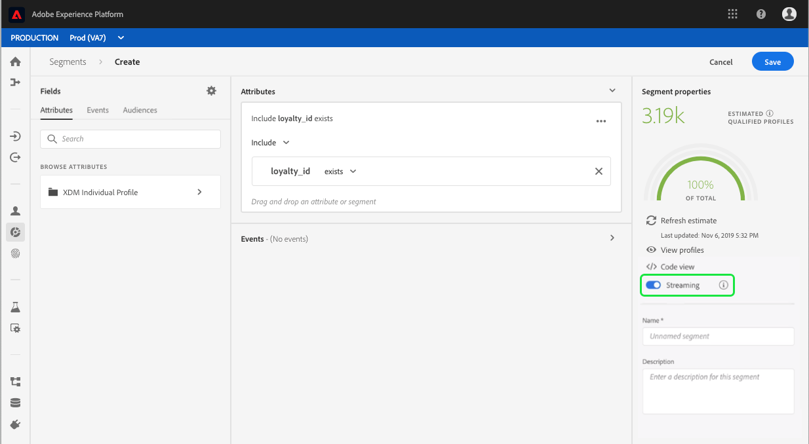

# Segment Builder-Benutzerhandbuch

Der Segmentierungsdienst für Adobe Experience Platform stellt eine RESTful-API und eine Benutzeroberfläche zum Erstellen von Segmentdefinitionen aus Daten aus dem Echtzeit-Profil von Kunden bereit.

## Erste Schritte

Das Arbeiten mit Segmentdefinitionen erfordert ein Verständnis der verschiedenen Experience Platform-Dienste, die mit der Segmentierung verbunden sind. Bevor Sie dieses Benutzerhandbuch lesen, lesen Sie bitte die Dokumentation für die folgenden Dienste:

- [Segmentierungsdienst](../home.md): Mit dem Segmentierungsdienst können Sie in Experience Platform gespeicherte Daten, die sich auf Einzelpersonen (z. B. Potenzieller Kunde, Benutzer oder Organisationen) beziehen, in kleinere Gruppen unterteilen, die ähnliche Eigenschaften aufweisen und ähnlich wie Marketingstrategien reagieren.
- [Echtzeit-Profil](../../profile/home.md): Bietet ein einheitliches, Echtzeit-Profil für Kunden, das auf aggregierten Daten aus mehreren Quellen basiert.
- [Identitätsdienst](../../identity-service/home.md): Ermöglicht Kunden-Profil in Echtzeit durch Überbrückung von Identitäten aus unterschiedlichen Datenquellen, die in Plattform integriert werden.
- [Erlebnisdatenmodell (XDM)](../../xdm/home.md): Das standardisierte Framework, mit dem Plattform Kundenerlebnisdaten organisiert.

Es ist außerdem wichtig, zwei Schlüsselbegriffe zu kennen, die in diesem Dokument verwendet werden, und den Unterschied zwischen ihnen zu verstehen:
- **Segmentdefinition**: Der Regelsatz, der zur Beschreibung wichtiger Merkmale oder Verhaltensweisen einer Zielgruppe-Audience verwendet wird.
- **Audience**: Der resultierende Satz von Profilen, die die Kriterien einer Segmentdefinition erfüllen.

## Zugriff auf Segmentdefinitionen

Um mit der Arbeit mit Segmentdefinitionen in Adobe Experience Platform zu beginnen, klicken Sie im linken Navigationsbereich auf **Segmente** . Um alle Segmentdefinitionen für Ihr Unternehmen anzuzeigen, klicken Sie auf die Registerkarte &quot; *Durchsuchen* &quot;. Diese Ansicht Liste Informationen zur Segmentdefinition, einschließlich der Bewertungsmethode, des erstellten Datums und des zuletzt geänderten Datums.

Die Bewertungsmethode kann entweder Streaming oder Batch sein. Streaming-Segmente werden ständig ausgewertet, wenn Daten in das System gelangen. Stapelsegmente werden gemäß einem festgelegten Zeitplan ausgewertet.

Für Stapelsegmente werden zusätzliche Informationen angezeigt, die sowohl das letzte Bewertungsdatum als auch das nächste Bewertungsdatum für den Stapel anzeigen.

Durch Klicken auf Segment **** erstellen in der oberen rechten Ecke wird der Segment Builder-Arbeitsbereich geöffnet, in dem Sie mit der Erstellung einer Segmentdefinition beginnen können.

## Arbeitsbereich &quot;Segmentaufbau&quot;

Der Segmentaufbau bietet eine umfangreiche Arbeitsfläche, mit der Sie mit Profil-Datenelementen interagieren können. Der Arbeitsbereich bietet intuitive Steuerelemente zum Erstellen und Bearbeiten von Regeln, z. B. Drag &amp; Drop-Kacheln, die zur Darstellung von Dateneigenschaften verwendet werden.

## Bausteine für die Segmentdefinition

Die grundlegenden Bausteine der Segmentdefinitionen sind **Attribute** und **Ereignis**. Darüber hinaus können die in bestehenden **Audiencen** enthaltenen Attribute und Ereignis auch als Komponenten für neue Definitionen verwendet werden.

Sie können diese Bausteine im Abschnitt &quot; *Felder* &quot;links im Arbeitsbereich &quot;Segmentaufbau&quot;sehen. *Felder* enthalten eine Registerkarte für jeden der Hauptbausteine: **Attribute**, **Ereignis** und **Audiencen**.

### Attribute

Auf der Registerkarte &quot; **Attribute** &quot;können Sie Profil-Attribute durchsuchen, die zur Klasse &quot;XDM Individuelles Profil&quot;gehören. Jeder Ordner kann erweitert werden, um zusätzliche Attribute anzuzeigen. Jedes Attribut ist eine Kachel, die in die Arbeitsfläche des Regelaufbaus in der Mitte des Arbeitsbereichs gezogen werden kann. Die Arbeitsfläche [des](#rule-builder-canvas) Regelaufbaus wird weiter unten in diesem Handbuch erläutert.

### Ereignisse

Auf der Registerkarte &quot; **Ereignis** &quot;können Sie eine Audience erstellen, die auf Ereignissen oder Aktionen basiert, die mit XDM ExperienceEvent-Datenelementen durchgeführt wurden. Sie finden Ereignistyp auch auf der Registerkarte &quot; **Ereignis** &quot;, bei denen es sich um eine Sammlung häufig verwendeter Ereignis handelt, mit denen Sie Ihre Segmente schneller erstellen können.

Sie können nicht nur nach ExperienceEvent-Elementen suchen, sondern auch nach Ereignistypen suchen. Ereignistyp verwenden dieselbe Kodierungslogik wie ExperienceEvents, ohne dass Sie die XDM ExperienceEvent-Klasse durchsuchen müssen, um nach dem richtigen Ereignis zu suchen. Wenn Sie z. B. die Suchleiste verwenden, um nach &quot;Warenkorb&quot;zu suchen, werden die Ereignistyp &quot;Warenkorb&quot;und &quot;Warenkorb&quot;zurückgegeben, bei denen es sich um zwei sehr häufig verwendete Warenkorbaktionen beim Erstellen von Segmentdefinitionen handelt.

Sie können nach beliebigen Komponenten suchen, indem Sie deren Namen in die Suchleiste eingeben, die die Suchsyntax von [Lucene verwendet](https://docs.microsoft.com/en-us/azure/search/query-lucene-syntax). Die Suchergebnisse beginnen mit der Eingabe ganzer Wörter zu füllen. Wenn Sie beispielsweise eine Regel auf Grundlage des XDM-Felds erstellen möchten, geben Sie `ExperienceEvent.commerce.productViews`im Suchfeld Beginn &quot;product Ansichten&quot;ein. Sobald das Wort &quot;Produkt&quot;eingegeben wurde, werden die Suchergebnisse angezeigt. Jedes Ergebnis enthält die Objekthierarchie, zu der es gehört.

>[!NOTE] Die Anzeige benutzerdefinierter Schema-Felder, die von Ihrem Unternehmen definiert wurden, kann bis zu 24 Stunden dauern und zur Verwendung bei der Erstellung von Regeln verfügbar werden.

Anschließend können Sie ExperienceEvents und Ereignistyp einfach per Drag &amp; Drop in Ihre Segmentdefinition ziehen.

Standardmäßig werden nur ausgefüllte Schema-Felder aus Ihrem Datenspeicher angezeigt. Dies schließt Ereignistyp ein. Wenn die Liste &quot;Ereignistyp&quot;nicht sichtbar ist oder Sie nur &quot;Beliebig&quot;als Ereignistyp auswählen können, klicken Sie auf das Zahnradsymbol neben *Felder* und wählen Sie dann unter &quot; **Verfügbare Felder** &quot;die Option Vollständiges XDM-Schema ** anzeigen aus. Klicken Sie erneut auf das Zahnradsymbol, um zur Registerkarte &quot; *Felder* &quot;zurückzukehren, und Sie sollten jetzt mehrere Ereignistyp und Schema-Felder unabhängig davon, ob sie Daten enthalten oder nicht, Ansicht werden können.

### Zielgruppen

Auf der Registerkarte &quot; **Audiencen** &quot;werden alle Audiencen, die aus externen Quellen importiert wurden, wie z. B. Adobe Audience Manager, sowie die in Experience Platform erstellten Audiencen Liste.

Auf der Registerkarte &quot;Audiencen&quot;können Sie alle verfügbaren Quellen als Ordnergruppe anzeigen. Wenn Sie in diese Ordner klicken, werden verfügbare Unterordner und Audiencen angezeigt. Außerdem können Sie auf das Ordnersymbol klicken (wie im Bild ganz rechts), um die Ordnerstruktur (ein Häkchen gibt den Ordner an, in dem Sie sich befinden) Ansicht und einfach durch Klicken auf den Ordnernamen im Baum durch die Ordnerstruktur zurück zu navigieren.

Wenn Sie den Mauszeiger über das ⓘ neben einer Audience halten, können Sie Informationen zur Ansicht der Audience einschließlich ID, Beschreibung und Ordnerhierarchie aufrufen, um die Audience zu suchen.

Sie können auch über die Suchleiste nach Audiencen suchen, die die Suchsyntax von [Lucene verwendet](https://docs.microsoft.com/en-us/azure/search/query-lucene-syntax). Wenn Sie auf der Registerkarte &quot; *Audiencen* &quot;einen Ordner der obersten Ebene auswählen, wird die Suchleiste angezeigt, sodass Sie in diesem Ordner suchen können. Die Suchergebnisse beginnen erst dann zu füllen, wenn die gesamten Wörter eingegeben wurden. Wenn Sie beispielsweise eine Audience mit dem Namen `Online Shoppers`suchen möchten, geben Beginn in der Suchleiste &quot;Online&quot;ein. Sobald das Wort &quot;Online&quot; vollständig eingegeben wurde, erscheinen die Suchergebnisse mit dem Wort &quot;Online&quot;.

## Arbeitsfläche Regelaufbau

Eine Segmentdefinition ist eine Auflistung von Regeln, die zur Beschreibung der Hauptmerkmale oder des Verhaltens einer Zielgruppe-Audience verwendet werden. Diese Regeln werden mithilfe der Arbeitsfläche *des* Regelaufbaus im Zentrum des Segmentaufbaus erstellt.

Um Ihrer Segmentdefinition eine neue Regel hinzuzufügen, ziehen Sie eine Kachel aus der Registerkarte &quot; *Felder* &quot;und legen Sie sie auf der Arbeitsfläche des Regelaufbaus ab. Anschließend werden Ihnen kontextspezifische Optionen entsprechend der Art der hinzugefügten Daten angezeigt. Zu den verfügbaren Datentypen gehören: Zeichenfolgen, Datumsangaben, ExperienceEvents, Ereignistyp und Audiencen.

### Hinzufügen von Audiencen

Sie können eine Audience per Drag &amp; Drop von der Registerkarte &quot; *Audience* &quot;auf die Arbeitsfläche &quot;Rule Builder&quot;ziehen, um auf die Mitgliedschaft in der Audience in der neuen Segmentdefinition zu verweisen. Auf diese Weise können Sie die Audiencen-Mitgliedschaft als Attribut in der neuen Segmentregel ein- oder ausschließen.

Bei Plattformregeln, die mit dem Segmentaufbau erstellt wurden, haben Sie die Möglichkeit, die Audience in den Regelsatz zu konvertieren, der in der Segmentdefinition für diese Audience verwendet wurde. Diese Konversion erstellt eine Kopie der Regellogik, die dann ohne Beeinträchtigung der ursprünglichen Segmentdefinition geändert werden kann.

>[!NOTE] Beim Hinzufügen einer Audience aus einer externen Quelle wird nur auf die Audience-Mitgliedschaft verwiesen. Sie können die Audience nicht in Regeln konvertieren. Daher können die zum Erstellen der ursprünglichen Audience verwendeten Regeln in der neuen Segmentdefinition nicht geändert werden.

## Behälter

Segmentregeln werden in der Reihenfolge bewertet, in der sie aufgeführt sind. Container ermöglichen die Steuerung der Ausführungsreihenfolge durch die Verwendung verschachtelter Abfragen.

Nachdem Sie der Regelaufbauarbeitsfläche mindestens eine Kachel hinzugefügt haben, können Sie beginnen, Container hinzuzufügen. Um einen neuen Container zu erstellen, klicken Sie auf die Ellipsen (...) in der oberen rechten Ecke der Kachel und dann auf **Hinzufügen Container**.

Ein neuer Container wird als untergeordnetes Element des ersten Containers angezeigt. Sie können die Hierarchie jedoch durch Ziehen und Verschieben der Container anpassen. Das Standardverhalten eines Containers besteht darin, das angegebene Attribut, Ereignis oder die bereitgestellte Audience einzuschließen. Sie können Profil, die den Kriterien des Containers entsprechen, auf &quot;Ausschließen&quot;setzen, indem Sie in der oberen linken Ecke der Kachel auf &quot; **Einschließen** &quot;klicken und &quot;Ausschließen&quot;wählen.

Ein untergeordneter Container kann auch extrahiert und inline zum übergeordneten Container hinzugefügt werden, indem auf &quot;Container aufheben&quot;im untergeordneten Container geklickt wird. Klicken Sie auf die Auslassungspunkte (...) in der oberen rechten Ecke des untergeordneten Containers, um auf diese Option zuzugreifen.

Wenn Sie auf Container **aufheben** klicken, wird der untergeordnete Container entfernt und die Kriterien werden inline angezeigt.

>[!NOTE] Achten Sie beim Entpacken von Containern darauf, dass die Logik weiterhin der gewünschten Segmentdefinition entspricht.

## Zusammenführungsrichtlinien

Mit der Experience Platform können Sie Daten aus mehreren Quellen zusammenführen und kombinieren, um eine vollständige Ansicht der einzelnen Kunden zu erhalten. Beim Zusammenführen dieser Daten sind Zusammenführungsrichtlinien die Regeln, die Plattform verwendet, um zu bestimmen, wie Daten priorisiert werden und welche Daten kombiniert werden, um ein Profil zu erstellen.

Sie können eine Zusammenführungsrichtlinie auswählen, die Ihrem Marketingzweck für diese Audience entspricht, oder die standardmäßige Zusammenführungsrichtlinie verwenden, die von Platform bereitgestellt wird. Sie können mehrere, für Ihr Unternehmen spezifische Zusammenführungsrichtlinien erstellen, einschließlich der Erstellung Ihrer eigenen Standardrichtlinie für die Zusammenführung. Eine schrittweise Anleitung zum Erstellen von Richtlinien zum Zusammenführen für Ihr Unternehmen finden Sie im Lernprogramm zum [Arbeiten mit Richtlinien zum Zusammenführen mithilfe der Benutzeroberfläche](../../profile/ui/merge-policies.md).

Um eine Richtlinie zum Zusammenführen für Ihre Segmentdefinition auszuwählen, klicken Sie auf das Zahnradsymbol auf der Registerkarte &quot; *Felder* &quot;und wählen Sie dann im Dropdown-Menü *&quot;Richtlinie* zusammenführen&quot;die gewünschte Richtlinie aus.

## Segmenteigenschaften

Beim Erstellen einer Segmentdefinition zeigt der Abschnitt *Segmenteigenschaften* auf der rechten Seite des Arbeitsbereichs eine Schätzung der Größe des resultierenden Segments an, sodass Sie die Segmentdefinition nach Bedarf anpassen können, bevor Sie die Audience selbst erstellen.

Im Abschnitt *Segmenteigenschaften* können Sie außerdem wichtige Informationen zur Segmentdefinition angeben, einschließlich *Name* und *Beschreibung*. Segmentdefinitionsnamen werden verwendet, um Ihr Segment unter den von Ihrer Organisation definierten zu identifizieren. Daher sollten sie beschreibend, knapp und eindeutig sein.

Wenn Sie Ihre Segmentdefinition weiter erstellen, können Sie eine paginierte Vorschau der Audience durch Auswahl der Profil für die **Ansicht** Ansicht erstellen.

>[!NOTE] Die Schätzungen der Audience werden anhand einer Stichprobengröße der Stichprobendaten dieses Tages erstellt. Wenn sich in Ihrem Profil-Store weniger als 1 Million Entitäten befinden, wird der vollständige Datensatz verwendet. für zwischen 1 und 20 Millionen Unternehmen werden 1 Million Einheiten verwendet; und für mehr als 20 Millionen Unternehmen werden 5 % der Gesamteinheiten verwendet. Weitere Informationen zum Generieren von Segmentschätzungen finden Sie im Abschnitt zur [Schätzung der Generierung](../tutorials/create-a-segment.md#estimate-and-preview-an-audience) des Lernprogramms zur Segmenterstellung.

## Geplante Segmentierung aktivieren

Nachdem Sie Segmentdefinitionen erstellt haben, können Sie diese dann durch On-Demand- oder geplante (kontinuierliche) Evaluierung bewerten. Die Auswertung bedeutet, dass Kundendaten in Echtzeit durch Segmentdefinitionen verschoben werden, um entsprechende Audiencen zu erhalten. Nach der Erstellung werden die Audiencen gespeichert und gespeichert, damit sie mit Experience Platform-APIs exportiert werden können.

Bei der On-Demand-Bewertung wird die API zur Durchführung von Evaluierungen und zum Aufbau von Audiencen nach Bedarf verwendet. Bei der geplanten Auswertung (auch als &quot;geplante Segmentierung&quot;bezeichnet) können Sie jedoch einen Zeitplan erstellen, um die Segmentdefinitionen zu einem bestimmten Zeitpunkt (maximal einmal täglich) zu bewerten.

Die Aktivierung Ihrer Segmentdefinitionen für die geplante Evaluierung kann über die Benutzeroberfläche oder die API erfolgen. Kehren Sie in der Benutzeroberfläche zur Registerkarte &quot; *Durchsuchen* &quot;innerhalb von **Segmenten** zurück und schalten Sie auf Alle Segmente **auswerten** um. Dadurch werden alle Segmente basierend auf dem von Ihrer Organisation festgelegten Zeitplan bewertet.

>[!NOTE] Geplante Auswertung kann für Sandboxen mit maximal fünf (5) Zusammenführungsrichtlinien für XDM Individuelles Profil aktiviert werden. Wenn Ihr Unternehmen über mehr als fünf Richtlinien zum Zusammenführen von XDM-Profilen innerhalb einer einzelnen Sandbox-Umgebung verfügt, können Sie keine geplante Auswertung verwenden.

Zeitpläne können derzeit nur mit der API erstellt werden. Ausführliche Anweisungen zum Erstellen, Bearbeiten und Arbeiten mit Zeitplänen mithilfe der API finden Sie im Tutorial zur Evaluierung und zum Zugriff auf Segmentergebnisse, insbesondere im Abschnitt zur [geplanten Auswertung mithilfe der API](../tutorials/evaluate-a-segment.md#scheduled-evaluation).

## Aktivieren der Streaming-Segmentierung

>[!NOTE] Die Streaming-Segmentierung ist eine Beta-Funktion und auf Anfrage verfügbar.

Darüber hinaus kann eine Segmentdefinition für Streaming-Segmentierung vor oder nach deren Erstellung aktiviert werden. Durch Streaming-Segmentierung wird ein Kunde sofort ausgewertet, sobald ein Ereignis in eine bestimmte Segmentgruppe aufgenommen wird. Mit dieser Funktion können die meisten Segmentregeln jetzt bewertet werden, wenn die Daten an die Plattform übergeben werden. Dies bedeutet, dass die Segmentmitgliedschaft auf dem neuesten Stand gehalten wird, ohne dass geplante Segmentierungsaufträge ausgeführt werden. Weitere Informationen zur Streaming-Segmentierung finden Sie in der Dokumentation zur [Streaming-Segmentierung](../api/streaming-segmentation.md).

Die Aktivierung Ihrer Segmentdefinitionen für Streaming kann über die Benutzeroberfläche oder die API erfolgen. Um eine neue oder vorhandene Segmentdefinition für das Streaming in der Benutzeroberfläche zu aktivieren, müssen Sie die *Streaming* -Option auf **EIN** umschalten.

Nachdem die Streaming-Segmentierung aktiviert wurde, muss eine Grundlinie festgelegt werden (dies ist der erste Run, nach dem das Segment immer auf dem neuesten Stand ist). Das System verarbeitet die Grundbildung automatisch, dies ist jedoch nur möglich, wenn die geplante Segmentierung aktiviert wurde. Weitere Informationen zur Aktivierung der geplanten Segmentierung finden Sie im vorherigen Abschnitt [dieses Benutzerhandbuchs](#enable-scheduled-segmentation).

## Verstöße gegen DULE-Richtlinien

>[!NOTE] Verstöße gegen DULE-Richtlinien gelten nur, wenn Sie ein Segment erstellen, das einem Ziel zugewiesen wurde.

Nachdem Sie Ihr Segment erstellt haben, wird das Segment von der Datenverwaltung analysiert, um sicherzustellen, dass innerhalb des Segments keine Richtlinienverletzungen auftreten. Weitere Informationen zu DUL- und Richtlinienverletzungen finden Sie in der Übersicht über die [Datenverwendung](../../data-governance/labels/overview.md).

## Nächste Schritte

Der Segmentaufbau bietet einen umfassenden Arbeitsablauf, mit dem Sie marktfähige Audiencen aus Echtzeitdaten zum Profil von Kunden isolieren können. Nach dem Lesen dieses Handbuchs sollten Sie jetzt in der Lage sein:

- Erstellen Sie Segmentdefinitionen mit einer Kombination aus Attributen, Ereignissen und vorhandenen Audiencen als Bausteine.
- Verwenden Sie die Arbeitsfläche und Container des Regelaufbaus, um die Reihenfolge zu steuern, in der Segmentregeln ausgeführt werden.
- Ansicht schätzt die voraussichtliche Audience, sodass Sie Ihre Segmentdefinitionen nach Bedarf anpassen können.
- Aktivieren Sie alle Segmentdefinitionen für die geplante Segmentierung.
- Aktivieren Sie die angegebenen Segmentdefinitionen für die Streaming-Segmentierung.

Eine schrittweise Anleitung zum Arbeiten mit dem Segmentierungsdienst mit der Echtzeit-Kunden-Profil-API finden Sie im Lernprogramm zum [Erstellen von Segmenten mit Audiencen mithilfe von APIs](../tutorials/create-a-segment.md) .