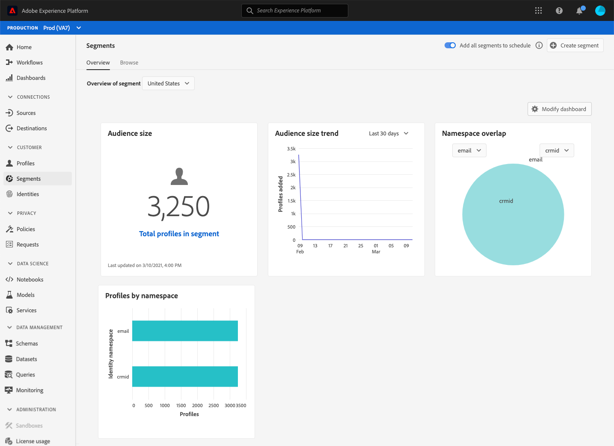
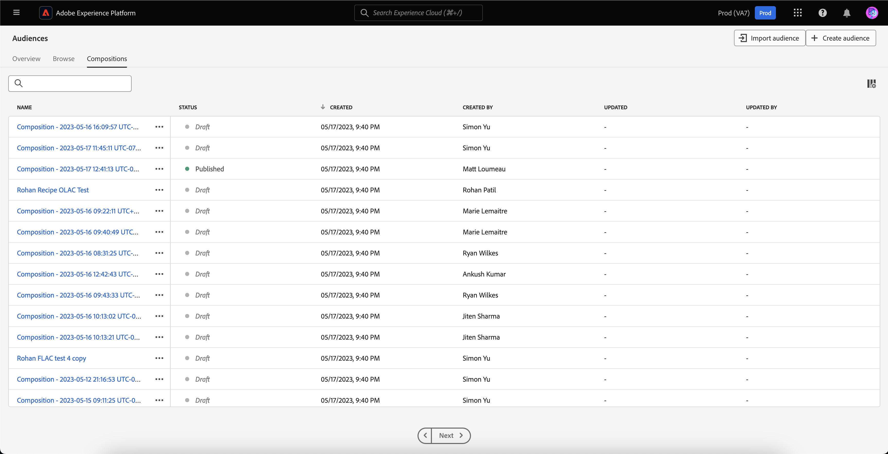
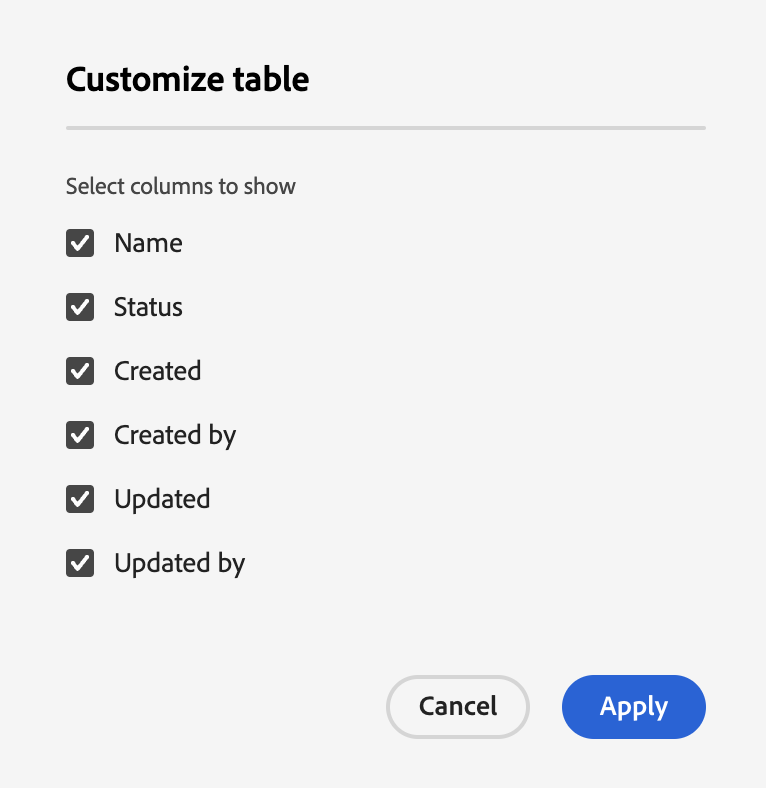
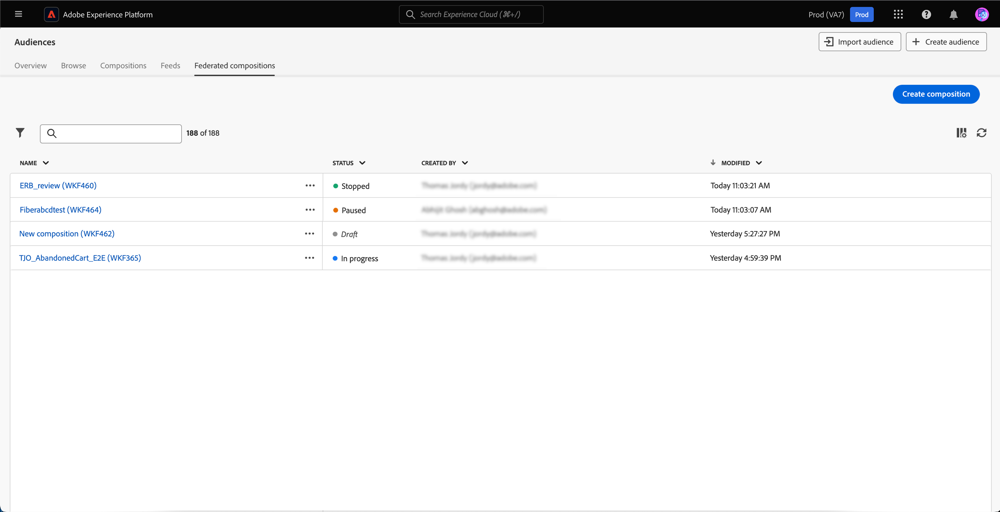
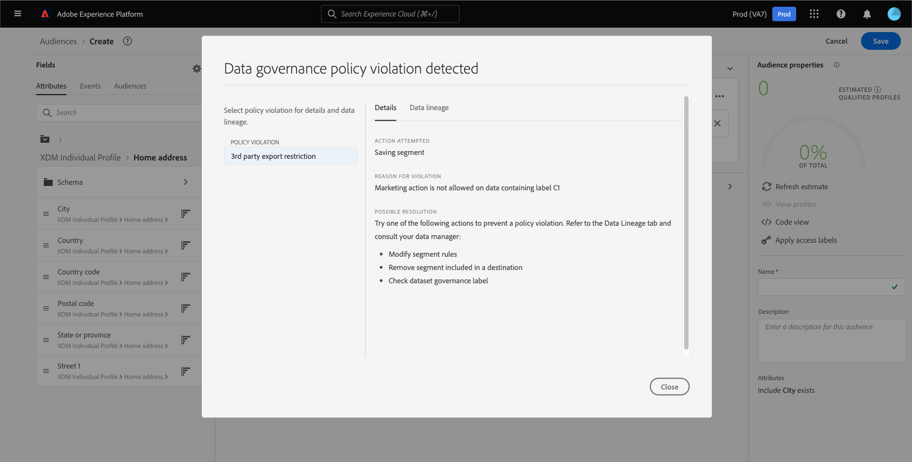

# Handbuch zur Benutzeroberfläche des Segmentierungs-Service

[!DNL Adobe Experience Platform Segmentation Service] bietet eine Benutzeroberfläche zur Erstellung und Verwaltung von Zielgruppen und Segmentdefinitionen.

## Erste Schritte

Die Arbeit mit Zielgruppen und Segmentdefinitionen erfordert ein Verständnis der verschiedenen [!DNL Experience Platform]-Dienste, die mit der Segmentierung verbunden sind. Bevor Sie dieses Benutzerhandbuch lesen, lesen Sie bitte die Dokumentation für folgende Services:

- [[!DNL Segmentation Service]](../home.md): [!DNL Segmentation Service] ermöglicht es Ihnen, in [!DNL Experience Platform] gespeicherte Daten, die sich auf Einzelpersonen (wie Kundinnen und Kunden, Interessierte, Benutzerinnen und Benutzer oder Organisationen) beziehen, in kleinere Gruppen zu unterteilen.
- [[!DNL Real-Time Customer Profile]](../../profile/home.md): Bietet ein einheitliches Echtzeit-Kundenprofil, das auf aggregierten Daten aus verschiedenen Quellen basiert.
- [[!DNL Adobe Experience Platform Identity Service]](../../identity-service/home.md): Ermöglicht die Erstellung von Kundenprofilen durch das Zusammenführen von Identitäten aus unterschiedlichen Datenquellen, die in [!DNL Experience Platform] aufgenommen werden.
- [[!DNL Experience Data Model (XDM)]](../../xdm/home.md): Das standardisierte Framework, mit dem Kundenerlebnisdaten durch [!DNL Experience Platform] organisiert werden. Um die Segmentierung optimal zu nutzen, stellen Sie sicher, dass Ihre Daten als Profile und Ereignisse gemäß den [Best Practices für die Datenmodellierung](../../xdm/schema/best-practices.md) aufgenommen werden.

Sie sollten auch die folgenden Schlüsselbegriffe verstehen, die in diesem Dokument verwendet werden, und den Unterschied zwischen ihnen verstehen:

- **Zielgruppe**: Eine Sammlung von Personen, die ähnliche Verhaltensweisen und/oder Merkmale aufweisen. Diese Personensammlung kann entweder von Adobe Experience Platform mithilfe von Segmentdefinitionen (von Experience Platform generierte Zielgruppe), der Zielgruppenkomposition oder aus externen Quellen wie benutzerdefinierten Uploads (extern generierte Zielgruppe) generiert werden.
- **Segmentdefinition**: Die Regeln, die Adobe Experience Platform verwendet, um wichtige Merkmale oder Verhaltensweisen einer Zielgruppe zu beschreiben.
- **Segmentieren**: Der Vorgang der Aufteilung von Profilen in Zielgruppen.

## Überblick

Wählen Sie in der Benutzeroberfläche von Experience Platform im linken Navigationsbereich die Option **[!UICONTROL Audiences]** aus, um die Registerkarte **[!UICONTROL Overview]** mit dem [!UICONTROL Audiences]-Dashboard zu öffnen.

>[!NOTE]
>
>Wenn Experience Platform neu in Ihrem Unternehmen ist und noch keine aktiven Profildatensätze oder Zusammenführungsrichtlinien erstellt hat, ist das [!UICONTROL Audiences]-Dashboard nicht sichtbar. Stattdessen werden auf der Registerkarte [!UICONTROL Overview] Links und Dokumentation angezeigt, die Ihnen bei den ersten Schritten mit Audiences helfen können.

### [!UICONTROL Audiences] dashboard {#segments-dashboard}

Im **[!UICONTROL Audiences]**-Dashboard werden Schlüsselmetriken im Zusammenhang mit den Zielgruppendaten Ihres Unternehmens beschrieben.

Weitere Informationen finden Sie im [Handbuch zum Zielgruppen-Dashboard](../../dashboards/guides/audiences.md).

## Durchsuchen {#browse}

Wählen Sie die Registerkarte **[!UICONTROL Browse]** aus, um das Zielgruppen-Portal anzuzeigen. Audience Portal bietet eine Liste aller Zielgruppen, die zu Ihrer Organisation und Sandbox gehören, und enthält Details wie die Profilanzahl, Herkunft, Erstellungsdatum, Datum der letzten Änderung, Tags und Aufschlüsselung.

Darüber hinaus können Sie mit dem Zielgruppenportal neue Zielgruppen mithilfe von Segment Builder oder der Zielgruppenkomposition erstellen sowie extern generierte Zielgruppen in Experience Platform importieren.

Weitere Informationen zu Audience Portal finden Sie unter [Audience Portal - Übersicht](./audience-portal.md).

## Kompositionen {#compositions}

Wählen Sie die Registerkarte **[!UICONTROL Compositions]** aus, um eine Liste aller Zielgruppen anzuzeigen, die durch die Zielgruppenkomposition für Ihre Organisation generiert wurden.

Standardmäßig enthält diese Ansicht Informationen zu den Zielgruppen, einschließlich Name, Status, Erstellungsdatum, Erstellungsperson, Datum der letzten Aktualisierung und zuletzt aktualisierende Person.

Neben jeder Zielgruppe befindet sich ein Symbol mit Auslassungspunkten. Wenn Sie diese Option auswählen, wird eine Liste der verfügbaren Schnellaktionen für die Zielgruppe angezeigt.

| Aktion | Beschreibung |
| ------ | ----------- |
| Duplizieren | Kopiert die ausgewählte Audience. |
| Verwalten des Zugriffs | Verwaltet die Zugriffsbeschriftungen für die Zielgruppe. Weitere Informationen zu Zugriffs-Labels finden Sie in der Dokumentation zum [Verwalten von Labels](../../access-control/abac/ui/labels.md). |
| Löschen | Löscht die ausgewählte Zielgruppe. Zielgruppen, die in nachgelagerten Zielen verwendet werden oder von anderen Zielgruppen abhängen **können** nicht gelöscht werden. Weitere Informationen zum Löschen von Audiences finden Sie unter [Häufig gestellte Fragen zur Segmentierung](../faq.md#lifecycle-states). |

Sie können das Symbol  auswählen, um zu ändern, welche Felder angezeigt werden.

Es wird ein Popup mit allen Feldern angezeigt, die in der Tabelle angezeigt werden können.

| Feld | Beschreibung |
| ----- | ----------- |
| [!UICONTROL Name] | Der Name der Zielgruppe. |
| [!UICONTROL Status] | Der Status der Zielgruppe. Mögliche Werte für dieses Feld sind `Draft`, `Inactive` und `Published`. |
| [!UICONTROL Created] | Datum und Uhrzeit der Erstellung der Zielgruppe. |
| [!UICONTROL Created by] | Der Name der Person, die die Zielgruppe erstellt hat. |
| [!UICONTROL Updated] | Datum und Uhrzeit der letzten Aktualisierung der Zielgruppe. |
| [!UICONTROL Updated by] | Der Name der Person, die die Zielgruppe zuletzt aktualisiert hat. |

Um zu sehen, wie die Zielgruppe aufgebaut ist, wählen Sie den Namen der Zielgruppe auf der Registerkarte [!UICONTROL Audiences] aus.

Die Seite „Zielgruppenkomposition“ wird mit den Bausteinen angezeigt, aus denen sich Ihre Zielgruppe zusammensetzt. Weitere Informationen zur Verwendung der Zielgruppenkomposition finden Sie im [Handbuch zur Benutzeroberfläche der Zielgruppenkomposition](./audience-composition.md).

## Komposition föderierter Zielgruppen {#fac}

Zusätzlich zu Zielgruppenkompositionen und Segmentdefinitionen können Sie die Federated-Audience-Komposition von Adobe verwenden, um neue Zielgruppen aus Unternehmensdatensätzen zu erstellen, ohne die zugrunde liegenden Daten zu kopieren, und diese Zielgruppen in Adobe Experience Platform Audience Portal zu speichern. Sie können auch bestehende Zielgruppen in Adobe Experience Platform anreichern, indem Sie zusammengestellte Zielgruppendaten verwenden, die aus dem Enterprise Data Warehouse zusammengeführt wurden. Lesen Sie das Handbuch zu [Komposition föderierter Zielgruppen](https://experienceleague.adobe.com/de/docs/federated-audience-composition/using/home).

## Streaming-Segmentierung  {#streaming-segmentation}

Streaming-Segmentierung bedeutet, dass Sie auf [!DNL Experience Platform] nahezu in Echtzeit segmentieren und sich dabei auf den Datenreichtum konzentrieren können. Mit der Streaming-Segmentierung erfolgt die Segmentqualifizierung jetzt direkt beim Eintreffen der Daten in [!DNL Experience Platform]. Damit entfällt die Notwendigkeit, Segmentierungsaufträge zu planen und auszuführen.

Weitere Informationen zur Streaming-Segmentierung finden Sie im [Benutzerhandbuch zur Streaming-Segmentierung](../methods/streaming-segmentation.md).

>[!NOTE]
>
>Damit die Streaming-Segmentierung funktioniert, müssen Sie die geplante Segmentierung für die Organisation aktivieren. Einzelheiten zur Aktivierung der geplanten Segmentierung finden Sie [im Abschnitt zur Streaming-Segmentierung in diesem Benutzerhandbuch](#scheduled-segmentation).

## Edge-Segmentierung {#edge-segmentation}

Bei der Edge-Segmentierung werden Zielgruppen in Experience Platform sofort am Edge ausgewertet, was Anwendungsfälle für die Personalisierung derselben Seite und der nächsten Seite ermöglicht.

Weitere Informationen zur Edge-Segmentierung finden Sie in der [Handbuch zur Benutzeroberfläche der Edge-Segmentierung](../methods/edge-segmentation.md)

## Richtlinienverstöße

>[!NOTE]
>
>Richtlinienverstöße können nur dann auftreten, wenn Sie eine Zielgruppe erstellen, die einem Ziel zugewiesen wurde.

Sobald Sie Ihre Zielgruppe erstellt haben, wird die Zielgruppe von der Data Governance in Adobe Experience Platform analysiert, um sicherzustellen, dass es keine Richtlinienverstöße innerhalb der Zielgruppe gibt. Weitere Informationen finden Sie in der [Übersicht zu Data Governance](../../data-governance/home.md).

## Nächste Schritte und zusätzliche Ressourcen {#next-steps}

Die [!DNL Segmentation Service]-Benutzeroberfläche bietet einen umfangreichen Workflow, der es Ihnen ermöglicht, vermarktbare Zielgruppen aus [!DNL Real-Time Customer Profile]-Daten zu erstellen.

Um mehr über den [!DNL Segmentation Service] zu erfahren, lesen Sie bitte die Dokumentation weiter. Um zu erfahren, wie Sie die [!DNL Segmentation Service]-API verwenden können, lesen Sie bitte das [[!DNL Segmentation Service] Entwicklerhandbuch](../api/overview.md).
