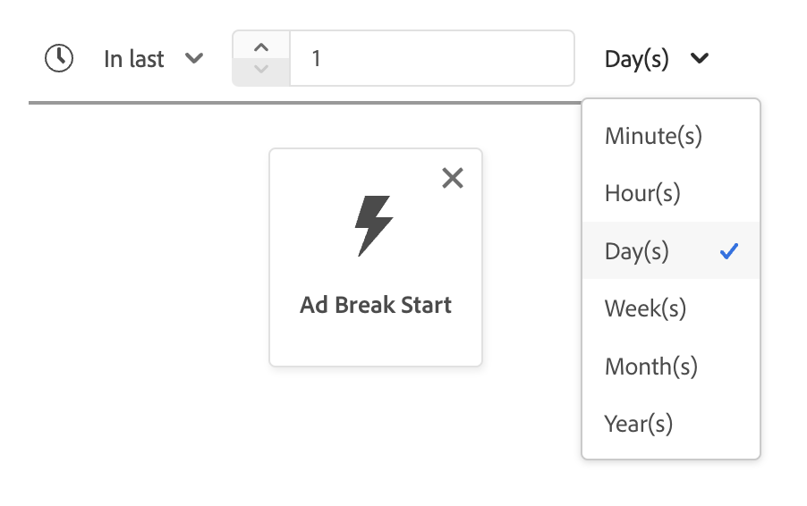

# Handbuch für die [!DNL Segment Builder]-Benutzeroberfläche

>[!NOTE]
>
>In diesem Handbuch wird erläutert, wie Sie Zielgruppen mit **Segmentdefinitionen** unter Verwendung von Segment Builder erstellen. Informationen zum Erstellen von Zielgruppen mithilfe der Zielgruppenkomposition finden Sie im [Handbuch zur Benutzeroberfläche der Zielgruppenkomposition](./audience-composition.md).

[!DNL Segment Builder] bietet einen umfangreichen Arbeitsbereich, in dem Sie mit [!DNL Profile]-Datenelementen interagieren können. Der Arbeitsbereich bietet intuitive Steuerelemente zum Erstellen und Bearbeiten von Regeln, z. B. Drag-and-Drop-Kacheln, die Dateneigenschaften entsprechen.

## Bausteine einer Segmentdefinition {#building-blocks}

>[!CONTEXTUALHELP]
>id="platform_segments_createsegment_segmentbuilder_fields"
>title="Felder"
>abstract="Die drei Feldtypen, aus denen eine Segmentdefinition besteht, sind Attribute, Ereignisse und Zielgruppen. Mit Attributen kann man Profilattribute verwenden, die zur Klasse „XDM-Kontaktprofil“ gehören. Mit Ereignissen kann man mithilfe von XDM ExperienceEvent-Datenelementen eine Zielgruppe basierend auf Aktionen oder stattfindenden Ereignissen erstellen, und mit Zielgruppen kann man importierte Zielgruppen aus externen Quellen verwenden."

>[!CONTEXTUALHELP]
>id="platform_segmentation_segmentbuilder_showfullxdmschema"
>title="Gesamtes XDM-Schema anzeigen"
>abstract="Standardmäßig werden nur Felder angezeigt, die Daten enthalten. Aktivieren Sie diese Option, um alle Felder im XDM-Schema anzuzeigen."

>[!CONTEXTUALHELP]
>id="platform_segmentation_segmentbuilder_showdeprecatedfields"
>title="Anzeigen verworfener Felder"
>abstract="Veraltete XDM-Felder werden standardmäßig nicht angezeigt. Aktivieren Sie diese Option, um veraltete XDM-Felder anzuzeigen."

Die grundlegenden Bausteine von Segmentdefinitionen sind Attribute und Ereignisse. Darüber hinaus können die in bestehenden Zielgruppen enthaltenen Attribute und Ereignisse als Komponenten für neue Definitionen verwendet werden.

>[!CONTEXTUALHELP]
>id="platform_segments_createsegment_segmentbuilder_summarydata"
>title="Zusammenfassungsdaten"
>abstract="Zusammenfassungsdaten werden nur für Profilattribute und <b>nicht</b> für Ereignis- oder Zielgruppenattribute angezeigt.  Zusammenfassungsdaten für Profilattribute werden unter folgenden Umständen möglicherweise nicht angezeigt: <ol><li>Einige Werte des Attributs sind mehr als 100 Zeichen lang.</li><li>Es gibt mehr als 3000 eindeutige Werte für das Attribut.</li></ol>"

>[!NOTE]
>
>Wenn Sie die Informationsblase eines Attributs auswählen, können Sie die Verteilung der Werte, auch als Zusammenfassungsdaten bezeichnet, des Felds anzeigen. Diese sind **nur** auf der Registerkarte Attribute verfügbar und nicht zur Verwendung auf der Registerkarte Ereignisse oder Zielgruppen verfügbar.
>
>Zusammenfassungsdaten werden angezeigt, wenn das Attribut die folgenden Kriterien erfüllt: Alle Werte des Attributs sind 100 Zeichen oder weniger und es gibt 3.000 oder weniger eindeutige Werte für das Attribut.
>
>Ein Attribut verfügt jedoch **nicht** über Zusammenfassungsdaten, wenn es sich um Daten mit mehreren Entitäten handelt, die über eine Beziehung mit dem Profil verknüpft sind. Wenn Sie beispielsweise über ein benutzerdefiniertes Schema mit dem Namen `Vehicle` verfügen **verfügen die** Eigenschaften) im `Vehicle` Schema **nicht** über Zusammenfassungsdaten.

Sie können diese Bausteine im Abschnitt **[!UICONTROL Fields]** auf der linken Seite des Arbeitsbereichs von [!DNL Segment Builder] sehen. **[!UICONTROL Fields]** enthält eine Registerkarte für jeden Hauptbaustein: &quot;[!UICONTROL Attributes]&quot;, &quot;[!UICONTROL Events]&quot; und &quot;[!UICONTROL Audiences]&quot;.

### Attribute

Auf der Registerkarte **[!UICONTROL Attributes]** können Sie [!DNL Profile] Attribute durchsuchen, die zur [!DNL XDM Individual Profile]-Klasse gehören. Jeder Ordner lässt sich erweitern, um zusätzliche Attribute anzuzeigen. Jedes Attribut ist eine Kachel, die in der Mitte des Arbeitsbereichs in die Arbeitsfläche des Regel-Builders gezogen werden kann. Die [Arbeitsfläche des Regel-Builders](#rule-builder-canvas) wird weiter unten in diesem Handbuch erläutert.

### Ereignisse

Auf der Registerkarte **[!UICONTROL Events]** können Sie mit [!DNL XDM ExperienceEvent] Datenelementen eine Zielgruppe erstellen, die auf stattgefundenen Ereignissen oder Aktionen basiert. Sie finden Ereignistypen auch auf dem Tab **[!UICONTROL Events]** . Dabei handelt es sich um eine Sammlung häufig verwendeter Ereignisse, mit der Sie Ihre Segmentdefinitionen schneller erstellen können.

Sie können nicht nur nach [!DNL ExperienceEvent]-Elementen suchen, sondern auch nach Ereignistypen. Ereignistypen verwenden dieselbe Codierungs-Logik wie [!DNL ExperienceEvents], ohne dass Sie die [!DNL XDM ExperienceEvent]-Klasse nach dem richtigen Ereignis durchsuchen müssen. Wenn Sie beispielsweise über die Suchleiste nach „cart“ suchen, werden die Ereignistypen &quot;[!UICONTROL AddCart]&quot; und &quot;[!UICONTROL RemoveCart]&quot; zurückgegeben. Dabei handelt es sich um zwei sehr häufig verwendete Warenkorbaktionen beim Erstellen von Segmentdefinitionen.

Sie können nach beliebigen Komponenten suchen, indem Sie ihren Namen in die Suchleiste eingeben; diese verwendet die [Suchsyntax von Lucene](https://docs.microsoft.com/de-DE/azure/search/query-lucene-syntax). Die Suchergebnisse beginnen sich mit der Eingabe ganzer Wörter zu füllen. Wenn Sie beispielsweise eine Regel auf Grundlage des XDM-Felds `ExperienceEvent.commerce.productViews` erstellen möchten, geben Sie im Suchfeld zunächst „product views“ ein. Sobald Sie das Wort „product“ eingegeben haben, werden Suchergebnisse angezeigt. Jedes Ergebnis enthält die Objekthierarchie, zu der es gehört.

>[!NOTE]
>
>Es kann bis zu 24 Stunden dauern, bis benutzerdefinierte Schemafelder, die von Ihrer Organisation definiert wurden, angezeigt und zum Erstellen von Regeln verfügbar werden.

Anschließend können Sie [!DNL ExperienceEvents] und &quot;[!UICONTROL Event Types]&quot; einfach per Drag-and-Drop in Ihre Segmentdefinition ziehen.

Standardmäßig werden nur ausgefüllte Schemafelder aus Ihrem Datenspeicher angezeigt. Dazu gehört &quot;[!UICONTROL Event Types]&quot;. Wenn die Liste &quot;[!UICONTROL Event Types]&quot; nicht sichtbar ist oder Sie nur &quot;[!UICONTROL Any]&quot; als &quot;[!UICONTROL Event Type]&quot; auswählen können, klicken Sie auf das **Zahnradsymbol** neben **[!UICONTROL Fields]** und wählen Sie dann **[!UICONTROL Show full XDM schema]** unter **[!UICONTROL Available Fields]** aus. Wählen Sie erneut **Zahnradsymbol**, um zur Registerkarte &quot;**[!UICONTROL Fields]**&quot; zurückzukehren. Jetzt sollten Sie mehrere &quot;[!UICONTROL Event Types]&quot;- und Schemafelder sehen, unabhängig davon, ob diese Daten enthalten oder nicht.

#### Adobe Analytics Report Suite-Datensätze

Sie können Daten aus einer oder mehreren Adobe Analytics Report Suites als Ereignisse innerhalb der Segmentierung verwenden.

Bei Verwendung von Daten aus einer einzelnen Analytics Report Suite fügt Experience Platform automatisch Deskriptoren und benutzerfreundliche Namen zu eVars hinzu, um das Auffinden dieser Felder innerhalb von [!DNL Segment Builder] zu erleichtern.

Bei Verwendung von Daten aus mehreren Analytics Report Suites **Experience Platform (**) automatisch Deskriptoren oder benutzerfreundliche Namen zu eVars hinzufügen. Daher müssen Sie vor Verwendung der Daten aus Analytics Report Suites auf eine Zuordnung von XDM-Feldern achten. Weitere Informationen zum Zuordnen von Analytics-Variablen zu XDM finden Sie im [Adobe Analytics-Handbuch zu Quellverbindungen](../../sources/tutorials/ui/create/adobe-applications/analytics.md#mapping).

Stellen Sie sich als Beispiel eine Situation vor, in der es zwei Report Suites mit den folgenden Variablen gibt:

| Feld | Report Suite Schema A | Report Suite Schema B |
| ----- | --------------------- | --------------------- |
| eVar1 | Referrer-Domain | Angemeldet J/N |
| eVar2 | Seitenname | Mitglied-Treuekennung |
| eVar3 | URL | Seitenname |
| eVar4 | Suchbegriffe | Produktname |
| event1 | Klicks | Seitenansichten |
| event2 | Seitenansichten | Zusätze zum Warenkorb |
| event3 | Zusätze zum Warenkorb | Checkouts |
| event4 | Käufe | Käufe |

In diesem Fall können Sie die beiden Report Suites dem folgenden Schema zuordnen:

>[!NOTE]
>
>Während die generischen eVar-Werte noch aufgefüllt werden, sollten Sie sie **nicht** in Ihren Segmentdefinitionen verwenden (sofern möglich), da die Werte eine andere Bedeutung haben können als ursprünglich in ihren Berichten.

Nachdem die Report Suites zugeordnet wurden, können Sie diese neu zugeordneten Felder in Ihren profilbezogenen Workflows und Segmentierungen verwenden.

| Szenario | Vereinigungsschema-Erlebnis | Allgemeine Segmentierungsvariable | Zugeordnete Segmentierungsvariable |
| -------- | ----------------------- | ----------------------------- | ---------------------------- |
| Einzelne Report Suite | Der Deskriptor für benutzerfreundliche Namen ist in generischen Variablen enthalten.   **Beispiel:** Seitenname (eVar2) | <ul><li>Der Deskriptor für benutzerfreundliche Namen ist in allgemeinen Variablen enthalten.</li><li>Abfragen verwenden Daten aus dem spezifischen Datensatz, da es sich um den einzigen Datensatz handelt.</li></ul> | Abfragen können Adobe Analytics-Daten und möglicherweise andere Quellen verwenden. |
| Mehrere Report Suites | In generischen Variablen sind keine Deskriptoren für benutzerfreundliche Namen enthalten.   **Beispiel:** eVar2 | <ul><li>Jedes Feld mit mehreren Deskriptoren wird als generisch angezeigt. Das bedeutet, dass in der Benutzeroberfläche keine benutzerfreundlichen Namen angezeigt werden.</li><li>Abfragen können Daten aus allen Datensätzen mit der eVar verwenden. Dies kann zu gemischten oder falschen Ergebnissen führen.</li></ul> | Abfragen verwenden korrekt kombinierte Ergebnisse aus mehreren Datensätzen. |

### Zielgruppen

>[!CONTEXTUALHELP]
>id="platform_segmentation_segmentBuilder_b2b_decomposition"
>title="Komplexe Auswertung"
>abstract="Der folgende Ausdruck ist zu komplex, um als einzelne Zielgruppe ausgedrückt zu werden. Führen Sie die folgenden Schritte aus, um sowohl B2B-Regeln als auch benutzerbasierte Ereignisse in derselben Segmentdefinition zu verwenden.<ol><li>Erstellen Sie eine Segmentdefinition, die nur auf die benutzerbasierten Ereignisse verweist, und speichern Sie sie als eigene Segmentdefinition.</li><li>Importieren Sie in einer neuen Segmentdefinition die zuvor erstellte Segmentdefinition, während Sie auf die B2B-Regeln verweisen.</li></ol>"

>[!CONTEXTUALHELP]
>id="platform_segmentation_segmentbuilder_externalaudiences"
>title="Externe Zielgruppen"
>abstract="Über die Registerkarte „Zielgruppen“ importierte Zielgruppen werden jetzt automatisch über das Zielgruppenportal angezeigt. Dazu gehören Zielgruppen, die aus Audience Manager, Customer Journey Analytics, Segment Match und anderen benutzerdefinierten Integrationen aufgenommen werden.  Ab Ende September 2025 werden Zielgruppen ausschließlich über die einheitliche Suche abgerufen und der vorherige Workflow wird nicht mehr unterstützt. Segment Match bleibt während der Umstellung des Diensts nur für eine geringe Anzahl bestimmter Kundinnen und Kunden verfügbar. Der Zugriff für neue Segment Match-Kundinnen und -Kunden kann auf Anfrage weiterhin aktiviert werden, bevor der Dienst vollständig eingestellt wird.  Für laufende Anwendungsfälle bezüglich Datenzusammenarbeit empfiehlt Adobe den Wechsel zu Collaboration, der langfristig unterstützten Lösung."
>additional-url="https://experienceleague.adobe.com/de/docs/experience-platform/segmentation/ui/audience-portal#list" text="Zielgruppenportal"

>[!NOTE]
>
>Für Zielgruppen, die in Experience Platform erstellt werden, werden nur Zielgruppen angezeigt **die dieselbe** haben.

Auf der Registerkarte **[!UICONTROL Audiences]** werden alle Zielgruppen, die aus externen Quellen (wie Adobe Audience Manager oder Customer Journey Analytics) importiert wurden, sowie alle in [!DNL Experience Platform] erstellten Zielgruppen aufgelistet.

Auf der Registerkarte **[!UICONTROL Audiences]** können Sie alle verfügbaren Quellen als eine Ordnergruppe anzeigen. Wenn Sie diese Ordner auswählen, werden verfügbare Unterordner und Zielgruppen angezeigt. Außerdem können Sie das Ordnersymbol auswählen (wie im Bild ganz rechts), um die Ordnerstruktur anzuzeigen (ein Häkchen gibt den Ordner an, in dem Sie sich befinden), und durch einfaches Auswählen eines Ordnernamens im Baum durch die Ordnerstruktur zurücknavigieren.

Wenn Sie mit dem Mauszeiger über das ⓘ neben einer Zielgruppe fahren, können Sie Informationen zur Zielgruppe anzeigen, einschließlich Kennung, Beschreibung und Ordnerhierarchie zum Auffinden der Zielgruppe.

## Arbeitsfläche des Regel-Builders {#rule-builder-canvas}

>[!IMPORTANT]
>
>Ab der Version vom Juni 2024 stellen die Zeitbeschränkungen „Dieser Monat“ und „Dieses Jahr“ die Zeitbeschränkungen „Monat bis heute“ bzw. „Jahr bis heute“ dar. Wenn Sie beispielsweise am 18. Juli eine Zielgruppe erstellt haben, die nach „allen Kunden, deren Geburtstag in diesem Monat stattfindet“ sucht, erhält die Zielgruppe alle Kunden, deren Geburtstag vom 1. Juli bis zum 31. Juli stattfand. Am 1. August erhielt diese Zielgruppe alle Kunden, deren Geburtstag vom 1. August bis zum 31. August stattfindet.
>
>Zuvor repräsentierten „Dieser Monat“ und „dieses Jahr“ jeweils 30 Tage bzw. 365 Tage, was Monate mit 31 Tagen und Schaltjahren nicht berücksichtigte.
>
>Um die Logik Ihrer Zielgruppen zu aktualisieren, speichern Sie Ihre zuvor erstellten Zielgruppen erneut.

Eine Segmentdefinition ist eine Kollektion von Regeln, die zur Beschreibung der Hauptmerkmale oder Verhaltensweisen einer Zielgruppe dienen. Diese Regeln werden mithilfe der Arbeitsfläche des Regel-Builders in der Mitte von [!DNL Segment Builder] erstellt.

Um Ihrer Segmentdefinition eine neue Regel hinzuzufügen, ziehen Sie eine Kachel aus der Registerkarte **[!UICONTROL Fields]** und legen Sie sie auf der Arbeitsfläche des Regel-Builders ab. Anschließend werden Ihnen je nach Art der hinzugefügten Daten kontextspezifische Optionen angezeigt. Zu den verfügbaren Datentypen gehören: Zeichenfolgen, Datumsangaben, [!DNL ExperienceEvents], &quot;[!UICONTROL Event Types]&quot; und Zielgruppen.

>[!IMPORTANT]
>
>Die neuesten Änderungen an Adobe Experience Platform haben sich auch auf die Verwendung der logischen Operatoren `OR` und `AND` zwischen Ereignissen ausgewirkt. Diese Aktualisierungen haben keinen Einfluss auf bestehende Segmentdefinitionen. Diese Änderungen wirken sich jedoch auf alle nachfolgenden Aktualisierungen vorhandener Segmentdefinitionen und neu erstellter Segmentdefinitionen aus. Weitere Informationen finden Sie im [Update zu Zeitkonstanten](./segment-refactoring.md).

Bei der Auswahl eines Werts für das Attribut wird eine Liste möglicher Aufzählungswerte für das Attribut angezeigt.

Wenn Sie einen Wert aus dieser Aufzählungsliste auswählen, wird der Wert mit einem durchgezogenen Rahmen dargestellt. Für Felder, die `meta:enum` (weiche) Aufzählungen verwenden, können Sie auch einen Wert auswählen, der **nicht** in der Liste der Aufzählungen steht. Wenn Sie einen eigenen Wert erstellen, wird dieser mit einem gepunkteten Rahmen und einer Warnung versehen, dass dieser Wert nicht in der Aufzählungsliste enthalten ist.

Wenn Sie mehrere Werte erstellen, können Sie sie alle gleichzeitig hinzufügen, indem Sie den Massen-Upload verwenden. Wählen Sie das  aus, um das **[!UICONTROL Add values in bulk]** Pop-up anzuzeigen.

Im **[!UICONTROL Add values in bulk]**-Popover können Sie eine CSV- oder TSV-Datei hochladen.

Alternativ können Sie manuell durch Kommas getrennte Werte hinzufügen.

Beachten Sie, dass maximal 250 Werte zulässig sind. Wenn Sie diese Grenze überschreiten, müssen Sie einige Werte entfernen, bevor Sie weitere hinzufügen.

### Hinzufügen von Zielgruppen

>[!CONTEXTUALHELP]
>id="platform_segmentation_segmentbuilder_addaudiences"
>title="Aktualisierungen der Suchfunktion"
>abstract="Das bestehende Suchsystem wurde aktualisiert und verwendet jetzt die einheitliche Suche. Mit der einheitlichen Suche können Sie die Zielgruppen einfacher und robuster nach Segmentzugehörigkeit durchsuchen."

Sie können eine Zielgruppe per Drag-and-Drop vom Tab **[!UICONTROL Audience]** auf die Arbeitsfläche des Regel-Builders ziehen, um auf die Zielgruppenzugehörigkeit in der neuen Segmentdefinition zu verweisen. Auf diese Weise können Sie die Zielgruppenzugehörigkeit als Attribut in den Regeln der neuen Segmentdefinition ein- oder ausschließen.

Bei [!DNL Experience Platform]-Zielgruppen, die mit [!DNL Segment Builder] erstellt werden, haben Sie die Möglichkeit, die Zielgruppe in den Regelsatz zu konvertieren, der in der Segmentdefinition für diese Zielgruppe verwendet wurde. Diese Konversion erstellt eine Kopie der Regellogik, die dann ohne Beeinträchtigung der ursprünglichen Segmentdefinition verändert werden kann. Vergewissern Sie sich, dass Sie die letzten Änderungen an Ihrer Segmentdefinition gespeichert haben, bevor Sie sie in eine Regellogik konvertieren.

>[!NOTE]
>
>Beim Hinzufügen einer Zielgruppe aus einer externen Quelle wird nur auf die Zielgruppenzugehörigkeit verwiesen. Sie können die Zielgruppe nicht in Regeln konvertieren. Daher können die zum Erstellen der ursprünglichen Zielgruppe verwendeten Regeln in der neuen Segmentdefinition auch nicht geändert werden.

Wenn beim Konvertieren von Zielgruppen in Regeln Konflikte auftreten, versucht [!DNL Segment Builder], die vorhandenen Optionen optimal zu erhalten.

### Code-Ansicht

Alts Alternative können Sie eine Code-basierte Version einer in [!DNL Segment Builder] erstellten Regel anzeigen. Nachdem Sie Ihre Regel auf der Arbeitsfläche des Regel-Builders erstellt haben, können Sie **[!UICONTROL Code view]** auswählen, um Ihre Segmentdefinition als PQL anzuzeigen.

Die Code-Ansicht bietet eine Schaltfläche, mit der Sie den Wert der Segmentdefinition kopieren können, der in API-Aufrufen verwendet werden kann. Um die neueste Version der Segmentdefinition zu erhalten, stellen Sie sicher, dass Sie die letzten Änderungen an der Segmentdefinition gespeichert haben.

### Aggregationsfunktionen

Eine Aggregation in [!DNL Segment Builder] ist eine Berechnung für eine Gruppe von XDM-Attributen, deren Datentyp eine Zahl ist (entweder vom Typ „Double“ oder „Integer“). Die vier unterstützten Aggregationsfunktionen in Segment Builder sind SUM, AVERAGE, MIN und MAX.

Um eine Aggregationsfunktion zu erstellen, wählen Sie in der linken Leiste ein Ereignis aus und fügen Sie es in den [!UICONTROL Events] ein.

Nachdem Sie das Ereignis im Ereignis-Container platziert haben, wählen Sie das Auslassungssymbol (…) und dann **[!UICONTROL Aggregate]** aus.

Die Aggregation wird jetzt hinzugefügt. Nun können Sie die Aggregationsfunktion, das zu aggregierende Attribut, die Gleichheitsfunktion sowie den Wert auswählen. Im folgenden Beispiel würde diese Segmentdefinition alle Profile mit einem Gesamtkaufwert von über 100 $ qualifizieren, selbst wenn jeder einzelne Kauf unter 100 $ liegt.

### Zählungsfunktionen {#count-functions}

Mit den Zählungsfunktionen in Segment Builder können Sie nach bestimmten Ereignissen suchen und zählen, wie oft sie durchgeführt wurden. Die unterstützten Zählungsfunktionen in Segment Builder sind „Mindestens“, „Höchstens“, „Genau“, „Zwischen“ und „Alle“.

Um eine Zählungsfunktion zu erstellen, wählen Sie in der linken Leiste ein Ereignis aus und fügen Sie es in den [!UICONTROL Events] ein.

Nachdem Sie das Ereignis im Ereignis-Container platziert haben, wählen Sie die Schaltfläche [!UICONTROL At least 1] aus.

Die Zählungsfunktion wird jetzt hinzugefügt. Nun können Sie die Zählungsfunktion und den Wert der Funktion auswählen. Im folgenden Beispiel würden alle Ereignisse mit mindestens einem Klick einbezogen werden.

### Zeitliche Beschränkungen {#time-constraints}

Mit Zeitbeschränkungen können Sie Zeitbeschränkungen auf zeitbasierte Attribute, Ereignisse und die Sequenz zwischen den Ereignissen anwenden.

>[!IMPORTANT]
>
>Wenn Sie eine Segmentdefinition mit den Zeitbeschränkungen „Diesen Monat“ oder „Dieses Jahr“ vor Juni 2024 erstellt haben, müssen Sie Ihre Segmentdefinitionen erneut speichern. Vor Juni 2024 basierte „Dieser Monat“ auf 30 Tagen und „Dieses Jahr“ auf 365 Tagen.

>[!NOTE]
>
>Sowohl [Zeitbeschränkung auf Jahresebene ignorieren](./ignore-year.md) als auch [Zeitbeschränkungen auf Regelebene](./segment-refactoring.md) wurden zuvor überarbeitet, wobei weitere Informationen in den verknüpften Übersichten verfügbar sind.

Die Liste der verfügbaren Zeitbeschränkungen sieht wie folgt aus:

+++ Verfügbare Zeitbeschränkungen

>[!NOTE]
>
>Alle Zeitbeschränkungen basieren auf UTC.
>
>Wenn das Kontrollkästchen [!UICONTROL Ignore year] aktiviert ist, wird das Jahr **nicht** im Rahmen der Segmentdefinitionsbewertung verglichen.

| Zeitliche Beschränkung | Beschreibung | Kann Jahr ignorieren aktivieren | Beispiel |
| --------------- | ----------- | ------------------- | ------- |
| Heute | Das Attribut oder Ereignis, das verglichen wird **muss** heute eintreten. | Ja | {width="100" zoomable="yes"} |
| Gestern | Das Attribut oder Ereignis, das verglichen wird **muss** gestern eintreten. | Ja | {width="100" zoomable="yes"} |
| Dieser Monat | Das zu vergleichende Attribut oder Ereignis **muss** in diesem Kalendermonat auftreten. | Ja | {width="100" zoomable="yes"} |
| Dieses Jahr | Das zu vergleichende Attribut oder Ereignis **muss** in diesem Kalenderjahr auftreten. | Nein | {width="100" zoomable="yes"} |
| Benutzerdefiniertes Datum | Das zu vergleichende Attribut oder Ereignis **muss** an dem angegebenen Datum auftreten. | Ja | {width="100" zoomable="yes"} |
| Letzte | Das zu vergleichende Attribut oder Ereignis **muss** innerhalb des letzten ausgewählten Zeitraums auftreten. Dieser Zeitraum ist **einschließlich** bis zur Auswertungszeit. | Nein | {width="100" zoomable="yes"} |
| Von (bis) | Das zu vergleichende Attribut oder Ereignis **muss** innerhalb der beiden ausgewählten Kalenderdaten auftreten. Dieser Zeitraum umfasst **einschließlich** der beiden Datumsangaben. | Ja, wenn benutzerdefiniertes Datum | {width="100" zoomable="yes"} |
| Während | Das zu vergleichende Attribut oder Ereignis **muss** innerhalb des ausgewählten Monats oder Jahres auftreten. Wenn ein Monat ausgewählt ist, müssen Sie sowohl den Monat als auch das Jahr auswählen, in dem das Attribut oder Ereignis stattgefunden hat.  Wenn ein Jahr ausgewählt ist, müssen Sie einfach das Jahr auswählen, in dem das Attribut oder Ereignis stattgefunden hat. Wenn Sie einen Monat auswählen, können Sie auch das Kontrollkästchen [!UICONTROL Ignore year] aktivieren. | Ja | {width="100" zoomable="yes"} |
| Innerhalb (+/-) | Das zu vergleichende Attribut oder Ereignis **muss** innerhalb von Tagen, Wochen, Monaten oder Jahren nach dem ausgewählten Datum auftreten. Dieser Zeitraum umfasst **einschließlich** der beiden Datumsangaben. Das ausgewählte Datum kann Heute, Gestern oder ein anderes benutzerdefiniertes Datum Ihrer Wahl sein. | Ja | {width="100" zoomable="yes"} |
| Vorher | Das zu vergleichende Attribut oder Ereignis **muss** vor dem ausgewählten Datum liegen. Das ausgewählte Datum kann ein benutzerdefiniertes Datum Ihrer Wahl oder eine Auswahl zwischen Tagen, Wochen, Monaten oder Jahren sein. | Ja | {width="100" zoomable="yes"} |
| Nachher | Das zu vergleichende Attribut oder Ereignis **muss** nach dem ausgewählten Datum auftreten. Das ausgewählte Datum kann ein benutzerdefiniertes Datum Ihrer Wahl oder eine Auswahl zwischen Tagen, Wochen, Monaten oder Jahren sein. | Ja | {width="100" zoomable="yes"} |
| Rollbereich | Das zu vergleichende Attribut oder Ereignis muss zwischen den beiden relativen Daten auftreten. Die Datumsangaben können in Sekunden, Minuten, Stunden, Tagen, Wochen, Monaten oder Jahren dargestellt werden. | Nein | {width="100" zoomable="yes"} |
| Nächste | Das zu vergleichende Attribut oder Ereignis muss innerhalb des nächsten ausgewählten Zeitraums auftreten. Die ausgewählten Zeiträume umfassen Minuten, Stunden, Tage, Wochen, Monate und Jahre. | Nein | {width="100" zoomable="yes"} |
| Existiert | Das Attribut ist vorhanden. | Nein | {width="100" zoomable="yes"} |
| existiert nicht | Das Attribut ist nicht vorhanden. | Nein | {width="100" zoomable="yes"} |

+++

Wenn Sie eine Zeitbeschränkung auf ein Ereignis anwenden, können Sie sie entweder auf der Arbeitsfläche, auf Kartenebene oder zwischen Ereignissen anwenden.

#### Einschränkung auf Canvas-Ebene

Um eine Zeitbeschränkung auf Arbeitsflächen-Ebene anzuwenden, wählen Sie das Uhrensymbol aus, das über der Zeitleiste von Ereignissen angezeigt wird.

Wenn Sie eine Zeitbeschränkung auf der Arbeitsflächen-Ebene anwenden, wird die Zeitbeschränkung auf **alle** Ereignisse in der Zielgruppe angewendet.

#### Einschränkung auf Kartenebene

Um eine Beschränkung auf Kartenebene anzuwenden, wählen Sie die Karte aus, auf die Sie die Zeitbeschränkung anwenden möchten, gefolgt vom Symbol mit den Auslassungspunkten, und **[!UICONTROL Apply time rule]**. Auf diese Weise können Sie eine Zeitbeschränkung innerhalb des **[!UICONTROL Event Rules]**-Containers auswählen.

Wenn Sie eine Zeitbeschränkung auf Kartenebene anwenden, gilt die Zeitbeschränkung für das **spezifizierte** Ereignis in der Zielgruppe.

#### Zwischen Ereignisbegrenzungen

Um eine Zeitbeschränkung zwischen Ereignissen anzuwenden, wählen Sie das Uhrensymbol zwischen den beiden Ereignissen aus, auf die Sie die Zeitbeschränkung anwenden möchten.

Wenn Sie eine Zeitbeschränkung zwischen den Ereignissen anwenden, gilt die Zeitbeschränkung für die Zeit **zwischen** den Ereignissen.

Die Liste der verfügbaren Zeitbeschränkungen für diesen Vorgang unterscheidet sich von der Hauptliste der Zeitbeschränkungen und ist wie folgt:

+++ Verfügbare Zeitbeschränkungen

| Zeitliche Beschränkung | Beschreibung |
| --------------- | ----------- |
| Nachher | Das letztgenannte Ereignis **muss mindestens** nach dem vorangegangenen Ereignis stattfinden. |
| Innerhalb von | Die beiden Ereignisse **müssen** innerhalb des in der Zeitbeschränkung angegebenen Zeitraums stattfinden. |

>[!NOTE]
>
>Bei Verwendung der Zeitbeschränkung „Nach“ kann letzteres Ereignis länger als die in der Zeitbeschränkung aufgeführte Zeit stattfinden. >
>&#x200B;>Wenn Sie beispielsweise ein Seitenansichtsereignis und ein Checkout-Ereignis haben und die Zeitbeschränkung „Nach 1 Stunde“ zwischen diese beiden Ereignisse setzen, wäre eine Segmentdefinition mit einem Checkout-Ereignis 2 Stunden nach dem Seitenansichtsereignis qualifiziert.
>
>Darüber hinaus können diese beiden Zeitbeschränkungen in Abstimmung miteinander verwendet werden.
>
>Wenn Sie beispielsweise über ein Seitenansichtsereignis und ein Checkout -Ereignis verfügen und sowohl die Zeitbeschränkungen „Nach 1 Stunde“ als auch „Innerhalb von 24 Stunden“ festlegen, würde eine Segmentdefinition mit einem Checkout -Ereignis 12 Stunden nach dem Seitenansichtsereignis qualifiziert, aber eine Segmentdefinition mit einem Checkout -Ereignis 36 Stunden nach dem Seitenansichtsereignis nicht.

+++

## Container {#containers}

Segmentregeln werden in der Reihenfolge ausgewertet, in der sie aufgelistet sind. Container ermöglichen eine Steuerung der Ausführungsreihenfolge durch Verwendung verschachtelter Abfragen.

Nachdem Sie der Arbeitsfläche des Regel-Builders mindestens eine Kachel hinzugefügt haben, können Sie beginnen, Container hinzuzufügen. Um einen neuen Container zu erstellen, wählen Sie oben rechts auf der Kachel das Auslassungszeichen (…) und dann **[!UICONTROL Add container]** aus.

Ein neuer Container wird als untergeordnetes Element des ersten Containers angezeigt. Sie können die Hierarchie jedoch durch Ziehen und Verschieben der Container anpassen. Das Standardverhalten eines Containers besteht darin, das angegebene Attribut, das angegebene Ereignis oder die angegebene Zielgruppe zu &quot;[!UICONTROL Include]&quot;. Sie können die Regel so einrichten, dass Profile, die den Kriterien des Containers entsprechen, [!UICONTROL Exclude] werden, indem Sie oben links auf der Kachel **[!UICONTROL Include]** auswählen und auf &quot;[!UICONTROL Exclude]&quot; klicken.

Ein untergeordneter Container kann auch extrahiert und inline zum übergeordneten Container hinzugefügt werden, indem Sie im untergeordneten Container die Option „Container entpacken“ auswählen. Wählen Sie oben rechts im untergeordneten Container das Auslassungszeichen (...) aus, um auf diese Option zuzugreifen.

Wenn Sie **[!UICONTROL Unwrap container]** auswählen, wird der untergeordnete Container entfernt und die Kriterien erscheinen inline.

>[!NOTE]
>
>Achten Sie beim Entpacken von Containern darauf, dass die Logik weiterhin der gewünschten Segmentdefinition entspricht.

## Zusammenführungsrichtlinien

>[!CONTEXTUALHELP]
>id="platform_segmentation_createSegment_segmentBuilder_mergePolicies"
>title="Zusammenführungsrichtlinien"
>abstract="Eine Zusammenführungsrichtlinie ermöglicht das Zusammenführen verschiedener Datensätze, um das Profil zu bilden. Experience Platform bietet eine standardmäßige Zusammenführungsrichtlinie. Alternativ können Sie eine neue standardmäßige Zusammenführungsrichtlinie in „Profile“ erstellen. Wählen Sie eine Zusammenführungsrichtlinie aus, die Ihrem Marketing-Zweck für diese Zielgruppe entspricht."

Mit [!DNL Experience Platform] können Sie Daten aus verschiedenen Quellen zusammenführen und kombinieren, damit Sie sich einen kompletten Überblick über einzelne Kundinnen und Kunden verschaffen können. Beim Zusammenführen dieser Daten dienen Zusammenführungsrichtlinien als jene Regeln, mit denen [!DNL Experience Platform] bestimmt, wie Daten priorisiert und welche Daten kombiniert werden sollen, um ein Profil zu erstellen.

Sie können eine Zusammenführungsrichtlinie auswählen, die Ihrem Marketing-Zweck für diese Zielgruppe entspricht, oder die standardmäßige Zusammenführungsrichtlinie von [!DNL Experience Platform] nutzen. Sie können verschiedene, für Ihre Organisation eindeutige Zusammenführungsrichtlinien erstellen, einschließlich einer eigenen standardmäßigen Zusammenführungsrichtlinie. Schrittweise Anweisungen zum Erstellen von Zusammenführungsrichtlinien für Ihre Organisation finden Sie in der [Übersicht zu Zusammenführungsrichtlinien](../../profile/merge-policies/overview.md).

Um eine Zusammenführungsrichtlinie für Ihre Segmentdefinition auszuwählen, wählen Sie auf der Registerkarte **[!UICONTROL Fields]** das Zahnradsymbol und dann im Dropdown-Menü **[!UICONTROL Merge Policy]** die gewünschte Zusammenführungsrichtlinie aus.

## Zielgruppen-Eigenschaften {#audience-properties}

>[!CONTEXTUALHELP]
>id="platform_segments_createsegment_segmentbuilder_segmentproperties"
>title="Zielgruppen-Eigenschaften"
>abstract="Im Bereich „Zielgruppeneigenschaften“ wird eine Schätzung der Größe der resultierenden Zielgruppe angezeigt, wobei die Anzahl der qualifizierten Profile im Vergleich zur Gesamtzahl der Profile angezeigt wird. Auf diese Weise kann die Zielgruppe nach Bedarf angepasst werden, bevor die Zielgruppe selbst erstellt wird."

>[!CONTEXTUALHELP]
>id="platform_segments_createsegment_segmentbuilder_refreshestimate"
>title="Aktualieren von Schätzungen"
>abstract="Die Schätzungen der Segmentdefinition können aktualisiert werden, um sofort eine Vorschau der Anzahl der Profile anzuzeigen, die für die vorgeschlagene Segmentdefinition qualifiziert sind. Zielgruppenschätzungen werden anhand einer Stichprobengröße der Beispieldaten dieses Tages erstellt."
>additional-url="https://experienceleague.adobe.com/docs/experience-platform/segmentation/tutorials/create-a-segment.html?lang=de#estimate-and-preview-an-audience" text="Schätzen und Anzeigen der Vorschau einer Zielgruppe"

>[!CONTEXTUALHELP]
>id="platform_segments_createsegment_segmentbuilder_qualifiedprofiles"
>title="Qualifizierte Profile"
>abstract="„Qualifizierte Profile“ gibt die tatsächliche Anzahl der Profile an, die den Regeln der Zielgruppe entsprechen. Diese Zahl wird alle 24 Stunden nach Ausführung des Segmentauswertungsauftrags aktualisiert."

>[!CONTEXTUALHELP]
>id="platform_segments_createsegment_segmentbuilder_estimatedprofiles"
>title="Geschätzte Profile"
>abstract="„Geschätzte Profile“ gibt eine ungefähre Anzahl von Profilen auf Grundlage des Beispielauftrags an, die für die Regeln der Zielgruppe qualifiziert wären."

Beim Erstellen einer Segmentdefinition zeigt der Abschnitt **[!UICONTROL Audience properties]** auf der rechten Seite des Arbeitsbereichs eine geschätzte Größe der resultierenden Segmentdefinition an, sodass Sie die Segmentdefinition nach Bedarf anpassen können, bevor Sie die eigentliche Zielgruppe erstellen.

**[!UICONTROL Qualified Profiles]** gibt die **tatsächliche** Anzahl von Profilen an, die den Regeln der Segmentdefinition entsprechen. Diese Zahl wird alle 24 Stunden nach Ausführung des Segmentauswertungsauftrags aktualisiert.

Der Zeitstempel für qualifizierte Profile gibt den neuesten Segmentauswertungsauftrag **Batch** an und wird **für Segmentdefinitionen angezeigt,** mithilfe von Streaming oder Edge-Segmentierung ausgewertet wurden. Wenn Sie die Segmentdefinition bearbeiten, bleibt die Anzahl der qualifizierten Profile gleich, bis der nächste Segmentauswertungsauftrag ausgeführt wird.

**[!UICONTROL Estimated Profiles]** gibt einen **ungefähren Bereich** von Profilen an, basierend auf dem **Beispielvorgang**. Dies bedeutet, dass die Beispieldaten auf den größeren Profilsatz projiziert werden, was zu einer geschätzten Anzahl führt, die von der tatsächlichen Anzahl qualifizierter Profile abweichen kann. Die geschätzte Profilstichprobe weist ein Konfidenzintervall von 95 % auf.

Wenn Sie Änderungen an den Regeln der Zielgruppe vornehmen, können Sie auf die Schaltfläche **[!UICONTROL Refresh estimate]** klicken, um die aktualisierte Anzahl der geschätzten Profile anzuzeigen. Diese Zahl basiert jedoch weiterhin auf dem vorherigen Beispielvorgang. Der Beispielvorgang wird aktualisiert, wenn die Änderung der Kundendaten mehr als 3 % beträgt oder der letzte Beispielvorgang älter als drei Tage ist.

Bei Auswahl der Informationsblase werden Datum und Uhrzeit der letzten Ausführung des Beispielauftrags angezeigt.

Im Abschnitt **[!UICONTROL Audience properties]** können Sie außerdem wichtige Informationen zur Zielgruppe angeben, einschließlich des Namens, der Beschreibung und des Auswertungstyps. Namen werden verwendet, um Ihre Segmentdefinition unter den von Ihrer Organisation definierten zu identifizieren. Sie sollten daher beschreibend, prägnant und eindeutig sein.

Wenn Sie mit der Erstellung Ihrer Audience fortfahren, können Sie eine paginierte Vorschau der Audience anzeigen, indem Sie **[!UICONTROL View Profiles]** auswählen.

>[!NOTE]
>
>Zielgruppenschätzungen werden anhand einer Stichprobengröße der Beispieldaten dieses Tages erstellt. Wenn sich in Ihrem Profilspeicher weniger als 1 Million Entitäten befinden, wird der vollständige Datensatz verwendet. Bei zwischen 1 und 20 Millionen Entitäten werden 1 Million Entitäten verwendet, und bei mehr als 20 Millionen Entitäten werden 5 % der gesamten Entitäten verwendet.
>
>Darüber hinaus basiert diese Schätzung auf dem Zeitpunkt, an dem der letzte Beispielvorgang für ein Profil ausgeführt wurde. Wenn Sie also eine relative Datumsfunktion wie „Heute“ oder „Diese Woche“ verwenden, basiert die Schätzung auf den Berechnungen der letzten Laufzeitbeispiele für Profilaufträge. Wenn heute beispielsweise der 24. Januar ist und der letzte Profilbeispielvorgang am 22. Januar ausgeführt wurde, basiert die relative Datumsfunktion „Gestern“ auf dem 21. Januar und nicht auf dem 23. Januar.
>
>Weiterführende Informationen zum Generieren von Schätzungen für Segmentdefinitionen finden Sie im Abschnitt zum [Generieren von Schätzungen](../tutorials/create-a-segment.md#estimate-and-preview-an-audience) des Tutorials zum Erstellen von Segmentdefinitionen.

Sie können auch Ihre Auswertungsmethode auswählen. Wenn Sie wissen, welche Auswertungsmethode Sie verwenden möchten, können Sie die gewünschte Auswertungsmethode über die Dropdown-Liste auswählen. Wenn Sie wissen möchten, für welche Auswertungstypen diese Segmentdefinition qualifiziert ist, können Sie das Durchsuchen-Symbol  auswählen, um eine Liste der verfügbaren Auswertungsmethoden für die Segmentdefinition anzuzeigen.

Das [!UICONTROL Evaluation method eligibility]-Popover wird angezeigt. In diesem Popup-Fenster werden die verfügbaren Auswertungsmethoden angezeigt, und zwar Batch, Streaming und Edge. Das Popup-Fenster gibt darüber Aufschluss, welche Auswertungsmethoden geeignet und welche nicht geeignet sind. Abhängig von den Parametern, die Sie in Ihrer Segmentdefinition verwendet haben, ist es möglicherweise nicht für bestimmte Auswertungsmethoden qualifiziert. Weitere Informationen zu den Anforderungen der einzelnen Auswertungsmethoden finden Sie in der Übersicht zur [Streaming-Segmentierung](../methods/streaming-segmentation.md#query-types) bzw. [Edge-Segmentierung](../methods/edge-segmentation.md#query-types).

Sie können auch die Auswertungsmethode der Segmentdefinition ändern, nachdem Sie sie fertig erstellt haben. Wenn Sie die Auswertungsmethode von Edge oder Streaming in Batch ändern, können **nicht** sie wieder in Edge oder Streaming ändern. Die Änderung an der Auswertungsmethode wird **nur** wirksam, sobald Sie **[!UICONTROL Save]** im Popover auswählen. Durch Abbrechen des Dialogfelds **die ursprüngliche** beibehalten.

Wenn Sie eine ungültige Auswertungsmethode auswählen, werden Sie aufgefordert, entweder Ihre Segmentdefinitionsregeln oder die Auswertungsmethode zu ändern.

Weitere Informationen zu den verschiedenen Auswertungsmethoden für Segmentdefinitionen finden Sie in der [Übersicht zur Segmentierung](../home.md#evaluate-segments).

## Nächste Schritte {#next-steps}

Segment Builder bietet einen umfangreichen Workflow, der es Ihnen ermöglicht, vermarktbare Zielgruppen aus [!DNL Real-Time Customer Profile]-Daten zu isolieren. Nach dem Lesen dieses Handbuchs sollten Sie jetzt Folgendes können:

- Segmentdefinitionen mit einer Kombination aus Attributen, Ereignissen und vorhandenen Zielgruppen als Bausteinen erstellen.
- Die Arbeitsfläche des Regel-Builders und Container verwenden, um die Reihenfolge zu steuern, in der Segmentregeln ausgeführt werden.
- Schätzungen der voraussichtlichen Zielgruppe anzeigen, sodass Sie Ihre Segmentdefinitionen nach Bedarf anpassen können.
- Alle Segmentdefinitionen für geplante Segmentierung aktivieren.
- Spezifische Segmentdefinitionen für Streaming-Segmentierung aktivieren.

Wenn Sie mehr über [!DNL Segmentation Service] erfahren möchten, lesen Sie bitte die Dokumentation weiter und sehen Sie sich die entsprechenden Videos an. Weitere Informationen zu den anderen Teilen der [!DNL Segmentation Service]-Benutzeroberfläche finden Sie im [[!DNL Segmentation Service] Benutzerhandbuch](./overview.md).
