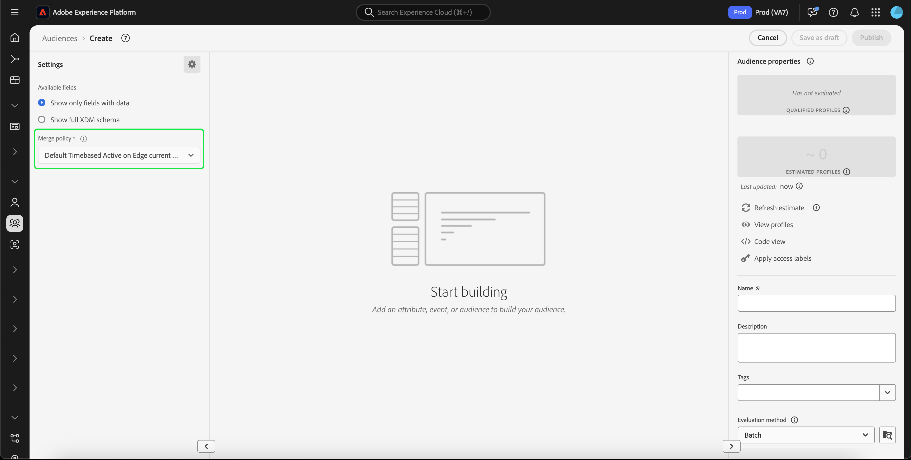

# Handbuch für die [!DNL Segment Builder]-Benutzeroberfläche

[!DNL Segment Builder] bietet einen umfassenden Arbeitsbereich, in dem Sie mit [!DNL Profile] Datenelemente. Der Arbeitsbereich bietet intuitive Steuerelemente zum Erstellen und Bearbeiten von Regeln, z. B. Drag-and-Drop-Kacheln, die zur Darstellung von Dateneigenschaften dienen.

## Bausteine einer Segmentdefinition

Die grundlegenden Bausteine von Segmentdefinitionen sind Attribute und Ereignisse. Darüber hinaus können die in bestehenden Zielgruppen enthaltenen Attribute und Ereignisse auch als Komponenten für neue Definitionen verwendet werden.

Sie können diese Bausteine im Abschnitt **[!UICONTROL Felder]** links im Arbeitsbereich von sehen.[!DNL Segment Builder] **[!UICONTROL Felder]** enthält für jeden der Hauptbausteine einen Tab: &quot;[!UICONTROL Attribute]&quot;, &quot;[!UICONTROL Veranstaltungen]&quot; und &quot;[!UICONTROL Zielgruppen]&quot;.

### Attribute

Die **[!UICONTROL Attribute]** -Registerkarte ermöglicht Ihnen das Durchsuchen von [!DNL Profile] -Attribute, die zu [!DNL XDM Individual Profile] -Klasse. Jeder Ordner lässt sich erweitern, um zusätzliche Attribute anzuzeigen. Jedes Attribut ist eine Kachel, die in der Mitte des Arbeitsbereichs in die Arbeitsfläche des Regel-Builders gezogen werden kann. Die [Arbeitsfläche des Regel-Builders](#rule-builder-canvas) wird weiter unten in diesem Handbuch erläutert.

### Ereignisse

Die **[!UICONTROL Veranstaltungen]** -Tab können Sie eine Zielgruppe basierend auf Ereignissen oder Aktionen erstellen, die mit [!DNL XDM ExperienceEvent] Datenelemente. Sie finden Ereignistypen auch auf dem Tab **[!UICONTROL Ereignisse]**; dabei handelt es sich um eine Kollektion häufig verwendeter Ereignisse, mit denen Sie Segmente schneller erstellen können.

Neben der Möglichkeit, nach [!DNL ExperienceEvent] -Elemente können Sie auch nach Ereignistypen suchen. Ereignistypen verwenden dieselbe Kodierungslogik wie [!DNL ExperienceEvents], ohne dass Sie die [!DNL XDM ExperienceEvent] -Klasse, die nach dem richtigen Ereignis sucht. Wenn Sie beispielsweise die Suchleiste verwenden, um nach &quot;Warenkorb&quot;zu suchen, werden die Ereignistypen zurückgegeben:[!UICONTROL AddCart]&quot; und &quot;[!UICONTROL RemoveCart]&quot;, bei dem es sich um zwei sehr häufig verwendete Warenkorbaktionen beim Erstellen von Segmentdefinitionen handelt.

Sie können nach beliebigen Komponenten suchen, indem Sie ihren Namen in die Suchleiste eingeben; diese verwendet die [Suchsyntax von Lucene](https://docs.microsoft.com/de-DE/azure/search/query-lucene-syntax). Die Suchergebnisse beginnen sich mit der Eingabe ganzer Wörter zu füllen. Wenn Sie beispielsweise eine Regel auf Grundlage des XDM-Felds `ExperienceEvent.commerce.productViews` erstellen möchten, beginnen Sie im Suchfeld mit der Eingabe von „product views“. Sobald Sie das Wort „product“ eingegeben haben, werden Suchergebnisse angezeigt. Jedes Ergebnis enthält die Objekthierarchie, zu der es gehört.

>[!NOTE]
>
>Es kann bis zu 24 Stunden dauern, bis benutzerdefinierte Schemafelder, die von Ihrer Organisation definiert wurden, angezeigt und zum Erstellen von Regeln verfügbar werden.

Sie können dann einfach per Drag &amp; Drop [!DNL ExperienceEvents] und &quot;[!UICONTROL Ereignistypen]in Ihre Segmentdefinition.

Standardmäßig werden nur ausgefüllte Schemafelder aus Ihrem Datenspeicher angezeigt. Dazu gehören &quot;[!UICONTROL Ereignistypen]&quot;. Wenn die[!UICONTROL Ereignistypen]&quot;nicht sichtbar ist oder Sie nur &quot;[!UICONTROL Alle]&quot; als &quot;[!UICONTROL Ereignistyp]&quot;, wählen Sie die **Zahnradsymbol** neben **[!UICONTROL Felder]**, wählen Sie **[!UICONTROL Gesamtes XDM-Schema anzeigen]** under **[!UICONTROL Verfügbare Felder]**. Wählen Sie die **Zahnradsymbol** erneut zu **[!UICONTROL Felder]** und Sie sollten jetzt mehrere[!UICONTROL Ereignistypen]und Schemafeldern, unabhängig davon, ob sie Daten enthalten oder nicht.

#### Adobe Analytics Report Suite-Datensätze

Sie können Daten aus einer oder mehreren Adobe Analytics Report Suites als Ereignisse innerhalb der Segmentierung verwenden.

Bei Verwendung von Daten aus einer einzelnen Analytics Report Suite fügt Platform eVars automatisch Deskriptoren und benutzerfreundliche Namen hinzu, wodurch die Suche nach diesen Feldern in [!DNL Segment Builder].

Bei Verwendung von Daten aus mehreren Analytics Report Suites, Platform **cannot** automatisch Deskriptoren oder Anzeigenamen zu eVars hinzufügen. Daher müssen Sie vor Verwendung der Daten aus Analytics Report Suites XDM-Feldern zuordnen. Weitere Informationen zum Zuordnen von Analytics-Variablen zu XDM finden Sie in der [Handbuch zur Adobe Analytics-Quellverbindung](../../sources/tutorials/ui/create/adobe-applications/analytics.md#mapping).

Angenommen, Sie hatten zwei Report Suites mit den folgenden Variablen:

| Feld | Report Suite-Schema A | Report Suite-Schema B |
| ----- | --------------------- | --------------------- |
| eVar1 | Referrer-Domäne | Angemeldet J/N |
| eVar2 | Page Name | Mitglied-Treuekennung |
| eVar3 | URL | Seitenname |
| eVar4 | Suchbegriffe | Produktname |
| event1 | Klicks | Page Views |
| event2 | Seitenansichten | Zusatz zum Warenkorb |
| event3 | Zusatz zum Warenkorb | Checkouts |
| event4 | Käufe | Käufe |

In diesem Fall können Sie die beiden Report Suites dem folgenden Schema zuordnen:

>[!NOTE]
>
>Während die generischen eVar noch ausgefüllt werden, sollten Sie **not** sie in Ihren Segmentdefinitionen verwenden (sofern möglich), da die Werte andere Dinge bedeuten können als die, die sie ursprünglich in ihren Berichten verwendet haben.

Nachdem die Report Suites zugeordnet wurden, können Sie diese neu zugeordneten Felder in Ihren profilbezogenen Workflows und Segmentierung verwenden.

| Szenario | Vereinigungsschema-Erlebnis | Allgemeine Segmentierungsvariable | Zugeordnete Segmentierungsvariable |
| -------- | ----------------------- | ----------------------------- | ---------------------------- |
| Einzelne Report Suite | Der Anzeigenamendeskriptor ist in generischen Variablen enthalten.   **Beispiel:** Seitenname (eVar2) | <ul><li>Der Anzeigenamendeskriptor ist mit allgemeinen Variablen enthalten.</li><li>Abfragen verwenden Daten aus dem spezifischen Datensatz, da es sich um den einzigen Datensatz handelt</li></ul> | Abfragen können Adobe Analytics-Daten und möglicherweise andere Quellen verwenden. |
| Mehrere Report Suites | In generischen Variablen sind keine Anzeigenamendeskriptoren enthalten.   **Beispiel:** eVar2 | <ul><li>Jedes Feld mit mehreren Deskriptoren wird als generisch angezeigt. Das bedeutet, dass in der Benutzeroberfläche keine Anzeigenamen angezeigt werden.</li><li>Abfragen können Daten aus allen Datensätzen verwenden, die die eVar enthalten. Dies kann zu gemischten oder falschen Ergebnissen führen.</li></ul> | Abfragen verwenden korrekt kombinierte Ergebnisse aus mehreren Datensätzen. |

### Audiences

Die **[!UICONTROL Zielgruppen]** auf der Registerkarte werden alle Zielgruppen aufgelistet, die aus externen Quellen wie Adobe Audience Manager importiert wurden, sowie Zielgruppen, die in [!DNL Experience Platform].

Im **[!UICONTROL Zielgruppen]** angezeigt, können Sie alle verfügbaren Quellen als eine Gruppe von Ordnern anzeigen. Bei der Auswahl der Ordner werden verfügbare Unterordner und Zielgruppen angezeigt. Darüber hinaus können Sie das Ordnersymbol (wie im Bild ganz rechts dargestellt) auswählen, um die Ordnerstruktur anzuzeigen (ein Häkchen gibt den Ordner an, in dem Sie sich gerade befinden) und durch Auswählen des Ordnernamens im Baum einfach durch die Ordner zurückzunavigieren.

Wenn Sie mit dem Mauszeiger über das ⓘ neben einer Zielgruppe fahren, können Sie Informationen zur Zielgruppe anzeigen, einschließlich Kennung, Beschreibung und Ordnerhierarchie zum Auffinden der Zielgruppe.

Sie können auch über die Suchleiste, die [Suchsyntax von Lucene](https://docs.microsoft.com/en-us/azure/search/query-lucene-syntax). Wenn Sie auf dem Tab **[!UICONTROL Audiences]** einen Ordner der obersten Ebene auswählen, wird die Suchleiste angezeigt, sodass Sie in diesem Ordner suchen können. Suchergebnisse beginnen sich erst dann zu füllen, wenn ganze Wörter eingegeben werden. Um beispielsweise eine Zielgruppe mit dem Namen `Online Shoppers`, beginnen Sie in der Suchleiste mit der Eingabe von &quot;Online&quot;. Nach vollständiger Eingabe des Worts „Online“ erscheinen Suchergebnisse, die das Wort „Online“ enthalten.

## Arbeitsfläche des Regel-Builders {#rule-builder-canvas}

Eine Segmentdefinition ist eine Kollektion von Regeln, die zur Beschreibung der Hauptmerkmale oder Verhaltensweisen einer Zielgruppe dienen. Diese Regeln werden mithilfe der Arbeitsfläche des Regel-Builders in der Mitte von [!DNL Segment Builder].

Um Ihrer Segmentdefinition eine neue Regel hinzuzufügen, ziehen Sie eine Kachel aus dem Tab **[!UICONTROL Felder]** und legen Sie sie auf der Arbeitsfläche des Regel-Builders ab. Anschließend werden Ihnen je nach Art der hinzugefügten Daten kontextspezifische Optionen angezeigt. Zu den verfügbaren Datentypen gehören: Zeichenfolgen, Datumsangaben, [!DNL ExperienceEvents], &quot;[!UICONTROL Ereignistypen]und Zielgruppen.

>[!IMPORTANT]
>
>Die neuesten Änderungen an Adobe Experience Platform haben die Verwendung der `OR` und `AND` logische Operatoren zwischen Ereignissen. Diese Aktualisierungen wirken sich nicht auf bestehende Segmente aus. Diese Änderungen wirken sich jedoch auf alle nachfolgenden Aktualisierungen vorhandener Segmente und der Erstellung neuer Segmente aus. Bitte lesen Sie die [Aktualisierung von Zeitkonstanten](./segment-refactoring.md) für weitere Informationen.

Bei der Auswahl eines Werts für das Attribut wird eine Liste mit Enum-Werten angezeigt, die das Attribut sein kann.

Wenn Sie einen Wert aus dieser Auflistungsliste auswählen, wird der Wert mit einem durchgehenden Rand dargestellt. Für Felder, die `meta:enum` (weiche) Auflistungen können Sie auch einen Wert auswählen, der **not** aus der Liste der Auflistungen. Wenn Sie einen eigenen Wert erstellen, wird dieser mit einem gepunkteten Rahmen und einer Warnung versehen, dass dieser Wert nicht in der Enum-Liste enthalten ist.

### Hinzufügen von Zielgruppen

Sie können eine Zielgruppe per Drag-and-Drop vom Tab **[!UICONTROL Zielgruppe]** auf die Arbeitsfläche des Regel-Builders ziehen, um auf die Zielgruppenzugehörigkeit in der neuen Segmentdefinition zu verweisen. Auf diese Weise können Sie Zielgruppenzugehörigkeit als Attribut in der neuen Segmentregel ein- oder ausschließen.

Für [!DNL Platform] mit [!DNL Segment Builder]erhalten Sie die Möglichkeit, die Zielgruppe in den Regelsatz zu konvertieren, der in der Segmentdefinition für diese Zielgruppe verwendet wurde. Diese Konversion erstellt eine Kopie der Regellogik, die dann ohne Beeinträchtigung der ursprünglichen Segmentdefinition verändert werden kann. Vergewissern Sie sich, dass Sie die letzten Änderungen an Ihrer Segmentdefinition gespeichert haben, bevor Sie sie in Regellogik konvertieren.

>[!NOTE]
>
> Beim Hinzufügen einer Zielgruppe aus einer externen Quelle wird nur auf die Zielgruppenzugehörigkeit verwiesen. Sie können die Zielgruppe nicht in Regeln konvertieren. Daher können die zum Erstellen der ursprünglichen Zielgruppe verwendeten Regeln in der neuen Segmentdefinition auch nicht geändert werden.

Wenn beim Konvertieren von Zielgruppen in Regeln Konflikte auftreten, [!DNL Segment Builder] versucht, die vorhandenen Optionen optimal zu erhalten.

### Codeansicht

Alternativ können Sie eine code-basierte Version einer Regel anzeigen, die im [!DNL Segment Builder]. Nachdem Sie Ihre Regel auf der Arbeitsfläche des Regel-Builders erstellt haben, können Sie **[!UICONTROL Codeansicht]** , um Ihr Segment als PQL anzuzeigen.

Die Codeansicht bietet eine Schaltfläche, mit der Sie den Wert des Segments kopieren können, das in API-Aufrufen verwendet werden soll. Um die neueste Version des Segments zu erhalten, stellen Sie sicher, dass Sie Ihre neuesten Änderungen am Segment gespeichert haben.

### Aggregationsfunktionen

Eine Aggregation in [!DNL Segment Builder] ist eine Berechnung für eine Gruppe von XDM-Attributen, deren Datentyp eine Zahl ist (entweder eine Dublette oder eine Ganzzahl). Die vier unterstützten Aggregationsfunktionen in Segment Builder sind SUM, AVERAGE, MIN und MAX.

Um eine Aggregationsfunktion zu erstellen, wählen Sie in der linken Leiste ein Ereignis aus und fügen Sie es in die [!UICONTROL Veranstaltungen] Container.

Nachdem Sie das Ereignis im Ereignisbehälter platziert haben, wählen Sie das Auslassungssymbol (...) gefolgt von **[!UICONTROL Aggregat]**.

Die Aggregation wird jetzt hinzugefügt. Jetzt können Sie die Aggregationsfunktion auswählen, das zu aggregierende Attribut, die Gleichheitsfunktion sowie den Wert auswählen. Im folgenden Beispiel würde dieses Segment alle Profile qualifizieren, deren Summe der erworbenen Werte über 100 USD liegt, selbst wenn jeder einzelne Kauf unter 100 USD liegt.

### Count-Funktionen {#count-functions}

Mit den Count-Funktionen in Segment Builder können Sie nach bestimmten Ereignissen suchen und zählen, wie oft sie durchgeführt wurden. Die unterstützten Zählerfunktionen im Segmentaufbau sind &quot;Mindestens&quot;, &quot;höchstens&quot;, &quot;Genau&quot;, &quot;Zwischen&quot;und &quot;Alle&quot;.

Um eine Zählerfunktion zu erstellen, wählen Sie ein Ereignis aus der linken Leiste aus und fügen Sie es in die [!UICONTROL Veranstaltungen] Container.

Nachdem Sie das Ereignis im Ereignisbehälter platziert haben, wählen Sie die [!UICONTROL Mindestens 1] Schaltfläche.

Die Funktion count wird jetzt hinzugefügt. Jetzt können Sie die Funktion count und den Wert der Funktion auswählen. Im folgenden Beispiel sollen alle Ereignisse mit mindestens einem Klick einbezogen werden.

## Container

Segmentregeln werden in der Reihenfolge ausgewertet, in der sie aufgelistet sind. Container ermöglichen eine Steuerung der Ausführungsreihenfolge durch Verwendung verschachtelter Abfragen.

Nachdem Sie der Arbeitsfläche des Regel-Builders mindestens eine Kachel hinzugefügt haben, können Sie beginnen, Container hinzuzufügen. Um einen neuen Container zu erstellen, wählen Sie die Auslassungszeichen (...) in der oberen rechten Ecke der Kachel aus und klicken Sie dann auf **[!UICONTROL Container hinzufügen]**.

Ein neuer Container wird als untergeordnetes Element des ersten Containers angezeigt. Sie können die Hierarchie jedoch durch Ziehen und Verschieben der Container anpassen. Das Standardverhalten eines Containers lautet: &quot;[!UICONTROL Einschließen]&quot; das angegebene Attribut, Ereignis oder die bereitgestellte Zielgruppe. Sie können die Regel auf &quot;[!UICONTROL Ausschließen]&quot; Profile, die mit den Behälterkriterien übereinstimmen, indem Sie **[!UICONTROL Einschließen]** in der oberen linken Ecke der Kachel und wählen Sie &quot;[!UICONTROL Ausschließen]&quot;.

Ein untergeordneter Container kann auch extrahiert und inline zum übergeordneten Container hinzugefügt werden, indem Sie im untergeordneten Container &quot;Container entpacken&quot;auswählen. Wählen Sie die Auslassungszeichen (...) in der oberen rechten Ecke des untergeordneten Containers aus, um auf diese Option zuzugreifen.

Nachdem Sie **[!UICONTROL Container entpacken]** Der untergeordnete Container wird entfernt und die Kriterien werden inline angezeigt.

>[!NOTE]
>
>Achten Sie beim Entpacken von Containern darauf, dass die Logik weiterhin der gewünschten Segmentdefinition entspricht.

## Zusammenführungsrichtlinien

[!DNL Experience Platform]Mit können Sie Daten aus verschiedenen Quellen zusammenführen und kombinieren, damit Sie sich einen kompletten Überblick über einzelne Kunden verschaffen können. Beim Zusammenführen dieser Daten sind Zusammenführungsrichtlinien die Regeln, die [!DNL Platform] verwendet , um zu bestimmen, wie Daten priorisiert werden und welche Daten kombiniert werden, um ein Profil zu erstellen.

Sie können eine Zusammenführungsrichtlinie auswählen, die Ihrem Marketing-Zweck für diese Zielgruppe entspricht, oder die standardmäßige Zusammenführungsrichtlinie verwenden, die von [!DNL Platform]. Sie können verschiedene, für Ihre Organisation eindeutige Zusammenführungsrichtlinien erstellen, einschließlich einer eigenen standardmäßigen Zusammenführungsrichtlinie. Eine schrittweise Anleitung zum Erstellen von Zusammenführungsrichtlinien für Ihre Organisation finden Sie im Abschnitt [Übersicht über Zusammenführungsrichtlinien](../../profile/merge-policies/overview.md).

Um eine Zusammenführungsrichtlinie für Ihre Segmentdefinition auszuwählen, wählen Sie das Zahnradsymbol auf der **[!UICONTROL Felder]** Registerkarte und verwenden Sie dann die **[!UICONTROL Zusammenführungsrichtlinie]** Dropdown-Menü, um die Zusammenführungsrichtlinie auszuwählen, die Sie verwenden möchten.

## Segmenteigenschaften

Beim Erstellen einer Segmentdefinition zeigt der Abschnitt **[!UICONTROL Segmenteigenschaften]** auf der rechten Seite des Arbeitsbereichs eine geschätzte Größe des resultierenden Segments an, sodass Sie die Segmentdefinition nach Bedarf anpassen können, bevor Sie die eigentliche Zielgruppe erstellen.

Die **[!UICONTROL Segmenteigenschaften]** können Sie auch wichtige Informationen zur Segmentdefinition angeben, einschließlich Name und Beschreibung. Namen von Segmentdefinitionen dienen dazu, Ihr Segment unter den von Ihrer Organisation definierten Segmenten zu identifizieren. Sie sollten daher beschreibend, knapp und eindeutig sein.

Wenn Sie mit der Erstellung Ihrer Segmentdefinition fortfahren, können Sie durch Auswahl von **[!UICONTROL Profile anzeigen]** eine paginierte Vorschau der Zielgruppe anzeigen.

>[!NOTE]
>
> Audience-Schätzungen werden anhand einer Stichprobengröße der Beispieldaten dieses Tages erstellt. Wenn sich in Ihrem Profilspeicher weniger als 1 Million Entitäten befinden, wird der vollständige Datensatz verwendet. Bei zwischen 1 und 20 Millionen Entitäten werden 1 Million Entitäten verwendet; bei mehr als 20 Millionen Entitäten werden 5 % der Gesamtentitäten genutzt. Weiterführende Informationen zum Generieren von Segmentschätzungen finden Sie in der Anleitung zur Segmenterstellung im Abschnitt zum [Generieren von Schätzungen](../tutorials/create-a-segment.md#estimate-and-preview-an-audience).

## Nächste Schritte {#next-steps}

Segment Builder bietet einen umfassenden Workflow, mit dem Sie marktfähige Zielgruppen isolieren können von [!DNL Real-time Customer Profile] Daten. Nach dem Lesen dieses Handbuchs sollten Sie jetzt Folgendes können:

- Segmentdefinitionen mit einer Kombination aus Attributen, Ereignissen und vorhandenen Zielgruppen als Bausteinen erstellen.
- Die Arbeitsfläche des Regel-Builders und Container verwenden, um die Reihenfolge zu steuern, in der Segmentregeln ausgeführt werden.
- Schätzungen der voraussichtlichen Zielgruppe anzeigen, sodass Sie Ihre Segmentdefinitionen nach Bedarf anpassen können.
- Alle Segmentdefinitionen für geplante Segmentierung aktivieren.
- Spezifische Segmentdefinitionen für Streaming-Segmentierung aktivieren.

Weitere Informationen finden Sie unter [!DNL Segmentation Service], lesen Sie bitte die Dokumentation weiter und ergänzen Sie Ihr Lernen durch die Ansehen der entsprechenden Videos. Weitere Informationen zu den anderen Teilen der [!DNL Segmentation Service] Benutzeroberfläche, lesen Sie bitte die [[!DNL Segmentation Service] Benutzerhandbuch](./overview.md)
