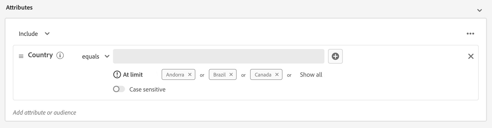
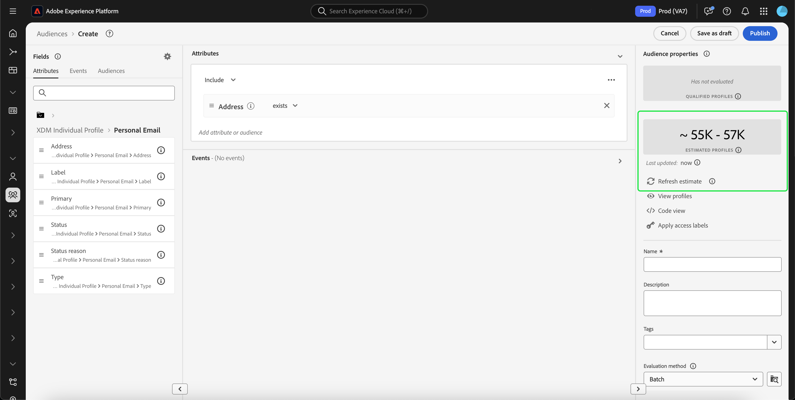

# Handbuch für die [!DNL Segment Builder]-Benutzeroberfläche

>[!NOTE]
>
>In diesem Handbuch wird erläutert, wie Sie Zielgruppen mit **Segmentdefinitionen** unter Verwendung von Segment Builder erstellen. Informationen zum Erstellen von Zielgruppen mithilfe der Zielgruppenkomposition finden Sie im [Handbuch zur Benutzeroberfläche der Zielgruppenkomposition](./audience-composition.md).

[!DNL Segment Builder] bietet einen umfangreichen Arbeitsbereich, in dem Sie mit [!DNL Profile]-Datenelementen interagieren können. Der Arbeitsbereich bietet intuitive Steuerelemente zum Erstellen und Bearbeiten von Regeln, z. B. Drag-and-Drop-Kacheln, die Dateneigenschaften entsprechen.

## Bausteine einer Segmentdefinition {#building-blocks}

>[!CONTEXTUALHELP]
>id="platform_segments_createsegment_segmentbuilder_fields"
>title="Felder"
>abstract="Eine Segmentdefinition besteht aus drei Feldtypen: Attributen, Ereignissen und Zielgruppen. Mit Attributen können Sie Profilattribute verwenden, die zur Klasse „XDM-Kontaktprofil“ gehören. Mit Ereignissen können Sie mithilfe von XDM ExperienceEvent-Datenelementen eine Zielgruppe basierend auf Aktionen oder stattfindenden Ereignissen erstellen, und mit Zielgruppen können Sie importierte Zielgruppen aus externen Quellen verwenden."

Die grundlegenden Bausteine von Segmentdefinitionen sind Attribute und Ereignisse. Darüber hinaus können die in bestehenden Zielgruppen enthaltenen Attribute und Ereignisse als Komponenten für neue Definitionen verwendet werden.

Sie können diese Bausteine im Abschnitt **[!UICONTROL Felder]** links im Arbeitsbereich von [!DNL Segment Builder] sehen. Der Abschnitt **[!UICONTROL Felder]** enthält eine Registerkarte für jeden der Hauptbausteine: [!UICONTROL Attribute], [!UICONTROL Ereignisse] und [!UICONTROL Zielgruppen].

### Attribute

Auf der Registerkarte **[!UICONTROL Attribute]** können Sie [!DNL Profile]-Attribute durchsuchen, die zur [!DNL XDM Individual Profile]-Klasse gehören. Jeder Ordner lässt sich erweitern, um zusätzliche Attribute anzuzeigen. Jedes Attribut ist eine Kachel, die in der Mitte des Arbeitsbereichs in die Arbeitsfläche des Regel-Builders gezogen werden kann. Die [Arbeitsfläche des Regel-Builders](#rule-builder-canvas) wird weiter unten in diesem Handbuch erläutert.

### Ereignisse

Auf der Registerkarte **[!UICONTROL Ereignisse]** können Sie mit [!DNL XDM ExperienceEvent]-Datenelementen eine Zielgruppe erstellen, die auf stattgefundenen Ereignissen oder Aktionen basiert. Sie finden Ereignistypen auch auf der Registerkarte **[!UICONTROL Ereignisse]**. Dabei handelt es sich um eine Sammlung häufig verwendeter Ereignisse, mit denen Sie Segmentdefinitionen schneller erstellen können.

Sie können nicht nur nach [!DNL ExperienceEvent]-Elementen suchen, sondern auch nach Ereignistypen. Ereignistypen verwenden dieselbe Codierungs-Logik wie [!DNL ExperienceEvents], ohne dass Sie die [!DNL XDM ExperienceEvent]-Klasse nach dem richtigen Ereignis durchsuchen müssen. Wenn Sie z. B. über die Suchleiste nach „cart“ suchen, werden die Ereignistypen „[!UICONTROL AddCart]“ und „[!UICONTROL RemoveCart]“ zurückgegben. Dabei handelt es sich um zwei sehr häufig genutzte Warenkorbaktionen beim Erstellen von Segmentdefinitionen.

Sie können nach beliebigen Komponenten suchen, indem Sie ihren Namen in die Suchleiste eingeben; diese verwendet die [Suchsyntax von Lucene](https://docs.microsoft.com/de-DE/azure/search/query-lucene-syntax). Die Suchergebnisse beginnen sich mit der Eingabe ganzer Wörter zu füllen. Wenn Sie beispielsweise eine Regel auf Grundlage des XDM-Felds `ExperienceEvent.commerce.productViews` erstellen möchten, geben Sie im Suchfeld zunächst „product views“ ein. Sobald Sie das Wort „product“ eingegeben haben, werden Suchergebnisse angezeigt. Jedes Ergebnis enthält die Objekthierarchie, zu der es gehört.

>[!NOTE]
>
>Es kann bis zu 24 Stunden dauern, bis benutzerdefinierte Schemafelder, die von Ihrer Organisation definiert wurden, angezeigt und zum Erstellen von Regeln verfügbar werden.

Anschließend können Sie [!DNL ExperienceEvents] und „[!UICONTROL Ereignistypen]“ einfach per Drag-und-Drop in Ihre Segmentdefinition ziehen.

Standardmäßig werden nur ausgefüllte Schemafelder aus Ihrem Datenspeicher angezeigt. Dies schließt „[!UICONTROL Ereignistypen]“ ein. Wenn die Liste „[!UICONTROL Ereignistypen]“ nicht sichtbar ist oder Sie nur „[!UICONTROL Beliebig]“ als „[!UICONTROL Ereignistyp]“ auswählen können, klicken Sie auf das **Zahnradsymbol** neben **[!UICONTROL Felder]** und wählen Sie dann die Option **[!UICONTROL Vollständiges XDM-Schema anzeigen]** unter **[!UICONTROL Verfügbare Felder]** aus. Wählen Sie erneut das **Zahnradsymbol** aus, um zur Registerkarte **[!UICONTROL Felder]** zurückzukehren. Jetzt sollten Sie mehrere [!UICONTROL Ereignistypen] und Schemafelder sehen, unabhängig davon, ob diese Daten enthalten oder nicht.

#### Adobe Analytics Report Suite-Datensätze

Sie können Daten aus einer oder mehreren Adobe Analytics Report Suites als Ereignisse innerhalb der Segmentierung verwenden.

Bei der Verwendung von Daten aus einer einzelnen Analytics Report Suite fügt Platform automatisch Deskriptoren und benutzerfreundliche Namen zu eVars hinzu, um das Auffinden dieser Felder innerhalb von [!DNL Segment Builder] zu erleichtern.

Bei Verwendung von Daten aus mehreren Analytics Report Suites kann Platform **nicht** automatisch Deskriptoren oder benutzerfreundliche Namen zu eVars hinzufügen. Daher müssen Sie vor Verwendung der Daten aus Analytics Report Suites auf eine Zuordnung von XDM-Feldern achten. Weitere Informationen zum Zuordnen von Analytics-Variablen zu XDM finden Sie im [Adobe Analytics-Handbuch zu Quellverbindungen](../../sources/tutorials/ui/create/adobe-applications/analytics.md#mapping).

Stellen Sie sich als Beispiel eine Situation vor, in der es zwei Report Suites mit den folgenden Variablen gibt:

| Feld | Report Suite Schema A | Report Suite Schema B |
| ----- | --------------------- | --------------------- |
| eVar1 | Referrer-Domain | Angemeldet J/N |
| eVar2 | Seitenname | Mitglied-Treuekennung |
| eVar3 | URL | Seitenname |
| eVar4 | Suchbegriffe | Produktname |
| event1 | Klicks | Seitenansichten |
| event2 | Seitenansichten | Zusätze zum Warenkorb |
| event3 | Zusätze zum Warenkorb | Checkouts |
| event4 | Käufe | Käufe |

In diesem Fall können Sie die beiden Report Suites dem folgenden Schema zuordnen:

>[!NOTE]
>
>Während die generischen eVar-Werte noch aufgefüllt werden, sollten Sie sie **nicht** in Ihren Segmentdefinitionen verwenden (sofern möglich), da die Werte eine andere Bedeutung haben können als ursprünglich in ihren Berichten.

Nachdem die Report Suites zugeordnet wurden, können Sie diese neu zugeordneten Felder in Ihren profilbezogenen Workflows und Segmentierungen verwenden.

| Szenario | Vereinigungsschema-Erlebnis | Allgemeine Segmentierungsvariable | Zugeordnete Segmentierungsvariable |
| -------- | ----------------------- | ----------------------------- | ---------------------------- |
| Einzelne Report Suite | Der Deskriptor für benutzerfreundliche Namen ist in generischen Variablen enthalten.   **Beispiel:** Seitenname (eVar2) | <ul><li>Der Deskriptor für benutzerfreundliche Namen ist in allgemeinen Variablen enthalten.</li><li>Abfragen verwenden Daten aus dem spezifischen Datensatz, da es sich um den einzigen Datensatz handelt.</li></ul> | Abfragen können Adobe Analytics-Daten und möglicherweise andere Quellen verwenden. |
| Mehrere Report Suites | In generischen Variablen sind keine Deskriptoren für benutzerfreundliche Namen enthalten.   **Beispiel:** eVar2 | <ul><li>Jedes Feld mit mehreren Deskriptoren wird als generisch angezeigt. Das bedeutet, dass in der Benutzeroberfläche keine benutzerfreundlichen Namen angezeigt werden.</li><li>Abfragen können Daten aus allen Datensätzen mit der eVar verwenden. Dies kann zu gemischten oder falschen Ergebnissen führen.</li></ul> | Abfragen verwenden korrekt kombinierte Ergebnisse aus mehreren Datensätzen. |

### Zielgruppen

>[!NOTE]
>
>Für Zielgruppen, die in Platform erstellt werden, nur Zielgruppen mit der **same** Die Zusammenführungsrichtlinie wird angezeigt.

Auf der Registerkarte **[!UICONTROL Zielgruppen]** werden alle Zielgruppen, die aus externen Quellen (wie z. B. Adobe Audience Manager) importiert wurden, sowie alle in [!DNL Experience Platform] erstellten Zielgruppen aufgelistet.

Auf der Registerkarte **[!UICONTROL Zielgruppen]** können Sie alle verfügbaren Quellen als eine Ordnergruppe anzeigen. Wenn Sie diese Ordner auswählen, werden verfügbare Unterordner und Zielgruppen angezeigt. Außerdem können Sie das Ordnersymbol auswählen (wie im Bild ganz rechts), um die Ordnerstruktur anzuzeigen (ein Häkchen gibt den Ordner an, in dem Sie sich befinden), und durch einfaches Auswählen eines Ordnernamens im Baum durch die Ordnerstruktur zurücknavigieren.

Wenn Sie mit dem Mauszeiger über das ⓘ neben einer Zielgruppe fahren, können Sie Informationen zur Zielgruppe anzeigen, einschließlich Kennung, Beschreibung und Ordnerhierarchie zum Auffinden der Zielgruppe.

Sie können auch über die Suchleiste nach Zielgruppen suchen; dabei wird die [Suchsyntax von Lucene](https://docs.microsoft.com/de-DE/azure/search/query-lucene-syntax) verwendet. Wenn Sie auf der Registerkarte **[!UICONTROL Zielgruppen]** einen Ordner der obersten Ebene auswählen, wird die Suchleiste angezeigt, sodass Sie in diesem Ordner suchen können. Suchergebnisse beginnen sich erst dann zu füllen, wenn ganze Wörter eingegeben werden. Wenn Sie beispielsweise eine Zielgruppen mit dem Namen `Online Shoppers` suchen, geben Sie in der Suchleiste „Online“ ein. Nach vollständiger Eingabe des Worts „Online“ erscheinen Suchergebnisse, die das Wort „Online“ enthalten.

## Arbeitsfläche des Regel-Builders {#rule-builder-canvas}

Eine Segmentdefinition ist eine Kollektion von Regeln, die zur Beschreibung der Hauptmerkmale oder Verhaltensweisen einer Zielgruppe dienen. Diese Regeln werden mithilfe der Arbeitsfläche des Regel-Builders in der Mitte von [!DNL Segment Builder] erstellt.

Um Ihrer Segmentdefinition eine neue Regel hinzuzufügen, ziehen Sie eine Kachel aus dem Tab **[!UICONTROL Felder]** und legen Sie sie auf der Arbeitsfläche des Regel-Builders ab. Anschließend werden Ihnen je nach Art der hinzugefügten Daten kontextspezifische Optionen angezeigt. Zu den verfügbaren Datentypen gehören: Zeichenfolgen, Datumsangaben, [!DNL ExperienceEvents], [!UICONTROL Ereignistypen] und Zielgruppen.

>[!IMPORTANT]
>
>Die neuesten Änderungen an Adobe Experience Platform haben sich auch auf die Verwendung der logischen Operatoren `OR` und `AND` zwischen Ereignissen ausgewirkt. Diese Aktualisierungen haben keinen Einfluss auf bestehende Segmentdefinitionen. Diese Änderungen wirken sich jedoch auf alle nachfolgenden Aktualisierungen vorhandener Segmentdefinitionen und neu erstellter Segmentdefinitionen aus. Weitere Informationen finden Sie im [Update zu Zeitkonstanten](./segment-refactoring.md).

Bei der Auswahl eines Werts für das Attribut wird eine Liste möglicher Aufzählungswerte für das Attribut angezeigt.

Wenn Sie einen Wert aus dieser Aufzählungsliste auswählen, wird der Wert mit einem durchgezogenen Rahmen dargestellt. Für Felder, die `meta:enum` (weiche) Aufzählungen verwenden, können Sie auch einen Wert auswählen, der **nicht** in der Liste der Aufzählungen steht. Wenn Sie einen eigenen Wert erstellen, wird dieser mit einem gepunkteten Rahmen und einer Warnung versehen, dass dieser Wert nicht in der Aufzählungsliste enthalten ist.

Wenn Sie mehrere Werte erstellen, können Sie sie alle gleichzeitig hinzufügen, indem Sie den Massen-Upload verwenden. Wählen Sie das , um das Pop-up **[!UICONTROL Werte in Massen hinzufügen]** anzuzeigen.

Im Pop-up **[!UICONTROL Werte in Massen hinzufügen]** können Sie eine CSV- oder TSV-Datei hochladen.

Alternativ können Sie manuell durch Kommas getrennte Werte hinzufügen.

Beachten Sie, dass maximal 250 Werte zulässig sind. Wenn Sie diese Grenze überschreiten, müssen Sie einige Werte entfernen, bevor Sie weitere hinzufügen.

### Hinzufügen von Zielgruppen

Sie können eine Zielgruppe per Drag-and-Drop vom Tab **[!UICONTROL Zielgruppe]** auf die Arbeitsfläche des Regel-Builders ziehen, um auf die Zielgruppenzugehörigkeit in der neuen Segmentdefinition zu verweisen. Auf diese Weise können Sie die Zielgruppenzugehörigkeit als Attribut in den Regeln der neuen Segmentdefinition ein- oder ausschließen.

Bei [!DNL Platform]-Zielgruppen, die mit [!DNL Segment Builder] erstellt werden, haben Sie die Möglichkeit, die Zielgruppe in den Regelsatz zu konvertieren, der in der Segmentdefinition für diese Zielgruppe verwendet wurde. Diese Konversion erstellt eine Kopie der Regellogik, die dann ohne Beeinträchtigung der ursprünglichen Segmentdefinition verändert werden kann. Vergewissern Sie sich, dass Sie die letzten Änderungen an Ihrer Segmentdefinition gespeichert haben, bevor Sie sie in eine Regellogik konvertieren.

>[!NOTE]
>
>Beim Hinzufügen einer Zielgruppe aus einer externen Quelle wird nur auf die Zielgruppenzugehörigkeit verwiesen. Sie können die Zielgruppe nicht in Regeln konvertieren. Daher können die zum Erstellen der ursprünglichen Zielgruppe verwendeten Regeln in der neuen Segmentdefinition auch nicht geändert werden.

Wenn beim Konvertieren von Zielgruppen in Regeln Konflikte auftreten, versucht [!DNL Segment Builder], die vorhandenen Optionen optimal zu erhalten.

### Code-Ansicht

Alts Alternative können Sie eine Code-basierte Version einer in [!DNL Segment Builder] erstellten Regel anzeigen. Nachdem Sie Ihre Regel auf der Arbeitsfläche des Regel-Builders erstellt haben, können Sie **[!UICONTROL Code-Ansicht]** auswählen, um Ihr Segment als PQL anzuzeigen.

Die Code-Ansicht bietet eine Schaltfläche, mit der Sie den Wert der Segmentdefinition kopieren können, der in API-Aufrufen verwendet werden kann. Um die neueste Version der Segmentdefinition zu erhalten, stellen Sie sicher, dass Sie die letzten Änderungen an der Segmentdefinition gespeichert haben.

### Aggregationsfunktionen

Eine Aggregation in [!DNL Segment Builder] ist eine Berechnung für eine Gruppe von XDM-Attributen, deren Datentyp eine Zahl ist (entweder vom Typ „Double“ oder „Integer“). Die vier unterstützten Aggregationsfunktionen in Segment Builder sind SUM, AVERAGE, MIN und MAX.

Um eine Aggregationsfunktion zu erstellen, wählen Sie in der linken Leiste ein Ereignis aus und fügen Sie es in den Container [!UICONTROL Ereignisse] ein.

Nachdem Sie das Ereignis im Ereignis-Container platziert haben, wählen Sie das Auslassungssymbol (...) und dann **[!UICONTROL Aggregat]** aus.

Die Aggregation wird jetzt hinzugefügt. Nun können Sie die Aggregationsfunktion, das zu aggregierende Attribut, die Gleichheitsfunktion sowie den Wert auswählen. Im folgenden Beispiel würde diese Segmentdefinition alle Profile mit einem Gesamtkaufwert von über 100 $ qualifizieren, selbst wenn jeder einzelne Kauf unter 100 $ liegt.

### Zählungsfunktionen {#count-functions}

Mit den Zählungsfunktionen in Segment Builder können Sie nach bestimmten Ereignissen suchen und zählen, wie oft sie durchgeführt wurden. Die unterstützten Zählungsfunktionen in Segment Builder sind „Mindestens“, „Höchstens“, „Genau“, „Zwischen“ und „Alle“.

Um eine Zählungsfunktionen zu erstellen, wählen Sie in der linken Leiste ein Ereignis aus und fügen Sie es in den Container [!UICONTROL Ereignisse] ein.

Nachdem Sie das Ereignis im Ereignis-Container platziert haben, wählen Sie die Schaltfläche [!UICONTROL Mindestens 1] aus.

Die Zählungsfunktion wird jetzt hinzugefügt. Nun können Sie die Zählungsfunktion und den Wert der Funktion auswählen. Im folgenden Beispiel würden alle Ereignisse mit mindestens einem Klick einbezogen werden.

## Container

Segmentregeln werden in der Reihenfolge ausgewertet, in der sie aufgelistet sind. Container ermöglichen eine Steuerung der Ausführungsreihenfolge durch Verwendung verschachtelter Abfragen.

Nachdem Sie der Arbeitsfläche des Regel-Builders mindestens eine Kachel hinzugefügt haben, können Sie beginnen, Container hinzuzufügen. Um einen neuen Container zu erstellen, wählen Sie oben rechts auf der Kachel das Auslassungszeichen (...) und dann die Option **[!UICONTROL Container hinzufügen]** aus.

Ein neuer Container wird als untergeordnetes Element des ersten Containers angezeigt. Sie können die Hierarchie jedoch durch Ziehen und Verschieben der Container anpassen. Das Standardverhalten eines Containers besteht darin, das angegebene Attribut, das angegebene Ereignis oder die angegebene Zielgruppe [!UICONTROL einzuschließen]. Sie können die Regel so einrichten, dass Profile, die den Kriterien des Containers entsprechen, [!UICONTROL ausgeschlossen] werden, indem Sie oben links auf der Kachel erst **[!UICONTROL Einschließen]** und dann [!UICONTROL Ausschließen] auswählen.

Ein untergeordneter Container kann auch extrahiert und inline zum übergeordneten Container hinzugefügt werden, indem Sie im untergeordneten Container die Option „Container entpacken“ auswählen. Wählen Sie oben rechts im untergeordneten Container das Auslassungszeichen (...) aus, um auf diese Option zuzugreifen.

Wenn Sie **[!UICONTROL Container entpacken]** auswählen, wird der untergeordnete Container entfernt und die Kriterien erscheinen inline.

>[!NOTE]
>
>Achten Sie beim Entpacken von Containern darauf, dass die Logik weiterhin der gewünschten Segmentdefinition entspricht.

## Zusammenführungsrichtlinien

>[!CONTEXTUALHELP]
>id="platform_segmentation_createSegment_segmentBuilder_mergePolicies"
>title="Zusammenführungsrichtlinien"
>abstract="Eine Zusammenführungsrichtlinie ermöglicht das Zusammenführen verschiedener Datensätze, um das Profil zu bilden. Platform bietet eine standardmäßige Zusammenführungsrichtlinie, oder Sie können eine neue standardmäßige Zusammenführungsrichtlinie in Profile erstellen. Wählen Sie eine Zusammenführungsrichtlinie aus, die dem Marketing-Zweck für diese Zielgruppe entspricht."

Mit [!DNL Experience Platform] können Sie Daten aus verschiedenen Quellen zusammenführen und kombinieren, damit Sie sich einen kompletten Überblick über einzelne Kundinnen und Kunden verschaffen können. Beim Zusammenführen dieser Daten dienen Zusammenführungsrichtlinien als jene Regeln, mit denen [!DNL Platform] bestimmt, wie Daten priorisiert und welche Daten kombiniert werden sollen, um ein Profil zu erstellen.

Sie können eine Zusammenführungsrichtlinie auswählen, die Ihrem Marketing-Zweck für diese Zielgruppe entspricht, oder die standardmäßige Zusammenführungsrichtlinie von [!DNL Platform] nutzen. Sie können verschiedene, für Ihre Organisation eindeutige Zusammenführungsrichtlinien erstellen, einschließlich einer eigenen standardmäßigen Zusammenführungsrichtlinie. Schrittweise Anweisungen zum Erstellen von Zusammenführungsrichtlinien für Ihre Organisation finden Sie in der [Übersicht zu Zusammenführungsrichtlinien](../../profile/merge-policies/overview.md).

Um eine Zusammenführungsrichtlinie für Ihre Segmentdefinition auszuwählen, wählen Sie auf der Registerkarte **[!UICONTROL Felder]** das Zahnradsymbol und dann im Dropdown-Menü die Option **[!UICONTROL Zusammenführungsrichtlinie]** aus, um die gewünschte Zusammenführungsrichtlinie festzulegen.

## Eigenschaften der Segmentdefinition {#segment-properties}

>[!CONTEXTUALHELP]
>id="platform_segments_createsegment_segmentbuilder_segmentproperties"
>title="Eigenschaften der Segmentdefinition"
>abstract="Im Abschnitt „Eigenschaften“ der Segmentdefinition wird eine Schätzung der Größe der resultierenden Segmentdefinition angezeigt. Darin wird die Anzahl der qualifizierten Profile im Vergleich zur Gesamtzahl der Profile angezeigt. Auf diese Weise können Sie Ihre Segmentdefinition nach Bedarf anpassen, bevor Sie die Zielgruppe selbst erstellen."

>[!CONTEXTUALHELP]
>id="platform_segments_createsegment_segmentbuilder_refreshestimate"
>title="Aktualieren von Schätzungen"
>abstract="Sie können die Schätzungen Ihrer Segmentdefinition aktualisieren, um sofort eine Vorschau anzuzeigen, wie viele Profile sich für die vorgeschlagene Segmentdefinition qualifizieren würden. Zielgruppenschätzungen werden anhand einer Stichprobengröße der Beispieldaten dieses Tages erstellt."
>additional-url="https://experienceleague.adobe.com/docs/experience-platform/segmentation/tutorials/create-a-segment.html?lang=de#estimate-and-preview-an-audience" text="Schätzen und Anzeigen der Vorschau einer Zielgruppe"

Beim Erstellen einer Segmentdefinition wird die **[!UICONTROL Zielgruppeneigenschaften]** auf der rechten Seite des Arbeitsbereichs wird eine Schätzung der Größe der resultierenden Segmentdefinition angezeigt, sodass Sie Ihre Segmentdefinition nach Bedarf anpassen können, bevor Sie die Zielgruppe selbst erstellen.

**[!UICONTROL Qualifizierte Profile]** gibt die **tatsächlich** Anzahl der Profile, die den Regeln der Segmentdefinition entsprechen. Diese Zahl wird alle 24 Stunden aktualisiert, nachdem der Segmentbewertungsauftrag ausgeführt wurde.

Der Zeitstempel für qualifizierte Profile gibt die neueste **Batch** Segmentbewertungsauftrag und ist **not** angezeigt für Segmentdefinitionen, die mithilfe von Streaming oder Kantensegmentierung ausgewertet werden. Wenn Sie die Segmentdefinition bearbeiten, bleibt die Anzahl der qualifizierten Profile gleich, bis der nächste Segmentbewertungsauftrag ausgeführt wird.

**[!UICONTROL Geschätzte Profile]** zeigt an, dass **Näherungswert** Anzahl der Profile basierend auf der **Beispielauftrag**. Nach dem Hinzufügen der neuen Regeln oder Bedingungen und dem Auswählen von **[!UICONTROL Schätzung aktualisieren]**. Wenn Sie die Informationsblase auswählen, erhalten Sie den Fehlerschwellenwert und die aktuelle Beispielauftragszeit.

Die **[!UICONTROL Zielgruppeneigenschaften]** können Sie auch wichtige Informationen zur Segmentdefinition angeben, einschließlich Name, Beschreibung und Auswertungstyp. Namen von Segmentdefinitionen dienen dazu, Ihr Segment unter den von Ihrer Organisation definierten Segmentdefinitionen zu identifizieren. Sie sollten daher beschreibend, knapp und eindeutig sein.

Wenn Sie mit der Erstellung Ihrer Segmentdefinition fortfahren, können Sie durch Auswahl von **[!UICONTROL Profile anzeigen]** eine paginierte Vorschau der Zielgruppe anzeigen.

>[!NOTE]
>
>Zielgruppenschätzungen werden anhand einer Stichprobengröße der Beispieldaten dieses Tages erstellt. Wenn sich in Ihrem Profilspeicher weniger als 1 Million Entitäten befinden, wird der vollständige Datensatz verwendet. Für zwischen 1 und 20 Millionen Entitäten werden 1 Million Entitäten verwendet und für über 20 Millionen Entitäten werden 5 % der gesamten Entitäten verwendet.
>
>Darüber hinaus basiert diese Schätzung auf dem Zeitpunkt, zu dem der letzte Profilstichprobenauftrag ausgeführt wurde. Wenn Sie also eine relative Datumsfunktion wie &quot;Heute&quot;oder &quot;Diese Woche&quot;verwenden, werden die Berechnungen der Schätzung von der letzten Laufzeit des Beispielauftrags für das Profil abgeleitet. Wenn heute beispielsweise der 24. Januar ist und der letzte Beispielauftrag am 22. Januar ausgeführt wurde, basiert die Funktion &quot;Gestern&quot;für das relative Datum auf dem 21. Januar und nicht auf dem 23. Januar.
>
>Weiterführende Informationen zum Generieren von Schätzungen für Segmentdefinitionen finden Sie im Abschnitt zum [Generieren von Schätzungen](../tutorials/create-a-segment.md#estimate-and-preview-an-audience) des Tutorials zum Erstellen von Segmentdefinitionen.

Sie können auch Ihre Auswertungsmethode auswählen. Wenn Sie wissen, welche Auswertungsmethode Sie verwenden möchten, können Sie die gewünschte Auswertungsmethode über die Dropdown-Liste auswählen. Wenn Sie wissen möchten, für welche Auswertungstypen diese Segmentdefinition qualifiziert ist, können Sie das Durchsuchen-Symbol  auswählen, um eine Liste der verfügbaren Auswertungsmethoden für die Segmentdefinition anzuzeigen.

Das Popup-Fenster [!UICONTROL Berechtigung der Auswertungsmethode] angezeigt. In diesem Popup-Fenster werden die verfügbaren Auswertungsmethoden angezeigt, und zwar Batch, Streaming und Edge. Das Popup-Fenster gibt darüber Aufschluss, welche Auswertungsmethoden geeignet und welche nicht geeignet sind. Abhängig von den Parametern, die Sie in Ihrer Segmentdefinition verwendet haben, ist es möglicherweise nicht für bestimmte Auswertungsmethoden qualifiziert. Weitere Informationen zu den Anforderungen der einzelnen Auswertungsmethoden finden Sie in der Übersicht zur [Streaming-Segmentierung](./streaming-segmentation.md#query-types) bzw. [Edge-Segmentierung](./edge-segmentation.md#query-types).

Wenn Sie eine ungültige Auswertungsmethode auswählen, werden Sie aufgefordert, entweder Ihre Segmentdefinitionsregeln oder die Auswertungsmethode zu ändern.

Weitere Informationen zu den verschiedenen Auswertungsmethoden für Segmentdefinitionen finden Sie in der [Übersicht zur Segmentierung](../home.md#evaluate-segments).

## Nächste Schritte {#next-steps}

Segment Builder bietet einen umfangreichen Workflow, der es Ihnen ermöglicht, vermarktbare Zielgruppen aus [!DNL Real-Time Customer Profile]-Daten zu isolieren. Nach dem Lesen dieses Handbuchs sollten Sie jetzt Folgendes können:

- Segmentdefinitionen mit einer Kombination aus Attributen, Ereignissen und vorhandenen Zielgruppen als Bausteinen erstellen.
- Die Arbeitsfläche des Regel-Builders und Container verwenden, um die Reihenfolge zu steuern, in der Segmentregeln ausgeführt werden.
- Schätzungen der voraussichtlichen Zielgruppe anzeigen, sodass Sie Ihre Segmentdefinitionen nach Bedarf anpassen können.
- Alle Segmentdefinitionen für geplante Segmentierung aktivieren.
- Spezifische Segmentdefinitionen für Streaming-Segmentierung aktivieren.

Wenn Sie mehr über [!DNL Segmentation Service] erfahren möchten, lesen Sie bitte die Dokumentation weiter und sehen Sie sich die entsprechenden Videos an. Weitere Informationen zu den anderen Teilen der [!DNL Segmentation Service]-Benutzeroberfläche finden Sie im [[!DNL Segmentation Service] Benutzerhandbuch](./overview.md)
