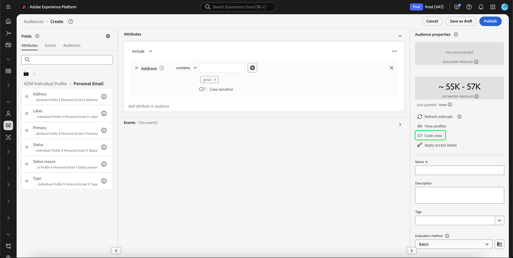

# [!DNL Segment Builder] UI-Handbuch

[!DNL Segment Builder] bietet einen Rich-Workspace, mit dem Sie mit  [!DNL Profile] Datenelementen interagieren können. Der Arbeitsbereich bietet intuitive Steuerelemente zum Erstellen und Bearbeiten von Regeln, z. B. Drag-and-Drop-Kacheln, die zur Darstellung von Dateneigenschaften dienen.

## Bausteine einer Segmentdefinition

Die grundlegenden Bausteine der Segmentdefinitionen sind Attribute und Ereignis. Darüber hinaus können die in bestehenden Audiencen enthaltenen Attribute und Ereignis auch als Komponenten für neue Definitionen verwendet werden.

Sie können diese Bausteine im Abschnitt **[!UICONTROL Felder]** links im Arbeitsbereich von sehen.[!DNL Segment Builder] **[!UICONTROL &quot;]** Felder&quot;enthält eine Registerkarte für jeden der Hauptbausteine: &quot;[!UICONTROL Attribute]&quot;, &quot;[!UICONTROL Ereignis]&quot;und &quot;[!UICONTROL Audiencen]&quot;.

### Attribute

Auf der Registerkarte **[!UICONTROL Attribute]** können Sie [!DNL Profile]-Attribute durchsuchen, die zur [!DNL XDM Individual Profile]-Klasse gehören. Jeder Ordner lässt sich erweitern, um zusätzliche Attribute anzuzeigen. Jedes Attribut ist eine Kachel, die in der Mitte des Arbeitsbereichs in die Arbeitsfläche des Regel-Builders gezogen werden kann. Die [Arbeitsfläche des Regel-Builders](#rule-builder-canvas) wird weiter unten in diesem Handbuch erläutert.

### Ereignisse

Auf der Registerkarte **[!UICONTROL Ereignis]** können Sie eine Audience erstellen, die auf Ereignissen oder Aktionen basiert, die mit [!DNL XDM ExperienceEvent]-Datenelementen durchgeführt wurden. Sie finden Ereignistypen auch auf dem Tab **[!UICONTROL Ereignisse]**; dabei handelt es sich um eine Kollektion häufig verwendeter Ereignisse, mit denen Sie Segmente schneller erstellen können.

Sie können nicht nur nach [!DNL ExperienceEvent]-Elementen suchen, sondern auch nach Ereignistypen suchen. Ereignistyp verwenden dieselbe Kodierungslogik wie [!DNL ExperienceEvents], ohne dass Sie nach dem richtigen Ereignis suchen müssen. [!DNL XDM ExperienceEvent] Wenn Sie beispielsweise in der Suchleiste nach &quot;Warenkorb&quot;suchen, werden die Ereignistyp &quot;[!UICONTROL AddCart]&quot;und &quot;[!UICONTROL RemoveCart]&quot;zurückgegeben, bei denen es sich um zwei sehr häufig verwendete Warenkorbaktionen beim Erstellen von Segmentdefinitionen handelt.

Sie können nach beliebigen Komponenten suchen, indem Sie ihren Namen in die Suchleiste eingeben; diese verwendet die [Suchsyntax von Lucene](https://docs.microsoft.com/de-DE/azure/search/query-lucene-syntax). Die Suchergebnisse beginnen sich mit der Eingabe ganzer Wörter zu füllen. Wenn Sie beispielsweise eine Regel auf Grundlage des XDM-Felds `ExperienceEvent.commerce.productViews` erstellen möchten, beginnen Sie im Suchfeld mit der Eingabe von „product views“. Sobald Sie das Wort „product“ eingegeben haben, werden Suchergebnisse angezeigt. Jedes Ergebnis enthält die Objekthierarchie, zu der es gehört.

>[!NOTE]
>
>Es kann bis zu 24 Stunden dauern, bis benutzerdefinierte Schemafelder, die von Ihrer Organisation definiert wurden, angezeigt und zum Erstellen von Regeln verfügbar werden.

Anschließend können Sie [!DNL ExperienceEvents] und &quot;[!UICONTROL Ereignistyp]&quot;einfach in Ihre Segmentdefinition ziehen.

Standardmäßig werden nur ausgefüllte Schemafelder aus Ihrem Datenspeicher angezeigt. Dazu gehört &quot;[!UICONTROL Ereignistyp]&quot;. Wenn die Liste &quot;[!UICONTROL Ereignistyp]&quot;nicht sichtbar ist oder Sie nur &quot;[!UICONTROL Beliebige]&quot;als &quot;[!UICONTROL Ereignistyp]&quot;auswählen können, wählen Sie das Symbol **Zahnrad** neben **[!UICONTROL Felder]** aus und wählen Sie **[!UICONTROL Anzeigen XDM-Schema]** unter **[!UICONTROL Verfügbare Felder]**. Wählen Sie das Zahnradsymbol **erneut aus, um zur Registerkarte**[!UICONTROL  Felder ]**zurückzukehren. Sie sollten jetzt in der Lage sein, mehrere Ereignistyp[!UICONTROL und Schema-Felder unabhängig davon, ob sie Daten enthalten oder nicht, Ansicht.**]

### Audiences

Auf der Registerkarte **[!UICONTROL Audiencen]** werden alle Audiencen, die aus externen Quellen importiert wurden, wie z. B. Adobe Audience Manager, sowie die Audiencen, die innerhalb von [!DNL Experience Platform] erstellt wurden, Liste.

Auf der Registerkarte **[!UICONTROL Audiencen]** können Sie alle verfügbaren Quellen als Ordnergruppe anzeigen. Während Sie die Ordner auswählen, werden verfügbare Unterordner und Audiencen angezeigt. Darüber hinaus können Sie das Ordnersymbol (wie in der Abbildung rechts dargestellt) auswählen, um die Ordnerstruktur (ein Häkchen gibt den Ordner an, in dem Sie sich befinden) Ansicht und durch Auswahl des Ordnernamens in der Ordnerstruktur einfach durch den Ordner zurückzunavigieren.

Wenn Sie mit dem Mauszeiger über das ⓘ neben einer Zielgruppe fahren, können Sie Informationen zur Zielgruppe anzeigen, einschließlich Kennung, Beschreibung und Ordnerhierarchie zum Auffinden der Zielgruppe.

Sie können auch über die Suchleiste nach Audiencen suchen, die [Lucene&#39;s Suchsyntax](https://docs.microsoft.com/en-us/azure/search/query-lucene-syntax) verwendet. Wenn Sie auf dem Tab **[!UICONTROL Audiences]** einen Ordner der obersten Ebene auswählen, wird die Suchleiste angezeigt, sodass Sie in diesem Ordner suchen können. Suchergebnisse beginnen sich erst dann zu füllen, wenn ganze Wörter eingegeben werden. Wenn Sie beispielsweise eine Audience mit dem Namen `Online Shoppers` suchen möchten, geben Sie in der Suchleiste den Beginn &quot;Online&quot;ein. Nach vollständiger Eingabe des Worts „Online“ erscheinen Suchergebnisse, die das Wort „Online“ enthalten.

## Arbeitsfläche des Regel-Builders {#rule-builder-canvas}

Eine Segmentdefinition ist eine Kollektion von Regeln, die zur Beschreibung der Hauptmerkmale oder Verhaltensweisen einer Zielgruppe dienen. Diese Regeln werden mithilfe der Arbeitsfläche des Regelaufbaus erstellt, die sich in der Mitte von [!DNL Segment Builder] befindet.

Um Ihrer Segmentdefinition eine neue Regel hinzuzufügen, ziehen Sie eine Kachel aus dem Tab **[!UICONTROL Felder]** und legen Sie sie auf der Arbeitsfläche des Regel-Builders ab. Anschließend werden Ihnen je nach Art der hinzugefügten Daten kontextspezifische Optionen angezeigt. Zu den verfügbaren Datentypen gehören: Zeichenfolgen, Datumsangaben, [!DNL ExperienceEvents], &quot;[!UICONTROL Ereignistyp]&quot;und Audiencen.

>[!IMPORTANT]
>
>Die neuesten Änderungen an Adobe Experience Platform haben die Verwendung der logischen Operatoren `OR` und `AND` zwischen Ereignissen aktualisiert. Diese Aktualisierungen wirken sich nicht auf vorhandene Segmente aus. Diese Änderungen wirken sich jedoch auf alle nachfolgenden Aktualisierungen vorhandener Segmente und neuer Segmentkreationen aus. Weitere Informationen finden Sie im Update für [Zeitkonstanten](./segment-refactoring.md).

### Hinzufügen von Zielgruppen

Sie können eine Zielgruppe per Drag-and-Drop vom Tab **[!UICONTROL Zielgruppe]** auf die Arbeitsfläche des Regel-Builders ziehen, um auf die Zielgruppenzugehörigkeit in der neuen Segmentdefinition zu verweisen. Auf diese Weise können Sie Zielgruppenzugehörigkeit als Attribut in der neuen Segmentregel ein- oder ausschließen.

Bei [!DNL Platform]-Audiencen, die mit [!DNL Segment Builder] erstellt wurden, haben Sie die Möglichkeit, die Audience in den Regelsatz zu konvertieren, der in der Segmentdefinition für diese Audience verwendet wurde. Diese Konversion erstellt eine Kopie der Regellogik, die dann ohne Beeinträchtigung der ursprünglichen Segmentdefinition verändert werden kann. Vergewissern Sie sich, dass Sie alle Änderungen an Ihrer Segmentdefinition gespeichert haben, bevor Sie sie in Regellogik konvertieren.

>[!NOTE]
>
> Beim Hinzufügen einer Zielgruppe aus einer externen Quelle wird nur auf die Zielgruppenzugehörigkeit verwiesen. Sie können die Zielgruppe nicht in Regeln konvertieren. Daher können die zum Erstellen der ursprünglichen Zielgruppe verwendeten Regeln in der neuen Segmentdefinition auch nicht geändert werden.

Falls Konflikte auftreten, wenn Audiencen in Regeln konvertiert werden, versucht [!DNL Segment Builder], die vorhandenen Optionen optimal zu erhalten.

### Code-Ansicht

Alternativ dazu können Sie eine codebasierte Version einer Regel, die in [!DNL Segment Builder] erstellt wurde, Ansicht vornehmen. Nachdem Sie Ihre Regel auf der Arbeitsfläche des Regelaufbaus erstellt haben, können Sie **[!UICONTROL Code-Ansicht]** auswählen, um Ihr Segment als PQL anzuzeigen.

Die Code-Ansicht bietet eine Schaltfläche, mit der Sie den Segmentwert kopieren können, der in API-Aufrufen verwendet werden soll. Um die neueste Version des Segments abzurufen, stellen Sie sicher, dass Sie die neuesten Änderungen am Segment gespeichert haben.

### Aggregationsfunktionen

Eine Aggregation in [!DNL Segment Builder] ist eine Berechnung für eine Gruppe von XDM-Attributen, deren Datentyp eine Zahl ist (entweder eine Dublette oder eine Ganzzahl). Die vier unterstützten Aggregationsfunktionen im Segmentaufbau sind SUM, DURCHSCHNITT, MIN und MAX.

Um eine Aggregationsfunktion zu erstellen, wählen Sie in der linken Leiste ein Ereignis aus und fügen Sie es in den Container [!UICONTROL Ereignis] ein.

Nachdem Sie das Ereignis im Container &quot;Ereignis&quot;platziert haben, wählen Sie das Auslassungszeichen (...) und anschließend **[!UICONTROL Aggregat]**.

Die Aggregation wird jetzt hinzugefügt. Sie können jetzt die Aggregationsfunktion auswählen, das Aggregat-Attribut, die Gleichheitsfunktion sowie den Wert auswählen. Im unten stehenden Beispiel würde dieses Segment alle Profil mit einer Kaufsumme von mehr als 100 USD qualifizieren, selbst wenn jeder Einzelkauf unter 100 USD liegt.

### Zählungsfunktionen

Mit den Zählerfunktionen im Segmentaufbau können Sie nach bestimmten Ereignissen suchen und zählen, wie oft diese ausgeführt wurden. Die unterstützten Zählfunktionen im Segmentaufbau sind &quot;Mindestens&quot;, &quot;höchstens&quot;, &quot;Genau&quot;, &quot;Zwischen&quot;und &quot;Alle&quot;.

Um eine Zählfunktion zu erstellen, wählen Sie in der linken Leiste ein Ereignis aus und fügen Sie es in den Container [!UICONTROL Ereignis] ein.

Nachdem Sie das Ereignis im Container &quot;Ereignis&quot;platziert haben, klicken Sie auf die Schaltfläche [!UICONTROL Mindestens 1].

Die Funktion count wird jetzt hinzugefügt. Sie können jetzt die Zählfunktion und den Wert der Funktion auswählen. Im Folgenden sehen Sie ein Ereignis mit mindestens einem Klick.

## Container

Segmentregeln werden in der Reihenfolge ausgewertet, in der sie aufgelistet sind. Container ermöglichen eine Steuerung der Ausführungsreihenfolge durch Verwendung verschachtelter Abfragen.

Nachdem Sie der Arbeitsfläche des Regel-Builders mindestens eine Kachel hinzugefügt haben, können Sie beginnen, Container hinzuzufügen. Um einen neuen Container zu erstellen, wählen Sie die Ellipsen (...) oben rechts in der Kachel aus und wählen Sie **[!UICONTROL Hinzufügen Container]**.

Ein neuer Container wird als untergeordnetes Element des ersten Containers angezeigt. Sie können die Hierarchie jedoch durch Ziehen und Verschieben der Container anpassen. Das Standardverhalten eines Containers lautet &quot;[!UICONTROL Include]&quot;, das angegebene Attribut, Ereignis oder die angegebene Audience. Sie können die Regel auf &quot;[!UICONTROL Ausschließen]&quot;Profil, die den Kriterien des Containers entsprechen, festlegen, indem Sie **[!UICONTROL Einschließen]** in der oberen linken Ecke der Kachel auswählen und &quot;[!UICONTROL Ausschließen]&quot;auswählen.

Ein untergeordneter Container kann auch extrahiert und inline zum übergeordneten Container hinzugefügt werden, indem Sie auf dem untergeordneten Container &quot;Container entpacken&quot;auswählen. Wählen Sie die Ellipsen (...) oben rechts im untergeordneten Container aus, um auf diese Option zuzugreifen.

Wenn Sie **[!UICONTROL Container aufheben]** auswählen, wird der untergeordnete Container entfernt und die Kriterien werden inline angezeigt.

>[!NOTE]
>
>Achten Sie beim Entpacken von Containern darauf, dass die Logik weiterhin der gewünschten Segmentdefinition entspricht.

## Zusammenführungsrichtlinien

[!DNL Experience Platform]Mit können Sie Daten aus verschiedenen Quellen zusammenführen und kombinieren, damit Sie sich einen kompletten Überblick über einzelne Kunden verschaffen können. Beim Zusammenführen dieser Daten sind Zusammenführungsrichtlinien die Regeln, die [!DNL Platform] verwenden, um zu bestimmen, wie die Daten priorisiert werden und welche Daten kombiniert werden, um ein Profil zu erstellen.

Sie können eine Zusammenführungsrichtlinie auswählen, die Ihrem Marketingzweck für diese Audience entspricht, oder die standardmäßige Zusammenführungsrichtlinie verwenden, die von [!DNL Platform] bereitgestellt wird. Sie können verschiedene, für Ihre Organisation eindeutige Zusammenführungsrichtlinien erstellen, einschließlich einer eigenen standardmäßigen Zusammenführungsrichtlinie. Eine schrittweise Anleitung zum Erstellen von Zusammenführungsrichtlinien für Ihre Organisation finden Sie in der Anleitung zum [Verwenden von Zusammenführungsrichtlinien mit der Benutzeroberfläche](../../profile/ui/merge-policies.md).

Um eine Richtlinie zum Zusammenführen für Ihre Segmentdefinition auszuwählen, wählen Sie auf der Registerkarte **[!UICONTROL Felder]** das Zahnradsymbol aus und wählen Sie dann im Dropdownmenü **[!UICONTROL Richtlinie zusammenführen]** die anzuwendende Richtlinie aus.

## Segmenteigenschaften

Beim Erstellen einer Segmentdefinition zeigt der Abschnitt **[!UICONTROL Segmenteigenschaften]** auf der rechten Seite des Arbeitsbereichs eine geschätzte Größe des resultierenden Segments an, sodass Sie die Segmentdefinition nach Bedarf anpassen können, bevor Sie die eigentliche Zielgruppe erstellen.

Im Abschnitt **[!UICONTROL Segmenteigenschaften]** können Sie auch wichtige Informationen zu Ihrer Segmentdefinition angeben, einschließlich Name und Beschreibung. Namen von Segmentdefinitionen dienen dazu, Ihr Segment unter den von Ihrer Organisation definierten Segmenten zu identifizieren. Sie sollten daher beschreibend, knapp und eindeutig sein.

Wenn Sie mit der Erstellung Ihrer Segmentdefinition fortfahren, können Sie durch Auswahl von **[!UICONTROL Profile anzeigen]** eine paginierte Vorschau der Zielgruppe anzeigen.

>[!NOTE]
>
> Audience-Schätzungen werden anhand einer Stichprobengröße der Beispieldaten dieses Tages erstellt. Wenn sich in Ihrem Profilspeicher weniger als 1 Million Entitäten befinden, wird der vollständige Datensatz verwendet. Bei zwischen 1 und 20 Millionen Entitäten werden 1 Million Entitäten verwendet; bei mehr als 20 Millionen Entitäten werden 5 % der Gesamtentitäten genutzt. Weiterführende Informationen zum Generieren von Segmentschätzungen finden Sie in der Anleitung zur Segmenterstellung im Abschnitt zum [Generieren von Schätzungen](../tutorials/create-a-segment.md#estimate-and-preview-an-audience).

## Nächste Schritte {#next-steps}

Der Segmentaufbau bietet einen umfassenden Arbeitsablauf, mit dem Sie marktfähige Audiencen aus [!DNL Real-time Customer Profile]-Daten isolieren können. Nach dem Lesen dieses Handbuchs sollten Sie jetzt Folgendes können:

- Segmentdefinitionen mit einer Kombination aus Attributen, Ereignissen und vorhandenen Zielgruppen als Bausteinen erstellen.
- Die Arbeitsfläche des Regel-Builders und Container verwenden, um die Reihenfolge zu steuern, in der Segmentregeln ausgeführt werden.
- Schätzungen der voraussichtlichen Zielgruppe anzeigen, sodass Sie Ihre Segmentdefinitionen nach Bedarf anpassen können.
- Alle Segmentdefinitionen für geplante Segmentierung aktivieren.
- Spezifische Segmentdefinitionen für Streaming-Segmentierung aktivieren.

Um mehr über [!DNL Segmentation Service] zu erfahren, lesen Sie bitte weiterhin die Dokumentation und ergänzen Sie Ihre Lernerfahrung, indem Sie sich die entsprechenden Videos ansehen. Weitere Informationen zu den anderen Teilen der [!DNL Segmentation Service]-Benutzeroberfläche finden Sie im [[!DNL Segmentation Service] Benutzerhandbuch](./overview.md)
