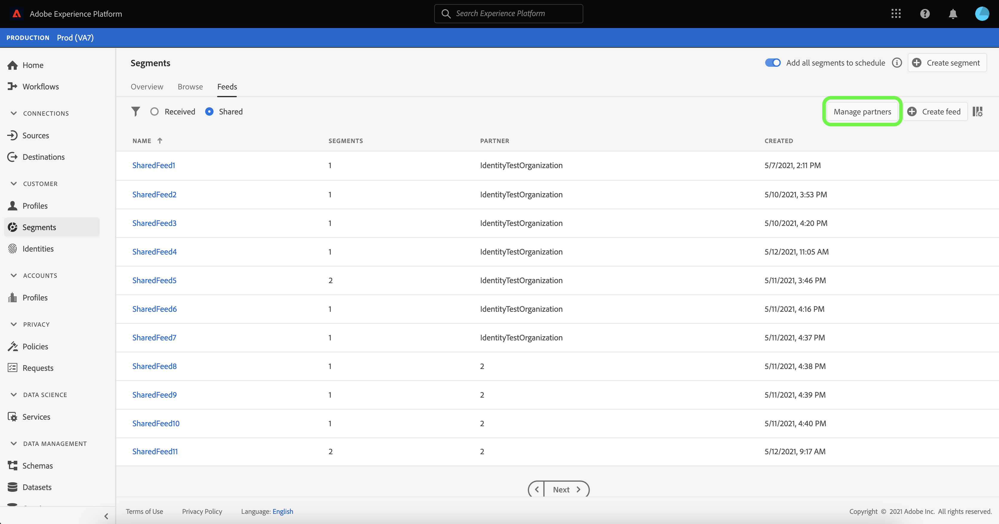
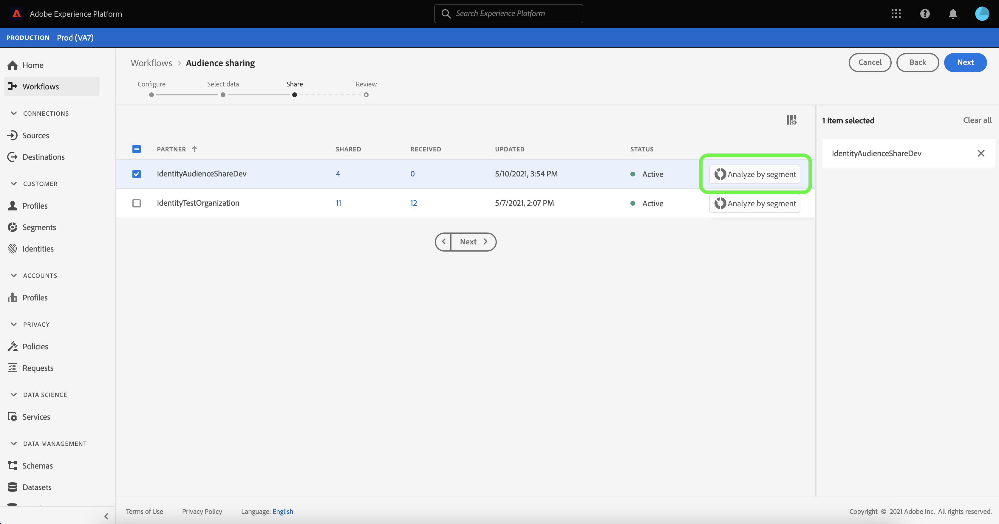

# (Beta) [!DNL Segment Match] - Übersicht

>[!IMPORTANT]
>
>[!DNL Segment Match] befindet sich derzeit in der Beta-Phase. Die Dokumentation und Funktionalität können sich ändern.

Adobe Experience Platform Segment Match ist ein Dienst zur Segmentfreigabe, mit dem zwei oder mehr Platform-Benutzer Segmentdaten auf sichere, gesteuerte und datenschutzfreundliche Weise austauschen können. [!DNL Segment Match] verwendet Platform-Datenschutzstandards und persönliche IDs wie Hash-E-Mails, Hash-Telefonnummern und Geräte-IDs wie IDFAs und GAIDs.

Mit [!DNL Segment Match] können Sie:

* Verwalten Sie die Identitätsüberschneidung.
* Anzeigen von Schätzungen vor der Freigabe.
* Wenden Sie Datennutzungsbezeichnungen an, um zu steuern, ob Daten für Partner freigegeben werden können.
* Verwalten Sie nach der Veröffentlichung eines Feeds das freigegebene Zielgruppen-Lebenszyklusmanagement und setzen Sie den dynamischen Datenaustausch fort, indem Sie die Möglichkeit zum Hinzufügen, Löschen und Aufheben der Freigabe bieten.

[!DNL Segment Match] verwendet einen Identitätsüberlappungsprozess, um sicherzustellen, dass die Segmentfreigabe auf sichere und datenschutzorientierte Weise erfolgt. Eine **überlappende Identität** ist eine Identität, die sowohl in Ihrem Segment als auch im Segment Ihres ausgewählten Partners eine Übereinstimmung aufweist. Vor der Freigabe eines Segments zwischen einem Absender und einem Empfänger prüft der Prozess zur Identitätsüberschneidung, ob sich Namespaces und die Zustimmungsprüfungen zwischen Absender und Empfänger überschneiden. Beide Überschneidungsprüfungen müssen bestanden werden, damit ein Segment freigegeben werden kann.

Die folgenden Abschnitte enthalten weitere Informationen zu [!DNL Segment Match], einschließlich Details zur Einrichtung und zum End-to-End-Workflow.

## Einrichten

In den folgenden Abschnitten wird beschrieben, wie Sie [!DNL Segment Match] einrichten und konfigurieren:

### Identitätsdaten und Namespaces einrichten {#namespaces}

Der erste Schritt zu den ersten Schritten mit [!DNL Segment Match] besteht darin sicherzustellen, dass Sie Daten mit den unterstützten Identitäts-Namespaces erfassen.

Identitäts-Namespaces sind eine Komponente von [Adobe Experience Platform Identity Service](../../identity-service/home.md). Jede Kundenidentität enthält einen zugehörigen Namespace, der den Kontext der Identität angibt. Beispielsweise kann ein Namespace den Wert &quot;name@email.com&quot;als E-Mail-Adresse oder &quot;443522&quot;als numerische CRM-ID unterscheiden.

Eine vollqualifizierte Identität umfasst einen ID-Wert und einen Namespace. Bei der Zuordnung von Datensatzdaten zu Profilfragmenten (z. B. wenn [!DNL Real-time Customer Profile] Profildaten zusammenführt) müssen sowohl der Identitätswert als auch der Namespace übereinstimmen.

Im Kontext von [!DNL Segment Match] werden Namespaces beim Datenaustausch im Überschneidungsprozess verwendet.

Folgende Namespaces werden unterstützt:

| Namespace | Beschreibung |
| --------- | ----------- |
| E-Mails (SHA256, in Kleinbuchstaben) | Ein Namespace für eine E-Mail-Adresse mit vorab gehashten Nachrichten. Die in diesem Namespace bereitgestellten Werte werden vor dem Hashing mit SHA256 in Kleinbuchstaben umgewandelt. Vor der Bereinigung einer E-Mail-Adresse müssen die Leerstellen am Anfang und am Ende abgeschnitten werden. Diese Einstellung kann nicht rückwirkend geändert werden. Weitere Informationen finden Sie im folgenden Dokument zu [SHA256-Hashing-Unterstützung](https://experienceleague.adobe.com/docs/id-service/using/reference/hashing-support.html?lang=en#hashing-support) . |
| Telefon (SHA256_E.164) | Ein Namespace, der rohe Telefonnummern darstellt, die im SHA256- und E.164-Format gehasht werden müssen. |
| ECID | Ein Namespace, der einen Experience Cloud-ID-Wert (ECID) darstellt. Dieser Namespace kann auch durch die folgenden Alias referenziert werden: &quot;Adobe Marketing Cloud ID&quot;, &quot;Adobe Experience Cloud ID&quot;, &quot;Adobe Experience Platform ID&quot;. Weiterführende Informationen dazu finden Sie in der [ECID-Übersicht](../../identity-service/ecid.md). |
| Apple IDFA (ID für Advertiser) | Ein Namespace, der die Apple ID für Advertiser darstellt. Weitere Informationen finden Sie im folgenden Dokument zu [Interessensbasierte Anzeigen](https://support.apple.com/de-de/HT202074) . |
| Google Ad-ID | Ein Namespace, der eine Google Advertising-ID darstellt. Weitere Informationen finden Sie im folgenden Dokument zu [Google Advertising ID](https://support.google.com/googleplay/android-developer/answer/6048248?hl=en). |

### Einrichten der Zustimmungskonfiguration

Sie müssen eine Zustimmungskonfiguration angeben und den Standardwert für eine Einwilligungsprüfung entweder auf `opt-in` oder `opt-out` setzen.

Die Opt-in- und Opt-out-Einverständnisprüfung bestimmt, ob Sie mit der Einwilligung arbeiten können, Benutzerdaten standardmäßig freizugeben. Wenn der Standardwert für die Zustimmungskonfiguration auf `opt-in` festgelegt ist, können Benutzerdaten freigegeben werden, es sei denn, ein Benutzer widerspricht ausdrücklich der Freigabe. Wenn der Standardwert auf `opt-out` festgelegt ist, können Benutzerdaten nicht freigegeben werden, es sei denn, ein Benutzer meldet sich explizit an.

Die standardmäßige Zustimmungskonfiguration für [!DNL Segment Match] ist auf `opt-out` festgelegt. Um ein Anmeldemodell für Ihre Daten zu erzwingen, senden Sie bitte eine E-Mail-Anfrage an Ihren Adobe Account Manager.

Weitere Informationen zum Attribut `share`, das zum Festlegen des Zustimmungswerts für die Datenfreigabe verwendet wird, finden Sie in der folgenden Dokumentation zu [Feldergruppe für Datenschutz und Einverständniserklärungen](../../xdm/field-groups/profile/consents.md). Informationen zu der spezifischen Feldergruppe, mit der die Einwilligung der Verbraucher zur Erfassung und Verwendung von Daten im Zusammenhang mit Datenschutz, Personalisierung und Marketing-Voreinstellungen erfasst wird, finden Sie im folgenden [GitHub-Beispiel für Einverständnis für Datenschutz, Personalisierung und Marketing-Voreinstellungen](https://github.com/adobe/xdm/blob/master/docs/reference/datatypes/consent/consent-preferences.schema.md).

### Datennutzungsbezeichnungen konfigurieren

Als letzte Voraussetzung müssen Sie eine neue Datennutzungsbezeichnung konfigurieren, um die Datenfreigabe zu verhindern. Mit Datennutzungsbezeichnungen können Sie verwalten, welche Daten über [!DNL Segment Match] freigegeben werden dürfen.

Mit Datennutzungsbeschriftungen können Sie Datensätze anhand der für diese Daten geltenden Nutzungsrichtlinien kategorisieren. Beschriftungen können jederzeit angewendet werden, was eine flexible Handhabung der Daten ermöglicht. Best Practices legen nahe, Daten direkt bei ihrer Aufnahme in Experience Platform oder ab dem Zeitpunkt ihrer Nutzbarkeit in Platform mit einer Beschriftung zu versehen.

[!DNL Segment Match] verwendet die C11-Beschriftung, eine spezielle Vertragsbeschriftung,  [!DNL Segment Match] die Sie manuell zu Datensätzen oder Attributen hinzufügen können, um sicherzustellen, dass sie vom  [!DNL Segment Match] Partnerfreigabeprozess ausgeschlossen sind. Die Bezeichnung „C11“ bezeichnet Daten, die nicht in [!DNL Segment Match]-Prozessen verwendet werden sollten. Nachdem Sie ermittelt haben, welche Datensätze und/oder Felder Sie aus [!DNL Segment Match] ausschließen möchten, und die C11-Beschriftung entsprechend hinzugefügt haben, wird die Beschriftung automatisch vom [!DNL Segment Match]-Workflow erzwungen. [!DNL Segment Match] aktiviert automatisch die Core-Richtlinie  [!UICONTROL Datenfreigabe beschränken ] . Spezifische Anweisungen zum Anwenden von Datennutzungsbezeichnungen auf Datensätze finden Sie im Tutorial zum Verwalten von Datennutzungsbezeichnungen in der Benutzeroberfläche](../../data-governance/labels/user-guide.md).[

Eine Liste der Datennutzungsbezeichnungen und ihrer Definitionen finden Sie im Glossar [Datennutzungsbezeichnungen](../../data-governance/labels/reference.md). Informationen zu Datennutzungsrichtlinien finden Sie unter [Datennutzungsrichtlinien - Übersicht](../../data-governance/policies/overview.md).

### Grundlagen zu [!DNL Segment Match]-Berechtigungen

[!DNL Segment Match] ist mit zwei Berechtigungen verknüpft:

| Berechtigung | Beschreibung |
| --- | --- |
| Verbindungen für Zielgruppenfreigabe verwalten | Mit dieser Berechtigung können Sie den Handshake-Prozess für Partner abschließen, der zwei IMS-Organisationen verbindet, um [!DNL Segment Match]-Flüsse zu aktivieren. |
| Verwalten von Zielgruppenfreigaben | Mit dieser Berechtigung können Sie Feeds (das Datenpaket, das für [!DNL Segment Match] verwendet wird) mit aktiven Partnern (Partnern, die vom Admin-Benutzer mit **[!UICONTROL Zielgruppen-Share-Verbindungen]**-Zugriff verbunden wurden) erstellen, bearbeiten und veröffentlichen. |

Weitere Informationen zur Zugriffskontrolle und zu Berechtigungen finden Sie in der [Übersicht zur Zugriffskontrolle](../../access-control/home.md) .

## [!DNL Segment Match] End-to-End-Workflow

Nachdem Sie Ihre Identitätsdaten und Namespaces, die Konfiguration der Einwilligung und die Datennutzungsbezeichnung eingerichtet haben, können Sie mit [!DNL Segment Match] und den zugehörigen Funktionen beginnen.

### Partner verwalten

Wählen Sie in der Platform-Benutzeroberfläche **[!UICONTROL Segmente]** aus dem linken Navigationsbereich und dann **[!UICONTROL Feeds]** aus der oberen Kopfzeile.

Die Seite [!UICONTROL Feeds] enthält eine Liste der Feeds, die von Partnern empfangen wurden, sowie der Feeds, die Sie freigegeben haben. Um eine Liste der vorhandenen Partner anzuzeigen oder eine Verbindung mit einem neuen Partner herzustellen, wählen Sie **[!UICONTROL Partner verwalten]** aus.

Eine Verbindung zwischen zwei Partnern ist ein &quot;bidirektionaler Handshake&quot;, der als Self-Service-Methode dient, mit der Benutzer ihre Platform-Organisationen auf Sandbox-Ebene miteinander verbinden können. Die Verbindung ist erforderlich, um Platform darüber zu informieren, dass eine Vereinbarung getroffen wurde und Platform die Freigabe von Diensten zwischen Ihnen und Ihren Partnern erleichtern kann.

>[!NOTE]
>
>Der &quot;bidirektionale Handshake&quot; zwischen Ihnen und Ihrem Partner ist ausschließlich eine Verbindung. Während dieses Vorgangs werden keine Daten ausgetauscht.

Sie können eine Liste der Verbindungen mit vorhandenen Partnern in der Hauptschnittstelle des Bildschirms [!UICONTROL Partner verwalten] anzeigen. Auf der rechten Leiste befindet sich das Bedienfeld [!UICONTROL Freigabeeinstellung], das Ihnen die Möglichkeit bietet, eine neue [!UICONTROL Verbindungs-ID] sowie ein Eingabefeld zu generieren, in das Sie die [!UICONTROL Verbindungs-ID] eines Partners eingeben können.

Um eine neue [!UICONTROL Verbindungs-ID] zu erstellen, wählen Sie **[!UICONTROL Regenerate]** unter [!UICONTROL Freigabeeinstellung] und klicken Sie dann auf das Kopiersymbol neben der neu generierten ID.

Um einen Partner mit seiner [!UICONTROL Verbindungs-ID] zu verbinden, geben Sie dessen eindeutigen ID-Wert in das Eingabefeld unter [!UICONTROL Partner verbinden] ein und wählen Sie dann **[!UICONTROL Anfrage]** aus.

### Feed erstellen

Ein **Feed** ist eine Gruppierung von Daten (Segmenten), Regeln, wie diese Daten bereitgestellt oder verwendet werden können, und Konfigurationen, die bestimmen, wie Ihre Daten mit den Daten Ihrer Partner abgeglichen werden. Ein Feed kann unabhängig verwaltet und mit anderen Platform-Benutzern über [!DNL Segment Match] ausgetauscht werden.

Um einen neuen Feed zu erstellen, wählen Sie **[!UICONTROL Feed erstellen]** aus dem Dashboard [!UICONTROL Feeds] aus.

Die grundlegende Einrichtung eines Feeds umfasst einen Namen, eine Beschreibung und Konfigurationen zu Marketing-Anwendungsfällen und Identitätseinstellungen. Geben Sie einen Namen und eine Beschreibung für Ihren Feed ein und wenden Sie dann die Marketing-Anwendungsfälle an, von denen Ihre Daten ausgeschlossen werden sollen. Sie können mehr als einen Anwendungsfall aus einer Liste auswählen, die Folgendes enthält:

* [!UICONTROL Analytics]
* [!UICONTROL Kombination mit PII]
* [!UICONTROL Site-übergreifendes Targeting]
* [!UICONTROL Data Science]
* [!UICONTROL E-Mail-Targeting]
* [!UICONTROL Export in Dritte]
* [!UICONTROL Onsite-Werbung]
* [!UICONTROL Onsite-Personalisierung]
* [!UICONTROL Segmentübereinstimmung]
* [!UICONTROL Personalisierung mit einer Identität]

Wählen Sie abschließend die entsprechenden Identitäts-Namespaces für Ihren Feed aus. Informationen zu den spezifischen Namespaces, die von [!DNL Segment Match] unterstützt werden, finden Sie in der Tabelle [Identitätsdaten und Namespaces](#namespaces). Wenn Sie fertig sind, wählen Sie **[!UICONTROL Weiter]** aus.

Nachdem Sie die Einstellungen für Ihren Feed festgelegt haben, wählen Sie die Segmente, die Sie freigeben möchten, aus Ihrer Liste der Erstanbietersegmente aus. Sie können mehr als ein Segment aus der Liste auswählen und Ihre Liste der ausgewählten Segmente über die rechte Leiste verwalten. Nachdem Sie fertig sind, wählen Sie **[!UICONTROL Weiter]** aus.

Die Seite [!UICONTROL Share] wird angezeigt und bietet Ihnen eine Schnittstelle zur Auswahl der Partner, für die Sie Ihren Feed freigeben möchten. Während dieses Schritts können Sie auch den Bericht mit den Überschneidungsschätzungen vor der Freigabe anzeigen und die Anzahl der überlappenden Identitäten nach Namespace zwischen Ihnen und Ihrem Partner sowie die Anzahl der überlappenden Identitäten sehen, die zur Datenfreigabe einverstanden sind.

Wählen Sie **[!UICONTROL Analysieren nach Segment]** aus, um den Schätzungen-Bericht anzuzeigen.

Der Überschneidungsbericht ermöglicht es Ihnen, Überschneidungen und Einverständnisprüfungen pro Partner und Segment zu verwalten, bevor Sie Ihren Feed freigeben.

| Metriken | Beschreibung |
| ------- | ----------- |
| Geschätzte Identitäten mit Zustimmung | Die Gesamtzahl der überlappenden Identitäten, die die für Ihr Unternehmen konfigurierten Zustimmungsanforderungen erfüllen. |
| Geschätzte überlappende Identitäten | Die Anzahl der Identitäten, die sich für das ausgewählte Segment qualifizieren und auch mit dem ausgewählten Partner übereinstimmen. Diese Identitäten werden nach Namespace angezeigt und stellen keine individuellen Profilidentitäten dar. Die Überschneidungsschätzungen basieren auf Profilskizzen. |

Wenn Sie fertig sind, wählen Sie **[!UICONTROL Close]** aus.

Nachdem Sie Ihre Partner ausgewählt und den Überschneidungsbericht angezeigt haben, wählen Sie **[!UICONTROL Weiter]** aus, um fortzufahren.

Der Schritt [!UICONTROL Überprüfen] wird angezeigt, sodass Sie Ihren neuen Feed überprüfen können, bevor er freigegeben und veröffentlicht wird. Dieser Schritt enthält Details zur angewendeten Identitätseinstellung sowie Informationen zu den von Ihnen ausgewählten Marketing-Anwendungsfällen, Segmenten und Partnern.

Wählen Sie **[!UICONTROL Finish]** aus, um fortzufahren.

### Feed aktualisieren

Um Segmente hinzuzufügen oder zu entfernen, wählen Sie **[!UICONTROL Feed erstellen]** aus der Seite [!UICONTROL Feeds] und klicken Sie dann auf **[!UICONTROL Vorhandener Feed]**. Wählen Sie in der angezeigten Liste des vorhandenen Feeds den Feed aus, den Sie aktualisieren möchten, und klicken Sie dann auf **[!UICONTROL Weiter]**.

Die Liste der Segmente wird angezeigt. Von hier aus können Sie neue Segmente zu Ihrem Feed hinzufügen und über die rechte Leiste alle Segmente entfernen, die Sie nicht mehr benötigen. Nachdem Sie die Verwaltung der Segmente in Ihrem Feed abgeschlossen haben, wählen Sie **[!UICONTROL Weiter]** aus und führen Sie dann die oben beschriebenen Schritte aus, um den aktualisierten Feed abzuschließen.

>[!NOTE]
>
>Wenn Sie ein Segment zu einem freigegebenen Feed hinzufügen oder daraus entfernen, muss der empfangende Partner die Änderung bestätigen, indem er den Umschalter [!DNL Profile] in der Liste der empfangenen Feeds erneut aktiviert.

### Eingehenden Feed akzeptieren

Um einen eingehenden Feed anzuzeigen, wählen Sie **[!UICONTROL Received]** aus der Kopfzeile der Seite [!UICONTROL Feeds] aus und wählen Sie dann den Feed aus der Liste aus, den Sie anzeigen möchten. Um den Feed zu akzeptieren, wählen Sie **[!UICONTROL Aktivieren für Profil]** und lassen Sie einige Augenblicke zu, bis der Status von [!UICONTROL Ausstehend] auf [!UICONTROL Aktiviert] aktualisiert wird.

Sobald Sie einen freigegebenen Feed akzeptiert haben, können Sie mit der Verwendung der freigegebenen Daten beginnen, neue Segmente zu erstellen.

## Nächste Schritte

Durch Lesen dieses Dokuments haben Sie Verständnis für [!DNL Segment Match], seine Funktionen und seinen End-to-End-Workflow gewonnen. Weitere Informationen zu anderen Platform-Diensten finden Sie in den folgenden Dokumenten:

* [[!DNL Segmentation Service]](../home.md)
* [[!DNL Identity Service]](../../identity-service/home.md)
* [[!DNL Real-time Customer Profile] – Übersicht](../../profile/home.md)
