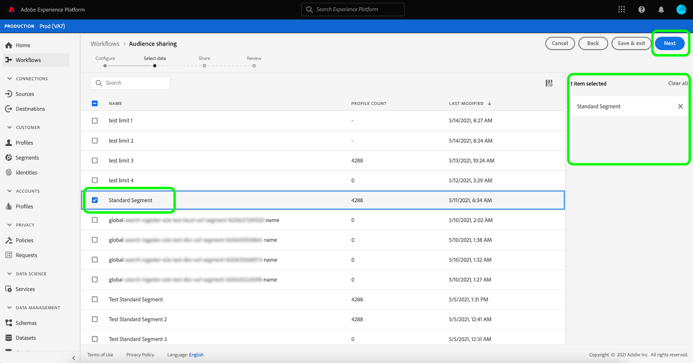

# [!DNL Segment Match] – Übersicht

Adobe Experience Platform Segment Match ist ein Dienst zur Segmentfreigabe, mit dem zwei oder mehr Platform-Benutzer Segmentdaten auf sichere, gesteuerte und datenschutzfreundliche Weise austauschen können. [!DNL Segment Match] verwendet Platform-Datenschutzstandards und persönliche IDs wie Hash-E-Mails, Hash-Telefonnummern und Geräte-IDs wie IDFAs und GAIDs.

Mit [!DNL Segment Match] Sie können:

* Verwalten Sie die Identitätsüberschneidung.
* Anzeigen von Schätzungen vor der Freigabe.
* Wenden Sie Datennutzungsbezeichnungen an, um zu steuern, ob Daten für Partner freigegeben werden können.
* Verwalten Sie nach der Veröffentlichung eines Feeds das freigegebene Zielgruppen-Lebenszyklusmanagement und setzen Sie den dynamischen Datenaustausch fort, indem Sie die Möglichkeit zum Hinzufügen, Löschen und Aufheben der Freigabe bieten.

[!DNL Segment Match] verwendet einen Identitätsüberlappungsprozess, um sicherzustellen, dass die Segmentfreigabe auf sichere und datenschutzorientierte Weise erfolgt. Ein **überlappte Identität** ist eine Identität, die sowohl in Ihrem Segment als auch im Segment Ihres ausgewählten Partners eine Übereinstimmung enthält. Vor der Freigabe eines Segments zwischen einem Absender und einem Empfänger prüft der Prozess zur Identitätsüberschneidung, ob sich Namespaces und die Zustimmungsprüfungen zwischen Absender und Empfänger überschneiden. Beide Überschneidungsprüfungen müssen bestanden werden, damit ein Segment freigegeben werden kann.

In den folgenden Abschnitten finden Sie weitere Informationen zu [!DNL Segment Match], einschließlich Details zum Setup und seinem End-to-End-Workflow.

## Einrichten

In den folgenden Abschnitten wird beschrieben, wie Sie [!DNL Segment Match]:

### Identitätsdaten und Namespaces einrichten {#namespaces}

Der erste Schritt zu den ersten Schritten mit [!DNL Segment Match] soll sicherstellen, dass Sie Daten mit den unterstützten Identitäts-Namespaces erfassen.

Identitäts-Namespaces sind eine Komponente von [Adobe Experience Platform Identity Service](../../../identity-service/home.md). Jede Kundenidentität enthält einen zugehörigen Namespace, der den Kontext der Identität angibt. Beispielsweise kann ein Namespace den Wert &quot;name&quot;unterscheiden@email.com&quot; als E-Mail-Adresse oder &quot;443522&quot; als numerische CRM-ID.

Eine vollqualifizierte Identität umfasst einen ID-Wert und einen Namespace. Bei der Zuordnung von Datensatzdaten zu Profilfragmenten (z. B. wann [!DNL Real-time Customer Profile] führt Profildaten zusammen), sowohl der Identitätswert als auch der Namespace müssen übereinstimmen.

Im Kontext von [!DNL Segment Match], werden Namespaces beim Datenaustausch im Überschneidungsprozess verwendet.

Folgende Namespaces werden unterstützt:

| Namespace | Beschreibung |
| --------- | ----------- |
| E-Mails (SHA256, in Kleinbuchstaben) | Ein Namespace für die E-Mail-Adresse mit vorab gehashten Nachrichten. Die in diesem Namespace bereitgestellten Werte werden vor dem Hashing mit SHA256 in Kleinbuchstaben umgewandelt. Vor der Bereinigung einer E-Mail-Adresse müssen die Leerstellen am Anfang und am Ende abgeschnitten werden. Diese Einstellung kann nicht rückwirkend geändert werden. Siehe folgendes Dokument unter [SHA-256-Hashing-Unterstützung](https://experienceleague.adobe.com/docs/id-service/using/reference/hashing-support.html?lang=en#hashing-support) für weitere Informationen. |
| Telefon (SHA256_E.164) | Ein Namespace, der rohe Telefonnummern darstellt, die im SHA256- und E.164-Format gehasht werden müssen. |
| ECID | Ein Namespace, der einen Experience Cloud-ID-Wert (ECID) darstellt. Dieser Namespace kann auch durch die folgenden Alias referenziert werden: &quot;Adobe Marketing Cloud ID&quot;, &quot;Adobe Experience Cloud ID&quot;, &quot;Adobe Experience Platform ID&quot;. Weiterführende Informationen dazu finden Sie in der [ECID-Übersicht](../../../identity-service/ecid.md). |
| Apple IDFA (ID für Advertiser) | Ein Namespace, der die Apple ID für Advertiser darstellt. Siehe folgendes Dokument unter [Interessensbasierte Anzeigen](https://support.apple.com/de-de/HT202074) für weitere Informationen. |
| Google Ad-ID | Ein Namespace, der eine Google Advertising-ID darstellt. Siehe folgendes Dokument unter [Google Advertising ID](https://support.google.com/googleplay/android-developer/answer/6048248?hl=en) für weitere Informationen. |

### Einrichten der Zustimmungskonfiguration

Sie müssen eine Zustimmungskonfiguration bereitstellen und ihren Standardwert auf Folgendes festlegen: `opt-in` oder `opt-out` für eine Einverständnisprüfung.

Die Opt-in- und Opt-out-Einverständnisprüfung bestimmt, ob Sie mit der Einwilligung arbeiten können, Benutzerdaten standardmäßig freizugeben. Wenn die Zustimmungskonfiguration standardmäßig auf `opt-out`festgelegt ist, können Benutzerdaten freigegeben werden, es sei denn, ein Benutzer widersetzt sich ausdrücklich der Freigabe. Wenn der Standardwert auf `opt-in`, können Benutzerdaten nicht freigegeben werden, es sei denn, ein Benutzer meldet sich ausdrücklich an.

Die standardmäßige Zustimmungskonfiguration für [!DNL Segment Match] auf `opt-out`. Um ein Anmeldemodell für Ihre Daten zu erzwingen, senden Sie bitte eine E-Mail-Anfrage an Ihren Adobe Account Manager.

Weitere Informationen über `share` -Attribut, das zum Festlegen des Zustimmungswerts für die Datenweitergabe verwendet wird, finden Sie in der folgenden Dokumentation unter [Feldergruppe &quot;Datenschutz und Einverständniserklärung&quot;](../../../xdm/field-groups/profile/consents.md). Informationen zu der spezifischen Feldergruppe, mit der die Zustimmung der Verbraucher zur Erfassung und Verwendung von Daten im Zusammenhang mit Datenschutz-, Personalisierungs- und Marketing-Voreinstellungen erfasst wird, finden Sie in den folgenden Abschnitten: [Einverständnis für Datenschutz, Personalisierung und Marketing-Voreinstellungen GitHub-Beispiel](https://github.com/adobe/xdm/blob/master/docs/reference/datatypes/consent/consent-preferences.schema.md).

### Datennutzungsbezeichnungen konfigurieren

Als letzte Voraussetzung müssen Sie eine neue Datennutzungsbezeichnung konfigurieren, um die Datenfreigabe zu verhindern. Mithilfe von Datennutzungsbezeichnungen können Sie verwalten, über welche Daten freigegeben werden dürfen [!DNL Segment Match].

Mit Datennutzungsbeschriftungen können Sie Datensätze anhand der für diese Daten geltenden Nutzungsrichtlinien kategorisieren. Beschriftungen können jederzeit angewendet werden, was eine flexible Handhabung der Daten ermöglicht. Best Practices legen nahe, Daten direkt bei ihrer Aufnahme in Experience Platform oder ab dem Zeitpunkt ihrer Nutzbarkeit in Platform mit einer Beschriftung zu versehen.

[!DNL Segment Match] verwendet das C11-Etikett, ein für [!DNL Segment Match] , die Sie manuell zu allen Datensätzen oder Attributen hinzufügen können, um sicherzustellen, dass sie aus dem [!DNL Segment Match] Partnerfreigabe. Die Bezeichnung „C11“ bezeichnet Daten, die nicht in [!DNL Segment Match]-Prozessen verwendet werden sollten. Nachdem Sie ermittelt haben, aus welchen Datensätzen und/oder Feldern Sie ausschließen möchten [!DNL Segment Match] und die Bezeichnung C11 entsprechend hinzugefügt wurde, wird die Bezeichnung automatisch von der [!DNL Segment Match] Arbeitsablauf. [!DNL Segment Match] aktiviert automatisch die [!UICONTROL Datenfreigabe beschränken] Kernrichtlinie. Spezifische Anweisungen zum Anwenden von Datennutzungsbezeichnungen auf Datensätze finden Sie im Tutorial zu [Verwalten von Datennutzungsbezeichnungen in der Benutzeroberfläche](../../../data-governance/labels/user-guide.md).

Eine Liste der Datennutzungsbezeichnungen und ihrer Definitionen finden Sie in der [Glossar zu Datennutzungsbezeichnungen](../../../data-governance/labels/reference.md). Informationen zu Datennutzungsrichtlinien finden Sie in der [Datennutzungsrichtlinien - Übersicht](../../../data-governance/policies/overview.md).

### Grundlagen [!DNL Segment Match] Berechtigungen

Es gibt zwei Berechtigungen, die mit [!DNL Segment Match]:

| Berechtigung | Beschreibung |
| --- | --- |
| Verbindungen für Zielgruppenfreigabe verwalten | Mit dieser Berechtigung können Sie den Partner-Handshake-Prozess abschließen, der zwei IMS-Organisationen verbindet, um die Aktivierung von [!DNL Segment Match] Flüsse. |
| Verwalten von Zielgruppenfreigaben | Mit dieser Berechtigung können Sie Feeds erstellen, bearbeiten und veröffentlichen (das Datenpaket, das für [!DNL Segment Match]) mit aktiven Partnern (Partnern, die vom Administrator mit **[!UICONTROL Zielgruppenfreigabe-Verbindungen]** Zugriff). |

Siehe [Zugriffskontrolle - Übersicht](../../../access-control/home.md) für weitere Informationen zur Zugriffskontrolle und zu Berechtigungen.

## [!DNL Segment Match] End-to-End-Workflow

Nachdem Sie Ihre Identitätsdaten und Namespaces, die Konfiguration der Einwilligung und die Datennutzungsbezeichnung eingerichtet haben, können Sie mit der Arbeit mit [!DNL Segment Match] und deren Funktionen.

### Partner verwalten

Wählen Sie in der Platform-Benutzeroberfläche die Option **[!UICONTROL Segmente]** aus der linken Navigation und wählen Sie dann **[!UICONTROL Feeds]** aus der oberen Kopfzeile.

Die [!UICONTROL Feeds] enthält eine Liste der Feeds, die von Partnern empfangen wurden, sowie der Feeds, die Sie freigegeben haben. Um eine Liste der vorhandenen Partner anzuzeigen oder eine Verbindung mit einem neuen Partner herzustellen, wählen Sie **[!UICONTROL Partner verwalten]**.

Eine Verbindung zwischen zwei Partnern ist ein &quot;bidirektionaler Handshake&quot;, der als Self-Service-Methode dient, mit der Benutzer ihre Platform-Organisationen auf Sandbox-Ebene miteinander verbinden können. Die Verbindung ist erforderlich, um Platform darüber zu informieren, dass eine Vereinbarung getroffen wurde und Platform die Freigabe von Diensten zwischen Ihnen und Ihren Partnern erleichtern kann.

>[!NOTE]
>
>Der &quot;bidirektionale Handshake&quot; zwischen Ihnen und Ihrem Partner ist ausschließlich eine Verbindung. Während dieses Vorgangs werden keine Daten ausgetauscht.

Sie können eine Liste der Verbindungen zu vorhandenen Partnern in der Hauptschnittstelle der [!UICONTROL Partner verwalten] angezeigt. Auf der rechten Leiste befindet sich die [!UICONTROL Freigabeeinstellung] -Bereich, der Ihnen die Möglichkeit gibt, eine neue [!UICONTROL connect-ID] sowie ein Eingabefeld, in das Sie die [!UICONTROL connect-ID].

So erstellen Sie eine neue [!UICONTROL connect-ID]auswählen **[!UICONTROL Regenerieren]** under [!UICONTROL Freigabeeinstellung] und wählen Sie dann das Kopiersymbol neben der neu generierten ID aus.

So verbinden Sie einen Partner mit seiner [!UICONTROL connect-ID], geben Sie ihren eindeutigen ID-Wert in das Eingabefeld unter [!UICONTROL Partner verbinden] und wählen Sie **[!UICONTROL Anfrage]**.

### Feed erstellen {#create-feed}

>[!CONTEXTUALHELP]
>id="platform_segment_match_marketing"
>title="Anwendungsfälle für eingeschränktes Marketing"
>abstract="Anwendungsfälle mit eingeschränktem Marketing helfen Ihren Partnern dabei, sicherzustellen, dass freigegebene Segmente gemäß Ihren Data Governance-Beschränkungen ordnungsgemäß verwendet werden."
>text="Learn more in documentation"

A **Feed** ist eine Gruppierung von Daten (Segmenten), den Regeln, wie diese Daten bereitgestellt oder verwendet werden können, und den Konfigurationen, die bestimmen, wie Ihre Daten mit den Daten Ihrer Partner abgeglichen werden. Ein Feed kann unabhängig verwaltet und mit anderen Platform-Benutzern über [!DNL Segment Match].

Um einen neuen Feed zu erstellen, wählen Sie **[!UICONTROL Feed erstellen]** von [!UICONTROL Feeds] Dashboard.

Die grundlegende Einrichtung eines Feeds umfasst einen Namen, eine Beschreibung und Konfigurationen zu Marketing-Anwendungsfällen und Identitätseinstellungen. Geben Sie einen Namen und eine Beschreibung für Ihren Feed ein und wenden Sie dann die Marketing-Anwendungsfälle an, von denen Ihre Daten ausgeschlossen werden sollen. Sie können mehr als einen Anwendungsfall aus einer Liste auswählen, die Folgendes enthält:

* [!UICONTROL Analytics]
* [!UICONTROL Kombination mit PII]
* [!UICONTROL Site-übergreifendes Targeting]
* [!UICONTROL Data Science]
* [!UICONTROL E-Mail-Targeting]
* [!UICONTROL Export in Dritte]
* [!UICONTROL Onsite-Werbung]
* [!UICONTROL Onsite-Personalisierung]
* [!UICONTROL Segment Match]
* [!UICONTROL Personalisierung mit einer Identität]

Wählen Sie abschließend die entsprechenden Identitäts-Namespaces für Ihren Feed aus. Informationen zu den spezifischen Namespaces, die von [!DNL Segment Match], siehe [Identitätsdaten und Namensraum-Tabelle](#namespaces). Wenn Sie fertig sind, wählen Sie **[!UICONTROL Nächste]**.

Nachdem Sie die Einstellungen für Ihren Feed festgelegt haben, wählen Sie die Segmente, die Sie freigeben möchten, aus Ihrer Liste der Erstanbietersegmente aus. Sie können mehr als ein Segment aus der Liste auswählen und die rechte Leiste verwenden, um Ihre Liste der ausgewählten Segmente zu verwalten. Nachdem Sie fertig sind, wählen Sie **[!UICONTROL Nächste]**.

Die [!UICONTROL Freigeben] angezeigt und erhalten Sie eine Oberfläche zur Auswahl der Partner, für die Sie Ihren Feed freigeben möchten. Während dieses Schritts können Sie auch den Bericht mit den Überschneidungsschätzungen vor der Freigabe anzeigen und die Anzahl der überlappenden Identitäten nach Namespace zwischen Ihnen und Ihrem Partner sowie die Anzahl der überlappenden Identitäten sehen, die zur Datenfreigabe einverstanden sind.

Auswählen **[!UICONTROL Analysieren nach Segment]** , um den Schätzbericht anzuzeigen.

Der Überschneidungsbericht ermöglicht es Ihnen, Überschneidungen und Einverständnisprüfungen pro Partner und Segment zu verwalten, bevor Sie Ihren Feed freigeben.

| Metriken | Beschreibung |
| ------- | ----------- |
| Geschätzte Identitäten mit Zustimmung | Die Gesamtzahl der überlappenden Identitäten, die die für Ihr Unternehmen konfigurierten Zustimmungsanforderungen erfüllen. |
| Geschätzte überlappende Identitäten | Die Anzahl der Identitäten, die sich für das ausgewählte Segment qualifizieren und auch mit dem ausgewählten Partner übereinstimmen. Diese Identitäten werden nach Namespace angezeigt und stellen keine individuellen Profilidentitäten dar. Die Überschneidungsschätzungen basieren auf Profilskizzen. |

Wenn Sie fertig sind, wählen Sie **[!UICONTROL Schließen]**.

Nachdem Sie Ihre Partner ausgewählt und Ihren Überschneidungsbericht angezeigt haben, wählen Sie **[!UICONTROL Nächste]** um fortzufahren.

Die [!UICONTROL Überprüfen] angezeigt, sodass Sie Ihren neuen Feed überprüfen können, bevor er freigegeben und veröffentlicht wird. Dieser Schritt enthält Details zur angewendeten Identitätseinstellung sowie Informationen zu den von Ihnen ausgewählten Marketing-Anwendungsfällen, Segmenten und Partnern.

Auswählen **[!UICONTROL Beenden]** um fortzufahren.

### Feed aktualisieren

Um Segmente hinzuzufügen oder zu entfernen, wählen Sie **[!UICONTROL Feed erstellen]** von [!UICONTROL Feeds] und wählen Sie **[!UICONTROL Vorhandener Feed]**. Wählen Sie in der angezeigten Liste des vorhandenen Feeds den Feed aus, den Sie aktualisieren möchten, und wählen Sie dann **[!UICONTROL Nächste]**.

Die Liste der Segmente wird angezeigt. Von hier aus können Sie neue Segmente zu Ihrem Feed hinzufügen und über die rechte Leiste alle Segmente entfernen, die Sie nicht mehr benötigen. Nachdem Sie die Segmente in Ihrem Feed verwaltet haben, wählen Sie **[!UICONTROL Nächste]** und dann die oben beschriebenen Schritte ausführen, um den aktualisierten Feed abzuschließen.

>[!NOTE]
>
>Wenn Sie ein Segment zu einem freigegebenen Feed hinzufügen oder daraus entfernen, muss der empfangende Partner die Änderung bestätigen, indem er die [!DNL Profile] in der Liste der empfangenen Feeds ein-/ausschalten.

### Eingehenden Feed akzeptieren

Um einen eingehenden Feed anzuzeigen, wählen Sie **[!UICONTROL Erhalten]** aus der Kopfzeile des [!UICONTROL Feeds] und wählen Sie dann den Feed aus der Liste aus, den Sie anzeigen möchten. Um den Feed zu akzeptieren, wählen Sie **[!UICONTROL Profil aktivieren]** und einige Augenblicke für die Aktualisierung des Status von [!UICONTROL Ausstehend] nach [!UICONTROL Aktiviert].

Sobald Sie einen freigegebenen Feed akzeptiert haben, können Sie mit der Verwendung der freigegebenen Daten beginnen, neue Segmente zu erstellen.

## Nächste Schritte

Durch Lesen dieses Dokuments haben Sie Verständnis für [!DNL Segment Match], seiner Funktionen und seines durchgängigen Workflows. Weitere Informationen zu anderen Platform-Diensten finden Sie in den folgenden Dokumenten:

* [[!DNL Segmentation Service]](../../home.md)
* [[!DNL Identity Service]](../../../identity-service/home.md)
* [[!DNL Real-time Customer Profile] – Übersicht](../../../profile/home.md)
