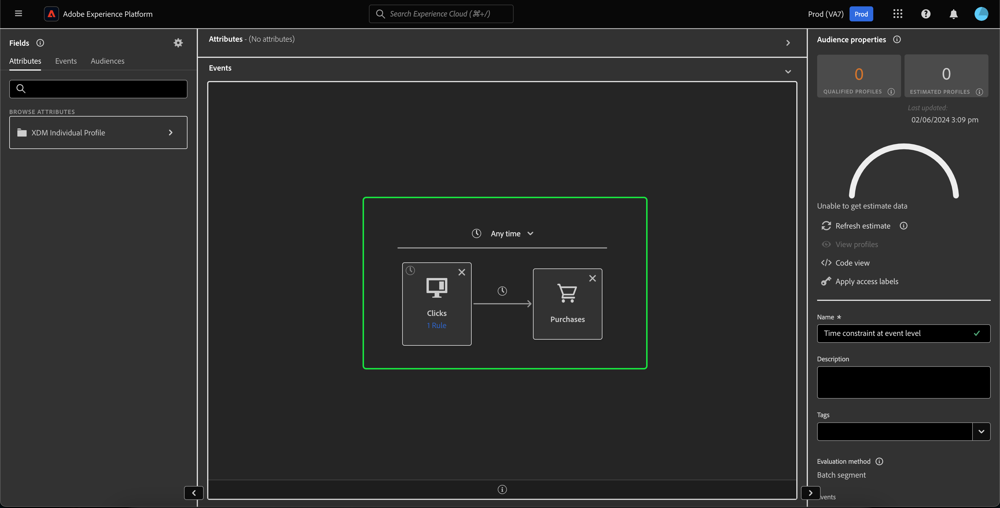

# Umgestaltung der Zeitbeschränkungen {#refactorization}

>[!CONTEXTUALHELP]
>id="platform_audiences_segmentBuilder_constraints"
>title="Umgestaltung der Zeitbeschränkungen"
>abstract="Zeitbeschränkungen auf Regelebene und Gruppenebene wurden entfernt, um die Verwendung von Zeitbeschränkungen klarer zu gestalten. Bitte schreiben Sie Ihre Beschränkung als Zeitbegrenzung auf Arbeitsebene oder Kartenebene neu."

In der Version vom Januar 2024 für Adobe Experience Platform wurden Änderungen am Adobe Experience Platform Segmentation Service eingeführt, die neue Einschränkungen hinzufügen, für die Zeitbeschränkungen definiert werden können. Diese Änderungen wirken sich auf neu erstellte oder bearbeitete Segmente aus, die über die Benutzeroberfläche von Segment Builder vorgenommen werden. In diesem Handbuch wird erläutert, wie Sie diesen Änderungen entgegenwirken.

Vor der Version vom Januar 2024 bezogen sich alle Zeitbeschränkungen auf Regelebene, Gruppenebene und Arbeitsfläche Redundant auf denselben Zeitstempel. Um die Verwendung von Zeitbeschränkungen klarzustellen, wurden Zeitbeschränkungen auf Regel- und Gruppenebene entfernt. Um diese Änderung zu berücksichtigen, müssen alle Zeitbeschränkungen **must** umgeschrieben werden als **Arbeitsflächenebene** oder **Kartenebene** Zeitbeschränkungen.

Zuvor konnten an ein einzelnes Ereignis mehrere Zeitbegrenzungsregeln angehängt werden. Mit dieser kürzlich erfolgten Aktualisierung führt der Versuch, einer Regel eine Zeitbeschränkung hinzuzufügen, jetzt zu einem **error**.

Zeitbeschränkungen können jetzt nur noch auf Arbeitsflächenebene oder auf Kartenebene angewendet werden.

Beim Anwenden einer Zeitbegrenzung auf die Arbeitsfläche können Sie weiterhin alle verfügbaren Zeitbeschränkungen auswählen.

>[!NOTE]
>
>Wenn nur **one** -Karte auf der Arbeitsfläche, wobei die Zeitbegrenzung auf die Karte angewendet wird **äquivalent** , um die Zeitbegrenzung auf der Arbeitsflächenebene anzuwenden.
>
>Wenn **multiple** -Karten auf der Arbeitsfläche anwenden, wird diese Zeitbegrenzung durch Anwendung der Zeitbegrenzung auf die Arbeitsflächenebene auf **all** Karten auf der Arbeitsfläche.

Um eine Zeitbegrenzung auf Kartenebene anzuwenden, wählen Sie die spezifische Karte aus, auf die Sie die Zeitbegrenzung anwenden möchten. Die **[!UICONTROL Ereignisregeln]** Container angezeigt. Sie können jetzt die Zeitbegrenzung auswählen, die Sie auf die Karte anwenden möchten.

