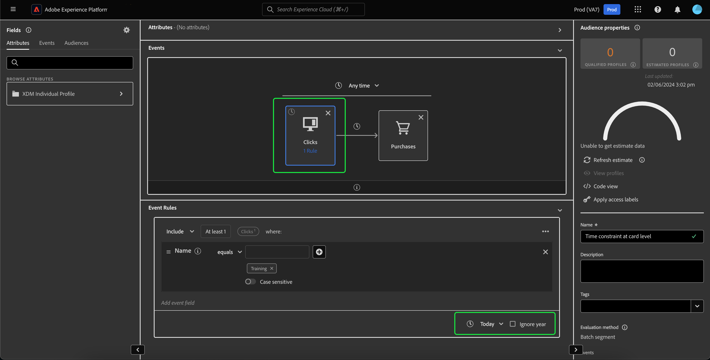

# Umgestaltung der Zeitbeschränkungen {#refactorization}

>[!CONTEXTUALHELP]
>id="platform_audiences_segmentBuilder_constraints"
>title="Umgestaltung der Zeitbeschränkungen"
>abstract="Zeitbeschränkungen auf Regelebene und Gruppenebene wurden entfernt, um die Verwendung von Zeitbeschränkungen klarer zu gestalten. Bitte schreiben Sie Ihre Beschränkung als Zeitbegrenzung auf Arbeitsebene oder Kartenebene neu."

In der Version vom Januar 2024 für Adobe Experience Platform wurden Änderungen am Adobe Experience Platform-Segmentierungs-Service eingeführt, die neue Einschränkungen hinzufügen, in denen Zeitbeschränkungen definiert werden können. Diese Änderungen wirken sich auf neu erstellte oder bearbeitete Segmente aus, die über die Segment Builder-Benutzeroberfläche vorgenommen werden. In diesem Handbuch wird erläutert, wie Sie diesen Änderungen entgegenwirken.

Vor der Version vom Januar 2024 bezogen sich alle Zeitbeschränkungen auf Regel-, Gruppen- und Arbeitsflächen-Ebene redundant auf denselben Zeitstempel. Um die Verwendung von Zeitbeschränkungen klarzustellen, wurden Zeitbeschränkungen auf Regel- und Gruppenebene entfernt. Um dieser Änderung Rechnung zu tragen **müssen alle Zeitbeschränkungen** **Arbeitsflächen-Ebene** oder **Kartenebene** umgeschrieben werden.

Zuvor konnten einem einzelnen Ereignis mehrere Zeitbeschränkungsregeln beigefügt werden. Im Rahmen dieser letzten Aktualisierung führt der Versuch, einer Regel eine Zeitbeschränkung hinzuzufügen, jetzt zu einem **Fehler**.

Zeitbeschränkungen können jetzt nur auf der Arbeitsflächen- oder Kartenebene angewendet werden.

Beim Anwenden einer Zeitbeschränkung auf Arbeitsflächen-Ebene können Sie dennoch alle verfügbaren Zeitbeschränkungen auswählen.

>[!NOTE]
>
>Wenn auf der Arbeitsfläche nur **eine** Karte vorhanden ist, entspricht das Anwenden der Zeitbeschränkung auf die Karte **&#x200B;**&#x200B;dem Anwenden der Zeitbeschränkung auf der Arbeitsfläche.
>
>Wenn sich **(mehrere** Karten auf der Arbeitsfläche befinden, wird diese Zeitbeschränkung durch Anwenden der Zeitbeschränkung auf die Arbeitsfläche-Ebene auf **alle** Karten auf der Arbeitsfläche angewendet.

Um eine Zeitbeschränkung auf Kartenebene anzuwenden, wählen Sie die Karte aus, auf die Sie die Zeitbeschränkung anwenden möchten. Der **[!UICONTROL Event Rules]** Container wird angezeigt. Jetzt können Sie die Zeitbeschränkung auswählen, die Sie auf die Karte anwenden möchten.

