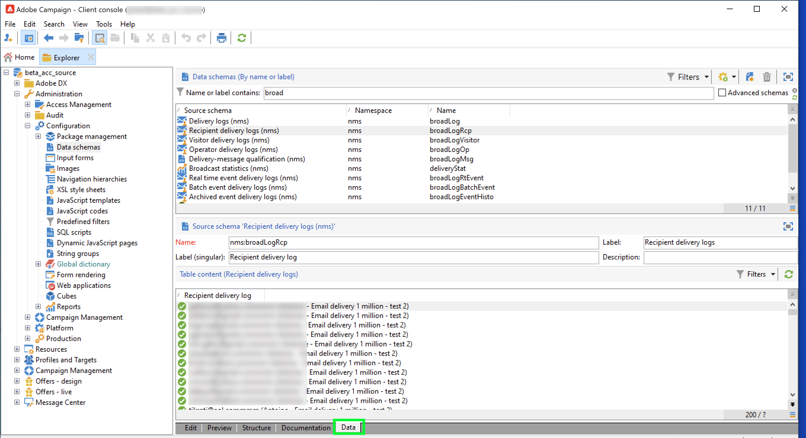
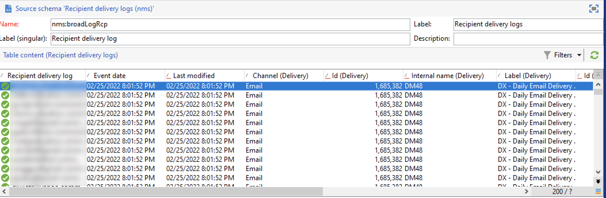

# Adobe Campaign Managed Cloud Services

Adobe Experience Platform ermöglicht die Aufnahme von Daten aus externen Quellen und bietet spezielle Services, mittels derer Sie eingehende Daten strukturieren, beschriften und erweitern können. Daten können aus verschiedensten Quellen aufgenommen werden, darunter etwa Adobe-Programme, Cloud-basierte Datenspeicher und Datenbanken.

Adobe Campaign Managed Cloud Services bietet eine Managed Services-Plattform für die Konzeption kanalübergreifender Kundenerlebnisse und eine Umgebung für die visuelle Kampagnenorchestrierung, Interaktionsverwaltung in Echtzeit und die kanalübergreifende Ausführung. Besuchen Sie die [Dokumentation zu Adobe Campaign v8](https://experienceleague.adobe.com/docs/campaign/campaign-v8/campaign-home.html?lang=en) für weitere Informationen.

Mit der Adobe Campaign Managed Cloud Services-Quelle können Sie Versandlogs und Trackinglog-Daten aus Adobe Campaign v8 in Adobe Experience Platform importieren.

## Voraussetzungen

Bevor Sie eine Quellverbindung erstellen können, um Ihre Campaign v8-Instanz in die Experience Platform zu bringen, müssen Sie zunächst die folgenden Voraussetzungen erfüllen:

* [Richten Sie den Ereignisprotokollimport mithilfe der Adobe Campaign-Clientkonsole ein](#view-delivery-and-tracking-log-data)
* [Erstellen eines XDM ExperienceEvent-Schemas](#create-a-schema)
* [Erstellen eines Datensatzes](#create-a-dataset)

### Anzeigen von Versand- und Trackinglog-Daten {#view-delivery-and-tracking-log-data}

>[!IMPORTANT]
>
>Sie benötigen Zugriff auf die Adobe Campaign v8 Client Console, um Ihre Protokolldaten in Campaign anzeigen zu können. Besuchen Sie die [Dokumentation zu Campaign v8](https://experienceleague.adobe.com/docs/campaign/campaign-v8/deploy/connect.html?lang=en) für Informationen zum Herunterladen und Installieren der Clientkonsole.

Melden Sie sich über die Client-Konsole bei Ihrer Campaign v8-Instanz an. Unter dem [!DNL Explorer] Registerkarte, wählen Sie [!DNL Administration] und wählen Sie [!DNL Configuration]. Wählen Sie als Nächstes [!DNL Data schemas] und wenden Sie dann die `broadLog` nach Namen oder Titel filtern. Wählen Sie in der angezeigten Liste das Quellschema der Versandlogs der Empfänger mit dem Namen aus. `broadLogRcp`.

Wählen Sie als Nächstes die **Daten** Registerkarte.

Klicken Sie mit der rechten Maustaste/Tastenanschlag im Datenbereich, um das Kontextmenü zu öffnen. Wählen Sie von hier aus **Liste konfigurieren..**

Das Listenkonfigurationsfenster wird angezeigt und bietet eine Oberfläche, über die Sie der bereits vorhandenen Liste die gewünschten Felder hinzufügen können, um die Daten im Datenbereich anzuzeigen.

Jetzt können Sie Ihre Versandlogs der Empfänger anzeigen, einschließlich der Konfigurationsfelder, die im vorherigen Schritt hinzugefügt wurden.

>[!TIP]
>
>Sie können dieselben Schritte wiederholen, aber nach `tracking` , um Ihre Trackinglog-Daten anzuzeigen.

### Erstellen eines Schemas {#create-a-schema}

Erstellen Sie anschließend ein XDM ExperienceEvent-Schema für Versandlogs und Trackinglogs. Sie müssen die Feldergruppe Kampagnenversandlogs auf Ihr Versandlog-Schema und die Feldergruppe Kampagnen-Trackinglogs auf Ihr Trackinglog-Schema anwenden. Sie müssen auch die `externalID` als primäre Identität Ihres Schemas.

>[!NOTE]
>
>Ihr XDM ExperienceEvent-Schema muss Profil-fähig sein, damit Ihre Campaign-Daten in [!DNL Real-time Customer Profile].

Detaillierte Anweisungen zum Erstellen eines Schemas finden Sie im Handbuch unter [Erstellen eines XDM-Schemas in der Benutzeroberfläche](../../../xdm/tutorials/create-schema-ui.md).

### Erstellen eines Datensatzes {#create-a-dataset}

Schließlich müssen Sie einen Datensatz für Ihre Schemas erstellen. Detaillierte Anweisungen zum Erstellen eines Datensatzes finden Sie im Handbuch unter [Erstellen eines Datensatzes in der Benutzeroberfläche](../../../catalog/datasets/user-guide.md).

## Erstellen einer Adobe Campaign Managed Cloud Services-Quellverbindung über die Platform-Benutzeroberfläche

Nachdem Sie nun auf Ihre Datenprotokolle in der Campaign-Clientkonsole zugegriffen, ein Schema und einen Datensatz erstellt haben, können Sie nun eine Quellverbindung erstellen, um Ihre Campaign Managed Services-Daten an Platform zu übertragen.

Detaillierte Anweisungen dazu, wie Sie Ihre Campaign v8-Versandlogs und -Trackinglog-Daten an Experience Platform übermitteln, finden Sie im Handbuch unter [Erstellen einer Campaign Managed Services-Quellverbindung in der Benutzeroberfläche](../../tutorials/ui/create/adobe-applications/campaign.md).